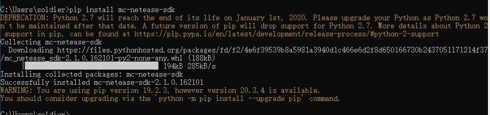

---
front:
hard: 入门
time: 10分钟
---
# 开发环境的搭建

开发我的世界玩法组件需要使用Python2.7，同时推荐安装一个集成开发环境来辅助代码的开发。

那么在本节课程中，将会带领大家下载并安装Python2.7和PyCharm。

<iframe src="https://cc.163.com/act/m/daily/iframeplayer/?id=632867066b13db499d094793" width="800" height="600" allow="fullscreen"/>

## Python2.7

Python2.7下载地址: [链接](https://www.python.org/downloads/release/python-2718/)

大家可以根据自己的操作系统，来选择下载。一般Windows64位系统都下载`Windows x86-64 MSI installer`。

下载完成后打开进行安装，自行选择安装路径，需要注意的是，在这个界面，翻到底部，将`Add python.exe to Path`勾选，然后再继续点击安装。

## PyCharm

PyCharm是一款由JetBrains开发的用于Python的集成开发环境，下载地址: [链接](https://www.jetbrains.com/pycharm/download/)。

打开页面后，下载`Community`版本即可，然后点击安装，在这里勾选创建桌面快捷方式。

## 安装补全库

在完成安装后，我们还需要手动安装补全库，有了补全库之后，模组的开发将会更加便捷。

同时按下Win和R，在弹出的“运行”窗口中，输入cmd并回车。

在命令提示符窗口中，输入`pip install mc-netease-sdk`，然后回车

出现这样的提示就安装成功，如果出现错误，可以检查网络连接是否稳定，更换网络后再试。

## 使用PyCharm打开附加包项目

首先我们需要在Studio中找一个需要打开的附加包，然后，右键点击，打开目录。

打开目录后，记录下目录的路径。然后在PyCharm中，点击Open，在目录浏览的窗口中，找到刚刚弹出的目录，点击打开。

打开后目录中有`behavior_pack`和`resource_pack`，即为正确打开。

## 课后作业

在课后作业中，我们需要验证Python2.7的安装是否成功。

具体操作步骤如下：

- 打开cmd
- 输入`python -V`
- 输入`pip -V`
- 检查是否有正确输出

打开cmd的方法在安装补全库的时候已经介绍过了，正确的输出如下图所示，可以自行输入并参考。

可以看到，Python的版本是2.7.18，pip的路径在python2.7的目录中。