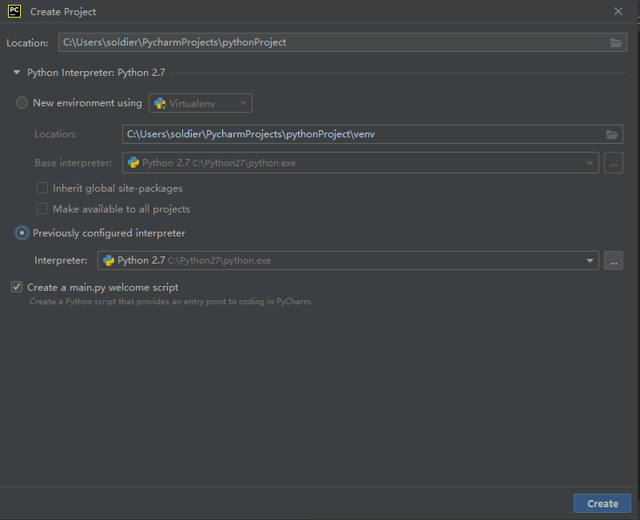
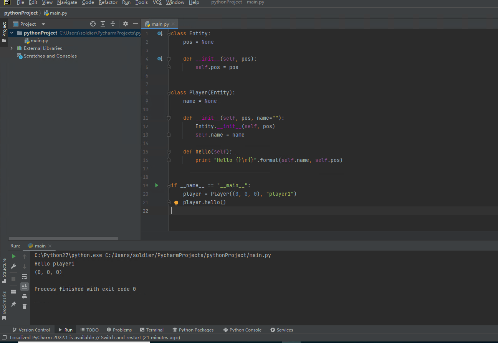

---
front:
hard: 进阶
time: 30分钟
---
# Python基础语法

想要使用Python进行玩法开发，那么就必须学会Python的基本语法。

因为已经有大量的优秀的教程来带领大家学习Python这门语言，所以在这里我们将不过多介绍Python的基础语法，主要介绍Python与我的世界玩法开发相关的地方。Python的教程见：[链接](https://www.runoob.com/python/python-chinese-encoding.html)，在链接的这系列的教程中，我们已经完成了环境搭建，所以从链接到的那一章开始往后看，一直看到`Python 模块`，额外加上`Python 面向对象`，即可开始本节内容的学习。


<iframe src="https://cc.163.com/act/m/daily/iframeplayer/?id=63286726e6c041f2578ca816" width="800" height="600" allow="fullscreen"/>

## 面向对象技术

面向对象技术(Object-Oriented Technology)，强调软件在开发过程中，采用人认知客观世界的过程中普遍运用的思维方法，直观、自然地描述客观世界中的有关事物。

在我的世界的玩法开发中，同样也运用到了这门技术。

在学习过面向对象技术之后，想要开发我的世界玩法组件，就首先需要了解我们本次介绍的Python零件开发中，需要使用的类。

```python
# -*- coding: utf-8 -*-
from Preset.Model.PartBase import PartBase
import random
from Preset.Model.GameObject import registerGenericClass


@registerGenericClass("MyLogPart")
class MyLogPart(PartBase):
	def __init__(self):
		super(MyLogPart, self).__init__()
		self.name = "日志零件"
		self.description = "日志零件，用于测试调试日志"
		self.interval = (30, 90)
		self._tickCnt = 0
		self._tickInterval = random.randint(self.interval[0], self.interval[1])

	def TickClient(self):
		self._tickCnt += 1
		if self._tickCnt == self._tickInterval:
			print("%s 在 %s" % (self.GetDisplayPath(), self.GetWorldPosition()))
			self._tickInterval = random.randint(self.interval[0], self.interval[1])
			self._tickCnt = 0

```

```python
# -*- coding: utf-8 -*-
from Meta.ClassMetaManager import sunshine_class_meta
from Meta.EnumMeta import DefEnum
from Meta.TypeMeta import PBool, PStr, PInt, PCustom, PVector3, PVector3TF, PEnum, PDict, PFloat, PArray, PVector2
from Preset.Model import PartBaseMeta


@sunshine_class_meta
class MyLogPartMeta(PartBaseMeta):
	CLASS_NAME = "MyLogPart"
	PROPERTIES = {
		"interval": PVector2(sort=1000, group="MyLogPart", text="打印间隔"),
	}

```

这里是官方内置零件中，一个日志零件的两个Python文件。

可以看到，第一个文件，是一个名为`MyLogPart`的class，它继承了`PartBase`这个类，同时定义了一些成员变量，用来描述这个零件的名字(name)、作用(description)。

这个类主要有两个函数，一个\_\_init\_\_，在初始化时会被执行，一个TickClient函数，会打印日志信息。

第二个文件，是一个名为`MyLogPartMeta`的类，继承了`PartBaseMeta`这个类，这个类同样也定义了成员变量，用来存储这个类的一些基本数据。这个类实际上是一个元数据类，用来和编辑器对接，方便我们将一部分变量通过编辑器设置到零件中。在本节中我们主要只做了解，不深入研究。


那么在玩法开发中，其实并不止PartBase和PartBaseMeta这两个类可以继承，所有与玩法开发相关的类，都在文档中可以查阅，[链接](https://mc.163.com/dev/mcmanual/mc-dev/mcguide/20-玩法开发/14-预设玩法编程/13-PresetAPI/%E9%A2%84%E8%AE%BE%E5%AF%B9%E8%B1%A1/%E9%80%9A%E7%94%A8/%E6%B8%B8%E6%88%8F%E5%AF%B9%E8%B1%A1GameObject.html?catalog=1)。

感兴趣的同学可以点击链接，大致了解一下有哪些类可以用，它们的作用又是什么，继承关系又是怎么样的。

## 课后作业

在了解了面向对象技术之后，为了加深对这个技术的理解，课后作业希望使用面向对象技术，制作一个简单的程序。

### 要求

1. 编写Entity类，代表游戏中的所有实体，需要有一个成员变量pos，类型为元组，代表坐标，初始化时接收一个3个int的元组，存入pos。
2. 编写Player类，继承Entity类，需要有一个成员变量name，类型为str，代表玩家名，定义一个hello函数，打印"Hello 玩家名"，并打印这个类的pos变量的值。
3. 实例化Player对象，调用hello函数。

### 操作步骤

在PyCharm左上角的菜单栏中，点击File，选择New Project，创建一个新项目。

路径自行选择，名称也自行命名。为了简单起见，我们不使用虚拟环境，`Python Interpreter`请选择`Previousl configured interprer`，路径应为你Python的安装路径，不包含venv等字样。



创建完成后，打开main.py，就可以看到已经有了一个简单的helloworld程序，我们在main.py中进行编写即可。

首先编写Entity类，代码如下，包含了一个pos的成员变量，和一个构造函数。

```python
class Entity:
    pos = None

    def __init__(self, pos):
        self.pos = pos
```

接着继续编写Player类，它继承了Entity类，同时有一个name变量

```python
class Player(Entity):
    name = None

    def __init__(self, pos, name=""):
        Entity.__init__(self, pos)
        self.name = name

    def hello(self):
        print "Hello {}\n{}".format(self.name, self.pos)
```

随后编写主函数

```python
if __name__ == "__main__":
    player = Player((0, 0, 0), "player1")
    player.hello()
```



编写完成后运行，完整的代码和运行结果如图。