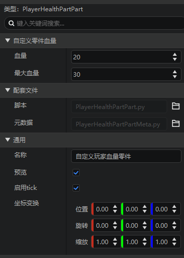

---
front:
hard: 进阶
time: 20分钟
---
# 零件开发基础

本节将通过一些内置的零件模板，来介绍零件的生命周期，带领大家初步了解零件开发。

<iframe src="https://cc.163.com/act/m/daily/iframeplayer/?id=6328676ba240f794f8c5fbc1" width="800" height="600" allow="fullscreen"/>

## 例子

### MyLogPart

首先我们创建一个玩家预设，再在新建零件中，找到`MyLogPart`，进行创建。并将MyLogPart挂接到玩家预设下。

接下来我们可以看到，MyLog这个零件，主要由两个python源代码文件构成，分别是`MyLogPart.py`和`MyLogPartMeta`，我们在PyCharm中打开这个项目。


对文件右键，打开文件所在位置，找到这个项目的根目录


将路径复制，在PyCharm中打开，并将资源包的文件夹，设置为Sources Root，否则补全功能将无法正常使用。


接下来按照如图路径打开`MyLogPart.py`，来观察它的代码。


可以发现，代码中有一个`MyLogPart`类，继承了`PartBase`类。在`__init__`这个初始化函数中，定义了自身的`name`和`description`。这两个均是从PartBase中继承下来的变量，分别代表这个零件的名字，和描述。

所有零件的保留变量名在下方列出了，开发者在对零件进行开发时，要避免使用这些变量名，以防出现不可预料的意外。

- id
- classType
- isClient
- filterKeys
- _parent
- entityId
- boxId
- name
- transform
- isRemoved
- loaded
- needUpdate
- <iframe src="https://cc.163.com/act/m/daily/iframeplayer/?id=63286726e6c041f2578ca816" width="800" height="600" allow="fullscreen"/>

- tickEnable
- data
- dataKeys
- eventMap
- replicated

而剩下的变量定义，均为这个类的成员变量。

而`TickClient`函数，是一个可重写的函数，它会在客户端被每Tick调用。

并且每次都随机在30到90之间随机一个数字，作为打印输出的间隔。

接下来看MyLogPartMeta.py，它是继承了PartBaseMeta，是用来存储在预设编辑器上的可编辑内容的


例如这里的interval，就对应了MyLogPart.py的interval变量，类型为PVector2，并且可以设置提示文本，具体编写格式会在后面一起介绍。

经过Meta的设置，我们就可以在预设编辑器的零件的属性中，看到对应的打印间隔的设置项。


### ReplicatePart

再次新建一个`ReplicatePart`零件，继续观察它的代码。


可以看到分裂零件的`__init__`函数和日志零件的大同小异，同样都是初始化数据。

这里重写了`CanAdd`函数和`InitServer`函数，其中`InitServer`代表服务器初始化，`CanAdd`会在挂载零件时触发，用来防止零件挂载到错误的预设上。

和日志相比，它多监听了一个实体受伤事件，用来在受伤时进行分裂。

它的PartMeta也是大同小异，定义了两个参数，分别是PBool和PInt类型。

```python
@sunshine_class_meta
class ReplicatePartMeta(PartBaseMeta):
	CLASS_NAME = "ReplicatePart"
	PROPERTIES = {
		"loop": PBool(sort=1000, group="ReplicatePart", text="循环分裂"),
		"health": PInt(sort=1001, group="ReplicatePart", text="血量"),
	}
```

## 生命周期

零件的生命周期指零件在游戏从开始到结束的整个运行过程。


零件分服务端和客户端，在运行的各个过程，会触发不同的函数。

拿服务端来说，会在初始化阶段先`__init__`，然后`InitServer`。初始化完成，便每Tick触发`TickServer`。在卸载阶段（游戏关闭/区块卸载），`UnloadServer`。在被击杀或者主动调用Destroy接口之后，触发`DestroyServer`。客户端同理。

具体每个函数的定义，可以在<a href="../../../../mcguide/20-玩法开发/14-预设玩法编程/13-PresetAPI/预设对象/零件/零件PartBase.html">文档</a>中查看。同时文档中还有别的函数，可以自行查看用法，例如刚刚看到的<a href="../../../../mcguide/20-玩法开发/14-预设玩法编程/13-PresetAPI/预设对象/零件/零件PartBase.html#canadd">CanAdd函数</a>。

## 自定义属性

自定义属性就是由`PartBaseMeta`类来定义的。要创建一个自定义属性，我们主要需要有两个步骤。

1. 在继承了`PartBase`的类中定义成员变量
2. 在继承了`PartBaseMeta`的类中定义`PROPERTIES`字典，其中的Key为变量名，Value为这个数据对应的变量属性。

当前自定义的零件支持编辑python的所有基本类型，即：整数int，浮点数float，布尔bool，字符串str，字典dict，列表list，除此之外，针对一些特定需求，也提供了相应的支持，如下拉列表选择，多维向量等。


上表列出了目前所有的支持的属性变量，同时列出了对应的Value定义。

每个属性的详细解释可以参考<a href="../../../../mcguide/20-玩法开发/14-预设玩法编程/12-深入理解零件/1-自定义属性面板.html#类型与属性">官方文档</a>。

```python
@sunshine_class_meta
class ReplicatePartMeta(PartBaseMeta):
	CLASS_NAME = "ReplicatePart"
	PROPERTIES = {
		"loop": PBool(sort=1000, group="ReplicatePart", text="循环分裂"),
		"health": PInt(sort=1001, group="ReplicatePart", text="血量"),
	}
```

还是拿分裂零件的属性来说，首先要定义一个`CLASS_NAME`，这些变量是哪个类的成员变量（会自动生成，不需要手动编写）。再定义一个`PROPERTIES`，定义两个变量`loop`和`health`，设置顺序和所属分组以及描述文本。

## 课后作业

1. 新建空白附加包，创建玩家预设，并创建一个零件，在零件的生命周期的每个阶段（除tick），都打印信息，来观察执行顺序。
2. 给这个零件设置自定义属性，提供2个参数，分别代表玩家的最大血量和当前血量，并且在玩家发送聊天消息"更新血量"的时候，应用到玩家身上。

### 操作步骤

新建附加包，创建玩家预设的操作在之前已经演示过很多遍，这里直接跳过。

接下来新建一个空零件，命名为`PlayerHealthPart`，并挂接到玩家预设上。

接下来使用PyCharm打开项目文件夹，设置Sources Root，打开对应的预设python文件。

文件中默认已经重写了一部分生命周期函数，我们可以在这基础上进行修改，每个都添加一个打印的函数，用来输出每个阶段。

并且额外重写`UnloadClient`和`UnloadServer`，加上对应输出，修改后的代码如下：

```python
# -*- coding: utf-8 -*-
from Preset.Model.GameObject import registerGenericClass
from Preset.Model.PartBase import PartBase


@registerGenericClass("PlayerHealthPartPart")
class PlayerHealthPartPart(PartBase):
    def __init__(self):
        PartBase.__init__(self)
        # 零件名称
        self.name = "空零件"

    def InitClient(self):
        print "InitClient"

    def InitServer(self):
        print "InitServer"

    def TickClient(self):
        pass

    def TickServer(self):
        pass

    def DestroyClient(self):
        print "DestroyClient"

    def DestroyServer(self):
        print "DestroyServer"

    def UnloadClient(self):
        print "UnloadClient"

    def UnloadServer(self):
        print "UnloadServer"

```

接下来，新建两个变量，分别是health和maxHealth，代表玩家的血量和最大血量，修改这个零件的name。

```python
@registerGenericClass("PlayerHealthPartPart")
class PlayerHealthPartPart(PartBase):
    def __init__(self):
        PartBase.__init__(self)
        self.health = 20
        self.maxHealth = 30
        self.name = "自定义玩家血量零件"
```

并且在`PlayerHealthPartPartMeta.py`中修改`PROPERTIES`，修改后代码如下：

```python
# -*- coding: utf-8 -*-
from Meta.ClassMetaManager import sunshine_class_meta
from Meta.TypeMeta import PInt
from Preset.Model import PartBaseMeta


@sunshine_class_meta
class PlayerHealthPartPartMeta(PartBaseMeta):
    CLASS_NAME = "PlayerHealthPartPart"
    PROPERTIES = {
        "health": PInt(sort=1, text="血量", default=20, group="自定义零件血量"),
        "maxHealth": PInt(sort=2, text="最大血量", default=30, group="自定义零件血量"),
    }

```

这时打开编辑器，已经可以看到零件的属性面板显示了自定义的属性。



然后再回到`PlayerHealthPartPart.py`中，编写设置血量的逻辑。新增一个函数，监听<a href="../../../../mcdocs/1-ModAPI/事件/世界.html?key=Join&docindex=2&type=0#serverchatevent">ServerChatEvent</a>，那么我们直接判断聊天内容和发送的实体id，是否是我们这个玩家，然后设置给它更新血量。

```python
    def ServerChatEvent(self, args):
        if args["message"] != "更新血量":
            return
        parent = self.GetParent()
        entityId = parent.GetEntityId()
        if args["playerId"] != entityId:
            return
        self.SetEntityAttrValue(entityId, AttrType.HEALTH, self.health)
        self.SetEntityAttrMaxValue(entityId, AttrType.HEALTH, self.maxHealth)
```

这样我们的血量就设置完成啦。最终代码：

```python
# -*- coding: utf-8 -*-
from Preset.Model.GameObject import registerGenericClass
from Preset.Model.PartBase import PartBase
from mod.common.minecraftEnum import AttrType


@registerGenericClass("PlayerHealthPartPart")
class PlayerHealthPartPart(PartBase):
    def __init__(self):
        PartBase.__init__(self)
        self.health = 20
        self.maxHealth = 30
        self.name = "自定义玩家血量零件"

    def InitClient(self):
        print "InitClient"

    def InitServer(self):
        print "InitServer"

    def TickClient(self):
        pass

    def TickServer(self):
        pass

    def ServerChatEvent(self, args):
        if args["message"] != "更新血量":
            return
        parent = self.GetParent()
        entityId = parent.GetEntityId()
        if args["playerId"] != entityId:
            return
        self.SetEntityAttrValue(entityId, AttrType.HEALTH, self.health)
        self.SetEntityAttrMaxValue(entityId, AttrType.HEALTH, self.maxHealth)

    def DestroyClient(self):
        print "DestroyClient"

    def DestroyServer(self):
        print "DestroyServer"

    def UnloadClient(self):
        print "UnloadClient"

    def UnloadServer(self):
        print "UnloadServer"

```

我们进入游戏测试，观察日志输出，可以看到有相关的生命周期输出。


并且发送 `更新血量`，可以看到我们的生命值被更改。

