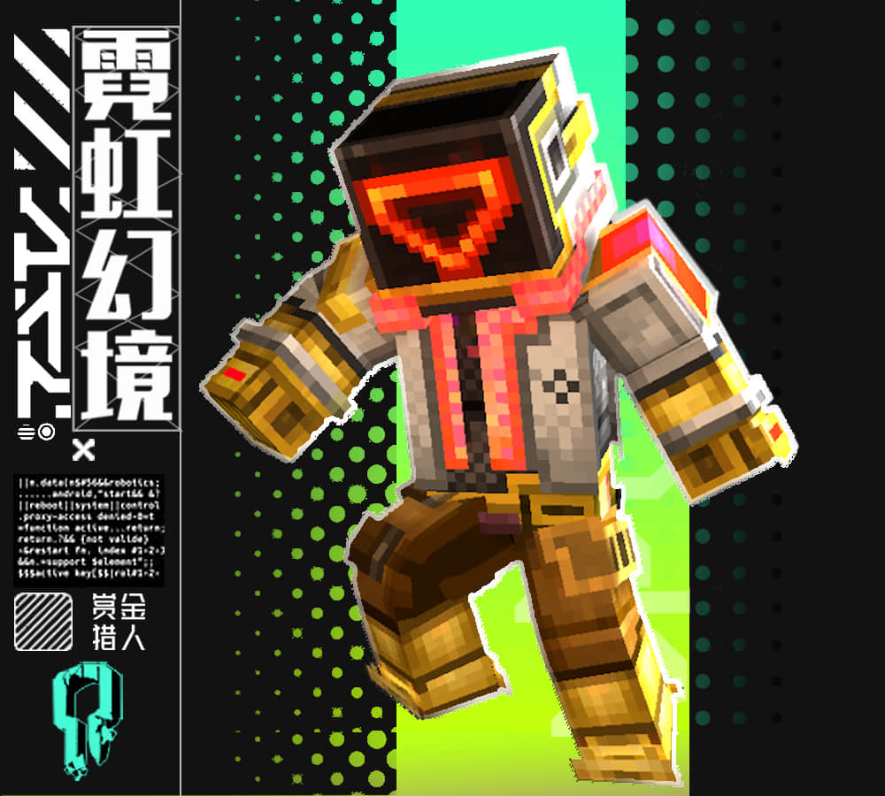

---
front:
hard: 入门
time: 5分钟
---
# 初始皮肤实战操作

## 选择一个自己喜欢的皮肤进行类别结构分析

对选择的皮肤进行分辨率、结构和模型底子的判定。

例如：这个皮肤是一个32像素的，双层，史蒂夫体型模型为基础的皮肤。

## 对这个皮肤做出优缺点的点评和可以改进的空间

对这个皮肤做出你认为的优缺点点评，并且针对这些优缺点的内容，提出改进的空间和想法。
