---
=front:
hard: 入门
time: 5分钟
---
# 制作皮肤的步骤和规范

## 学会给皮肤做一个设定

在绘制皮肤前，我们不要着急直接下笔开始绘制噢~因为如果是第一次接触皮肤绘制的话。我们先来给皮肤一个设定是最好的！

首先，要先简单绘制一个基础的草稿，或者是给自己找一些参考。

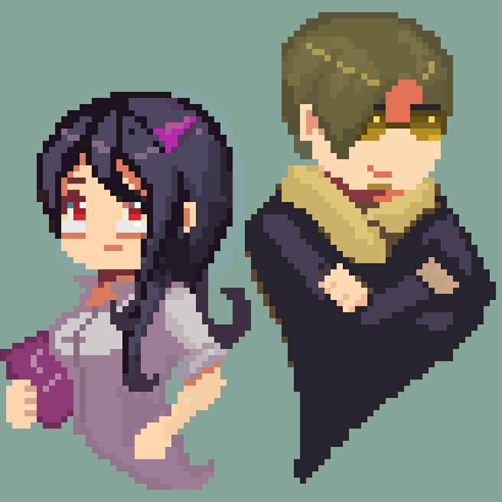

其次，再给皮肤设定一个风格，风格就随你们自己喜欢的风格来定就OK。

如果是进行原创绘制，可以找一些真实风格搭配进行参考，在配色上可以选择一些二次元配色进行尝试，这样的混搭风格组合往往会得到不小的创意收获呢~

然后，可以在真实的服饰案例找灵感，确定好大致的样式类型，短袖，长裙还是长裤。

但注意16X的贴图结构是每一个面为可绘制的像素格子是有限的，所以我们如需绘制眼睛、头发、嘴部等全部内容，是肯定不建议要学会取舍。并且如果真的是想要绘制更精细，那就建议大家在后期绘制熟练之后尝试更高一层的高清贴图的绘制来实现这个想法。

最后，给皮肤来一个色彩的基调定义。

比如我们皮肤的主体衣服颜色，皮肤的颜色和头发的颜色选择是哪些都提前选好。并且需要注意，在绘制的时候一般颜色取色不要过于的鲜艳或者过于的重（饱和度过高），例如亮红色或者是深黑色。

这样一套的流程下来后，我们对于自己要画的皮肤整体就已经有了定义和方向。这样完成皮肤的过程就更加事半功倍啦！

## 开始绘制属于自己的皮肤

### 头部的绘制

既然我们已经学会了皮肤设定，那么，我们的入门学习就从单层皮肤开始吧。

先新建一个单层的STEVE皮肤。

选择【Skins】→【Players】→【Steve（Minimal）】

注意：带有Minimal是单层皮肤，没有的是双层皮肤

确认新建行为后，我们可以看到软件中生成了一个原版的Steve。

打开工具栏中的2D/3D混合模式，将贴图和模型一起展示出来。

注：当然也可以直接上手绘图，只要自信充足什么模式开始都可以。

为了方便绘制头部，我们将头部以外的区域全部取消显示。

点击框内示意选项，从工具栏中将头部以外的部分全部取消显示。

躯干手脚部分都点掉之后，就剩下头部、头盔，这样就可以进行精准的绘制啦。

（以上案例都不建议大家使用噢~因为不利于后期的美化）

首先，我们选择常用的中性头部皮肤、头发可以加减阴影高光的颜色，来作为我们皮肤贴图的皮肤和头皮基色。

如果不确定取色是否是自己要的颜色小伙伴，可以参考以下精准的取色方式：

第一，可以选择一个比较中间色的色彩，比如黑灰白，灰色是介于黑和白之间的，即灰色在后期可以增加阴影和高光，很适合作为中间色。

第二，大家可以选择自己喜欢或者想要绘制的人物图片案例直接进行取色，也是可以的。

色彩选好后，使用工具栏中的铅笔模式，进行头部的绘制。先选好的两个颜色分别在贴图空白处留色。

（注：所有的取色都可以在贴图外的地方进行留色，这样可以很好的保证色彩不会在后期绘制后偏移原色噢~在贴图显示外的地方留色不会影响到人物皮肤本身，所以空白处可以随意使用，并且还可以留下你们自己的署名。）

直接使用铅笔大笔刷，将head模型块的【top】头顶、【bottom】下巴链接脖子的部分、【front】脸、【Right】右边侧脸、【Left】左边侧脸、【Back】后脑勺，全部涂满皮肤底色。

#### 头发的画法

头部区域的发型在可绘制程度上有一定的局限性，我们可以通过刘海来增加皮肤的美观度

第一部分的底色刘海只需要有一个大概的分布形状就可以了，因为后面会通过头盔进行叠加，所以大家不需要过于纠结刘海在初步的表现中好像有点呆板的问题。

接下来，开始给头发进行阴影的叠加，也就是给头发纹路进行上色。让头发看上去更加自然。

我们选择工具栏里面的变亮/变暗工具

此处工具的强度大家可以自行根据实际调整，找寻绘制的手感。变亮是用来体现高光部分，所以先从暗部阴影开始增加质感。

头发的纹理正常是一条一条的，那么像素里面也是一样需要尝试逐条往下进行绘制。

先一条隔一条的先把纹路区分出来。

目前的纹路虽然可能比较僵硬，但却对头发的层次有了初步的表现。那么接下来就是重要的环节：暗部阴影的叠色。

从第一个压暗的区域空出一格，一条线画下去。然后空出的格数可以根据个人的视觉效果进行调整。一直重复阴影加深，头发的层次就会凸显出来了。

注意：很多时候不需要很有规则的去涂，非常有规律的涂抹会让表现看上去很死板。

接下来增加一个高光部分，高光不需要全涂，只需要部分就好。比如跟例图中的高光一样，头发给个局部亮点的感觉即可。

在工具的选择中，需要在变亮/变暗中间选择变亮。

然后选择高光最亮的区域，一般是在额头偏上中间的部分。

直接使用工具画一条增亮。

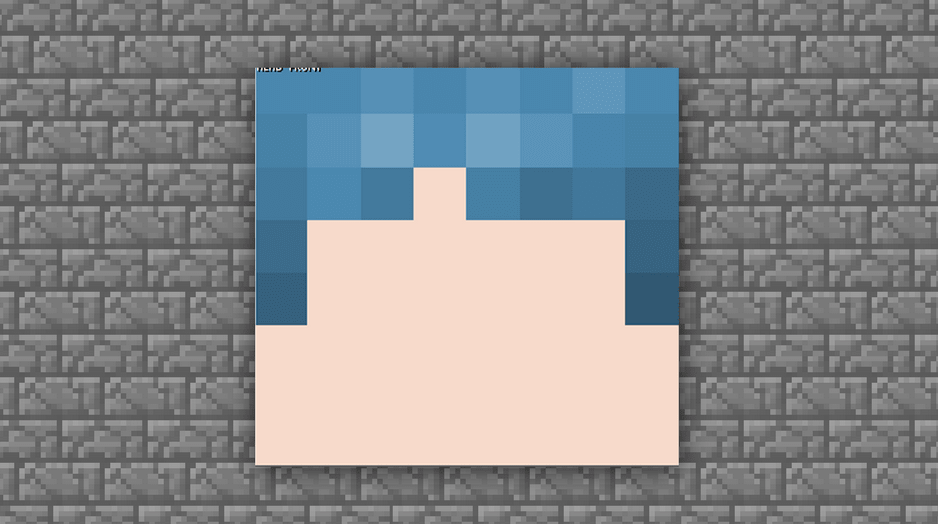

这样的增加后，是不是觉得头发凸出来了一点。

随后我们把周围的渐变过渡调整自然。

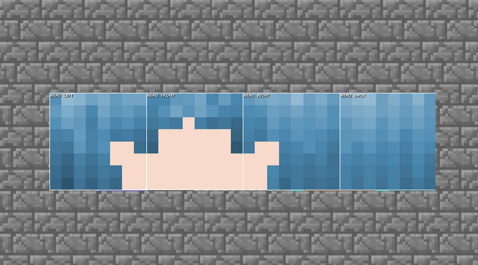

接下来开始绘制头顶部分，按照通俗的理解，头顶部分一般是有个【旋】。

即头发是根据一个或多个中心点分散开来。

所以在目前的案例中，如果需要绘制一个中分的感觉，那么需要继续使用变暗功能。

头发分出左右各一半的感觉，然后就开始进行对其他头发垂直方向的绘制。

完成当前步骤后，可以看到头顶部分已经有了一定雏形。接下来，需要紧跟着上方已经讲过的内容，将阴影部分和高光部分绘制出来。

在补齐阴影及高光后，头发的绘制就基本完成。

细节绘制的部分大家可以根据个人的喜好进行调整。

#### 脸部的画法

接下来，将继续细化脸部。脸部的画法一般是根据头发根部走向进行绘制，同样需要增加阴影和高光。

#### 继续使用【变暗工具】

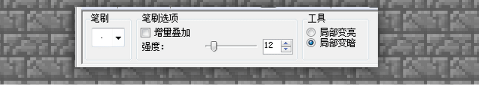

跟着头发的根部绘制一圈阴影。使用叠加的效果，就可以绘制出面部的阴影啦。

目前的脸部比较平整，我们可以使用高光增加体积感。

脖子以下的部分，因为是盲区，稍微用阴影手法，大概的涂抹部分阴影效果画一个脖子衔接的感觉就行。

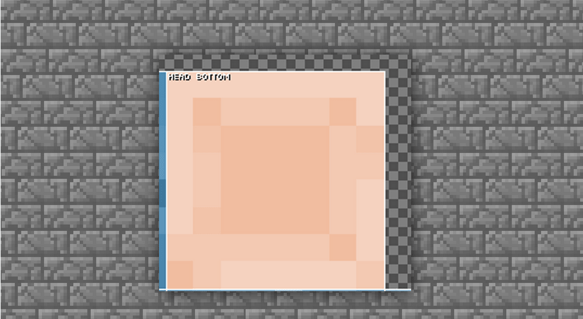

完成当前步骤后，脸部的表现大致都差不多了，接下来就要开始头部最重要的两个加分点：刘海（头盔部分）和眼睛。

我们先从刘海开始。

#### 刘海的画法

刘海的部分就是贴图内的头盔部分。

一般来说，如果头发部分已经完成，大家可以使用PS工具直接进行复制过去修改就行，当然如果对PS不是很熟悉，那我们就根据头发的画法，再把刘海部分绘制一遍即可。

头发的第二层刘海的部分，目前看起来很呆板，所以我们需要进行调整。

刘海的对边缘进行修剪，修剪的造型根据自己个人定的造型来取舍就行。

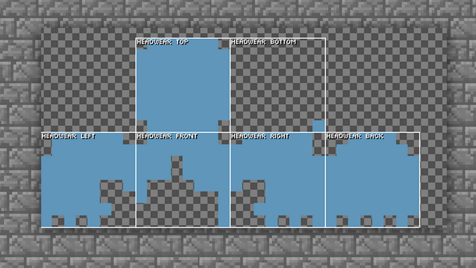

然后根据一层头发的阴影表现，进行二层头盔的阴影及高光的上色处理。

这样修剪过的头发就会变得很自然了，再对颜色阴影进行一些细化调整后，我们就可以画五官眼睛啦。

#### 画眼睛

五官的画法其实分两种，第一种是大家经常使用的常规两格画法，第二种就是日式三眼画法。嘴的部分通常由大家根据自己的喜好自行选择

第一种：常规两格眼睛绘制方法。眼睛的高度最好再脸部的第五到七排。不同的高度位置可以让眼睛展现的状态是不同的。

第二种：这类就是偏日式一些的绘制方法，让两眼之间距离变远，并且加上眉毛和淡淡的腮红，效果上会更偏向萌系。

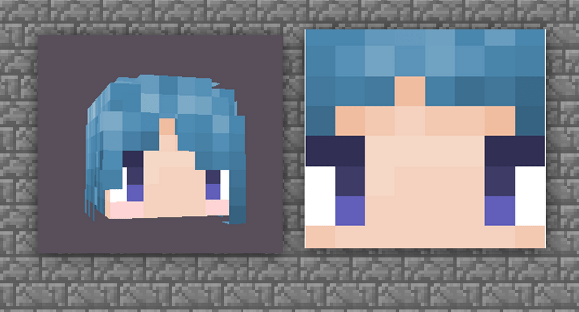

所以大家根据自己的喜好及审美来绘制眼睛即可，同时多尝试给眼睛加上一定的明暗调节。

至此，我们就完成了对头部的绘制步骤。开好了头，那么接下来的绘制就会更加顺利。

### 身体的绘制

#### 身体的绘制概述

身体部分的绘制，只要在了解了对头发的绘制规则后，大家可以很好的摸索出一套顺手的绘画方式。 而身体的部分其实基础操作跟头部一样，着重点就是衣服需要化繁为简。

#### 身体的绘制技巧

首先老样子我们先把界面设置成只显示【身体部分】。在【工具栏】中间将身体以外的部件全部隐藏。并且将模式依旧设置成为混合模式，如果一直是这个模式就不需要设置啦。

设置好后我们只需要绘制中间的body部分，也就是身体的贴图就OK啦，左右两边是手脚暂时不用绘制。

使用【工具栏】→【橡皮擦】，先把身体的原始部分全部清除。

然后使用【工具栏】→【铅笔】给衣服铺满底色。

**注：也可以先画出轮廓，这样也可以更好的分区块上色。演示部分我们将以先上底色为例来进行。**

随后开始粗略绘制衣领、纽扣之类的部分，提前确定衣服造型的整体。

底色铺垫好后，就可以开始对光影进行处理。有一点大家需要注意一下：大部分常见的服饰是属于布料类别，明暗关系比较分散，不会有过于强烈的对比关系。所以衣服很多大块面的地方尽量通过中间色来进行过渡就好。

我们使用【工具栏】→【光度刷】进行第一层的细节上色。

接下来，开始针对衣服光暗进行细化，来增加服饰的质感。

继续使用【工具栏】→【光度刷】变暗进行叠加

整体的暗度已经加的差不多了，可以针对侧面关节连接处再加深一点，当然我们在上色时也需要注意光感，不要涂抹直接的高光，颜色要缓和并延展过渡出去。

继续使用【工具栏】→【光度刷】变暗进行侧面关节接触部分的叠加.

到此程度后，身体的绘制基本完成。我们把之前画的头部显示出来，看一下整体效果，如果觉得整体效果不好还可以进行微调，调整完毕后就可以开始下一步。

### 四肢的绘制

#### 手脚的绘制

通过头部和身体的绘制，我们基本对于绘制整体结构的方法有了一定的了解。

手脚的绘制在单层皮肤中只需要绘制一个就会自动变成两个，跟镜像一样的感觉。但在双层皮肤中则是不一样的，这里也有一点内容需要注意一下。

首先我们老样子先把手臂显示出来。

【工具栏】→【混合模式】打开&单独显示【手臂部分】左右都可以

手脚的衣服颜色就根据本身身体的衣服颜色进行选择即可，如果设计上是无袖的话，根据面部的调色绘制肤色就好了。 接下来就让我们直接开始吧，先将手臂的底色按照衣服的底色进行涂抹。

注意：别忘记把手的部分画出来哦。

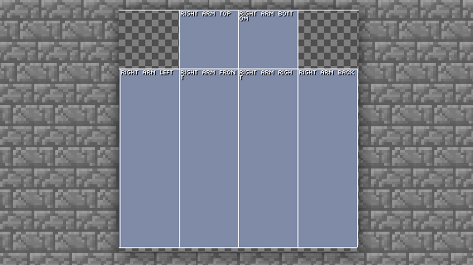

然后根据之前学习的同理，先画出大体的阴影，上肢可以大体分成三部分：即臂、前臂、手部，因为方块的体积是一样的，所以我们只要用阴影把手臂分成两部分即可。

同样使用【工具栏】→【变亮变暗】给手臂分段绘制一下。

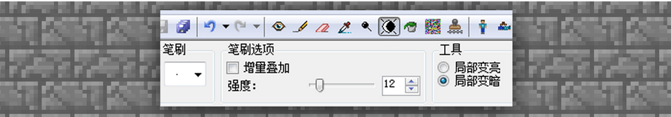

靠近身体的部分进行加深，例如：腋下和贴近身体的侧面和正面。这个时候可以将身体部分的显示，然后进行整体观察和绘制。

先将手臂靠近身体的部分给加深。使用【工具栏】→【变亮变暗】选择变暗。

然后手臂中间部分稍微加一点高光就行，不要太亮，亮度问题参照身体部分的服饰设定。

接下来我们就将正面的光影关系过渡到侧面。

画内侧部分的时，就不需要对高光部分进行安排了。因为此处是背光面，可以过渡暗色压低光照。

针对另外一个背面，可以直接依葫芦画瓢，或是直接复制一下都是可以的。

手臂的部分大体就完成，接下来再把手的部分根据前面手臂的上色方式再来一次即可。

注意：手靠身体的部分我们定义为手心，手心是需要加深的哈。

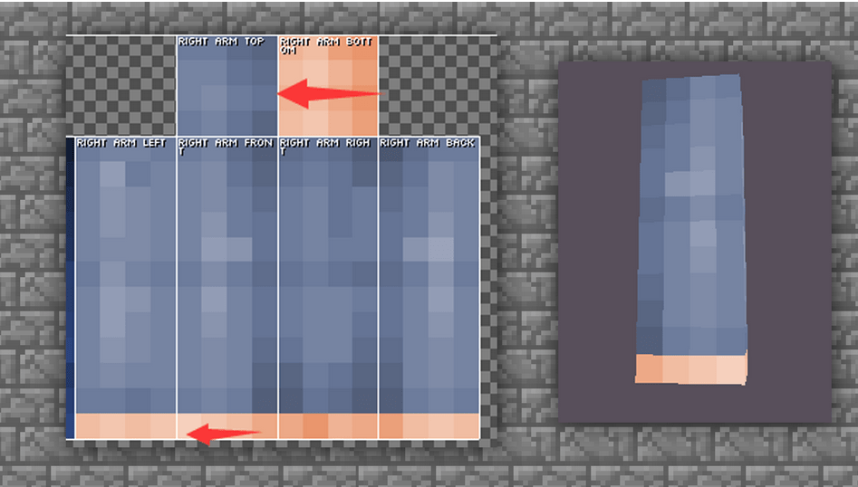

这样，整条手臂的结构就完全画完了。我们把两条手臂都显示，并且把身体部分也显示出来看一下整体效果。

此处主要是看一下衔接的部分有没有问题，就可以根据手臂的绘制开始腿部的绘制。

#### 腿部的绘制

腿部的绘制方法跟手臂袖子绘制是大体相同的，因为下肢也可以分成三个部分，只需要将各个部分展示出来即可。

首先，先老样子先把底色铺好。然后这里向大家展示一个小技巧，如果想要上半身和下半身进行合理的衔接，那就需要把身体部分的衣服延伸下来。

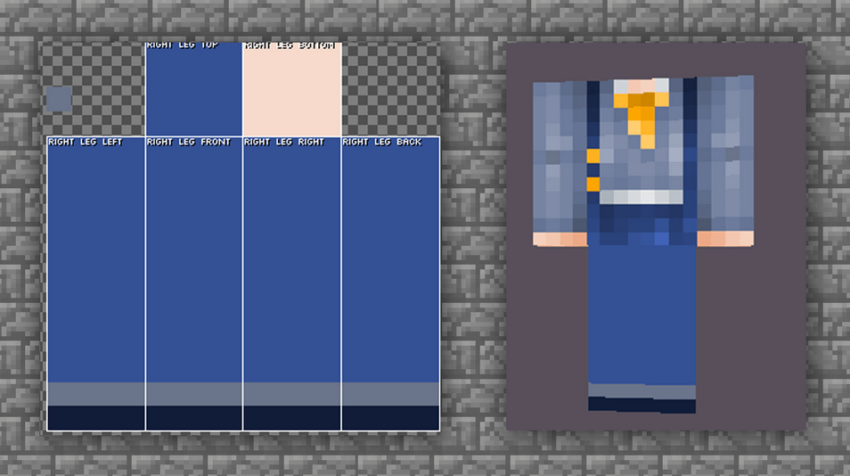

根据手部的绘制，继续来添加腿部光影明暗的区分。

使用【工具栏】→【变亮变暗】选择变暗

与上肢绘制相同，上肢部分加深的是胳肢窝，腿部加深的则是两腿之间，因为此处接触光源最少。同样的我们也需要注意暗部的叠加色彩和次数，并且要多注意与身体上部的无缝衔接。

继续叠加暗部，然后将高光部分跟上肢一样进行叠加绘制。

大腿根衔接的部位，建议大家根据上下部分的结合来绘制，不然皮肤在进行走路动作的时候会有些穿帮的感觉。

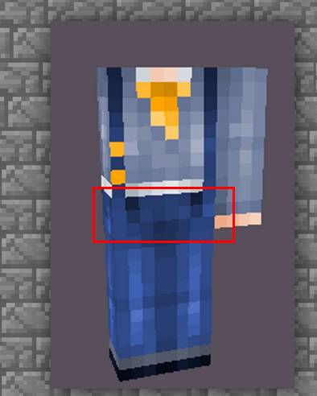

鞋底有很多种绘制方法，但是因为鞋底在实际情况中是若隐若现的，所以大家按照自己的喜好随意发挥即可。案例中选择回形绘制方法。大家也可以选择条纹的绘制方法（条纹参见手指绘制）

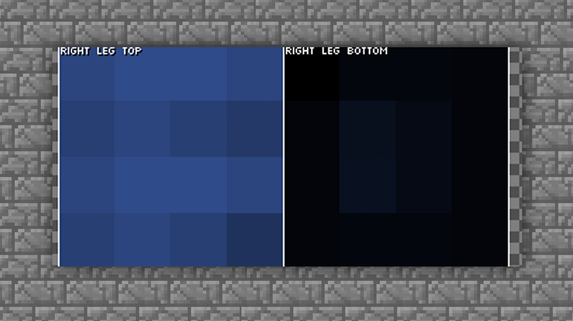

然后将所有的部位都显示出来，我们来看一下整体效果。

根据整体，可以再加一点小细节装饰，专属于我们自己的小皮肤就完成啦。

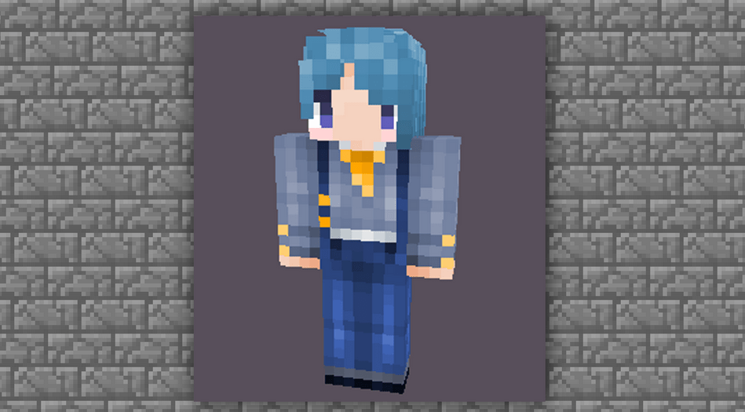

## 皮肤导出的正确格式

我们皮肤绘制好之后，需要导出正确的格式才可以正确的上传到网页上面。

皮肤的格式如果是使用MCskin3D直接使用菜单栏中的【文件】—【另存为】直接将贴图保存出来。

将你皮肤的名字输入到文件名，然后直接保存即可。

如果是使用Photoshop绘制皮肤的开发者们，到储存出来的时候一定要选择PNG格式。不然会出现读取错误的情况哈。
