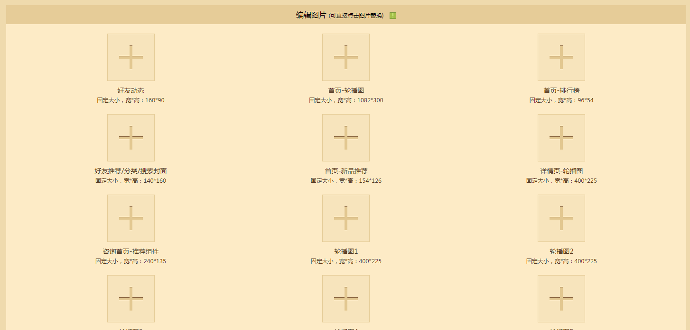

---
front:
hard: 入门
time: 5分钟
---
# 宣传与上传：制作宣传图并且上架开发者平台

## 了解宣传作品的重要性

当我们完成了作品之后，如果想要更多人了解和欣赏你的作品，那么给作品安排一次让人印象深刻的宣传是很重要的。可以让你再众多普通的视觉宣传中脱颖而出。

那么我们在什么情况下可以使用到宣传图呢？

1.  作品上传平台

    在开发者平台会设有专门的宣传图上传位置，所有的尺寸规格都在上面写的清清楚楚。只要按照尺寸和规则制作就可以啦。

    

2.  制作个人视频宣传

    制作好的宣传视频也可以为自己的作品起到好的宣传作用，而宣传视频的封面则也是一个吸引关注的首要宣传图位置。

    

    有了明确的宣传途径和位置，再结合上好的宣传图，这一切都是事半功倍的。但当然有一个前提，我们要明白什么是好的宣传图。接下里让我们一个对比图，来感受一下好与不好。

    这一张人物物本身是蓝色系，但是背景却选择了真实系和同色系，将人物和背景完全的融在一起，这是十分不可取的。因为不仅没有起到好的宣传效果，反而拉低了我们作品的质感。

    

    而一张整体排版简介明朗，主次分明。背景颜色和前面人物部分划分明显，虽然也有冷色系的，但是并不会显得突兀甚至还是比较协调的。这就是一个不错的宣传图。

## 如何快速构思一个有个人风格的宣传图

想要做好一个好的宣传图并不难，但是一定要学会根据对应尺寸将正确的构图排版、字体种类、颜色、组合形状、位置等组合在一起。才可以得到你们想要的宣传构图基础。

**—了解开发者平台的通常上架尺寸和规格**

在开发者平台电脑版/手机版上架作品时候，通常尺寸都是横版偏多。

例如：在其中展示在首页的轮播图和产品详情页中的轮播图都多为横版图，但封面图一般为竖图，所以这一点大家一定要注意，尺寸一定要根据平台上给的尺寸来进行调整和制图。

**—横版宣传图的构图排版**

**Icon图片构图（手机版）**

icon图是目前版本的手机版启动器中，资源中心区域组件展示给玩家的第一张图，但由于尺寸较小的原因，当下它的主要功能在于给玩家传递一种感知，即看到icon能够大概判断，这是什么风格及类型模组的感知。

对于icon图，我们需要做到的是：不堆叠过多元素的前提下，能在资源中心一众icon展示图中脱颖而出，成功吸引到玩家。

以下为资源中心icon图简单一览：

### 制作建议

首先icon图片可以被划分为多个区域，这里我建议是划分为3个区域来看：

区域1会被评分内容遮挡，所以尽量不要在右下角放置关键元素，也注意组件文字不要被评分遮挡到，会影响到整体美观。

因为评分（区域3）的设定，区域2部分是比较突兀的，所以建议的处理方式是在底部拉一个小横条出来，将评分完美融合进整个icon图里。

小横条的位置可以加上团队/工作室名字，也可以写组件名称或玩法类型。

小横条与文字的配色选定后，建议不要随意修改。在以后的icon中都保持一致，它将作为工作室作品的特征标识存在，方便玩家认知。

### banner图片（电脑版&手机版）

banner图，玩法的核心展示图片。banner的美观度和表现出的内容质量将决定玩家引流的效果。好的banner对大家在玩家论坛、社区、新鲜事内发布自己的玩法宣传内容是非常重要的。

一般banner的设计建议大家可以参考下面的构图来进行组合。推荐大家制作突出玩法主题、美观、且具有一定视觉冲击效果的banner图。

### 字体/颜色选择

字体建议尽量使用粗体的字体，一般我们建议大家选择可商用的开源字体。

可以尝试与官方logo接近的字体样式，这样看起来会很舒服，没有违和感。

在不使用立体字体设计的前提上，我们一般建议大家选择渐变色来做平面字体，同时渐变也尽量选择纯色渐变，如能掌握好色彩搭配原理的话，当然也建议大家多多尝试其他色彩跨度大的渐变。

### POS图片

**要点简述：这是出现在购买页面的图片，一般能看到这个图片的玩家，他就有成为你客户的可能性。**

所以POS图里我们需要传递的信息很简单：

1、感谢冒险家的支持，希望冒险家能关注工作室后续作品，或加入工作室讨论组

2、预防冒险家余额不足，告诉他可以去广告主那看广告获取钻石

制作建议：

POS图的内容可以不用与组件内容相关，但需要具有一定的通用性，所以按照上面的要点完成制作，再放上工作室的logo，差不多就可以完成了。

### 轮播图

轮播图可以被称作组件页内的banner，是一个尽量把你觉得组件里最有吸引力的地方，都放在这里展示。

但注意不要在轮播图里放大段的使用说明，尽量纯游戏内的组件效果图，寸土寸金的地方要好好利用起来，把模组里最炫酷的东西放上去，引起特定部分玩家的兴趣，就是轮播图最大的作用。

注：不论你觉得玩法里某个亮点有多么闪耀，也不要三张轮播图都用同一张……

## 将作品上传上架至开发者平台

宣传图都制作安排好之后，我们就可以直接通过开发者平台的上架流程进行作品上架和宣传图的上传啦。

首先，我们用开发者账号登陆开发者平台后，选择【作品管理】—【上架与资源管理】页面上的【发布新资源】就可以开始上架我们的作品啦。

然后，我们根据自己作品填写关于我们作品的信息。

组件信息这边一定要根据自己制作的产品类型来选择噢~不然错品类是没办法上架的哈

然后将我们制作好的宣传图按着规格和位置上传。

上传完成后直接点击保存,然后申请上架审核即可，如果有漏写的部分，系统会提示补全即可。

审核通过后，就会出现上架按钮，就可以直接上架作品开始展示自己的才艺啦。
