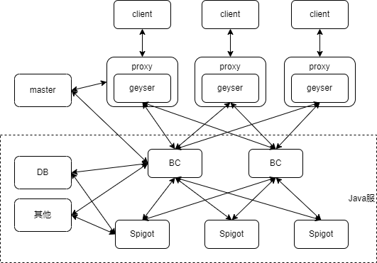

# 开服工具2.0简介

<iframe src="https://cc.163.com/act/m/daily/iframeplayer/?id=64818855ef3bb6958baf37fc" width="800" height="600" allow="fullscreen"/>

开服工具2.0是基于网络游戏开服工具、Geyser等框架的基础上改进而来的一种开服技术。开发者可以使用此技术，通过Java版Spigot服务端来架设我的世界中国版手机端服务器。

玩家可以利用网络游戏开服工具，制作专用于我的世界中国版手机端的Mod，来代替原来Java服的Forge Mod，实现客户端UI、特效、音效、模型等效果。

## 架构

框架图如上图所示，其中Java服部分和传统的Spigot服务器一致，主要包括以下一些服务器：

- Spigot：用来承载玩家游戏
- BC：代理服
- DB：数据库

剩余部分主要分为以下服务器：

- Geyser：协议转换服务器，用来将基岩版协议转换到Java版协议
- master：网络游戏开服工具的master端，主要用于控制整个集群，开发者无需过多关注
- proxy：代理服，用来分发玩家连接，可以理解为基岩版的BC服
- client：中国版基岩版客户端

想要制作开服工具2.0的服务器，至少需要掌握以下开发技术：

- Spigot插件开发
- ModSDK模组制作
- 任意一款数据库的使用

