# 小小云的申请和连接

小小云是我的世界中国版免费发放给开发者用来制作手机版服务器玩法的一台云服务器。需要开发者提前在开发者平台上进行申请。

小小云使用的是Debian操作系统，需要使用任意一款SSH连接工具进行连接。本教程中，将会使用XShell和XFtp这两款软件，介绍小小云的申请和使用的相关流程。

## 如何申请

### 生成RSA密钥对

提前安装好XShell，打开XShell之后，在菜单栏中找到工具，选择**用户密钥管理者**。

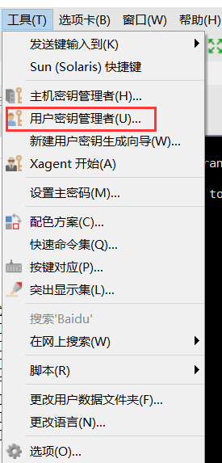

在弹出的窗口中点击右侧生成按钮。

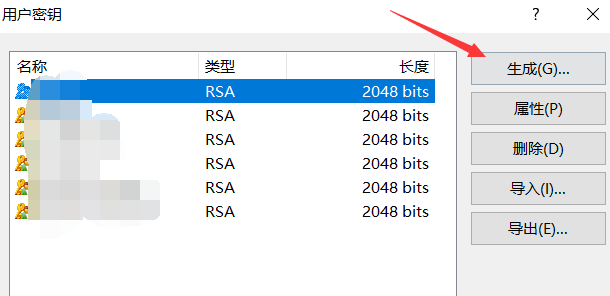

保持选项默认，点击下一步，直到出现下图的界面，填写密钥的名称。名称可以任意填写，仅作区分用途。

密码可以留空，也可以自行进行设置。**需要注意的是，如果忘记密码，没有任何渠道找回。**

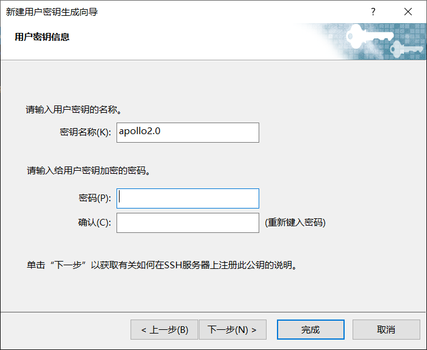

点击下一步，在公钥处，点击保存为文件，并记住文件位置。随后点击完成。

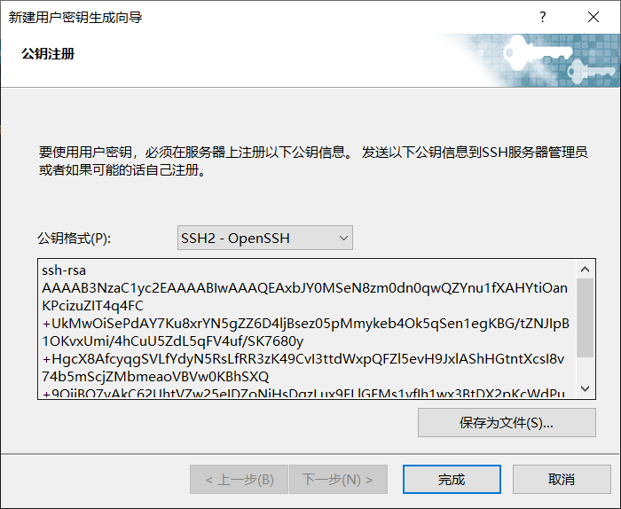

### 提交申请

前往开发者平台，提交手机版网络游戏入驻申请。[地址](https://mcdev.webapp.163.com/#/pe-server/application/edit/new)

勾选Spigot集成支持，并自行填写基本信息。

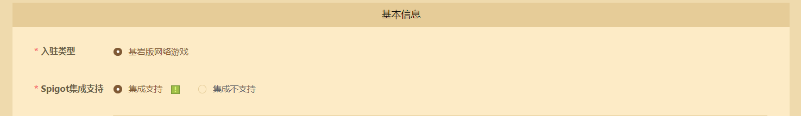

在下一步上传刚刚保存的公钥文件。正式服和测试服上传同一文件。

> 正式服和测试服可以使用不同的公钥。
>
> 在开发阶段，我们可以将正式服和测试服上传同一个公钥，在正式运营前，再重新生成并上传一个正式服所用的公钥。

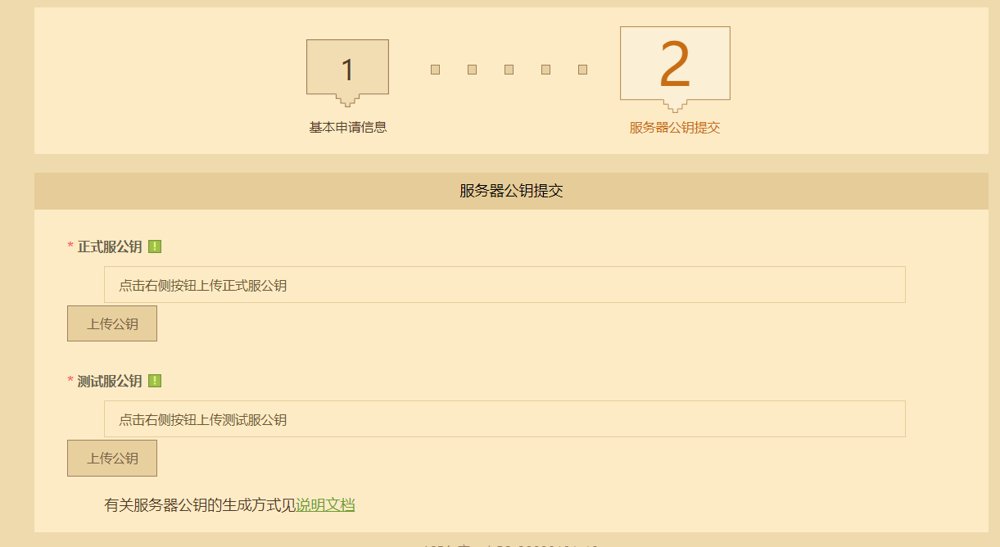

## 如何连接

在申请到开发机之后，可以进入开发者平台，服务器使用情况处，查看服务器IP地址等信息。

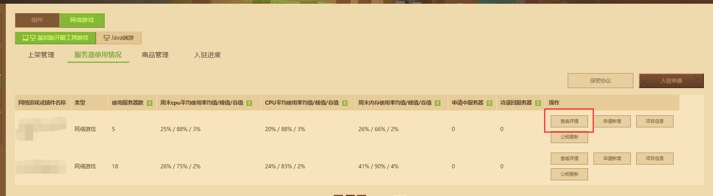

在开始连接服务器之前，首先需要访问白名单网页来获取临时白名单。

找到服务器地址后，打开浏览器，输入网址：**http://temp-white-list.mc.netease.com:9999/?machine=机器IP**，来获取白名单。

例如机器IP是42.186.1.1，那么网址就是: http://temp-white-list.mc.netease.com:9999/?machine=42.186.1.1。

正确访问后应该出现以下提示：

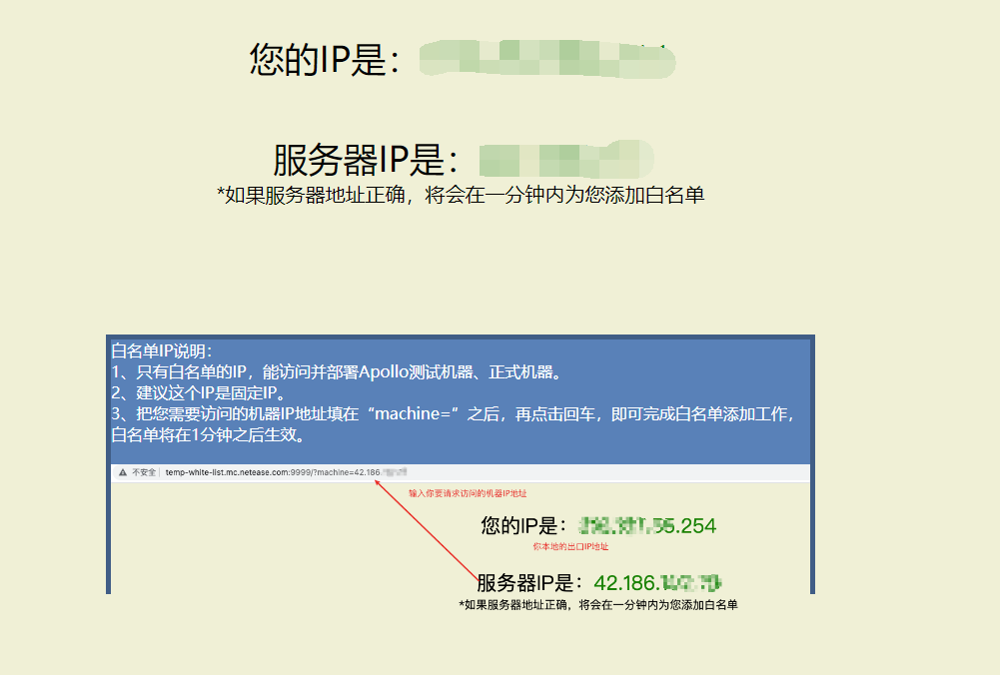

访问过后等待1分钟，即可为当前IP添加白名单。

打开XShell，点击 文件->新建。其中名称可以任意填写，主机填写服务器IP地址或自己解析的域名，端口号32200。

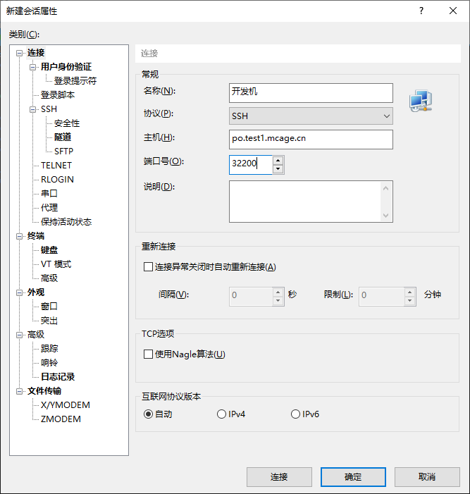

接下来切换到用户身份认证，用户名填写fuzhu，将方法的Password取消勾选，并勾选Public Key，点击右侧设置。

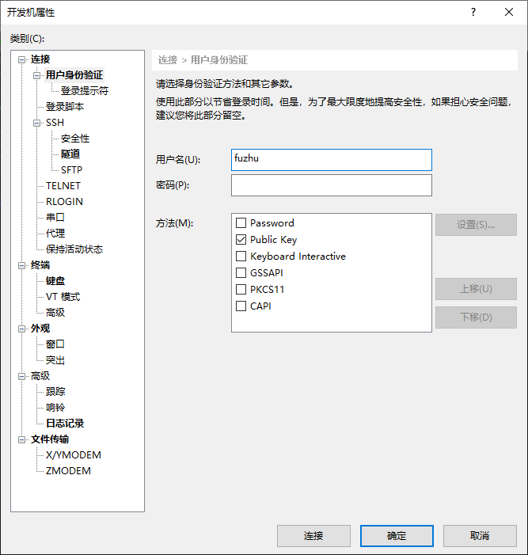

在弹出的窗口中选择之前创建的用户密钥，如有密码输入密码，点击确定。

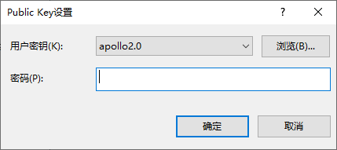

并点击”新建会话属性“的确定按钮，并在会话管理器中选择刚刚创建的会话，双击即可连接。

连接成功如下图：

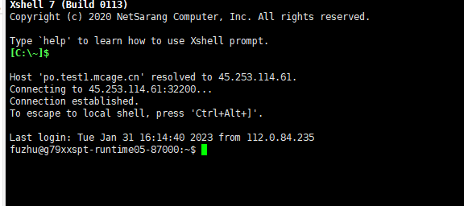

同时小小云内置了MySQL，Redis和MongoDB。

默认数据库连接信息如下：

- MySQL 主机127.0.0.1 端口3306 用户名 minecraft 密码 minecraft 数据库 minecraft
- Redis 主机127.0.0.1 端口 6379 密码 mcnetgame
- Mongo 主机127.0.0.1 端口 27017 用户名 minecraft 密码 minecraft 数据库 minecraft

要使用前端工具（例如Navicat）来连接并管理数据库，可以[点我参考](../../../30-网络服插件教程/1-准备知识/3-数据库的概念.md)。
