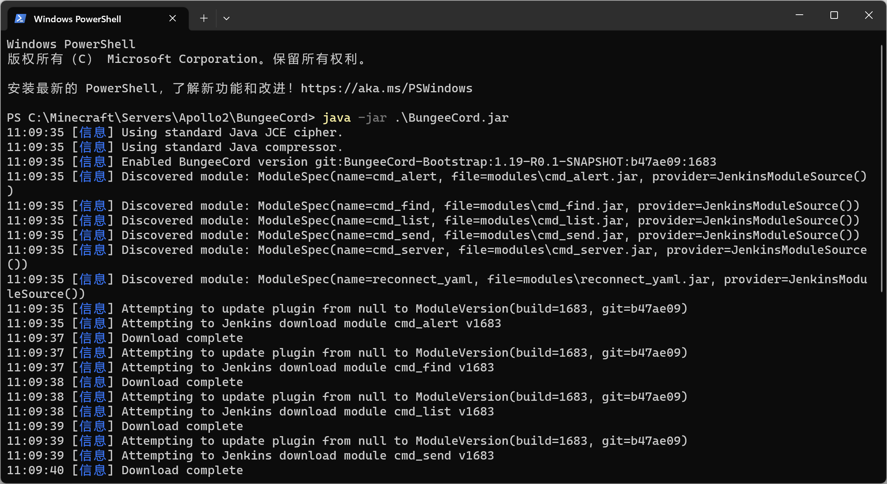
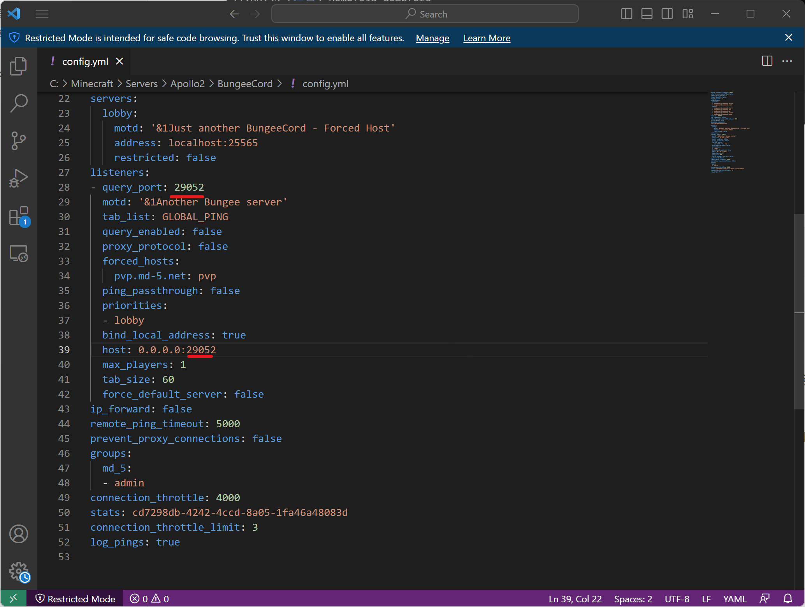
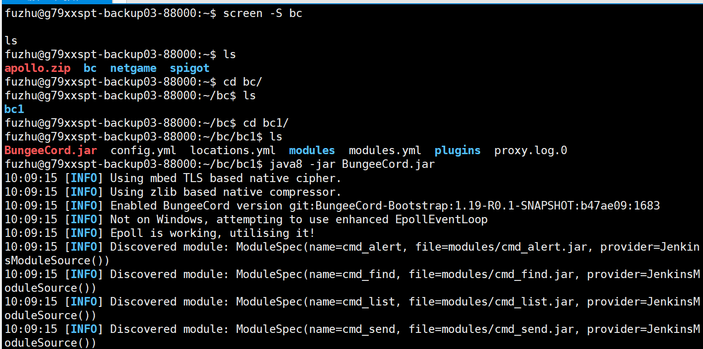

# Java服的搭建与部署

<iframe src="https://cc.163.com/act/m/daily/iframeplayer/?id=64818951c31a9c0f360dc572" width="800" height="600" allow="fullscreen"/>

本章将会介绍如何部署开服工具2.0架构中的Java服部分。部署服务器和传统的Java服类似，唯一的区别就是：

在制作和开发开服工具2.0的玩法时，必须将服务器运行在小小云中。

因此，我们需要提前准备好BC端和对应的Spigot端，将其上传到小小云的SFTP中。

## 准备BC端和Spigot端

首先下载对应的BC端和Spigot端jar文件。

部分需要下载的插件，可以自行提前下载 [链接](https://mc.163.com/dev/mcmanual/mc-dev/mcguide/27-手机网络游戏/课程10：使用Spigot开服/99-下载内容.html?catalog=1)

ViaVersion [链接](https://www.spigotmc.org/resources/viaversion.19254/)

### BC

BC端下载：前往 [CI构建站](https://ci.md-5.net/job/BungeeCord/) 下载最新的BungeeCord.jar并存放到一个空文件夹中。

打开cmd，输入启动指令`java -jar BungeeCord.jar`，等待下载资源并生成默认配置文件。



随后进入`plugins`文件夹，下载BungeeMaster插件并拖入`plugins`文件夹

随后新建BungeeMaster文件夹，新建`config.yml`，为BungeeMaster的配置文件。

填入以下内容

```yaml
master_port: 29001
server_id: 12001
```

填写要求

- server_id 取值区间在[12000, 14000)内，并且保持单次部署唯一即可，代表部署时的服务器id
- master_port端口范围要求[29000,31000)，代表控制服端口
  - **master_port**是指BC服监听Master服连接所用端口，请注意与下述用于原生游戏的**query_port**区分，以免造成端口冲突
- 填写完毕后，请记下相关参数，后面需要在studio中填写

接下来需要配置BC端的配置文件`config.yml`，其位置在与BungeeCord.jar的同级目录中。配置bc服监听的端口，端口范围要求[29000,31000)

并且**关闭**正版验证`online_mode`



剩下bc配置部分和传统Java服类似，BC配置参考文档[点我](https://www.spigotmc.org/wiki/bungeecord-configuration-guide/)。

### Spigot

开服工具2.0官方推荐使用Spigot1.12.2，需要使用官方构建工具进行构建，具体构建教程见SpigotMC官网。[下载链接](https://hub.spigotmc.org/jenkins/job/BuildTools/)

创建一个空文件夹并准备最新版Spigot的jar文件，并在cmd输入`java -jar 文件名`，启动服务器。

- 同意EULA
- 下载SpigotMaster插件放入plugins文件夹
- 下载ViaVersion插件放入plugins文件夹
- 关闭正版验证

随后关闭服务器，将两个文件夹打包，通过SFTP上传到小小云。

根据官方开发规范要求，将文件解压到指定目录。

> - **BungeeCord服需要部署在以下路径**：`~/bc/*/BungeeCord.jar`
>
>   例如：`~/bc/bc1/BungeeCord.jar`
>
> - **Spigot服需要部署在以下路径**：`~/spigot/*/spigot-1.12.2.jar`
>
>   例如：`~/spigot/lobby1/spigot-1.12.2.jar`

## 启动服务器

使用screen命令新建一个名为bc的screen`screen -S bc`，cd到BungeeCord.jar的目录后，输入`java8 -jar BungeeCord.jar`启动服务器。Java命令行参数可以自行配置。



服务器启动成功后，按下组合键`Ctrl A D`退出screen，再使用同样的操作新建一个screen来运行spigot端。

要切换到以前的screen，输入`screen -rx screen名`即可。
