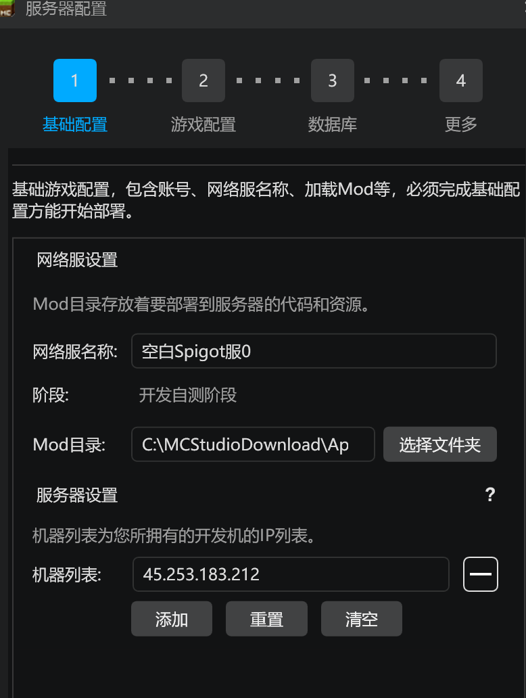
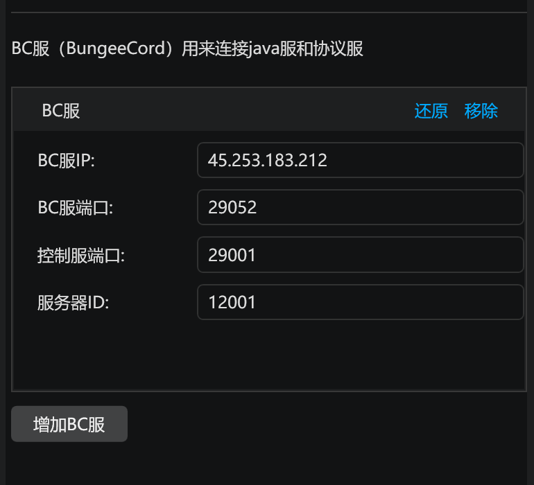
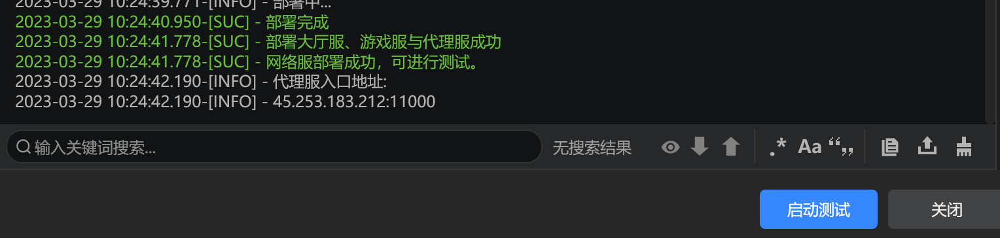
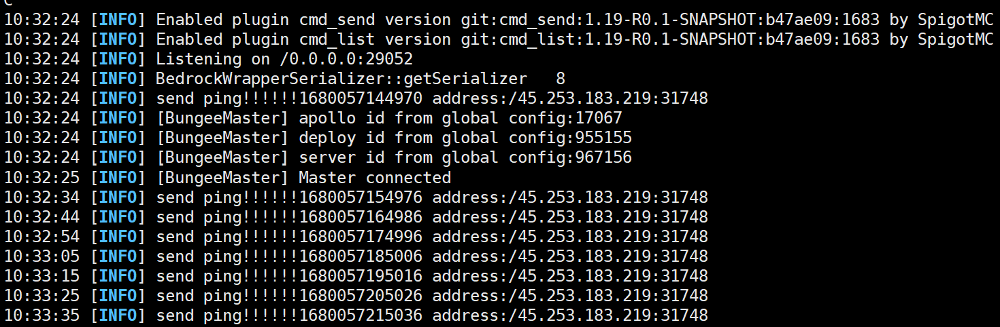

# 开发者工作台的使用

在完成了小小云上Java服的搭建与上传后，我们需要继续前往开发者工作台完成开服工具2.0其他服务器的部署。

登陆开发者工作台之后，切换到基岩版服务器分类。点击新建，创建一个**空白Spigot服**。

在服务器配置窗口中，确认机器列表中的机器为自己的开发机IP地址。

切换到游戏配置标签页中，确认控制服、代理服、协议服、BC服都至少有一个，没有的点击增加。除了BC服之外，其他配置保持默认即可。

BC服的配置信息，根据在上一节中BC服的相关配置填写，如果填写时完全按照教程的步骤操作，那么可以参考下方填写。

填写完成后点击完成，并部署。

出现下方提示时代表部署完成，就可以点击启动测试，进入游戏进行测试了。

配置正确的情况下，可以正常进入Java服，并且BC服的控制台可以看到BungeeMaster插件的输出。

