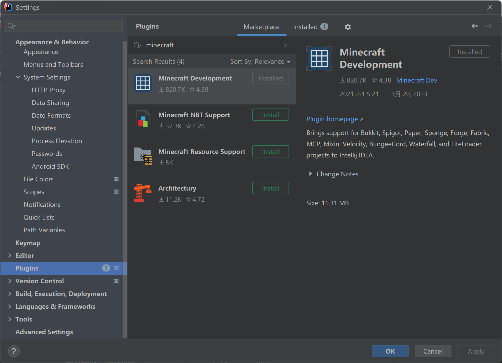
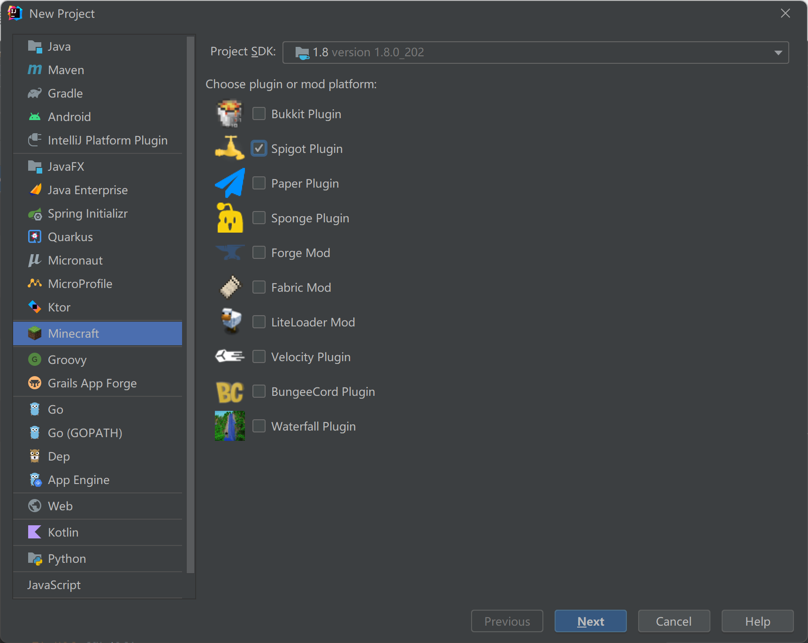
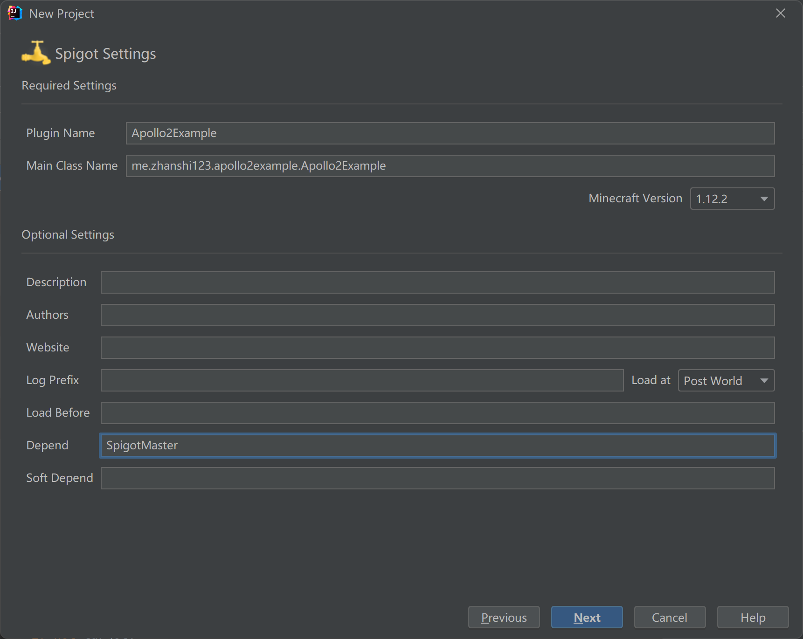
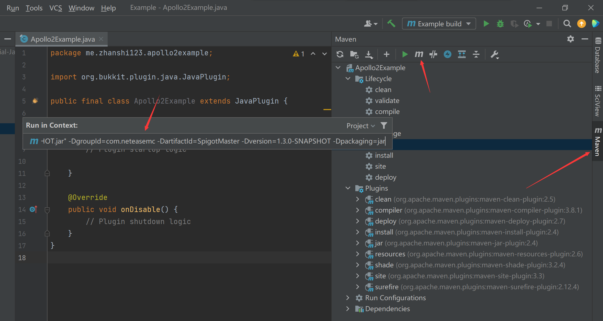
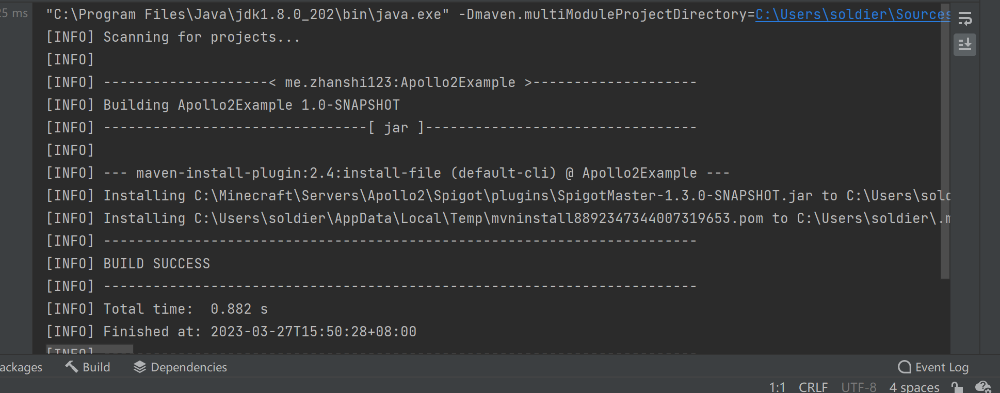
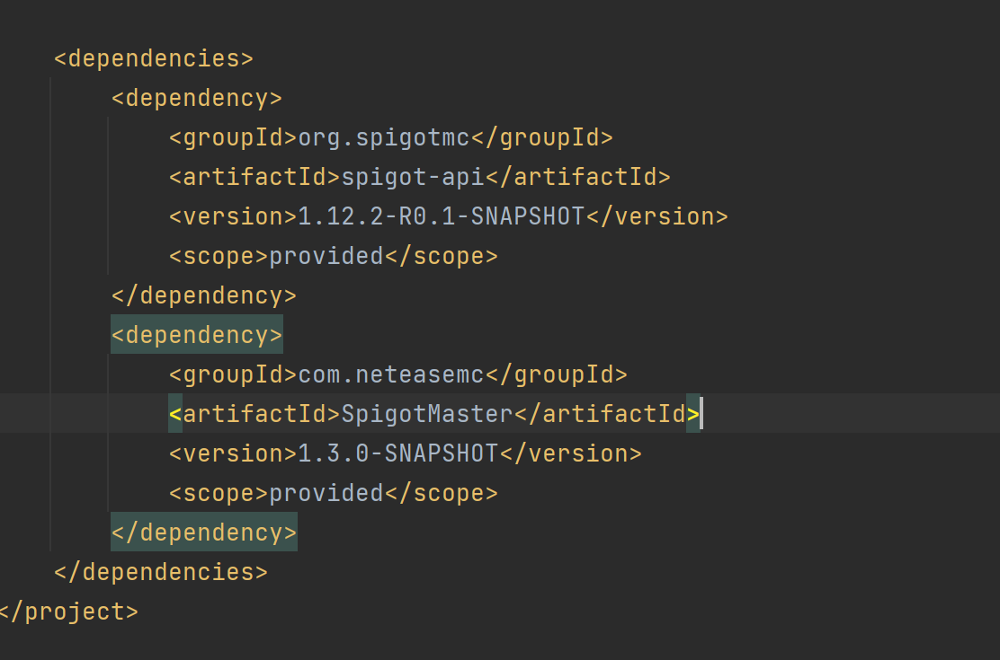

# Spigot插件编写

<iframe src="https://cc.163.com/act/m/daily/iframeplayer/?id=64818bb8c31a9c0f360dc5b2" width="800" height="600" allow="fullscreen"/>

## 语言基础

编写Spigot插件需要一定的Java语言基础，并在后续开发中会使用到Maven或Gradle来构建Spigot插件，在此仅提供部分链接供参考，需要开发者自行学习。

- [Java](https://www.runoob.com/java/java-tutorial.html)
- [Maven](https://maven.apache.org/)
- [Gradle](https://gradle.org/)

在掌握Java语言基础后，需要继续学习Spigot、BC的API并进行插件开发。同样也需要开发者自行进行学习。

- [Spigot插件开发教程](https://www.spigotmc.org/wiki/spigot-plugin-development/)
- [BC插件开发教程](https://www.spigotmc.org/wiki/bungeecord-plugin-development/)

## 开始编写Spigot插件

### 创建项目

> 本教程会使用IntelliJ IDEA来进行插件开发，并使用Minecraft Development插件来快速创建项目。
>
> 如果没有安装的可以提前进行安装
>
> 

首先点击创建项目，找到Minecraft分类，选择Spigot插件。



接着自行填写GroupId和ArtifactId，点击下一步后，进行如下更改：

1. 选择Minecraft Version为1.12.2
2. 填写Depend为SpigotMaster



点击下一步后，选择目录和目录名进行项目创建。

### 添加依赖

在下载SpigotMaster插件后，复制文件路径。将下方指令中的path-to-jar替换为路径，x.x.x替换为版本号。

SpigotMaster插件和之前安装到服务器里的是同一个，可以点[我](https://mc.163.com/dev/mcmanual/mc-dev/mcguide/27-手机网络游戏/课程10：使用Spigot开服/99-下载内容.html?catalog=1)查看下载方式。

```
mvn install:install-file -Dfile=path-to-jar -DgroupId=com.neteasemc -DartifactId=SpigotMaster -Dversion=x.x.x-SNAPSHOT -Dpackaging=jar
```

在IDEA的Maven指令中执行



执行成功后，会看到BUILD SUCCESS的输出。



接下来在pom.xml中，配置dependency添加依赖。

```
		<dependency>
            <groupId>com.neteasemc</groupId>
            <artifactId>SpigotMaster</artifactId>
            <version>1.3.0-SNAPSHOT</version>
            <scope>provided</scope>
        </dependency>
```

其中版本处需要替换为自己安装的版本。添加完成后dependency如下。



### 代码编写

完成了依赖的添加，就可以使用SpigotMaster来和中国版基岩版客户端进行通信了。

在SpigotMaster的接口中，涉及到与客户端通信的方法主要有两个。

- listenForEvent
- notifyToClient

使用SpigotMaster实例下的这两个方法将可以实现绝大多数通信的需求。

其他方法可以参考：[SpigotMaster文档](https://mc.163.com/dev/mcmanual/mc-dev/mcguide/27-手机网络游戏/课程10：使用Spigot开服/81-SpigotMasterAPI文档.html?catalog=1)

SpigotMaster的实例可以通过下方代码获取。

```java
public void onEnable() {
	SpigotMaster spigotMaster = (SpigotMaster) Bukkit.getPluginManager().getPlugin("SpigotMaster");
}
```

#### listenForEvent

使用该方法可以监听客户端发送来的事件，需要提供参数：

- `namespace` - 来源客户端系统的namespace
- `system` - 来源客户端系统的systemName
- `event` - 事件名
- `handler` - 回调函数

在这里我们先暂时编写一个简单的监听事件的函数。

```java
package me.zhanshi123.apollo2example;

import com.neteasemc.spigotmaster.SpigotMaster;
import org.bukkit.Bukkit;
import org.bukkit.plugin.java.JavaPlugin;

public final class Apollo2Example extends JavaPlugin {
    private static Apollo2Example instance;

    public static Apollo2Example getInstance() {
        return instance;
    }

    private SpigotMaster spigotMaster;

    public SpigotMaster getSpigotMaster() {
        return spigotMaster;
    }

    @Override
    public void onEnable() {
        instance=this;
        spigotMaster = (SpigotMaster) Bukkit.getPluginManager().getPlugin("SpigotMaster");
        spigotMaster.listenForEvent("testMod", "testModBeh", "TestEvent", (player, map) -> {
            getLogger().info(player.getName());
            map.forEach((key, value) -> getLogger().info("k: " + key + "v: " + value));
        });

    }

    @Override
    public void onDisable() {
        // Plugin shutdown logic
    }
}
```

调用这个方法，将会注册一个命名空间为testMod，系统名为testModBeh的TestEvent事件，并在收到数据时打印发送的玩家名，和事件的信息字典。

Java的listenForEvent的回调函数，会在Python端调用NotifyToServer时触发。对应的代码如下：

```python
self.NotifyToServer("TestEvent", {"data": "测试数据"})
```

在**ClientSystem**内调用**NotifyToServer**方法，传递事件和对应参数。完整的Python代码见下一节。

#### notifyToClient

该方法可以主动给客户端发送事件，需要提供参数：

- `player` - 接收事件的玩家
- `namespace` - 在客户端系统使用ListenForEvent监听的namespace
- `system` - 在客户端系统使用ListenForEvent监听的systemName
- `event` - 事件名
- `data` - 事件参数。注意，要使用-2指代本地玩家的entityId。

我们同样编写一个指令，用来后续测试Python端是否能正常收到消息

首先在plugin.yml中注册指令

```yaml
commands:
  apollotest:
```

接下来新建一个类，实现CommandExecutor接口，在玩家执行指令时调用SpigotMaster实例并notifyToClient

```java
package me.zhanshi123.apollo2example;

import org.bukkit.command.Command;
import org.bukkit.command.CommandExecutor;
import org.bukkit.command.CommandSender;
import org.bukkit.entity.Player;

import java.util.HashMap;
import java.util.Map;

public class Commands implements CommandExecutor {
    @Override
    public boolean onCommand(CommandSender sender, Command command, String label, String[] args) {
        if (!(sender instanceof Player)) {
            return true;
        }
        Player player = (Player) sender;
        Map<String, Object> data = new HashMap<>();
        data.put("msg", "这是一条来自Java服的消息");
        Apollo2Example.getInstance().getSpigotMaster()
                .notifyToClient(player, "testMod", "testModDev", "TestServerEvent", data);
        player.sendMessage("notifyToClient已执行");
        return true;
    }
}
```

在这里，我们将作为testMod这个命名空间的testModDev的系统，发送事件，事件名为TestServerEvent，数据为一个Map，它会在客户端被读取为Python的字典类型进行处理，其中的数据也会被转换为Python类型：

| Java类型                 | Python类型 |
| ------------------------ | ---------- |
| null                     | None       |
| boolean                  | bool       |
| int                      | int        |
| long                     | long       |
| BigInteger(2^63到2^64-1) | long       |
| float                    | float      |
| double                   | float      |
| String                   | str        |
| List\<Object\>           | list       |
| Map<String, Object>      | dict       |

对于Python端，需要接受来自Java端的notifyToClient发送的数据，需要调用**ClientSystem**的**ListenForEvent**方法，对应的代码如下：

这样就会在收到事件时，打印参数。完整的Python代码见下一节。

```python
    def __init__(self, namespace, systemName):
        ClientSystem.__init__(self, namespace, systemName)
        self.ListenForEvent(ModConst.ModName, ModConst.ServerSystemName, "TestServerEvent", self, self.OnServerEvent)

    def OnServerEvent(self, args):
        print "OnServerEvent", args

    def Destroy(self):
        self.UnListenForEvent(ModConst.ModName, ModConst.ServerSystemName, "TestServerEvent", self, self.OnServerEvent)
```

接下来在onEnable方法中进行注册。

```java
Bukkit.getPluginCommand("apollotest").setExecutor(new Commands());
```

随后执行`mvn package`即可对插件进行打包，随后可以上传至小小云对应Spigot端的plugins文件夹。

然后重启服务器，即可让插件加载。