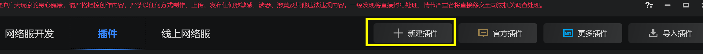
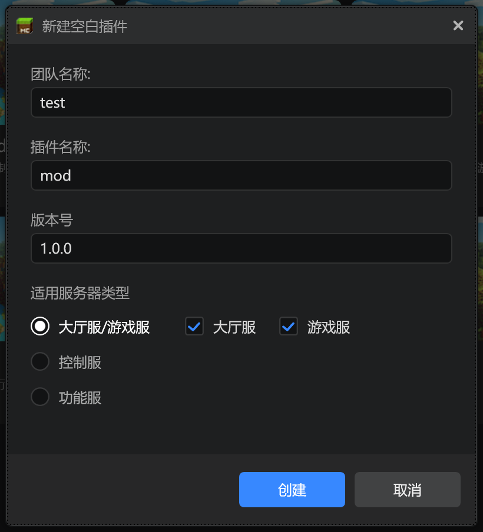
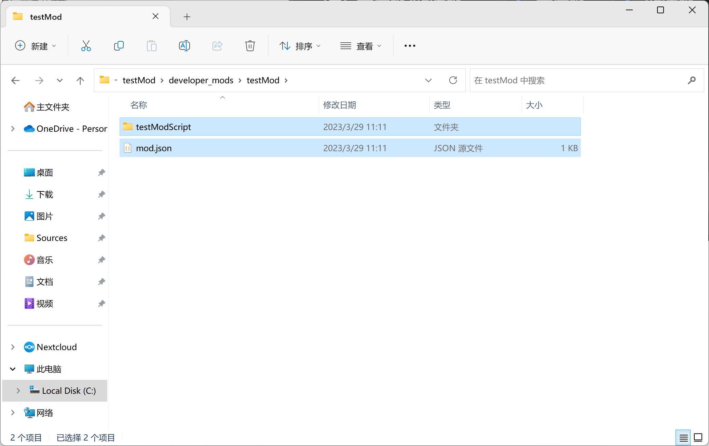
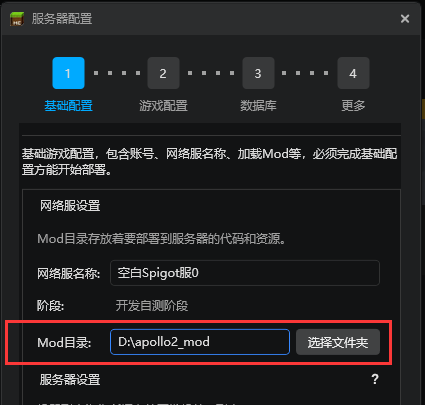
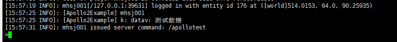
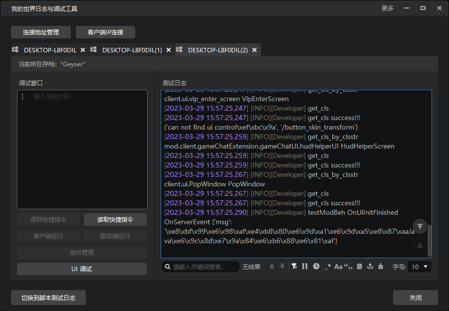

# 客户端模组编写

本节将主要介绍如何制作客户端模组与Java服插件进行通信。

## 语言基础

编写中国版基岩版客户端模组需要掌握Python2.7、模组SDK。

该部分较为基础，需要开发者自行安装并学习。推荐提前安装[补全库](https://mc.163.com/dev/mcmanual/mc-dev/mcguide/20-%E7%8E%A9%E6%B3%95%E5%BC%80%E5%8F%91/13-%E6%A8%A1%E7%BB%84SDK%E7%BC%96%E7%A8%8B/2-Python%E8%84%9A%E6%9C%AC%E5%BC%80%E5%8F%91/0-%E8%84%9A%E6%9C%AC%E5%BC%80%E5%8F%91%E5%85%A5%E9%97%A8.html?key=%E8%A1%A5%E5%85%A8&docindex=1&type=0#%E5%AE%89%E8%A3%85mod-sdk%E8%A1%A5%E5%85%A8%E5%BA%93)。

- [Python2.7](https://www.python.org/downloads/release/python-2718/)
- [模组SDK](https://mc.163.com/dev/mcmanual/mc-dev/mcguide/20-%E7%8E%A9%E6%B3%95%E5%BC%80%E5%8F%91/13-%E6%A8%A1%E7%BB%84SDK%E7%BC%96%E7%A8%8B/1-Mod%E5%BC%80%E5%8F%91%E7%AE%80%E4%BB%8B/1-Mod%E7%AE%80%E4%BB%8B.html?catalog=1)

## 项目创建

在开始代码编写之前，首先需要创建项目。

切换到插件标签页，点击新建插件。



然后我们按照团队名，插件名称来填写信息，并且勾选大厅服/游戏服。

因为我们在之前已经在Spigot插件中定义好了插件的命名空间和系统名，所以我们这里按照下方截图填写，方便后面直接和Java服通信。



创建完成后，对插件右键，打开目录。就可以看到插件的目录结构。

- behavior_packs - 行为包目录
- developer_mods - 在开服工具2.0中无用
- resource_packs - 资源包目录
- worlds - 存档（在开服工具2.0中仅用来配置行为包和资源包）

在这里，我们主要需要编写的地方就是**行为包目录、资源包目录**。

- **行为包**主要用来存放客户端模组的代码、物品定义、实体定义等等。
- **资源包**主要用来存放客户端模组的美术资源，文本资源等等。

因为developer_mods在开服工具2.0中没有用途，所以我们可以打开文件夹，将截图所示内容删除。



完成删除后，我们可以将整个testMod文件夹剪切到服务器配置中的Mod目录文件夹。



接下来，打开装有Python插件的IDEA或者PyCharm，对客户端模组进行脚本编辑。

在File->Open中复制文件路径，打开这个模组文件夹。


然后对`testModBehavior`右键，将其标记为`Sources Root`，这样补全库才能正常工作。


接下来，我们可以打开`modConst.py`，在这里可以看到这个模组的一些常量。

- `ModName` 代表 模组命名空间
- `ClientSystemName`  代表 模组客户端系统名

可以回顾一下Java服插件中的命名空间和客户端系统名，可以看到这它们是一一对应的。

**只有在服务器和客户端通信时使用相同命名空间和系统名，通信数据才会被成功处理。**

```python
# -*- coding: utf-8 -*-

# 整个Mod的一些绑定配置
ModVersion = "1.0.0"
ModName = "testMod"
ClientSystemName = "testModBeh"
ClientSystemClsPath = "testModScript.modClientSystem.ModClientSystem"
ServerSystemName = "testModDev"
ServerSystemClsPath = "testModScript.modServerSystem.ModServerSystem"

# 引擎事件
UiInitFinishedEvent = "UiInitFinished"
```

接下来打开`modClientSystem.py`

```python
import client.extraClientApi as clientApi
```

将文件顶部的代码修改为，方便正常使用补全库。

```python
import mod.client.extraClientApi as clientApi
```

## 代码编写

功能需求：

- 在玩家客户端UI初始化完成时，向服务器发送TestEvent事件，参数任意。
- 监听服务器TestServerEvent，并打印信息到控制台。

会用到以下两个函数：

- [NotifyToServer](https://mc.163.com/dev/mcmanual/mc-dev/mcdocs/1-ModAPI/%E6%8E%A5%E5%8F%A3/%E9%80%9A%E7%94%A8/%E4%BA%8B%E4%BB%B6.html?key=NotifyToServer&docindex=1&type=0)
- [ListenForEvent](https://mc.163.com/dev/mcmanual/mc-dev/mcdocs/1-ModAPI/%E6%8E%A5%E5%8F%A3/%E9%80%9A%E7%94%A8/%E4%BA%8B%E4%BB%B6.html?key=ListenForEvent&docindex=5&type=0)

除此之外，还有更多的事件相关的接口，可以参考[官方文档](https://mc.163.com/dev/mcmanual/mc-dev/mcdocs/1-ModAPI/%E6%8E%A5%E5%8F%A3/%E9%80%9A%E7%94%A8/%E4%BA%8B%E4%BB%B6.html?catalog=1)。

### 向服务器发送TestEvent事件

在创建项目后的模板中，已经生成了监听UI初始化完成的事件，我们可以直接在这个事件的回调函数中向服务器通信。

直接使用NotifyToServer函数即可。发送的数据是一个Python字典。

```python
    # UI加载完成
    def OnUiInitFinished(self, args):
        logger.info("%s OnUiInitFinished", ModConst.ClientSystemName)
        self.NotifyToServer("TestEvent", {"data": "测试数据"})
```

Python的类型会被转换成Java的类型，对照表如下：

| Python类型                               | Java类型            |
| ---------------------------------------- | ------------------- |
| None                                     | null                |
| bool                                     | Boolean             |
| int/long（-2^31到2^31-1）                | Integer             |
| int/long（-2^63到-2^31-1，2^31到2^63-1） | Long                |
| int/long（2^63到2^64-1）                 | BigInteger          |
| float                                    | Double              |
| str                                      | String              |
| list                                     | List\<Object\>      |
| dict（key必须为str）                     | Map<String, Object> |

### 监听服务器TestServerEvent事件

我们可以在客户端系统初始化时，监听这个事件并注册回调函数。在Destroy时注销监听。

```python
    def __init__(self, namespace, systemName):
        ClientSystem.__init__(self, namespace, systemName)
        self.mUIMgr = uiMgr.UIMgr()

        self.ListenForEvent(clientApi.GetEngineNamespace(), clientApi.GetEngineSystemName(), ModConst.UiInitFinishedEvent, self, self.OnUiInitFinished)
        self.ListenForEvent(ModConst.ModName, ModConst.ServerSystemName, "TestServerEvent", self, self.OnServerEvent)

    def OnServerEvent(self, args):
        print "OnServerEvent", args

    def Destroy(self):
        self.UnListenForEvent(ModConst.ModName, ModConst.ServerSystemName, "TestServerEvent", self, self.OnServerEvent)
        self.UnListenForEvent(clientApi.GetEngineNamespace(), clientApi.GetEngineSystemName(), ModConst.UiInitFinishedEvent, self, self.OnUiInitFinished)
        if self.mUIMgr:
            self.mUIMgr.Destroy()
```

在这里，我们监听的命名空间，引用了ModConst中的ModName，对应Spigot插件中的命名空间`testMod`。还引用了ModConst中的ServerSystemName，对应Spigot插件中的系统名`testModDev`。因此这个监听函数将会正常监听来自服务器的信息。

## 部署测试

至此我们完成了客户端与服务端之间双端通信的最基础的实现。接下来将客户端模组进行部署，进入服务器测试。

找到服务器配置->游戏配置->协议服，勾选testMod。进行部署。


随后点击启动测试，进入游戏。并输入指令/apollotest

可以看到服务器控制台正常输出



客户端控制台也正常输出。



Python命令行执行：

```python
"OnServerEvent {'msg': '\xe8\xbf\x99\xe6\x98\xaf\xe4\xb8\x80\xe6\x9d\xa1\xe6\x9d\xa5\xe8\x87\xaaJava\xe6\x9c\x8d\xe7\x9a\x84\xe6\xb6\x88\xe6\x81\xaf'}".decode("utf-8")
```

```python
u"OnServerEvent {'msg': '\u8fd9\u662f\u4e00\u6761\u6765\u81eaJava\u670d\u7684\u6d88\u606f'}"
```

消息经过utf8解码，是我们传输的消息

