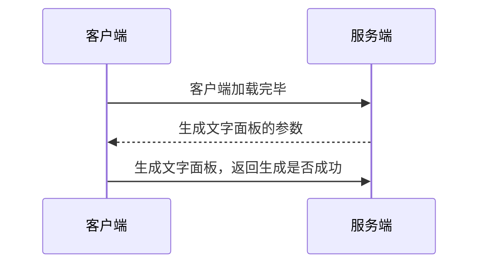
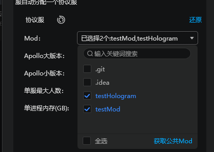
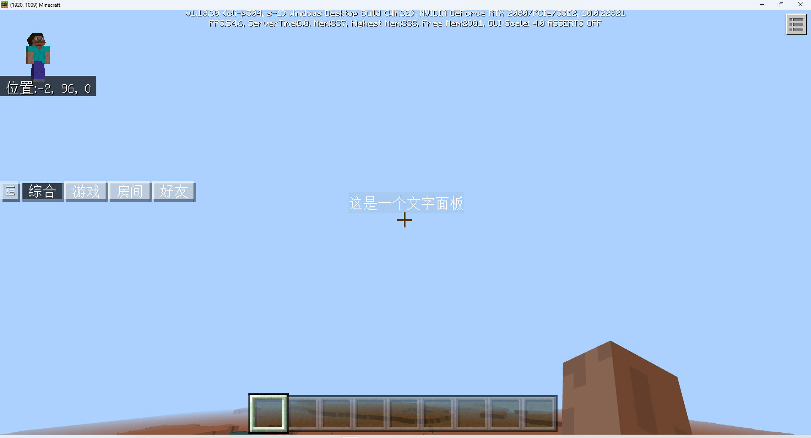

# 作业

<iframe src="https://cc.163.com/act/m/daily/iframeplayer/?id=64818c70c31a9c0f360dc5c0" width="800" height="600" allow="fullscreen"/>

学习了服务端与客户端之间的基本通信方法之后，我们可以尝试来完成一个使用模组SDK来实现的全息字的功能。

## 要求

在玩家加入游戏之后，在玩家客户端的指定位置生成一个文字面板（全息字）。

整个通信流程应该如下图所示：



> **为什么需要在客户端加载完毕的时候主动通知服务端，而不是直接监听服务端的PlayerJoinEvent？**
>
> 因为在PlayerJoinEvent触发的时候，基岩版客户端可能还没有完全加载完毕。
>
> 在这个时候给客户端发送事件，有可能客户端模组还没有初始化完成，无法处理请求。

## 实现过程

### Spigot插件

首先新建Spigot项目，操作步骤和之前一致。这里新建了一个名为TutorialHologram的项目，并配置pom.xml，添加SpigotMaster插件的maven依赖。

在开始编写插件之前，我们预先定义好，客户端的命名空间为`testHologram`，因此，根据[开发规范](https://mc.163.com/dev/mcmanual/mc-dev/mcguide/27-%E6%89%8B%E6%9C%BA%E7%BD%91%E7%BB%9C%E6%B8%B8%E6%88%8F/%E8%AF%BE%E7%A8%8B5%EF%BC%9A%E6%8F%92%E4%BB%B6%E6%95%99%E5%AD%A6/%E7%AC%AC1%E8%8A%82%EF%BC%9A%E5%AE%98%E7%BD%91%E6%8F%92%E4%BB%B6%E8%A7%84%E8%8C%83.html?catalog=1)，客户端系统名应为`testHologramBeh`，服务端系统名应为`testHologramDev`。

- 客户端通知加载完毕的事件定义为`ClientLoadFinishEvent`
- 传输生成文字面板的参数的事件定义为`HologramParameterEvent`
- 返回生成结果的事件定义为`HologramGeneratedEvent`

推荐将这部分命名空间和事件名定义为常量。

> 教程为了方便将所有代码都写入主类，在实际开发过程中，不推荐将所有代码写入一个类中！！

```java
	private final String NAMESPACE = "testHologram";
    private final String CLIENT_SYSTEM_NAME = "testHologramBeh";
    private final String SERVER_SYSTEM_NAME = "testHologramDev";
    private final String CLIENT_LOAD_FINISH_EVENT = "ClientLoadFinishEvent";
    private final String HOLOGRAM_PARAMETER_EVENT = "HologramParameterEvent";
    private final String HOLOGRAM_GENERATED_EVENT = "HologramGeneratedEvent";
```

首先，生成一个文字面板，需要提供这个文字面板的坐标，文本的信息，我们在作业中可以简单地硬编码坐标的位置和文本的内容。例如坐标为`(0,100,0)`，内容为`这是一个文字面板`。

在监听ClientLoadFinishEvent后，发送文字面板参数信息。同时监听HologramGeneratedEvent，输出结果。

```java
	@Override
    public void onEnable() {
        spigotMaster = (SpigotMaster) Bukkit.getPluginManager().getPlugin("SpigotMaster");
        spigotMaster.listenForEvent(NAMESPACE, CLIENT_SYSTEM_NAME, CLIENT_LOAD_FINISH_EVENT, (player, map) -> {
            Map<String, Object> data = new HashMap<>();
            data.put("x", 0);
            data.put("y", 100);
            data.put("z", 0);
            data.put("text", "这是一个文字面板");
            spigotMaster.notifyToClient(player, NAMESPACE, SERVER_SYSTEM_NAME, HOLOGRAM_PARAMETER_EVENT, data);
        });
        spigotMaster.listenForEvent(NAMESPACE, CLIENT_SYSTEM_NAME, HOLOGRAM_GENERATED_EVENT, (player, map) -> {
            boolean success = (boolean) map.get("suc");
            getLogger().info("生成全息字 " + player.getName() + " " + success);
        });
    }
```

在HologramGeneratedEvent中，我们可以监听来自客户端的事件，并从中获取suc的值，来判断生成是否成功，可以继续拓展插件的功能。

这样我们的Spigot插件部分的代码就编写完成了，可以构建后装入服务器。

### 客户端模组

和之前的操作一样，新建一个插件，团队名称填写test，模组名填写hologram，勾选游戏服和大厅服。

生成完成后打开插件文件夹，删除`developer_mods`文件夹里的内容，并将整个插件文件夹复制到部署设置的模组目录中。

#### 文字面板的生成

文字面板的API文档 [点我](https://mc.163.com/dev/mcmanual/mc-dev/mcdocs/1-ModAPI/%E6%8E%A5%E5%8F%A3/%E7%89%B9%E6%95%88/%E6%96%87%E5%AD%97%E9%9D%A2%E6%9D%BF.html?catalog=1)

通过文档的查阅，我们需要先后

1. 创建文字面板
2. 设置文字面板的位置
3. 如有需要的话 返回服务器文字面板的ID

#### 常量定义

之前在Spigot服插件编写的过程中已经定义了一些事件名常量，方便起见，我们也需要在客户端模组的常量文件中定义相同的常量。

`hologramConst.py`文件中定义下列变量

```python
ClientLoadFinishEvent = "ClientLoadFinishEvent"
HologramParameterEvent = "HologramParameterEvent"
HologramGeneratedEvent = "HologramGeneratedEvent"
```

#### 功能实现

首先在OnUiInitFinished函数中，向服务端系统发送事件。

```python
# UI加载完成
def OnUiInitFinished(self, args):
    logger.info("%s OnUiInitFinished", HologramConst.ClientSystemName)
    self.NotifyToServer(HologramConst.ClientLoadFinishEvent, {})
```

接下来监听来自服务端系统的`HologramParameterEvent`事件，并设置回调函数。获取坐标，创建文字面板。

部分代码如下

```python
def __init__(self, namespace, systemName):
    ClientSystem.__init__(self, namespace, systemName)
    self.mUIMgr = uiMgr.UIMgr()
    self.mTextBoardComp = clientApi.GetEngineCompFactory().CreateTextBoard(clientApi.GetLevelId())

    self.ListenForEvent(HologramConst.ModName, HologramConst.ServerSystemName, HologramConst.HologramParameterEvent, self, self.OnHologramParameter)
    self.ListenForEvent(clientApi.GetEngineNamespace(), clientApi.GetEngineSystemName(), HologramConst.UiInitFinishedEvent, self, self.OnUiInitFinished)

def OnHologramParameter(self, args):
    x = args["x"]
    y = args["y"]
    z = args["z"]
    text = args["text"]
    boardId = self.mTextBoardComp.CreateTextBoardInWorld(text, (1, 1, 1, 1), (0.5, 0.5, 0.5, 0.1), True)
    if not boardId:
        self.NotifyToServer(HologramConst.HologramGeneratedEvent, {"suc": False})
        return
    self.mTextBoardComp.SetBoardPos(boardId, (x, y, z))
    self.NotifyToServer(HologramConst.HologramGeneratedEvent, {"suc": True, "boardId": boardId})

def Destroy(self):
    self.UnListenForEvent(HologramConst.ModName, HologramConst.ServerSystemName, HologramConst.HologramParameterEvent, self, self.OnHologramParameter)
    self.UnListenForEvent(clientApi.GetEngineNamespace(), clientApi.GetEngineSystemName(), HologramConst.UiInitFinishedEvent, self, self.OnUiInitFinished)
    if self.mUIMgr:
        self.mUIMgr.Destroy()
```

OnHologramParameter函数，会解析来自服务端的数据，在指定xyz坐标创建文字面板，如果失败，返回信息中suc是False。如果成功，suc为True，并附带文字面板的id。

## 部署测试

前往服务器配置，协议服，勾选刚刚编写的testHologram模组，重新部署后进入游戏进行测试。



进入游戏后，传送到坐标(0,100,0)附近，可以看到我们生成的文字面板。


