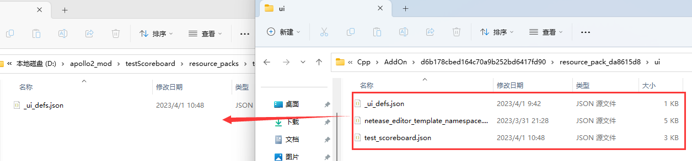
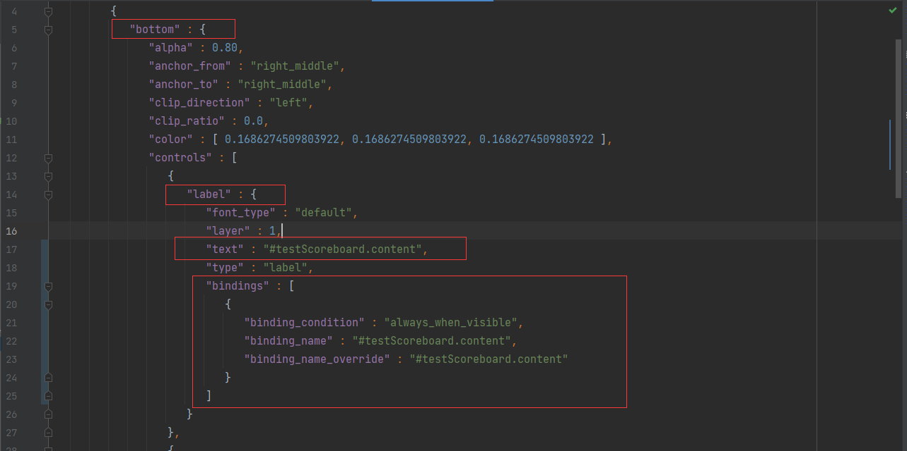
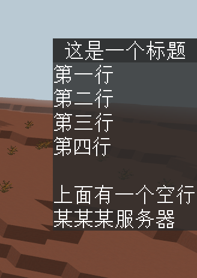

# 界面逻辑的编写

## 注册界面

在上一节中，我们使用界面编辑器简单制作了一个计分板界面。但是它的内容目前还是固定的，想要让它动起来，就需要编写界面逻辑的代码。

在[第一节](./0-创建界面的两种方式.md)中，已经介绍过，创建UI有两种方式，分别是CreateUI和PushScreen。根据计分板的这种界面的特性，我们应该使用CreateUI方式来创建Hud界面。

使用开发者工作台创建的模板插件默认包含一个客户端的界面注册管理类，我们可以先新建一个插件，命名为`testScoreboard`，并将其剪切到服务器模组目录，删除`developer_mods`文件。

然后找到上一节编辑的附加包项目，右键打开目录。

将`resource_pack`文件夹中的ui文件夹里的内容，复制到`testScoreboard\resource_packs\testScoreboardResource\ui`中。这里都是我们在附加包中编辑的界面文件的相关资源。

- _ui_defs.json：资源包中所使用的ui文件的定义，引用到的界面都需要在这个文件里定义
- netease_editor_template_namespace.json： 网易编辑器模板文件，必须保留
- test_scoreboard.json：上一节编辑的计分板界面文件



接下来使用IDE打开这个模组文件夹，观察代码。在客户端初始化的时候，实例化了uiMgr.UIMgr。

```python
def __init__(self, namespace, systemName):
   ClientSystem.__init__(self, namespace, systemName)
   self.mUIMgr = uiMgr.UIMgr()
```

观察UIMgr的代码。可以发现，只要我们调用Init方法，并传入ClientSystem，就会自动帮我们注册uiDef中的所有界面。

```python
class UIMgr(object):
   def __init__(self):
      super(UIMgr, self).__init__()
      self.mUIDict = {}
      self.mClientSystem = None

   def Destroy(self):
      pass

   def Init(self, system):
      self.mClientSystem = system
      for uiKey, config in uiDef.UIData.iteritems():
         self.InitSingleUI(uiKey, config)

   def InitSingleUI(self, uiKey, config):
      cls, screen = config["cls"], config["screen"]
      extraClientApi.RegisterUI(ModName, uiKey, cls, screen)
      extraParam = {}
      if config.has_key("isHud"):
         extraParam["isHud"] = config["isHud"]
      ui = extraClientApi.CreateUI(ModName, uiKey, extraParam)
      if not ui:
         print "InitSingleUI %s fail" % uiKey
         return
      if config.has_key("layer"):
         ui.GetBaseUIControl("").SetLayer(config["layer"])
      self.mUIDict[uiKey] = ui

   def GetUI(self, uiKey):
      return self.mUIDict.get(uiKey, None)

   def RemoveUI(self, uiKey):
      ui = self.mUIDict.get(uiKey, None)
      if ui:
         del self.mUIDict[uiKey]
         ui.SetRemove()
         return True
      return False
```

注册界面的流程是：

1. `extraClientApi.RegisterUI(ModName, uiKey, cls, screen)`
2. `extraClientApi.CreateUI(ModName, uiKey, extraParam)`

即注册了界面之后，直接调用了CreateUI方法，使用CreateUI的方式创建了界面。

如果我们后期需要使用PushScreen界面，也可以对这里的代码进行简单的修改，让它RegisterUI后直接返回。后续我们需要创建界面的时候，直接调用PushScreen方法。

因此我们可以提前编辑好uiDef，并且在UI初始化完成后，调用Init方法，即可完成对界面的注册。

UIDef中主要定义了几个参数

- cls：逻辑代码类的路径
- screen：界面json的命名空间和画布，画布默认为main
- layer：注册ui后，ui所在的显示层级
- isHud：是否为Hud

我们这里可以根据需要修改，修改screen的定义，删除layer：

```python
	UIDef.ScoreboardScreen : {
		"cls":"testScoreboardScript.ui.test_scoreboard_screen.ScoreboardScreen",
		"screen":"test_scoreboard.main",
		"isHud":1
	}
```

接下来在ClientSystem中，UI初始化完毕的事件中，调用Init方法，注册界面。

```python
def OnUiInitFinished(self, args):
    logger.info("%s OnUiInitFinished", ScoreboardConst.ClientSystemName)
    self.mUIMgr.Init(self)
```

UI注册到此完毕，如果这时进入游戏，将可以看到静态的UI会被显示在游戏中。

想要让它根据需要动起来，就需要编写界面逻辑，也就是之前所提到的uiDef中cls对应的类。接下来将介绍界面逻辑的两种方式：

- 使用模组SDK
- 使用数据绑定

## 使用模组SDK

找到`test_scoreboard_screen.py`文件，可以看到，它是一个继承了ScreenNode的类。

所有UI逻辑相关的代码都需要继承ScreenNode，并且基于界面的操作的很多方法，都在ScreenNode的成员方法中。[文档链接](https://mc.163.com/dev/mcmanual/mc-dev/mcdocs/1-ModAPI/%E6%8E%A5%E5%8F%A3/%E8%87%AA%E5%AE%9A%E4%B9%89UI/UI%E7%95%8C%E9%9D%A2.html#screennode)

其中最为常用的方法便是[GetBaseUIControl](https://mc.163.com/dev/mcmanual/mc-dev/mcdocs/1-ModAPI/%E6%8E%A5%E5%8F%A3/%E8%87%AA%E5%AE%9A%E4%B9%89UI/UI%E7%95%8C%E9%9D%A2.html#getbaseuicontrol)，它可以用来根据路径获取BaseUIControl示例，从而对界面控件进行修改。

对UI中的内容进行操作的一般步骤如下：

- 定义各个控件的路径
- 通过GetBaseUIControl来获取各个控件的实例
- 根据控件的不同类型，调用[asXXX](https://mc.163.com/dev/mcmanual/mc-dev/mcdocs/1-ModAPI/%E6%8E%A5%E5%8F%A3/%E8%87%AA%E5%AE%9A%E4%B9%89UI/UI%E7%95%8C%E9%9D%A2.html#getbaseuicontrol)，转换为具体的实例
- 根据要求设置数据，例如修改文本、图片等

拿我们要制作的计分板UI来说，我们主要需要对两个地方进行设置：标题、内容。

因此我们可以先定义好两个控件的路径。

```python
def __init__(self, namespace, name, param):
    ScreenNode.__init__(self, namespace, name, param)
    print '==== %s ====' % 'init ScoreboardScreen'
    self.mBottom = "/bottom"
    self.mBottomLabel = self.mBottom + "/label"
    self.mTitle = self.mBottom + "/title"
    self.mTitleLabel = self.mTitle + "/label"
```

接下来可以编写一个方法，用来设置计分板的标题和内容。

要设置文本内容，首先应该先通过GetBaseUIControl获取实例，再asLabel，获取文本的控件实例。

```python
self.GetBaseUIControl(self.mBottomLabel)
```

接下来查阅[文档](https://mc.163.com/dev/mcmanual/mc-dev/mcdocs/1-ModAPI/%E6%8E%A5%E5%8F%A3/%E8%87%AA%E5%AE%9A%E4%B9%89UI/UI%E6%8E%A7%E4%BB%B6.html?catalog=1#labeluicontrol)，找到LabelUIControl的方法，可以看到使用SetText来设置文本内容。

完整的方法如下：

```python
def SetText(self, title, content):
    self.GetBaseUIControl(self.mBottomLabel).asLabel().SetText(content)
    self.GetBaseUIControl(self.mTitleLabel).asLabel().SetText(title)
```

这样就完成了文本的设置，后续如果需要在服务器上同步计分板信息给玩家，只需要客户端监听来自服务端的事件，并且每次收到事件时调用这个方法即可。


我们也可以在Create方法中，调用这个函数，来测试修改是否生效。

> Create方法是ScreenNode的生命周期之一，它会在UI界面被创建完成的时候被调用，这时可以获取控件并修改控件属性了。
>
> 其他生命周期可以参考[文档](https://mc.163.com/dev/mcmanual/mc-dev/mcguide/18-%E7%95%8C%E9%9D%A2%E4%B8%8E%E4%BA%A4%E4%BA%92/30-UI%E8%AF%B4%E6%98%8E%E6%96%87%E6%A1%A3.html?docindex=1&type=0#%E7%95%8C%E9%9D%A2%E5%88%9B%E5%BB%BA%E6%B5%81%E7%A8%8B%E5%8F%8A%E7%94%9F%E5%91%BD%E5%91%A8%E6%9C%9F)

参考代码如下：

```python
# -*- coding: utf-8 -*-
import mod.client.extraClientApi as clientApi

ScreenNode = clientApi.GetScreenNodeCls()


class ScoreboardScreen(ScreenNode):
    """
    Scoreboard
    """

    def __init__(self, namespace, name, param):
        ScreenNode.__init__(self, namespace, name, param)
        print '==== %s ====' % 'init ScoreboardScreen'
        self.mBottom = "/bottom"
        self.mBottomLabel = self.mBottom + "/label"
        self.mTitle = self.mBottom + "/title"
        self.mTitleLabel = self.mTitle + "/label"

    def SetText(self, title, content):
        self.GetBaseUIControl(self.mBottomLabel).asLabel().SetText(content)
        self.GetBaseUIControl(self.mTitleLabel).asLabel().SetText(title)

    # Create函数是继承自ScreenNode，会在UI创建完成后被调用
    def Create(self):
        print '==== %s ====' % 'ScoreboardScreen Create'
        self.SetText("这是一个标题", "第一行\n第二行\n第三行\n第四行\n\n上面有一个空行\n某某某服务器")
```

## 使用数据绑定

除了使用模组SDK在数据更变时主动调用接口来设置控件数据之外，还可以使用数据绑定的方式，将Python代码和界面某个属性进行绑定。

数据绑定[说明文档](https://mc.163.com/dev/mcmanual/mc-dev/mcguide/18-%E7%95%8C%E9%9D%A2%E4%B8%8E%E4%BA%A4%E4%BA%92/70-UI%E6%95%B0%E6%8D%AE%E7%BB%91%E5%AE%9A.html?catalog=1)

我们可以先将之前编写的使用模组SDK方式来修改界面的`test_scoreboard_screen.py`文件复制一份保留，然后再在原文件上做修改。

### Json文件修改

首先我们需要明确，需要绑定修改数据的控件，分别是`/bottom/label`和`/bottom/title/label`。

打开ui文件`resource_packs/ui/test_scoreboard.json`，找到两个文本控件。

例如下方截图的是bottom控件下的label控件，即路径为`/buttom/label`的控件。



修改字段：

```json
"bindings" : [
   {
      "binding_condition" : "always_when_visible",
      "binding_name" : "#testScoreboard.content",
      "binding_name_override" : "#testScoreboard.content"
   }
],
"text" : "#testScoreboard.content"
```

根据[UI说明文档](https://mc.163.com/dev/mcmanual/mc-dev/mcguide/18-%E7%95%8C%E9%9D%A2%E4%B8%8E%E4%BA%A4%E4%BA%92/30-UI%E8%AF%B4%E6%98%8E%E6%96%87%E6%A1%A3.html?catalog=1#label)，可以查阅到text字段的值对应了label控件显示的文本，因此我们可以给它创建一个绑定，名为`#testScoreboard.content`，并把这个值赋值给text字段。

同样的，继续修改`/bottom/title/label`控件，也给它添加一个绑定，名为`#testScoreboard.title`。最终修改后的JSON文件如下：

```json
{
   "main" : {
      "controls" : [
         {
            "bottom" : {
               "alpha" : 0.80,
               "anchor_from" : "right_middle",
               "anchor_to" : "right_middle",
               "clip_direction" : "left",
               "clip_ratio" : 0.0,
               "color" : [ 0.1686274509803922, 0.1686274509803922, 0.1686274509803922 ],
               "controls" : [
                  {
                     "label" : {
                        "font_type" : "default",
                        "layer" : 1,
                        "text" : "#testScoreboard.content",
                        "type" : "label",
                        "bindings" : [
                           {
                              "binding_condition" : "always_when_visible",
                              "binding_name" : "#testScoreboard.content",
                              "binding_name_override" : "#testScoreboard.content"
                           }
                        ]
                     }
                  },
                  {
                     "title" : {
                        "alpha" : 0.90,
                        "anchor_from" : "top_middle",
                        "anchor_to" : "bottom_middle",
                        "clip_direction" : "left",
                        "clip_ratio" : 0.0,
                        "color" : [ 0.1372549019607843, 0.1372549019607843, 0.1372549019607843 ],
                        "controls" : [
                           {
                              "label" : {
                                 "font_type" : "default",
                                 "layer" : 1,
                                 "text" : "#testScoreboard.title",
                                 "text_alignment" : "center",
                                 "type" : "label",
                                 "bindings" : [
                                    {
                                       "binding_condition" : "always_when_visible",
                                       "binding_name" : "#testScoreboard.title",
                                       "binding_name_override" : "#testScoreboard.title"
                                    }
                                 ]
                              }
                           }
                        ],
                        "fill" : true,
                        "layer" : 2,
                        "size" : [ "100.0%sm+0.0px", "100.0%c+0.0px" ],
                        "texture" : "textures/ui/white_background",
                        "type" : "image"
                     }
                  }
               ],
               "fill" : true,
               "layer" : 1,
               "size" : [ "100.0%cm+0.0px", "100.0%cm+0.0px" ],
               "texture" : "textures/ui/white_background",
               "type" : "image"
            }
         }
      ],
      "type" : "screen"
   },
   "namespace" : "test_scoreboard"
}
```

### Python文件修改

我们可以直接在ScreenNode中定义两个变量，分别将其和`#testScoreboard.title`、`#testScoreboard.content`进行绑定。

具体代码如下：

```python
# -*- coding: utf-8 -*-
import mod.client.extraClientApi as clientApi

ScreenNode = clientApi.GetScreenNodeCls()
ViewBinder = clientApi.GetViewBinderCls()


class ScoreboardScreen(ScreenNode):
    """
    Scoreboard
    """

    def __init__(self, namespace, name, param):
        ScreenNode.__init__(self, namespace, name, param)
        print '==== %s ====' % 'init ScoreboardScreen'
        self.mContent = "第一行\n第二行\n第三行\n第四行\n\n上面有一个空行\n某某某服务器"
        self.mTitle = "这是一个标题"

    @ViewBinder.binding(ViewBinder.BF_BindString, "#testScoreboard.title")
    def ReturnTitleText(self):
        return self.mTitle

    @ViewBinder.binding(ViewBinder.BF_BindString, "#testScoreboard.content")
    def ReturnContentText(self):
        return self.mContent
```

通过给方法添加`@ViewBinder.binding`注解，可以给函数设置数据绑定。其中第一个参数为数据类型，第二个参数为绑定名。要更新数据时，直接修改变量的值即可。

除此之外还可以对其他类型的数据进行绑定，可以参考文档深入了解。

## 测试

部署到服务器进行测试：



可以看到实现了原版计分板的效果。

