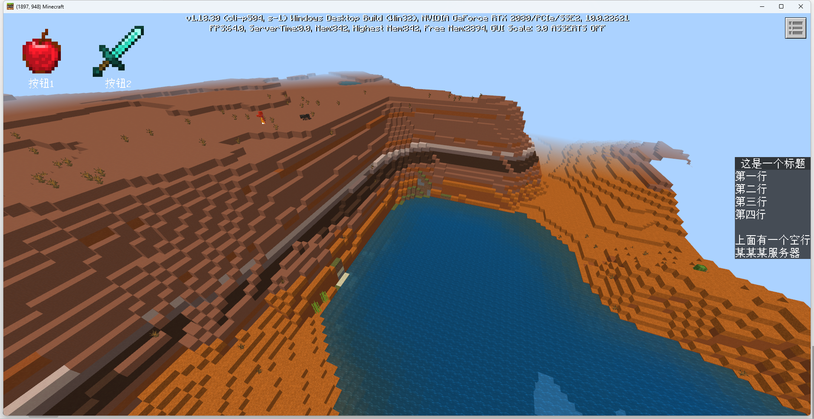
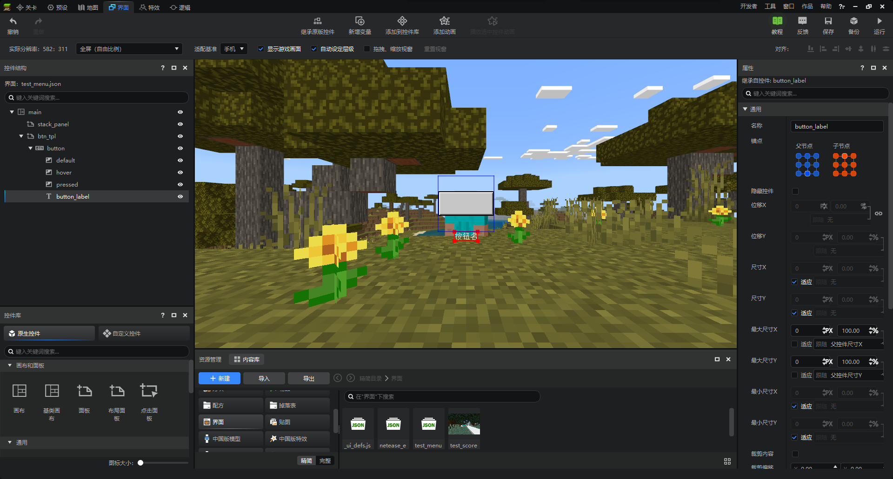
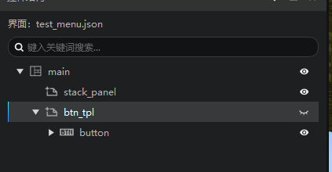
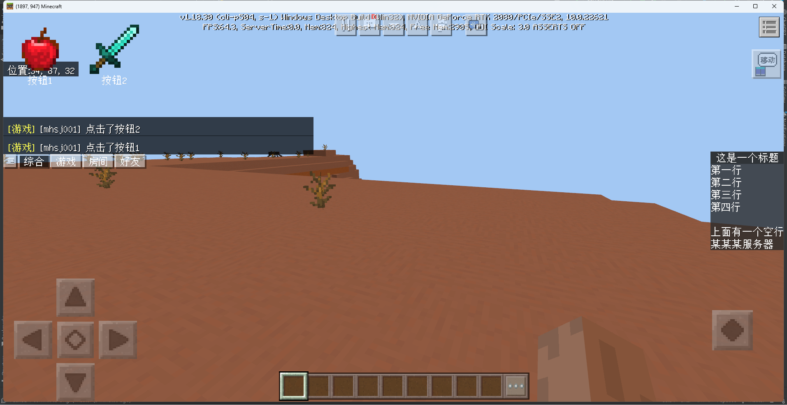

# 作业

<iframe src="https://cc.163.com/act/m/daily/iframeplayer/?id=64818d47c31a9c0f360dc5da" width="800" height="600" allow="fullscreen"/>

要求：依赖客户端Mod制作一个简易的菜单插件。

- 进入游戏自动生成一个在Hud界面上的菜单
- 服务器可以配置每个菜单按钮：
  - 索引位置
  - 图片、文本
  - 点击后以玩家身份执行指令

示例图：



## Spigot插件

Spigot插件的逻辑较为简单，在玩家UI加载完成之后，向玩家客户端发送提前加载好的菜单配置文件即可。

配置文件格式：

```yaml
button1:
  idx: 1
  # 该按钮在菜单中的位置
  texture: 'textures/items/apple'
  # 该按钮显示的贴图
  text: '按钮1'
  # 该按钮下方的提示文本
  commands:
    - 'say 点击了按钮1'
  # 点击后执行的玩家指令
button2:
  idx: 2
  texture: 'textures/items/diamond_sword'
  text: '按钮2'
  commands:
    - 'say 点击了按钮2'
```

读取配置文件的代码不过多介绍，需要参考可以下载源码进行查看。

主类中包含了与客户端通讯的关键代码，供参考：

```java
package me.zhanshi123.tutorialmenu;

import com.neteasemc.spigotmaster.SpigotMaster;
import me.zhanshi123.tutorialmenu.config.ConfigManager;
import me.zhanshi123.tutorialmenu.config.MenuButtonConfig;
import org.bukkit.Bukkit;
import org.bukkit.plugin.java.JavaPlugin;

public final class TutorialMenu extends JavaPlugin {
    private static TutorialMenu instance;
    private SpigotMaster spigotMaster;

    private final String NAMESPACE = "testMenu";
    private final String SERVER_SYSTEM_NAME = "testMenuDev";
    private final String CLIENT_SYSTEM_NAME = "testMenuBeh";
    private final String CLIENT_UI_LOADED_EVENT = "ClientUiLoadedEvent";
    private final String SERVER_MENU_EVENT = "ServerMenuEvent";
    private final String CLIENT_MENU_CLICKED_EVENT = "ClientMenuClickedEvent";


    public static TutorialMenu getInstance() {
        return instance;
    }

    @Override
    public void onEnable() {
        instance = this;
        ConfigManager.getInstance().loadConfig();
        spigotMaster = (SpigotMaster) Bukkit.getPluginManager().getPlugin("SpigotMaster");
        spigotMaster.listenForEvent(NAMESPACE, CLIENT_SYSTEM_NAME, CLIENT_UI_LOADED_EVENT, (player, map) ->
                spigotMaster.notifyToClient(player, NAMESPACE, SERVER_SYSTEM_NAME, SERVER_MENU_EVENT, ConfigManager.getInstance().getClientData()));
        spigotMaster.listenForEvent(NAMESPACE, CLIENT_SYSTEM_NAME, CLIENT_MENU_CLICKED_EVENT, (player, map) -> {
            int index = (int) map.get("index");
            MenuButtonConfig menuButtonConfig = ConfigManager.getInstance().getMenuConfigs().get(index);
            if (menuButtonConfig == null) {
                getLogger().warning("玩家 " + player.getName() + " 发送了一个不正确的菜单数据");
                return;
            }
            menuButtonConfig.dispatchCommand(player);
        });
    }

    @Override
    public void onDisable() {

    }
}
```

## 客户端模组

创建一个命名空间为testMenu的插件，删除`developer_mods`文件夹之后，就可以先创建一个空白附加包，开始编辑菜单界面。

### 界面编辑

对于这种有序排列的界面，我们可以直接使用布局面板来自动给按钮排版。

1. 新建一个布局面板，将其锚点都设置在左上方，并设置`尺寸X`为适应，修改排列方式为水平排布。

2. 新建一个面板，命名为`btn_tpl`，作为按钮的模板。自行调整其尺寸，教程中设置为60x60。

3. 在`btn_tpl`下新建一个按钮，这就是按钮本体。自行调整其尺寸，教程中设置为40x40。

4. 在空间结构中展开界面`button`，找到`button_label`，它被用来显示按钮上的文本，将它的父锚点设置到下，子锚点设到上。这样它就会整个显示在按钮图片的下方。

   

5. 最后将`btn_tpl`设置为隐藏。后面我们会把它作为模板来克隆别的按钮，添加到`stack_panel`中。

   

> 除了使用布局面板+克隆模板的方式来制作这种多按钮的界面。
>
> 还可以使用网格来实现。需要注意的是，网格的内容在Create生命周期的时候，有可能还没有被生成。
>
> 需要监听[GridComponentSizeChangedClientEvent](https://mc.163.com/dev/mcmanual/mc-dev/mcdocs/1-ModAPI/%E4%BA%8B%E4%BB%B6/UI.html#gridcomponentsizechangedclientevent)，在其数量由0变为其他的时候，才能对网格下的控件进行操作。

### 界面逻辑

将刚刚编辑好的文件，复制到对应的客户端资源`testMenu/resource_packs/testMenuResource/ui`处。

接下来编辑UiDef，修改screen的值为刚刚编辑的json文件。

```python
UIData = {
    UIDef.MenuScreen: {
        "cls": "testMenuScript.ui.test_menu_screen.MenuScreen",
        "screen": "test_menu.main",
        "isHud": 1
    }
}
```

客户端界面初始化完成后，加载`UiMgr`，并向服务器通知。

```python
def OnUiInitFinished(self, args):
    logger.info("%s OnUiInitFinished", MenuConst.ClientSystemName)
    self.mUIMgr.Init(self)
    self.NotifyToServer("ClientUiLoadedEvent", {})
```

监听来自服务器的`ServerMenuEvent`事件，并通过`mUIMgr`获取`ScreenNode`实例，调用`SetData`方法来设置来自服务端的数据。

```python
def __init__(self, namespace, systemName):
    ClientSystem.__init__(self, namespace, systemName)
    self.mUIMgr = uiMgr.UIMgr()

    self.ListenForEvent(clientApi.GetEngineNamespace(), clientApi.GetEngineSystemName(), MenuConst.UiInitFinishedEvent, self, self.OnUiInitFinished)
    self.ListenForEvent(MenuConst.ModName, MenuConst.ServerSystemName, "ServerMenuEvent", self, self.OnServerMenu)

def OnServerMenu(self, args):
    print "OnServerMenu", args
    if self.mUIMgr:
        self.mUIMgr.GetUI(UIDef.MenuScreen).SetData(args["data"])
    else:
        print "UIMgr还没有加载!"
```

编写MenuScreen的`SetData`方法，通过传入的数据来克隆按钮。并给按钮添加回调。

[Clone](https://mc.163.com/dev/mcmanual/mc-dev/mcdocs/1-ModAPI/%E6%8E%A5%E5%8F%A3/%E8%87%AA%E5%AE%9A%E4%B9%89UI/UI%E7%95%8C%E9%9D%A2.html?key=Clone&docindex=2&type=0#clone)具体参数见文档。

```python
# -*- coding: utf-8 -*-
import mod.client.extraClientApi as clientApi

from testMenuScript.menuConst import ModName, ClientSystemName

ScreenNode = clientApi.GetScreenNodeCls()


class MenuScreen(ScreenNode):
    """
    Menu
    """

    def __init__(self, namespace, name, param):
        ScreenNode.__init__(self, namespace, name, param)
        self.mStackPanel = "/stack_panel"
        self.mTemplate = "/btn_tpl"
        print '==== %s ====' % 'init MenuScreen'

    # Create函数是继承自ScreenNode，会在UI创建完成后被调用
    def Create(self):
        print '==== %s ====' % 'MenuScreen Create'

    def OnBtnClick(self, args):
        print args["ButtonPath"]
        path = args["ButtonPath"]  # 路径为 /stack_panel/btn_x/button
        buttonId = int(path[path.rindex("_") + 1:path.index("/button")])  # 截取路径中的x，它就是按钮的索引
        clientApi.GetSystem(ModName, ClientSystemName).NotifyToServer("ClientMenuClickedEvent", {"index": buttonId})  # 发送给服务器

    def SetData(self, data):
        data = sorted(data, key=lambda x: x["index"])
        # 对按钮顺序进行排序
        for btn in data:
            newName = "btn_{}".format(btn["index"])  # 把按钮对应的index存在路径中，后面按钮点击时，根据路径判断是哪个按钮
            self.Clone(self.mTemplate, self.mStackPanel, newName)
            newPath = self.mStackPanel + "/" + newName
            self.GetBaseUIControl(newPath).SetVisible(True)  # 设置可见
            newPath += "/button"
            btnControl = self.GetBaseUIControl(newPath).asButton()
            btnControl.AddTouchEventParams({"isSwallow": True})  # 先开启按钮回调功能
            btnControl.SetButtonTouchUpCallback(self.OnBtnClick)  # 再设置按钮回调函数
            # 按钮的贴图有3个，分别对应默认、按下、悬浮。这里三个都设置。
            self.GetBaseUIControl(newPath + "/default").asImage().SetSprite(btn["texture"])
            self.GetBaseUIControl(newPath + "/pressed").asImage().SetSprite(btn["texture"])
            self.GetBaseUIControl(newPath + "/hover").asImage().SetSprite(btn["texture"])
            self.GetBaseUIControl(newPath + "/button_label").asLabel().SetText(btn["text"])  # 设置按钮下的文本

```

## 效果展示



## 代码下载

Spigot插件：[点我](https://g79.gdl.netease.com/TutorialMenu-Spigot.zip)

客户端模组：[点我](https://g79.gdl.netease.com/testMenu-Python.zip)
