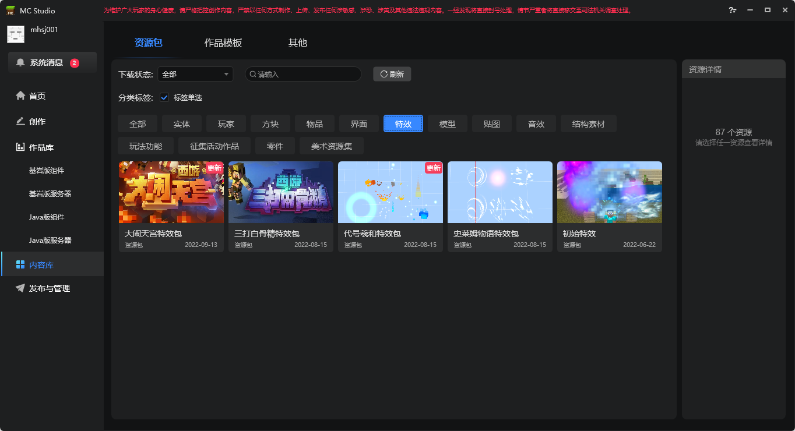
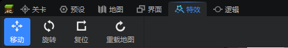
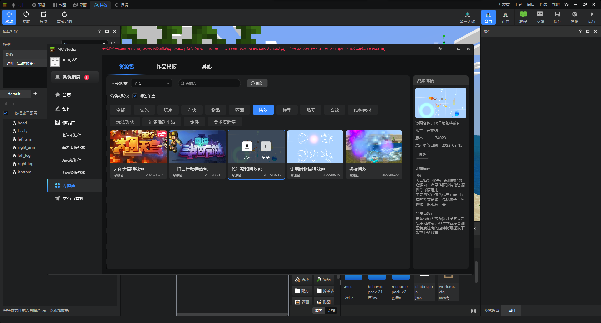
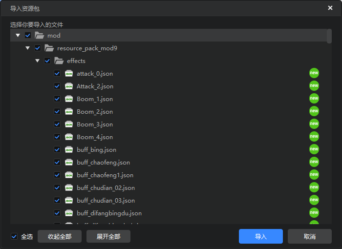
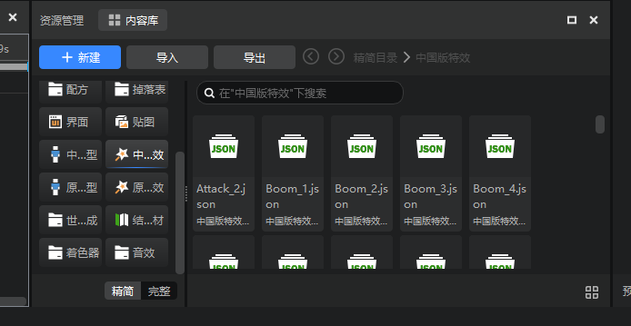
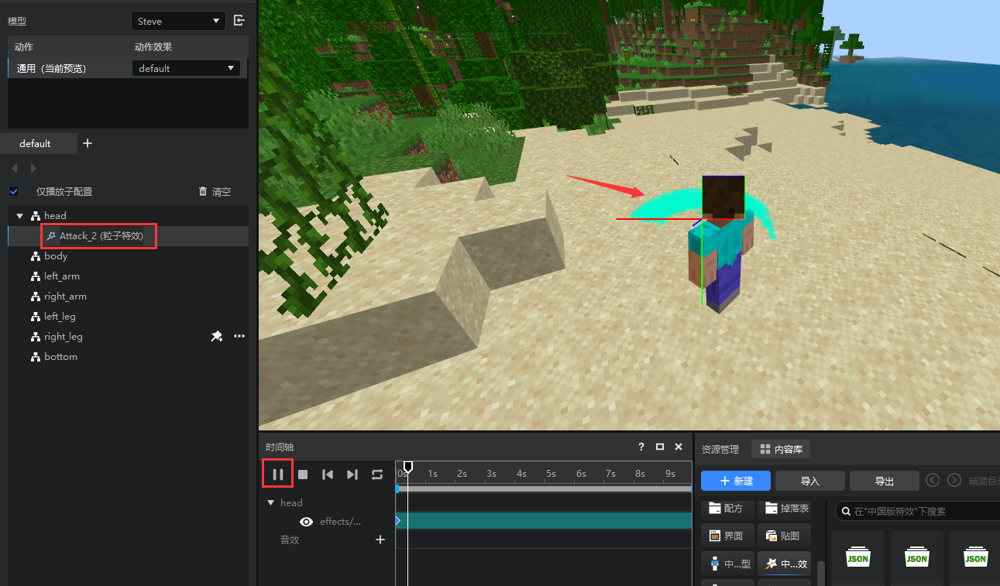
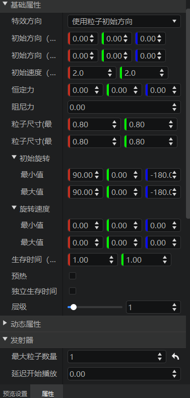
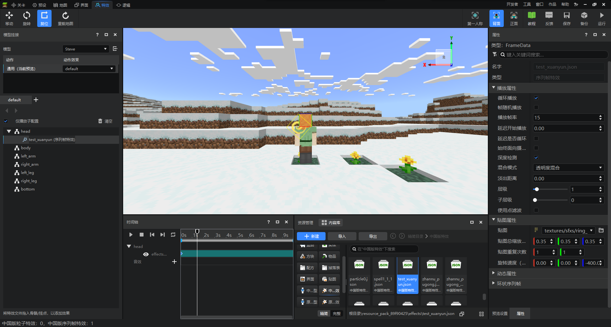
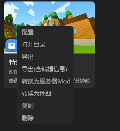
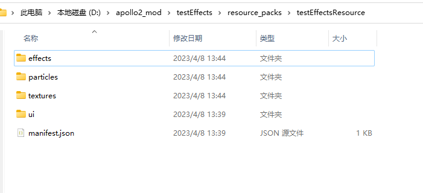

# 中国版特效的使用

<iframe src="https://cc.163.com/act/m/daily/iframeplayer/?id=64818d8ec31a9c0f360dc5de" width="800" height="600" allow="fullscreen"/>

在我的世界中国版中的特效，有两种：

- 微软特效
- 中国版特效

微软特效是游戏原生支持的特效，使用`/particle`原版指令来生成。

中国版特效基于特效编辑器来制作，可以实现更多效果的特效。

中国版特效主要有两种形式，它们应用的场景各不相同

- 序列帧特效：通过在场景中绘制一张单面片的贴图，在这个贴图上不断的更换新的图片，这个过程形成完整的序列帧特效。
- 粒子特效：通过在场景中生成大量粒子图像来产生视觉效果，每个粒子都代表着效果中的单个元素，所有的粒子组合起来就形成了完整的粒子特效。

特效编辑器的使用教程，可以参考[官方文档](https://mc.163.com/dev/mcmanual/mc-dev/mcguide/16-%E7%BE%8E%E6%9C%AF/9-%E7%89%B9%E6%95%88/00-%E7%89%B9%E6%95%88%E7%BC%96%E8%BE%91%E5%99%A8%E7%AE%80%E4%BB%8B.html?catalog=1)。本教程将主要介绍，如何使用官方内容库中的现成的特效，将其使用到开服工具2.0制作的网络游戏中。

## 素材下载和导入

开发者工作台的内容库中，包含了众多已经编辑好的特效包，可以供开发者自由使用。

本教程中，下载`代号羲和特效包`，并以该特效包为例，介绍如何在游戏中使用这些特效。



点击下载按钮后，我们可以新建一个空白基岩版附加包，用来导入、调试这个特效。

打开编辑器后，在左上角选择`特效`，切换到特效编辑器。



在编辑器打开的情况下，切换到开发者工作台的内容库，点击导入按钮，即可导入特效包。



弹出的对话框，全选导入即可。



这时在资源管理窗口中，切换到中国版特效分类，就可以看到所有我们导入的特效。



如果需要预览特效，可以将特效拖动到模型挂接的窗口中，然后点击播放按钮进行播放。

比如将Attack_2这个特效，拖动到`head`上，可以看到它是粒子特效。点击时间轴的播放按钮，就可以看到特效在玩家模型头部被播放。



选中Attack_2这个特效后，右侧属性窗口可以看到粒子特效的相关属性设置。

主要包括粒子的尺寸、速度、旋转、发射器的设置等等参数。



除此之外，资源包中还有部分序列帧特效，例如`test_xuanyun`这个特效。挂接播放后可以看到，它就是一个不断变化的图片。

属性窗口中也只有贴图相关选项，没有粒子的发射器等参数。



## 使用代码控制播放

我们可以首先新建一个插件，比如这里名为`testEffects`，删除其`developer_mods`的内容后，复制到Mod目录。

然后对刚刚创建的空白附加包右键，打开目录



将资源包目录中的`effects`,`particles`,`textures`文件夹，复制到插件的资源包目录。

这三个文件夹 分别存放了`中国版特效`，`原版特效`，`材质`，如果需要完整的使用特效包内的特效，缺一不可。



### 粒子

接下来就是代码编写的部分，模组SDK内提供了丰富的接口来控制特效的播放，参考[链接](https://mc.163.com/dev/mcmanual/mc-dev/mcdocs/1-ModAPI/%E6%8E%A5%E5%8F%A3/%E7%89%B9%E6%95%88/%E7%B2%92%E5%AD%90.html?catalog=1#createengineparticle)。

例如我们可以将播放特效的代码封装到一个函数内，然后另外编写监听来自服务器的事件的代码，通过服务器控制粒子特效的播放。

```python
def PlayEffect(self, effectName, pos):
    particleEntityId = self.CreateEngineParticle(effectName, pos)
    particleControlComp = clientApi.GetEngineCompFactory().CreateParticleControl(particleEntityId)
    particleControlComp.Play()
    return particleEntityId
```

例如监听来自服务端的PlayEffectEvent，播放特效，服务端的部分大同小异，这里不再介绍。

```python
def __init__(self, namespace, systemName):
    ClientSystem.__init__(self, namespace, systemName)
    self.ListenForEvent(EffectsConst.ModName, EffectsConst.ServerSystemName, "PlayEffectEvent", self, self.OnPlayEffect)

def OnPlayEffect(self, args):
    name = args["name"]
    pos = tuple(args["pos"])
    particleId = self.PlayEffect(name, pos)
    print "播放了特效，实体id", particleId
```

### 序列帧

序列帧的播放控制代码和粒子略有不同，参考[文档](https://mc.163.com/dev/mcmanual/mc-dev/mcdocs/1-ModAPI/%E6%8E%A5%E5%8F%A3/%E7%89%B9%E6%95%88/%E5%BA%8F%E5%88%97%E5%B8%A7.html?catalog=1)。

主要通过两个接口创建序列帧特效：

- CreateEngineSfx
- CreateEngineSfxFromEditor

推荐使用`CreateEngineSfxFromEditor`，可以按照编辑器中编辑好的参数创建序列帧。支持环状序列帧。

在完成创建后，也可以使用其他接口对序列帧特效进行控制，使用上和粒子特效大同小异。
