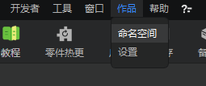
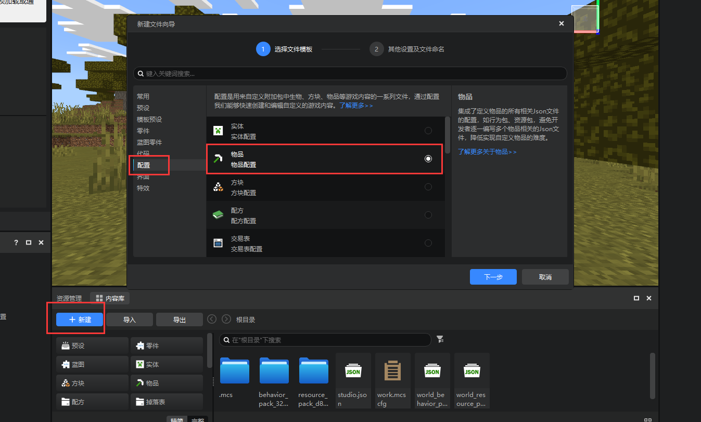
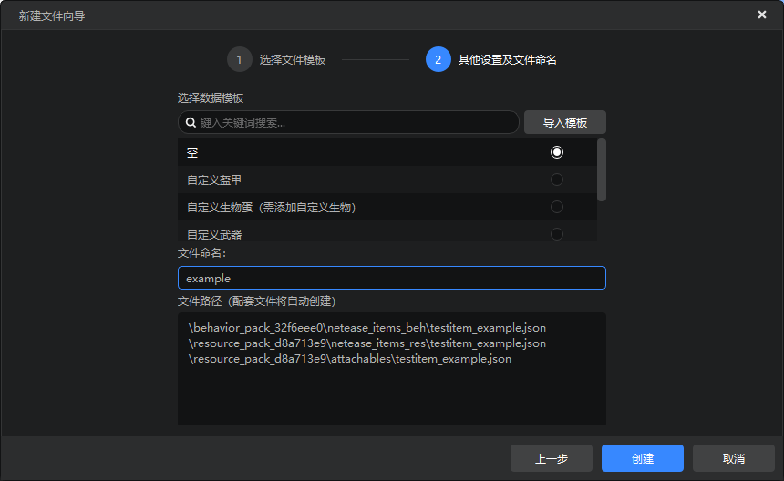
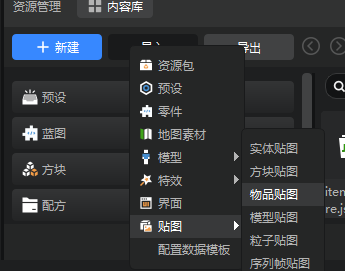
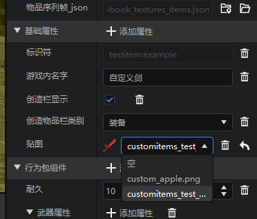
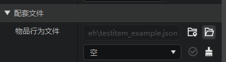
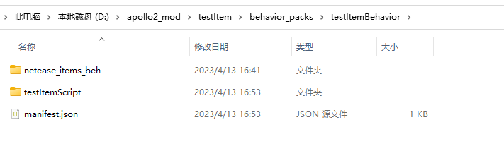
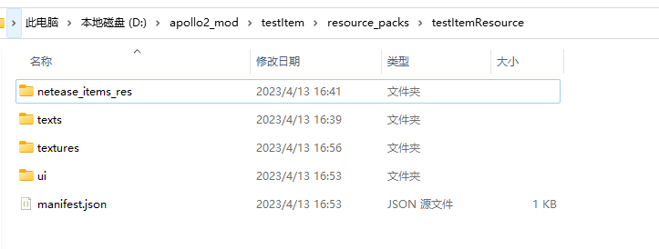
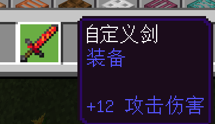
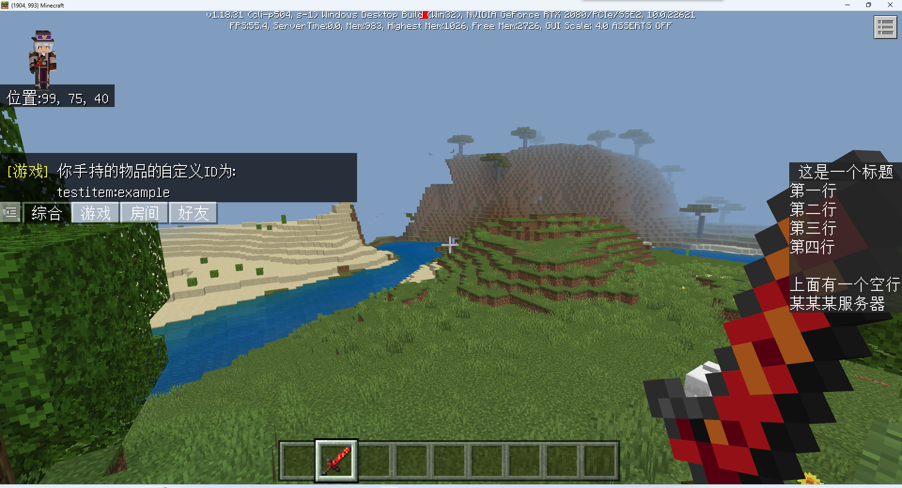

# 自定义物品制作

<iframe src="https://cc.163.com/act/m/daily/iframeplayer/?id=64818e58c31a9c0f360dc5f2" width="800" height="600" allow="fullscreen"/>

基于目前Spigot服相关接口、自定义物品流程，Spigot服的自定义物品实际上是原生Java物品的换皮物品，客户端Mod利用字段**java_identifier**来标识

在玩家通过Geyser转发之后，利用**java_identifier**实现基岩版自定义物品和Java版物品的映射。

因此要实现自定义物品，我们不仅需要在服务端编写相关逻辑，还需要定义客户端行为包和资源包文件。

## 客户端定义物品

首先提前准备好一个服务端插件，这里命名为`testItem`。除此之外，为了更加方便地编辑客户端物品，我们可以另外再创建一个空白Addon，用来完成物品之后，复制到插件中。

编辑新创建的空白附加包，在编辑器中，首先在右上角作品菜单中，修改命名空间。教程中命名空间修改为`testitem`。



找到资源管理的新建按钮->配置->物品。



接下来填写文件命名，同时它也是物品名，例如这里填写`example`。模板选择自定义武器。

**那么这个物品的标识符就是`命名空间:物品名`，即`testitem:example`。**



接下来我们可以给这个物品设置贴图，贴图我们可以使用Spigot示例Demo中的武器贴图。

在资源管理中，点击导入，选择贴图，物品贴图。



找到目录`SpigotDemo\CustomItemDemo\CustomItemClientMod\resource_packs\CustomItemsMod_resource\textures\items`，导入`customitems_test_sword`，作为自定义武器的贴图。

如果你足够熟悉附加包的目录结构，也可以直接打开作品文件夹，将贴图复制到`资源包/textures/items`目录中，也可以不使用编辑器的贴图导入功能。

接下来在右侧属性窗口中，选择刚刚导入的贴图，也可以根据自己的需要，修改`游戏内名字`，它将会作为物品的默认物品名。



编辑完成后，点击`配套文件`中的`物品行为文件`后面的`打开文件`按钮。



在文件中添加`java_identifier`字段。这个字段用来表示在Java服中，它所对应的实际的物品的标识符。

```json
{
    "format_version": "1.10",
    "minecraft:item": {
        "components": {
            "minecraft:max_damage": 10,
            "netease:weapon": {
                "attack_damage": 12,
                "enchantment": 10,
                "level": 3,
                "speed": 5,
                "type": "sword"
            }
        },
        "description": {
            "category": "Equipment",
            "identifier": "testitem:example"
        },
        "java_identifier": "wooden_sword"
    }
}
```

例如这里填写`wooden_sword`，那么在Java服中，木剑将尝试换皮为我们创建的自定义物品。


在编辑器的属性窗口中，还包含了一些行为包组件。需要注意的是，因为自定义物品本质上是Java版物品换皮，这里的大多数属性都只是用来给客户端设置物品的表现的，很多属性都无法生效。

### **需要注意的点**

- 字段工具挖掘速度、挖掘等级需要和Java物品对应，不然会出现方块破坏速率不一致导致的卡方块现象。对应物品json中： `"netease:weapon":{ "type":"shovel", "level":0, "speed":2 }`

具体对应关系如下：

| 键    | 类型 | 默认值 | 解释                                                         |
| ----- | ---- | ------ | ------------------------------------------------------------ |
| type  | str  |        | 武器/工具的类型,目前支持类型有： sword：剑 shovel：铲 pickaxe：镐 hatchet：斧 hoe：锄头 |
| level | int  |        | level为0：当速度为2对应木板,否则对应金锭 level为1：对应石头 level为2：对应铁锭 level为3：对应钻石 level大于3：无法使用铁砧修复 |
| speed | int  | 0      | 对采集工具生效，表示挖掘方块时的基础速度 木头：2 石头：4 铁：6 钻石：8 金：12 |

使用编辑器，可以直接在`行为包组件中`进行修改，在`武器属性`中，选择对应的`类型`，`工具等级`，`挖掘基础速度`。

- 同理，盔甲字段，json中，需要和Java物品对应 `"netease:armor":{ "armor_slot":2 }` 盔甲槽位，详见[ ArmorSlotType](https://mc.163.com/dev/mcmanual/mc-dev/mcdocs/1-ModAPI/枚举值/ArmorSlotType.html)。使用编辑器，可以直接在`盔甲穿戴属性`类别中就可以选择槽位。

也有部分行为包组件不会生效，目前已知的有

````
- 基岩版自定义物品中用于物品防火的组件
```
设置物品是否防火
"netease:fire_resistant"{ "value" : true}
```

- 基岩版自定义物品中用于物品是否可做燃料的组件
```
设置物品是否可作为燃料
"netease:fuel" { "value" : true}
```

- 基岩版自定义物品中用于物品的使用间隔
```
设置物品使用间隔
"netease:cooldown" : { "duration" : 5}
```

````


完成了客户端物品的配置，我们就可以关闭编辑器。

打开附加包文件夹，将资源包和行为包目录中的部分涉及到自定义物品的内容，复制到`testItem`插件中的对应位置。

### 行为包

- netease_items_beh



### 资源包

- netease_items_res
- texts
- textures



至此，我们就完成了客户端物品的定义。

## 服务端逻辑

首先新建一个项目，依赖SpigotMaster。

### 创建物品

```java
ItemStack itemStack = new ItemStack(Material.WOOD_SWORD);
itemStack = spigotMaster.setCustomItemIdentifier(itemStack, "testitem:example");
```

像正常Spigot插件一样，直接实例化ItemStack来新建一个物品，物品的Material为`java_identifier`字段中的值，即木剑。

然后调用spigotMaster的`setCustomItemIdentifier`方法，为这个物品设置自定义物品标识符，即`testitem:example`。

### 获取物品

```java
String customIdentifier = spigotMaster.getCustomItemIdentifier(itemStack);
```

调用spigotMaster的`getCustomItemIdentifier`方法来获取自定义物品标识符。如果是自定义物品，返回标识符，否则返回null。

我们可以编写测试一些测试用监听器，查看自定义物品如何生效。

```java
public class Listeners implements Listener {
    private final SpigotMaster spigotMaster = TutorialItem.getInstance().getSpigotMaster();

    @EventHandler
    public void onJoin(PlayerJoinEvent e) {
        Player player = e.getPlayer();
        ItemStack itemStack = new ItemStack(Material.WOOD_SWORD);
        itemStack = spigotMaster.setCustomItemIdentifier(itemStack, "testitem:example");
        player.getInventory().addItem(itemStack);
    }

    @EventHandler
    public void onInteract(PlayerInteractEvent e) {
        Player player = e.getPlayer();
        ItemStack itemStack = player.getInventory().getItemInMainHand();
        if (itemStack == null) {
            return;
        }
        String customIdentifier = spigotMaster.getCustomItemIdentifier(itemStack);
        if (customIdentifier == null) {
            player.sendMessage("你手持的物品不是自定义物品");
            return;
        }
        player.sendMessage("你手持的物品的自定义ID为: " + customIdentifier);
    }
}
```

安装插件到服务器，然后勾选`testItem`，重新部署。

进入游戏后，可以看到背包发送了一个我们的自定义物品。



对物品交互，可以看到正常输出，成功获取到了自定义物品的identifier。


