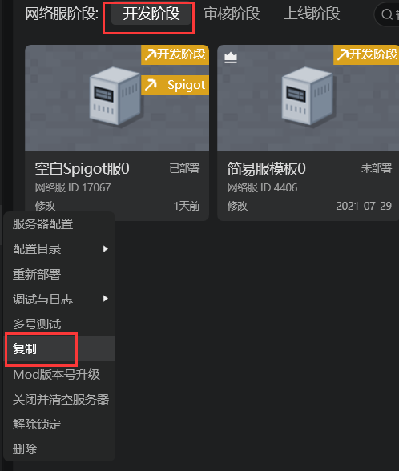
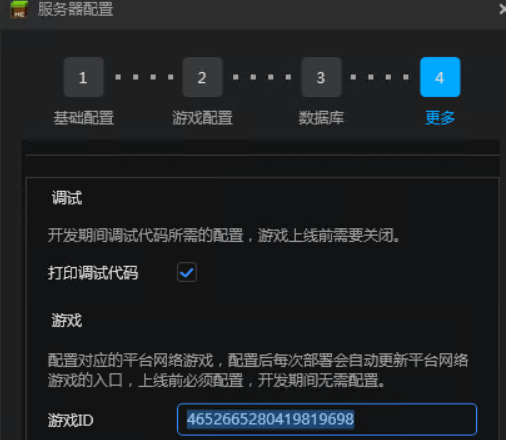
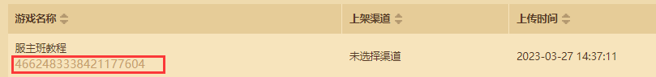
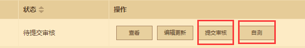
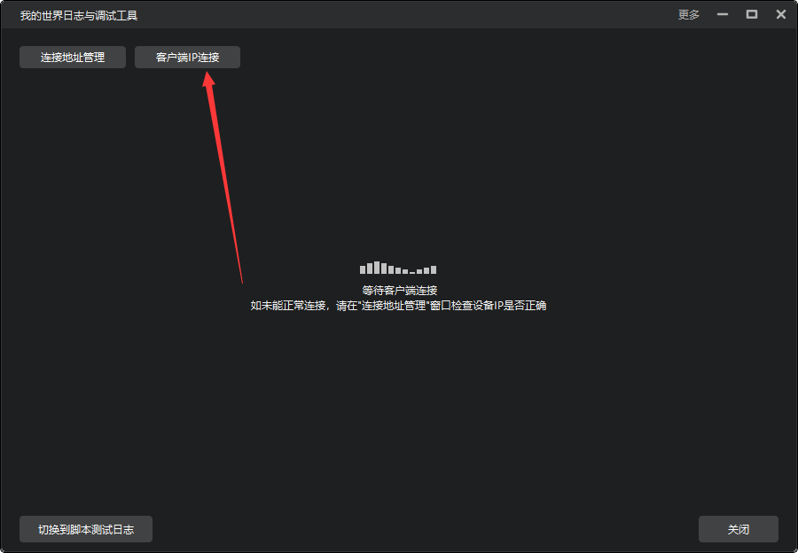

# 手机测试

<iframe src="https://cc.163.com/act/m/daily/iframeplayer/?id=64818f2dc31a9c0f360dc600" width="800" height="600" allow="fullscreen"/>

## 提交到测试环境

有时候电脑环境和手机环境的不一致，会导致模组在手机上无法运行。这时候我们就需要进行手机端自测。

在基岩版服务器的分类中，我们可以看到网络服阶段有3个：

- 开发阶段
- 审核阶段
- 上线阶段

网络服默认创建在开发阶段。在开发阶段的服务器可以快速修改并调试代码，进行部署、测试。

审核阶段除了部署服务器之外，还会将模组资源上传到开发者平台，方便进行提审、审核操作。

上线阶段需要选择审核阶段部署之后，通过审核的模组资源来进行部署。

在需要进行自测时，我们首先需要准备一个在审核阶段的网络游戏。

如果没有，则可以从开发阶段的服务器中进行复制，复制到审核阶段。

并且服务器配置的`更多`中，输入游戏ID。游戏ID可以在开发者平台中找到。

然后部署审核阶段的服务器。

在审核服部署完成后，在开发者平台点击自测或提交审核按钮。

等待审核或自测资源准备完成后，会收到开发者平台的邮件。在收到邮件后方可进入手机测试端进行测试。

## 手机测试工具下载

手机测试服需要下载专门的客户端进入，下载地址可以在开发者平台找到。

下载并安装手机测试版客户端后，可以使用当前开发者账号登录，在网络游戏中就可以找到自己提交自测的服务器。

这时就可以进入游戏进行手机端测试。

## 调试工具的使用

在调试时，如果遇到问题，可以配合调试工具查看日志或临时运行脚本。调试工具可以在工具箱中找到。

需要保证手机测试端和电脑在同一个内网中，然后点击`客户端IP连接`，输入手机端的内网IP，即可连接调试工具。

