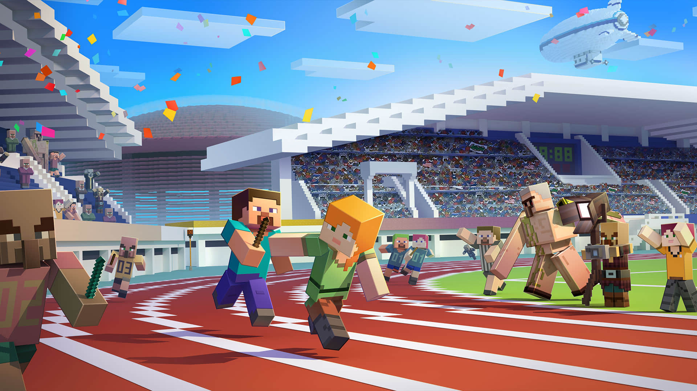
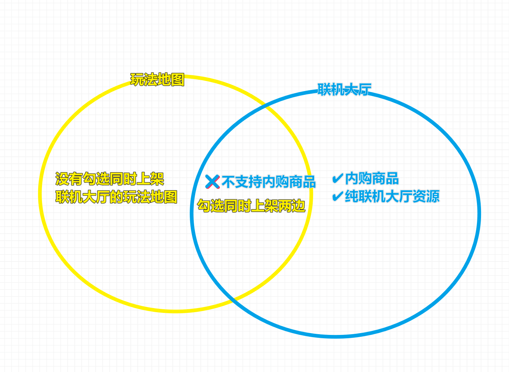
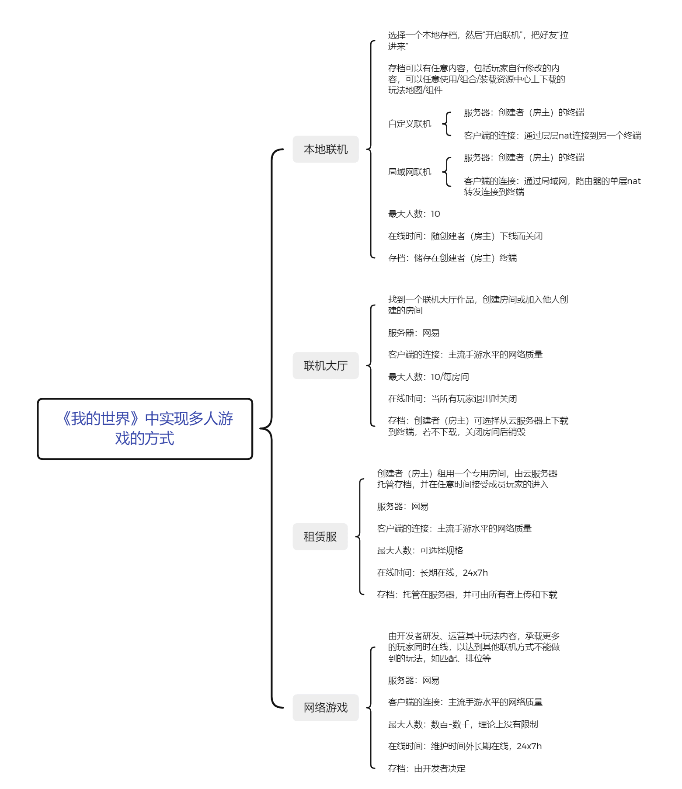
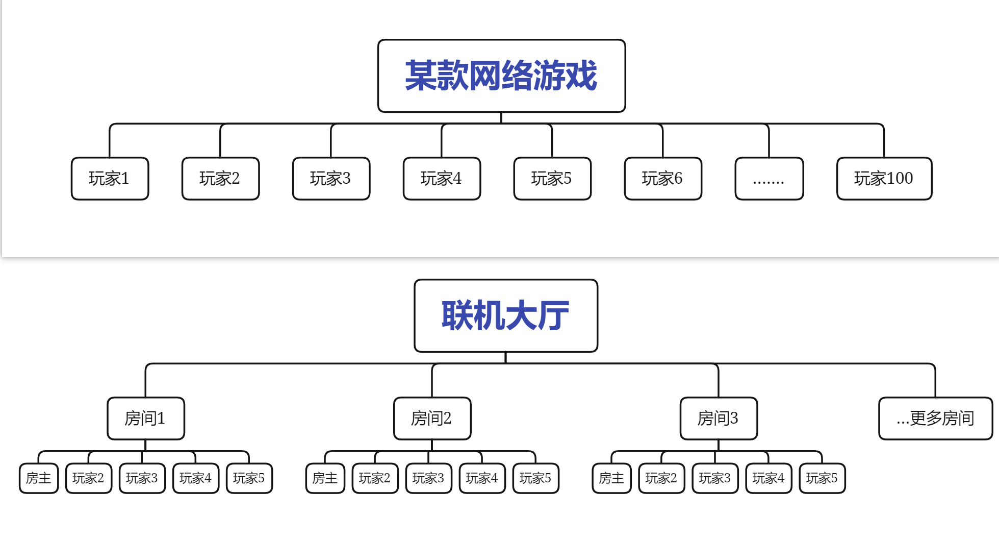
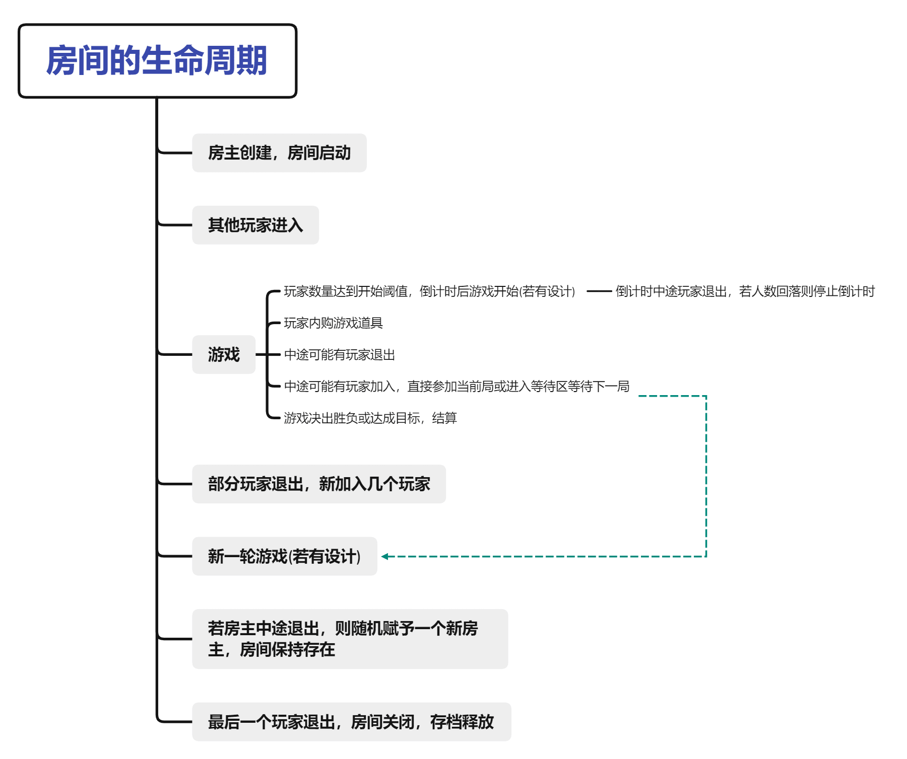
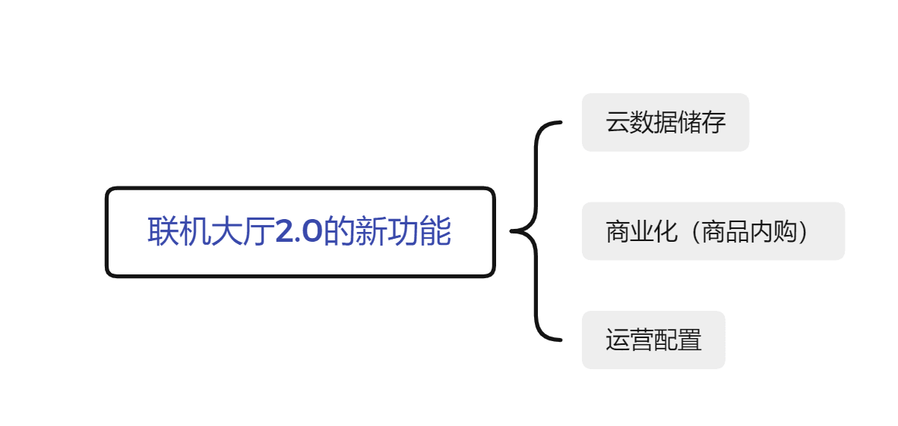
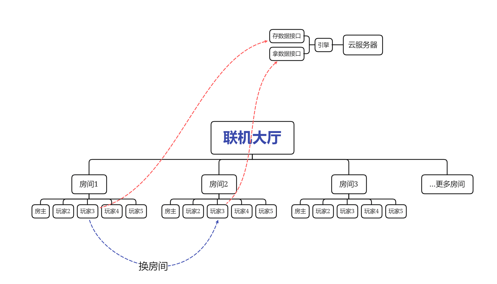
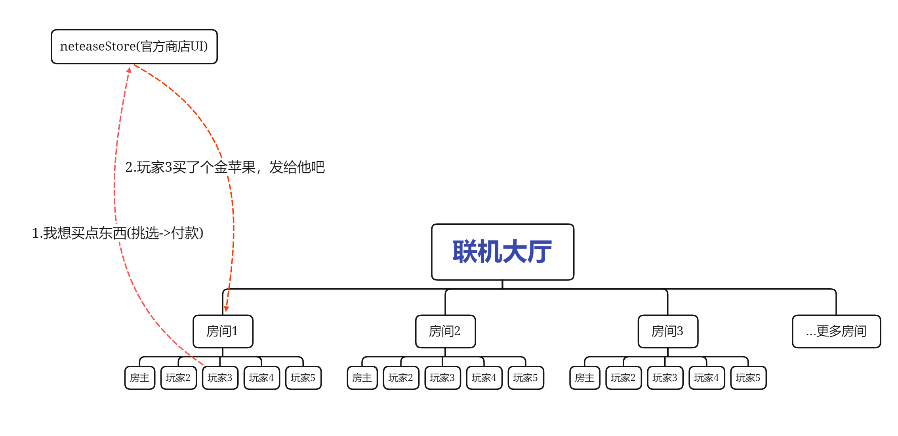
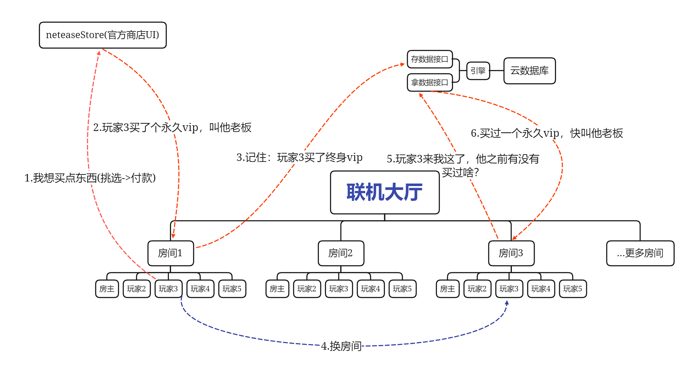

---
front:
hard: 入门
time: 10分钟
---
# 什么是联机大厅

<iframe src="https://cc.163.com/act/m/daily/iframeplayer/?id=63468088e6c041f2578d9204" width="800" height="600" allow="fullscreen"/>

## 在开始之前

不论是共赏美景、齐心协力，还是竞技对抗，联机功能使玩家们在虚拟的游戏世界中不会孤单。

当玩家体验一张特殊困难生存玩法地图时，觉得要是有个伙伴一起挑战就好了；

当玩家想要比试战斗技术，就需要一张竞技类玩法地图，和几个同样热爱PVP的对手；

通过联机大厅，玩家可以方便地找到满意的玩法，然后马上遇到数个同样和你看中了这个玩法的伙伴，志趣相投的几人携手开启一段美妙的冒险旅程。

**本系列教程主要围绕如何将联机大厅玩法商业化，即我们假定你已经了解[什么是玩法地图](../玩法地图基础教程/1-玩法地图是追求完整游戏体验的不二选择.html)，甚至已经制作好一个成型的多人玩法地图，我们将在此基础上设计、实现数个内购商品，并测试、上架这些商品供玩家购买。**

**2023.2更新：**

我们讲到设计、实现数个内购商品，此前是指利用预设系统，编写几行Python代码以定制你的发货零件。现在《我的世界》开发工作台支持使用<a href="../../../mcguide/20-玩法开发/12-可视化编程/10-新版逻辑编辑器使用说明/01-什么是逻辑编辑器.html">逻辑编辑器</a>实现发货功能，真正做到不需要写一行代码就可以做出丰富的内购商品功能。

## 玩法地图和联机大厅的关系

在开平发布新资源时，你可能会对玩法地图和联机大厅玩法之间的关系产生困惑：玩法地图可以同时上架联机大厅，联机大厅资源又可以同时上架玩法地图，勾选了商业化内购功能的联机大厅资源则不可以同时上架玩法地图？什么跟什么，简直太乱了。

解答来了：准确地讲，联机大厅玩法是一种特殊的玩法地图。

联机大厅本身是一种运行方式，向玩家提供了灵活的联机服务。实际上，联机大厅的房间可以理解为虚拟化出来的一个容器，理论上可以用任意一张玩法地图来启动。而一开始就为多人游戏设计的、可能包含内购商品、运营逻辑、云成就系统的玩法地图，可以称之为联机大厅玩法（资源）。

## 联机大厅和其他多人游戏方式的区别

要了解联机大厅，首先需要知道联机大厅的定位。在我的世界中，主要通过如下几种方式实现玩家间的联机：

相比其他几种多人游戏方式，特别是本地联机，联机大厅有如下特点：

- **服务端引擎运行在专用云服务器而不是房主手机上，网络质量、服务器性能较好。** 因此我们在设计商品时进一步不受桎梏，可以任意发挥，例如制作更精美的特效、要求服务器进行批量的实体生成、方块创建销毁等。
- **玩家间流动更灵活。** 相对动辄几十、百人的租赁服、网络游戏，联机大厅由一个个房间组成，将玩家分割成更小的部分，玩家随时会从一个房间退出后加入另一个房间；房间也会随时启动新的、销毁旧的。这就让玩家更容易遇见随机的陌生人，从而一定程度上实现了网络游戏中随机匹配几个玩家开启一局游戏的功能。
- **内容统一而可控。** 联机大厅的房间由开发者提供的包体启动而来，相比本地存档联机，环境更加确定，不会有无法预测的其他组成部分，能对玩家做更好的限制，而不会让不遵守游戏规则的玩家轻易破坏机制，玩成TNT满天飞，失去玩法原本设计的意义。同时，由于环境的封闭，使得你提供一些增值服务作为商品成为可能，例如起床战争的自动铺路、战墙时的连锁挖矿等。

## 房间的生命周期

上面提到，房间是联机大厅的基本单位，我们借由下图了解一个房间从启动到销毁会发生什么。在开发过程中，只需要额外注意一下游戏进行到各个状态时玩家列表的改变造成的影响，并正确处理即可。

## 进阶的创作需求

联机大厅在2.0更新了一些新功能，将这个赛道推到前所未有的新高度。本系列教程主要围绕商业化讨论，由于技术需要会同时涉及到云数据储存。关于运营配置的部分，请参阅<a href="../../../mcguide/26-联机大厅/6-联机大厅商品2.0文档.html">联机大厅商品2.0文档</a>。

### 云数据储存

上面已经聊到，玩家会很容易地在房间之间流动。那么玩家在不同房间之间的体验要一致，积累的分数、背包、资产要带走，这就很重要。

我们知道房间承载存档，存档本身可以储存数据，但不同存档的数据不能互通。所以为了实现这些数据的同步，需要一个第三方媒介——云数据库。

云数据库是什么样，什么原理，如何连接，如何操作，这些我们通通无需关心，引擎已经为我们封装和处理好，我们只需要调用两个新接口，将需要储存的数据交给云数据库，再等需要的时候使用接口获取回来即可。

只有一点需要稍稍注意，由于是云数据库，我们使用接口本质上是在进行http操作，所以callback是异步的，在编码的时候需要留个心眼。

### 商业化（商品内购）

在完成了基本的玩法设计后，我们当然希望可以将玩法商业化，让开发者的热爱有所回响。

在游戏内，我们可以吸引玩家或玩家主动打开商店（neteaseStore），玩家选购商品后商店会通过引擎通知你的代码，流程类似下图

当然，有时候玩家购买的商品需要**持久化**，那么就需要借助云数据库的力量，过程进化为如下：

在下一章中，我们将了解如何设计、实现商品。
