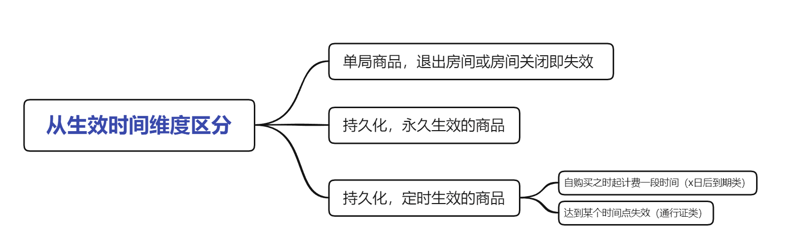
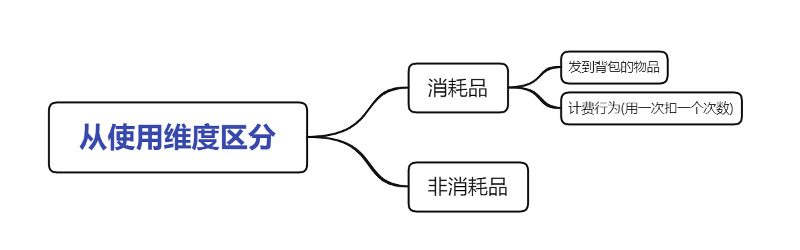
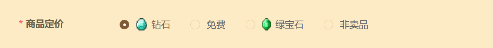
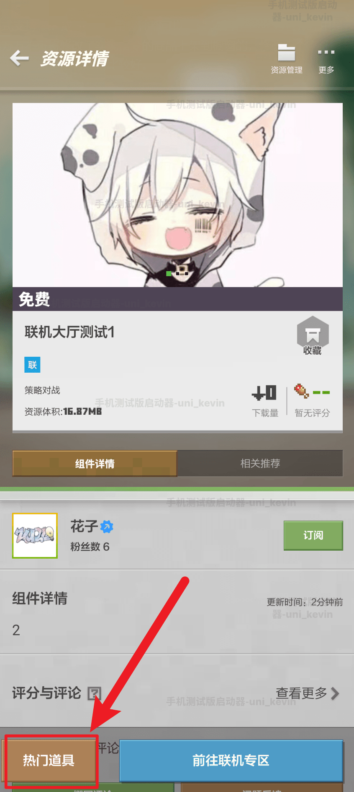
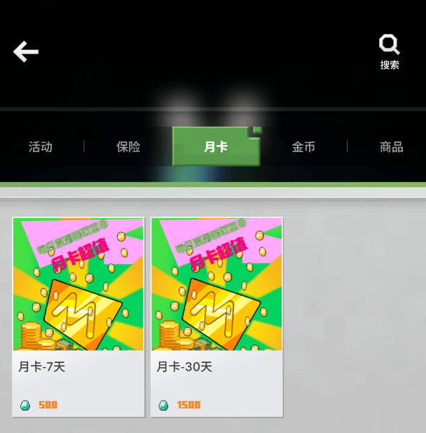
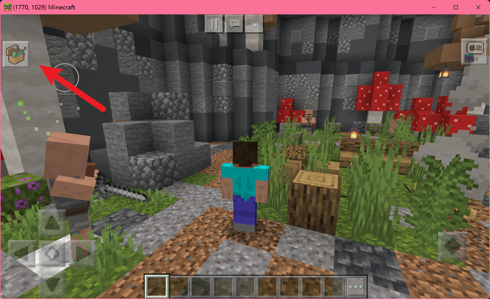

---
front:
hard: 高级
time: 30分钟
---
# 什么是内购商品

<iframe src="https://cc.163.com/act/m/daily/iframeplayer/?id=6346815ac6dfd1bb76f2bfac" width="800" height="600" allow="fullscreen"/>


## 商品的类型

谈到根据玩法设计商品，策划同学应该就不困了。开发者可以根据自己手上的作品，具体问题具体分析，针对性的设计。在此期间，可能会脑洞出很多可能和提案，为了方便思考和整理，可以从两个维度区分商品：



- 单局商品

  就是说这个商品只在当前这一个联机大厅房间有效，而若玩法设计了重复开局，那么新的一局是否清除商品的效用则开发者自行决定。

  若玩家退出房间并再次进入，只要逻辑系统尚未卸载，理论上商品可以继续生效，也可以选择在玩家退出时让商品失效。

  但无论如何，一旦房间关闭，内存将会丢失，单局商品将彻底失效。开发者仍然可以通过接口查询到玩家曾经购买单局商品的历史记录。

- 持久化，永久生效的商品

  持久化是指将玩家购买此商品记入云端数据库，以达到玩家即使换房间，或隔几天又来玩这个地图，逻辑系统始终可以知道玩家（曾经）购买了此商品。

- 持久化，定时生效的商品

  定时生效有别于上面的永久生效，当然也和持久化意思不冲突，是指逻辑系统知道玩家购买了，但并不是永久提供某项服务。又可以分为例如某权限，自购买日起生效10天，到期后失去权限；或s10赛季对应的通行证从9月1号运行到9月30号，那么无论玩家何时购买此商品， 都会在9月30号失去权限。



- 消耗品

  一般有食物、药水、盔甲、各种道具这些物品形式的，由于玩法一般是生存或冒险模式，用了就没了，相当于是原版逻辑帮我们完成计费。

  若是一些别的形式，例如释放一次某个技能，这种由逻辑系统实现的行为，可以用云数据库来记录消费次数。

- 非消耗品

  一些常在的权限，不需要计次，例如某种外观、称号、VIP身份，由云数据库记录，使用时判断玩家是否拥有权限。


## 合理定价

我们知道，《我的世界》客户端中玩家有两种货币可供消费——钻石、绿宝石。



- **钻石** 一般是玩家用人民币购买的，也在开平中作为收益结算的来源。因此建议将价值高的商品用钻石定价。
- **绿宝石** 是玩家在客户端和游戏中通过各种行为积攒的免费积分，绿宝石收入在开平中作为开发者积分、等级的重要依据，若想提升开发者等级，绿宝石收入不可或缺。因此建议将一般价值的商品，特别是单局或消耗品商品用绿宝石定价。

有时候，我们想要让玩家通过一些额外渠道获得高价值等价物，例如参与某活动赠送10钻石，但显然你不能扩展玩家的钻石来源，于是可以考虑设计一种新的中间货币——金币，玩家用钻石兑换金币，再用金币兑换商品，而你管控金币，有权赠送玩家金币。

关于金币如何实现，本教程受限于篇幅不能详细讲到，建议参考<a href="../../../mcguide/20-玩法开发/13-模组SDK编程/60-Demo示例.html">lobbyGoodsMod2.0</a>这个官方示例demo。


## 玩家购买商品的方式

你设计的商品一般在 **这两个地方** 展示，玩家可在 **这两个地方** 点击购买：

- 方法一：竖屏启动器时，联机大厅资源左下角。

  

  

  **tips：此处的test_1662920041字样是因为处于手机版测试端环境。商品分类功能在测试端无法生效，会临时显示乱序英文和数字。**

  正式环境下，会显示分类：

  


- 方法二：游戏内的neteaseStore商店界面。

  


  这就是我们在第一章中提到的[neteaseStore](./0-什么是联机大厅.html?catalog=1#商业化-商品内购)，它是在游戏中将商品销售给玩家的重要媒介。因为在游戏中购买商品流程更简洁、直接，且商品效果立即生效。`neteaseStore`可看作一个UI，打开它的方式有两种：

  - 默认自带一个按钮，在左上角，点击即可打开：

    


    tips：这个自带按钮并不是一开始就显示的，毕竟不是所有玩法都需要它。所以需要在玩家进入游戏时，调用一个接口显示这个按钮。

    ```python
    import mod.client.extraClientApi as clientApi
    clientApi.HideNeteaseStoreGui(False)
    ```

  - 不显示自带按钮，通过玩法激发玩家购买欲望，然后在合适时机用<a href="../../../mcdocs/1-ModAPI/接口/原生UI.html?catalog=1#openneteasestoregui">接口</a>拉起UI，引导玩家购买：

    | 参数名       | 数据类型 | 说明         |
    | :----------- | :------- | :----------- |
    | categoryName | str      | 商品分类名称 |
    | itemName     | str      | 商品名称     |

    ```python
    import mod.client.extraClientApi as clientApi
    clientApi.OpenNeteaseStoreGui("商品", "测试商品1")
    ```


