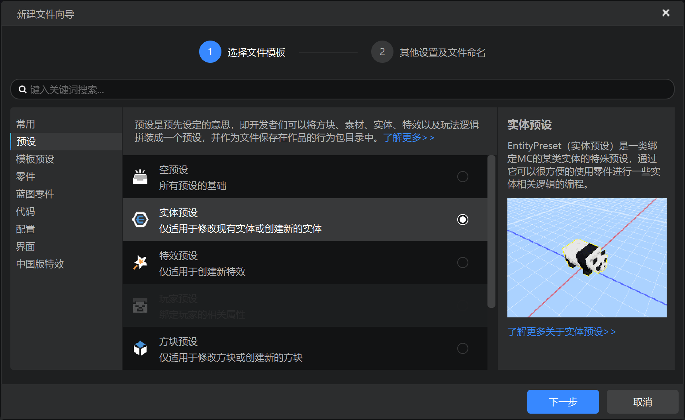
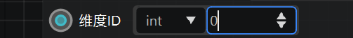
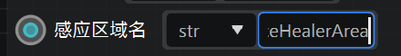
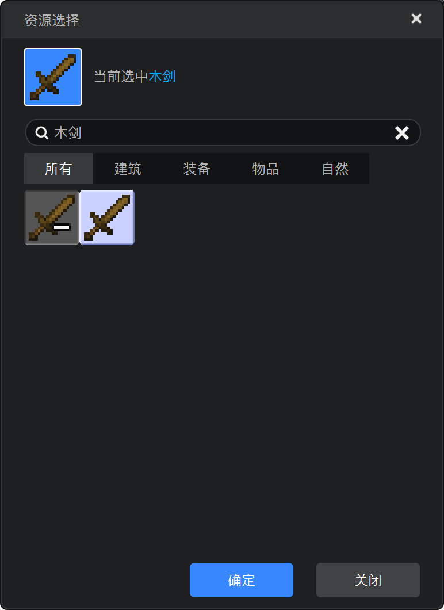

---
front:
hard: 进阶
time: 60分钟
---
# 为玩法设计内购商品

## 导航

本章技术向实战分为 **Python实现路线** 和 **逻辑编辑器实现路线** 。你可根据选择需要跳转：

- [设计demo商品（策划）](#策划向实战-设计demo商品)
- [制作新职业-Python](#Python程序向实战-制作新职业)
- [制作新职业-逻辑编辑器](#逻辑编辑器程序向实战-制作新职业)
- [制作会员特效-Python](#Python程序向实战-制作会员特效)
- [制作会员特效-逻辑编辑器](#逻辑编辑器程序向实战-制作会员特效)


## 策划向实战-设计demo商品

有了上面的理论支撑，让我们为这个来自[第一期创造营的玩法地图教程](../玩法地图基础教程/1-玩法地图是追求完整游戏体验的不二选择.html)的职业战争demo设计和实现如下几个内购商品。

职业战争（KitPVP）的玩法很简单，选择一个职业然后尽可能多击杀其他玩家。这个demo提供了三个职业：坦克、弓箭手、战士。


这三个互相制衡的基础职业是较为经典合理的，不适合作为内购商品。所以我们新设一个职业：治疗师，模型选用原版的女巫作为商品。设计信息如下：

- 治疗师（Healer）
- 定位：辅助
- 护甲：铁胸甲，铁护腿，铁靴子
- 武器：木剑
- 物品：喷溅型伤害药水x3，喷溅型治疗药水x3，喷溅型生命恢复x1
- 售价：100钻石（不可重复购买）
- 类型：购买后持久化，永久生效


仅有增值职业还不够，我们还可以售卖一些单局消耗品，最简单的当然是原版的物品，这里使用demo自带的一个补给类物品吧：

- 美味鲜菇（testmap:testitem1）
  - 售价：10绿宝石，可重复购买。
  - 类型：单局消耗品。


有了永久商品、单局消耗品，我们再设计一个带有效期的定时商品。特效是个不错的选择，因为特效不会影响PVP中的平衡性，维持良好的作品评分，又可以为付费玩家提供很好的游戏体验。

- 脚底光圈
  - 售价：30钻石/1天（可重复购买以叠加时长）。
  - 类型：持久化，定期商品。


## Python程序向实战-制作新职业

由于该demo原本没有治疗师职业，所要简单制作一下，首先创建一个实体预设。




选择女巫模板，因为要借用它的模型，遵循原作者命名规则，命名为testPresetEntity4。


在属性栏勾选免疫伤害，取消勾选保留AI，再清理掉不需要的行为组件，这样让女巫成为一个NPC，站着不会动，作为摆设，也不会攻击玩家。


我们看到testPresetEntity1到3的头顶都有粒子特效，所以入乡随俗，将粒子预设挂载到testPresetEntity4预设下，并调整位置，让女巫模型头顶有一个粒子特效。


进入地图编辑器，造一个放模型的方块，原本demo地图里只有三个，放置第四个。


在关卡编辑器里把testPresetEntity4预设放置到舞台，并调整位置和旋转。


好了，到这里外观就已经完成，进入游戏就可以看到治疗师的模型正确的出现在第四个职业的位置。


接下来要开始实现功能，原本三个职业是用命令方块来实现，走进职业的模型就会被传送到游戏区域内、给予缓降特效和职业物品。

由于内购逻辑需要涉及modsdk编码，这里使用预设零件来实现。首先创建一个新的空零件，命名为Healer，继承触发器（TriggerPart）


**触发器不难理解，就是框定一个区域，有任何实体进入、停留、退出这个区域都会被触发器检测到。**

点击新建的零件，属性面板，修改下面的参数：

- **区域** ：参数如图，触发器挂载在实体预设下时，坐标将会使用相对于预设的坐标。

- **监听** ：由于只需要检测玩家进入（即为玩家意图选择此职业），离开和停留都不需要，所以只勾选进入。

- **监听间隔**： 由于原demo使用命令方块做出来的效果是反应非常迅速的，为了不造成割裂感，设置此参数为1。

  


将Healer零件挂载到testPresetEntity4预设下。


点击 **属性面板** - **定位按钮** ，浏览我们刚才设置的框框，就可以看到效果——玩家走进这个框框将会被检测到。


点击 **属性面板** - **配套文件** - **脚本** - **编辑文件** ，打开零件的代码文件，编写接受检测结果的代码：

```python
def InitServer(self):
    TriggerPart.InitServer(self)
    self.ListenSelfEvent('OnTriggerEntityEnter', self, self.OnTriggerEntityEnter)

def OnTriggerEntityEnter(self, e):
    for entityId in e['EnterEntityIds']:
        if entityId in self.GetLoadedPlayers():
            self.NotifyOneMessage(entityId, '你尝试选择治疗师职业')
```

进入游戏，测试效果：


继续编写传送和给予buff、物品的逻辑：

```python
def OnTriggerEntityEnter(self, e):
	for entityId in e['EnterEntityIds']:
		if entityId in self.GetLoadedPlayers():
			self.NotifyOneMessage(entityId, '你尝试选择治疗师职业')
			self.TurnHealer(entityId)

def TurnHealer(self, playerId):
	self.NotifyOneMessage(playerId, '你变成了治疗师')
	for itemDict in self.healerItem:
		self.SpawnItemToPlayerInv(itemDict, playerId)
	dim = self.GetEntityDimensionId(playerId)
	self.ChangePlayerDimension(playerId, dim, (352, 83, 442))
	self.AddEffectToEntity(playerId, 'slow_falling', 5, 0, False)
```

进入游戏，测试效果：


那么整个零件源码是这样：

```python
# -*- coding: utf-8 -*-
from Preset.Parts.TriggerPart import TriggerPart
from Preset.Model.GameObject import registerGenericClass

@registerGenericClass("HealerPart")
class HealerPart(TriggerPart):
	def __init__(self):
		TriggerPart.__init__(self)
		# 零件名称
		self.name = "治疗师零件"
		self.area = {'min': (-1.0, -1.0, -1.0), 'max': (1.0, 3.0, 1.0), 'dimensionId': 0}
		self.isTriggerExit = False
		self.healerItem = [
			{
				'newItemName': 'minecraft:iron_leggings',
				'newAuxValue': 0,
				'count': 1
			},
			{
				'newItemName': 'minecraft:iron_boots',
				'newAuxValue': 0,
				'count': 1
			},
			{
				'newItemName': 'minecraft:iron_chestplate',
				'newAuxValue': 0,
				'count': 1
			},
			{
				'newItemName': 'minecraft:wooden_sword',
				'newAuxValue': 0,
				'count': 1
			},
			{
				'newItemName': 'minecraft:splash_potion',
				'newAuxValue': 21,
				'count': 3
			},
			{
				'newItemName': 'minecraft:splash_potion',
				'newAuxValue': 23,
				'count': 3
			},
			{
				'newItemName': 'minecraft:splash_potion',
				'newAuxValue': 28,
				'count': 1
			}
		]
		self.intervalTick = 1

	def InitServer(self):
		TriggerPart.InitServer(self)
		self.ListenSelfEvent('OnTriggerEntityEnter', self, self.OnTriggerEntityEnter)

	def OnTriggerEntityEnter(self, e):
		for entityId in e['EnterEntityIds']:
			if entityId in self.GetLoadedPlayers():
				self.NotifyOneMessage(entityId, '你尝试选择治疗师职业')
				self.TurnHealer(entityId)

	def TurnHealer(self, playerId):
		self.NotifyOneMessage(playerId, '你变成了治疗师')
		for itemDict in self.healerItem:
			self.SpawnItemToPlayerInv(itemDict, playerId)
		dim = self.GetEntityDimensionId(playerId)
		self.ChangePlayerDimension(playerId, dim, (352, 83, 442))
		self.AddEffectToEntity(playerId, 'slow_falling', 5, 0, False)
```


但是目前将坐标、buff、给予物品等内容硬编码在了代码里，现在零件的自定义属性功能让我们有了更好的做法。想要让这个零件有更多可扩展性，编辑零件元数据文件：

```python
# -*- coding: utf-8 -*-
from Meta.ClassMetaManager import sunshine_class_meta
from Meta.TypeMeta import PBool, PStr, PInt, PCustom, PVector3, PVector3TF, PEnum, PDict, PFloat, PArray, PVector2, \
    PColor
from Preset.Parts.TriggerPart import TriggerPartMeta

@sunshine_class_meta
class HealerPartMeta(TriggerPartMeta):
    CLASS_NAME = "HealerPart"
    PROPERTIES = {
        "gamePos": PVector3(text="传送到", sort=12, group="职业设置"),
        "effectList": PArray(sort=13, text="给予状态效果列表", group="职业设置", childAttribute=PDict(children={
            "effectName": PStr(text="状态原版名称", sort=1, default="speed"),
            "duration": PInt(text="持续时间", sort=2, default=1),
            "amplifier": PInt(text="状态等级", sort=3, default=0),
            "showParticles": PBool(text="显示粒子效果", sort=4, default=True)
        })),
        "itemList": PArray(text="给予物品列表", group="职业设置", sort=14, childAttribute=PDict(children={
            "itemDict": PCustom(
                sort=0,
                text="物品选择",
                editAttribute="MCItems",
                default=("minecraft:wooden_sword", 0),
                withNamespace=True,
                withAuxValue=True,
                isBlock=None,
            ),
            "count": PInt(sort=1, text="物品数量", default=1)
        })),
    }
```

这样，治疗师零件的属性面板就出现了如下设置选项：


把我们刚才硬编码在代码里的配置应用上去：


这样将属性用mcs可视化面板暴露出来，无论是后续要制作更多其他职业，或是其他团队成员想要修改，都会更加方便。

最后，简单修改刚才的硬编码，让属性面板的配置实际生效。

```python
def TurnHealer(self, playerId):
	self.NotifyOneMessage(playerId, '你变成了治疗师')
	for item in self.itemList:
		self.SpawnItemToPlayerInv({
			'newItemName': item['itemDict'][0],
			'newAuxValue': item['itemDict'][1],
			'count': item['count']
		}, playerId)
	dim = self.GetEntityDimensionId(playerId)
	self.ChangePlayerDimension(playerId, dim, tuple(self.gamePos))
	for effect in self.effectList:
		self.AddEffectToEntity(playerId, effect['effectName'], effect['duration'], effect['amplifier'], effect['showParticles'])
```


## 逻辑编辑器程序向实战-制作新职业

由于该demo原本没有治疗师职业，所以要简单制作一下，首先创建一个实体预设。


选择女巫模板，因为要借用它的模型，遵循原作者命名规则，命名为testPresetEntity4。


在属性栏勾选免疫伤害，取消勾选保留AI，再清理掉不需要的行为组件，这样让女巫成为一个NPC，站着不会动，作为摆设，也不会攻击玩家。


我们看到testPresetEntity1到3的头顶都有粒子特效，所以入乡随俗，将粒子预设挂载到testPresetEntity4预设下，并调整位置，让女巫模型头顶有一个粒子特效。


进入地图编辑器，造一个放模型的方块，原本demo地图里只有三个，放置第四个。


在关卡编辑器里把testPresetEntity4预设放置到舞台，并调整位置和旋转。


好了，到这里外观就已经完成，进入游戏就可以看到治疗师的模型正确的出现在第四个职业的位置。


接下来要开始实现功能，原本三个职业是用命令方块来实现，走进职业的模型就会被传送到游戏区域内、给予缓降特效和职业物品。

首先创建一个**新的蓝图零件**，命名为Healer（治疗师实现零件）。


创建好后，在下方资源管理点击“蓝图”，找到对应的Healer.bp，双击进入逻辑编辑器编辑：


首先要 **检测玩家靠近实体** ，然后才会执行传送、给予物品、buff等逻辑。要实现 **检测玩家靠近实体** ，需使用到 **NewOnEntityAreaEvent** 事件，此事件在你注册一个感应区域后，当有实体进入或离开感应区域时会触发。在空白处右键，输入 **有实体** ，即可找到此事件，点击创建节点。


在空白处右键，输入“有实体”，即可找到此事件，点击创建节点。


可以看到，这个事件要求注册感应区域，我们需要注册一个实体附近1x3x1的区域，它才会工作。右键空白区域，输入“注册感应区域”，可调出注册接口节点。


点击创建节点。


你会看到，注册接口需要传入一些参数，用以描述 **在哪个维度，从哪个点到哪个点的一块区域，当哪些类型的实体进入或离开时，触发NewOnEntityAreaEvent事件** 。

由于这些参数需要较为复杂的构建，所以建议创建一个单独的接口来做这件事，在左侧自定义接口处点击 **+** 号，创建一个新的自定义接口。


命名为 **f_InitArea** 。


备注为 **构建更换职业触发区域**，分组填写 **初始化变量接口** 。


现在双击 **f_InitArea** ，你会进入到子接口编辑：


右键输入 **注册实体感应区域** 调出刚才的节点，创建节点。


将节点连接起来：


接下来开始编辑参数，因为地图实体位于主世界，维度ID类型选择int，值输入0。




感应区域名为自取名，类型选择 **str** ，输入 **PlayerChoiceHealerArea** ，则事件通知时将传此名称。




实体类型，需要传入欲监听的实体类型，即你希望哪些实体走进/走出此区域时收到事件通知，此情景下我们是想监听玩家靠近实体，所以需要传入玩家枚举。有两个办法，一是查阅<a href="../../../mcdocs/1-ModAPI/枚举值/EntityType.html?catalog=1">EntityType枚举文档</a>，二是使用构造枚举节点传入。在空白处右键，输入 **构造 实体类型** ，点击创建节点。


点击节点，在右侧的属性面板找到 **实体类型** ，选择 **玩家** 。


将 **构造节点的输出值** 与 **注册接口节点的实体类型输入端口** 连接。


最后比较复杂的一个参数 **区域范围** ，通过<a href="../../../mcguide/20-玩法开发/14-预设玩法编程/13-PresetAPI/预设对象/通用/SDK接口封装SdkInterface.html#registerentityaoievent">查阅注册感应区域接口文档</a>可知，此参数通过AABB两个坐标描述一个正方形区域（依次为minX, minY, minZ, maxX, maxY, maxZ）。


将这6个数字依次排列为一个列表，即可组成此参数。所以右键调出 **构造列表** 节点：


在右侧的节点属性面板中，长度设置为6：


将 **构造列表的输出** 连接到 **区域范围** - **参数输入** ，就得到了一个往区域范围传入由6个数字构成的列表作为参数的节点，如下：


理论上，若你按顺序填写绝对坐标值（例如你到游戏中记录女巫实体的左上角和右下角两个实际坐标），此注册接口即可生效。

但那样做略显不优雅，且我们希望此零件无论挂到哪个实体预设下都可以正常工作，而不需要再额外改动一些东西。

所以可以获取父预设实体在游戏中的实际位置，复制两份，一份均+1作为max值，一份均-1作为min值，这样就等于为实体划出一个框框区域。


具体怎么做呢？首先调出 **获取世界位置** 接口节点：


获取到坐标后，坐标是一个参数，需要拆成x、y、z三个数字，调出 **拆分三维坐标** 节点：


右键删除原先的输入连接线。


连接新的连接线。


连接 **获取世界位置输出的XYZ轴坐标** 和 **拆分三维坐标节点的坐标输入** 。你会发现，获取到的世界位置坐标拆分为x、y、z后，距离传入构造列表仅一步之遥。


还需要将一组变为两组，依次为minX, minY, minZ, maxX, maxY, maxZ进行加减运算，min组-1，max组+1。右键 **+** 调出多个运算节点。


将拆分后的X、Y、Z坐标连接到运算节点的变量A输入端口。


然后在变量B端口输入三个-1（负一），即可为X、Y、Z坐标分别减一。


将运算结果输出端口与构造节点输入端口按下图依次相连：


现在完成了min组，如法炮制， 创建三个新的 **+** 运算节点，运算值输入正1。考虑到女巫模型身高，Y值可由1改为3，增加判断准确率。


将拆分三维坐标输出的X、Y、Z，再拉一次到第二组运算节点输入处。


将 **运算节点的结果输出** 拉到 **构造列表max组输入端口** 。


最后结果如下图。


至此，你获得了一个完美的注册感应区域接口。

点击左上角的Graph，返回蓝图入口。


你需要在入口调用 **f_InitArea** ，使之生效。右键输入 **f_** 创建节点。


按照下图连接，此接口将在服务端初始化时被调用，然后执行上面制作的一连串逻辑，对感应区域进行注册。


注册好后，我们可以正式开始检测玩家走进感应区域了。在 **Graph** 空白处右键输入 **NewOnEntityAreaEvent** ，调出节点。


可见，此事件提供了 **逻辑入口** 和 **注册感应区域名称** 、 **进入感应区域的实体列表** 、 **离开感应区域的实体列表** 这三个参数。

- 若 **注册感应区域名称** 和上面注册时拟定的 **PlayerChoiceHealerArea** 一致，则说明玩家触发的是刚才注册的那个区域，要进行处理，否则则不需要处理。
-  **进入感应区域的实体列表** 将会传进一个由玩家/实体id构成的列表，以便你对这些玩家做出操作。
- **离开感应区域的实体列表** 参数不需要用到，玩家离开区域不是我们所关心的。

首先要判断第一点， **注册感应区域名称** 和上面注册时拟定的 **PlayerChoiceHealerArea** 是否一致。右键输入 **=** 调出判断节点。


按照下图连接，参数1连接 **注册感应区域名称** ，参数2选择**str**类型，输入 **PlayerChoiceHealerArea** ：


判断节点将判断参数1和参数2是否相等，并在结果端口输出一个布尔值（是/否）。右键输入 **布尔值比较** 调出节点：


要判断是否相等节点输出的结果是否为 **是** ，若为 **是** ，则继续执行下面的流程。按照下图连接：


变量B选择bool（布尔值）类型，并打勾。


此时，若 **注册感应区域名称** 等于 **PlayerChoiceHealerArea** ，则 **=** 后面的流程会被执行。


给靠近实体的玩家打印一句话， **你尝试选择治疗师职业** 。右键输入 **NotifyOneMessage** 调出节点。


可见此接口有两个主要参数来执行功能，很好理解，玩家id用来指定给哪个玩家发送，消息内容更是字面意思。


可是事件给来的是玩家列表，接口需要的是玩家id，并不能直接连接。


此时需要用到循环，例如有三个玩家同时靠近实体，列表内容为[玩家A，玩家B，玩家C]，则循环会为这三个玩家同时发送聊天框消息。

右键调出条件循环遍历节点。


按照下图连接。


消息内容选择 **str** 类型，输入 **你尝试选择治疗师职业** ，最后得到：


将制作好的这个蓝图零件挂接到治疗师实体预设下，功能即可生效。


现在测试一下，当玩家靠近实体时，将会收到消息通知。


接下来，要为靠近实体的玩家，不仅发送消息通知，继续添加tp到战斗场地、给予物品、给予状态效果的功能。

为了方便整理逻辑，像刚才一样在左侧自定义接口栏创建 **f_TurnHealer** 接口，用于执行tp、给予物品、给予状态效果。


备注 **更换玩家职业** ，分组 **逻辑接口** ，点击输入参数右边的 **+** 号，创建 **playerId** 输入参数，表示为哪个玩家更换职业。


参数名输入 **playerId** ，类型选择 **Any** 。


双击进入接口，你会看到此接口在 **In** 逻辑入口时，接受一个 **playerId** 参数。


右键空白处，输入 **ChangePlayerDimension** ，调出传送玩家接口节点。


可以看到，此接口需要 **玩家Id** 、 **维度Id** 、 **传送坐标** 三个参数，才能实现功能。

**玩家Id** 就是传入的 **playerId** ，直接连接即可。

**维度Id** 选择 **int** ，输入0，指向主世界的战斗区域。


传送坐标需要一个三维坐标传入，战斗区域在地图上的坐标为(352, 83, 442)

右键输入 **合并三维坐标** ，调出节点。


类型选择int，输入 **(352, 83, 442)** 。


将 **合并节点输出的坐标** 连接到 **传送接口节点的输入坐标** 。


创建执行连线。


传送玩家到战斗场地后，还要给予职业相关的物品。右键输入 **SpawnItemToPlayerInv** 调出生成物品到玩家背包接口节点。


将此节点插入到传送玩家逻辑后面。


可以看到，至少需要 **物品信息字典** 、 **玩家Id** 参数。玩家Id从最左边输入 **playerId** 连接，<a href="../../../mcguide/20-玩法开发/10-基本概念/1-我的世界基础概念.html#物品信息字典">物品信息字典</a>需要构造。右键输入 **构造物品信息字典** ，调出节点。


创建节点后，在右侧属性栏可看到，有物品一项可视化选择。点击文件夹即可选择物品。


搜索选择 **木剑** ，并按确定。




按照下图创建数据连线，即可实现传送玩家后，往玩家背包发放一把木剑。


按照 **构造物品信息字典** + **调用生成物品到背包接口** 的组合，为以下职业设计物品创建节点，并插入到接口逻辑尾部：

- 护甲：铁胸甲，铁护腿，铁靴子。
- 武器：木剑。
- 物品：喷溅型伤害药水x3，喷溅型治疗药水x3，喷溅型生命恢复x1。


需要注意的是， **一定** 要在 **构造物品字典** 节点的属性面板设置 **物品数量** ，它默认是0，必须要设成1或更多数量。


创建连接线。


接下来，调出 **为实体添加状态效果** 节点。


编辑参数，名称选择 **str** ，输入 **slow_falling** （缓降），持续时间选择 **int** ，输入5秒，粒子效果看心情。 **实体Id** 从接口 **In** 处 **playerId** 拉。


创建连接线，将 **添加状态效果** 节点插入接口逻辑尾部。


最后，调出发送消息节点。


告诉玩家 **【你变成了治疗师！】** ，同上，插入逻辑尾部。


最后，回到 **Graph** ，为靠近实体的玩家调用 **f_TrunHealer** 接口。右键调出 **f_TrunHealer** 接口。


在发送 **你尝试选择治疗师** 节点后，连接 **f_TrunHealer** 接口。注意要传入 **playerId** 参数，从前面的循环遍历节点输出值处连接。

你可能会疑惑，为什么要先告诉玩家尝试选择，然后再调用切换职业接口。不要忘了，我们在制作内购商品，并不是所有玩家都购买了此付费职业。在发货章节，我们将在这里插入权限判断，若玩家没有购买商品，就不执行 **f_TrunHealer** ，而是告诉玩家你没有购买。


保存蓝图，运行游戏。

可以看到，靠近女巫实体后，玩家被传送到战斗区域，并被赋予装备、buff。


## Python程序向实战-制作会员特效

除了购买职业权限，我们当然还可以售卖一些特殊外观服务，下面简单做一个绑定在玩家骨骼上的特效。为了减少工作量，进入**开发者工具台**的内容库，下载一个特效包。


在编辑器打开时，点击导入此特效包。


进入特效编辑器。


在资源管理，点击中国版特效，挑选一个特效文件：


我们要浏览这个特效，将其拖拽至模型挂接栏，挂接到bottom骨骼下：


挂接好后，点击时间轴的播放按钮。


可以看到特效播放出来了。


但是我们希望这个光环在玩家脚底下，所以在 **右侧属性栏** 找到 **渲染** - **粒子朝向模式** ，选择 **水平** 。


可以看到特效变成了正确的脚底光环。


好了，准备好特效后，返回预设编辑器，创建新的特效预设。


在属性栏选择特效文件，也就是我们刚才挂载的特效文件。


由于这是商品，需要选择性对已购买的玩家生效，所以我们取消勾选属性栏的自动播放。


将 **特效预设** 挂接到 **玩家预设** 下。


可以看到玩家的脚底有了光环，这里有播放是因为默认勾选了浏览，游戏里是不会播放的。


由于脚底光环很容易和地面重合，导致深度检测抽风，所以最好这类特效增加一些y轴坐标变换。


那么上面取消勾选了自动播放，现在特效预设即使挂载也不会播放，就需要一个零件来根据玩家是否有权限控制特效的播放。创建一个VipEffect空零件，命名为会员特效零件，编写代码：

```python
def InitClient(self):
	"""
	@description 客户端的零件对象初始化入口
	"""
	PartBase.InitClient(self)
	self.ListenForEngineEvent(ClientEvent.UiInitFinished, self, self.COnUIInitFinished)

def COnUIInitFinished(self, e):
    # 这里就可以判断权限，播放特效
	self.GetParent().ToEffectPreset().Play()
```

将会员特效零件挂载到特效预设下：


返回玩家特效，可以看到玩家预设下有特效预设，特效预设下有一个控制播放的零件：


进入游戏，测试效果：


## 逻辑编辑器程序向实战-制作会员特效

除了购买职业权限，我们当然还可以售卖一些特殊外观服务，下面简单做一个绑定在玩家骨骼上的特效。为了减少工作量，进入**开发者工具台**的内容库，下载一个特效包。


在编辑器打开时，点击导入此特效包。


进入特效编辑器。


在资源管理，点击中国版特效，挑选一个特效文件：


我们要浏览这个特效，将其拖拽至模型挂接栏，挂接到bottom骨骼下：


挂接好后，点击时间轴的播放按钮。


可以看到特效播放出来了：


但是我们希望这个光环在玩家脚底下，所以在 **右侧属性栏** 找到 **渲染** - **粒子朝向模式** ，选择水平。


可以看到特效变成了正确的脚底光环：


好了，准备好特效后，返回预设编辑器，创建新的特效预设。


在属性栏选择特效文件，也就是我们刚才挂载的特效文件：


由于这是商品，需要选择性对已购买的玩家生效，所以我们取消勾选属性栏的自动播放：


将 **特效预设** 挂接到 **玩家预设** 下：


可以看到玩家的脚底有了光环，这里有播放是因为默认勾选了浏览，游戏里是不会播放的。


由于脚底光环很容易和地面重合，导致深度检测抽风，所以最好这类特效增加一些y轴坐标变换：


那么上面取消勾选了自动播放，现在特效预设即使挂载也不会播放，就需要一个零件来根据玩家是否有权限控制特效的播放。

控制播放很简单，特效预设已经有`Play()`和`Stop()`这两个开始/停止播放接口，只需要一个挂接在特效预设下的零件，负责像按一个灯的开关一样，拨打特效的播放开关即可。

创建一个VipEffect蓝图零件，命名为会员特效零件，进入逻辑编辑器。

在Graph空白处右键，输入 **uiinit** ，调出监听界面初始化完成节点。


我们现在要在界面初始化好后，按下让特效预设开始播放的 **开关** 。

继续依次调出 **获取父对象** 、 **转换为特效预设** 、 **播放特效** 接口节点。


全部调出完后，按照下图连接：


连接好后，退出逻辑编辑器，将会员特效零件挂载到特效预设下：


返回玩家特效，可以看到玩家预设下有特效预设，特效预设下有一个控制播放的零件：


进入游戏，测试效果：


