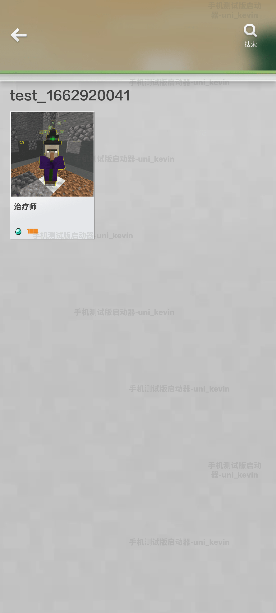
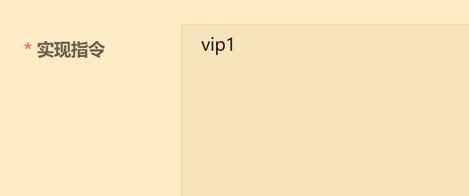

---
front:
hard: 高级
time: 15分钟
---

# 上传并售卖商品

<iframe src="https://cc.163.com/act/m/daily/iframeplayer/?id=63468187c6dfd1bb76f2bfb4" width="800" height="600" allow="fullscreen"/>


本章将带你手把手的创建联机大厅资源、上传商品，有关更多系统性的信息，请查阅<a href="../../../mcguide/26-联机大厅/5-联机大厅作品与商品上传文档.html">商品上传文档</a>。

## 创建地图和商品

创建资源时，资源类别选择**联机大厅**，勾选商业化内购功能。


创建好后，该资源将出现在 **联机大厅商品栏** 。


点击 **添加商品** 。


可选：编辑商品分类信息。


编辑基本信息。


实现指令见下一部分，补充剩余商品信息，并保存商品。


将商品 **提交自测** ，联机大厅资源本身也 **提交自测** ，便可看到此商品出现在橱窗。

当然这只是测试版客户端的橱窗，正式版并不会上架此商品，若商品要投入生产环境，需要提交审核，然后更新到橱窗。





如上所示，添加剩余两个商品。


## 什么是实现指令

在上传商品时，你需要了解 **实现指令** 的概念。实现指令是一个 **代号** ，由平台和开发者 **提前约定好** ，用于识别玩家购买的商品，并授予游戏内的实现权限。当玩家在游戏中购买了某个商品后，商店会向联机大厅房间中运行的逻辑系统（Python/蓝图）发送一个事件，告诉逻辑系统玩家购买了XX商品。实现指令的内容就是这个商品。该事件包含一个实现指令参数，开发者通过这个参数，判断玩家购买的具体商品，以便给玩家发货。


举个例子，如果你出售一个皮肤包，可将 **实现指令** 参数设置为 **sendSkin_001** 。如果有一个叫做 **火箭发射器** 的商品，那么对应的实现指令可以是 **rocket_launcher** 。一件魔法武器，实现指令可设为 **magic_sword** 。

在下图中，neteaseStore（官方商店UI）告知房间1： **玩家3购买了1个金苹果** ，那么实现指令就是 **golden_apple** 。


简而言之，实现指令是连接平台和游戏内容逻辑代码的重要纽带，它帮助逻辑代码识别出哪个商品需要被发货，以便给玩家发放商品实现权限，确保购买商品的顺畅交付。


## 实现指令的两种格式

实现指令格式支持`str`（字符串）或`json`。若您对编程接触不深，建议使用字符串即可（填写时注意输入精准、注意大小写、不要有多余字符/空格、若有符号注意全半角问题）。




也可以使用`json`格式。


使用`json`格式，即使需要发生部分变化，只要核心内容没有改变， **仍不会影响识别功能本身** 。


`json`体内可包含任意字段，只要起到标识作用即可，可以是code或name或任意形式，取决于开发者喜好。


实际填写实现指令之前，为了保证不出现无法反序列化错误，建议一定要在格式化工具里校验、压缩json。


## 实现指令的使用

若你使用本教程提供的demo和工具进行学习，那么参照以下流程，在两个地方输入同样的实现指令，即可绑定商品和发货零件。如果你是经验丰富的开发者，可参阅<a href="../../../mcguide/26-联机大厅/6-联机大厅商品2.0文档.html">联机大厅商品2.0文档</a>完全自行实现。

首先，拟好一个实现指令，例如vip1，在开平输入vip1。


创建一个Vip1零件（取名随意），继承ShipBase。在此零件中编写Python代码或绑定蓝图实现此VIP特权功能。


在零件的属性面板中，输入实现指令。


这样一来，开平上的这个商品和这个零件就绑定了。玩家购买这个商品，所有发货零件会收到通知，但其他零件不会反应，而这个零件会检测到是它负责的商品，会执行发货实现逻辑。

```python
def COnPlayerBrought(self, playerId, expireTime=-1.0, newBuy=False, orderTime=None):  #  当玩家购买此商品
	preset = self.GetParent().ToEffectPreset()
	preset.Play()  #  （实现你的逻辑）

def COnPlayerExpired(self, playerId):  #  当玩家商品权限过期
	preset = self.GetParent().ToEffectPreset()
	preset.Stop()  #  （实现你的逻辑）
```


## 更好的包装与宣传

上传好了商品，实现了功能，同时要注重包装与宣传，才能获得更高的销量。下图展示了商品宣传图片出现的位置，帮助你对美术素材准备建立预期。


下图展示了一段真实的游戏内商品购买的流程场景，观察**商品宣传图片**、**介绍文本**出现的位置，帮助你对美术素材准备建立预期。


更多关于商品宣传的信息，参阅[宣传素材的设计与制作](../作品推广基础教程/1-宣传素材的设计与制作.html)。