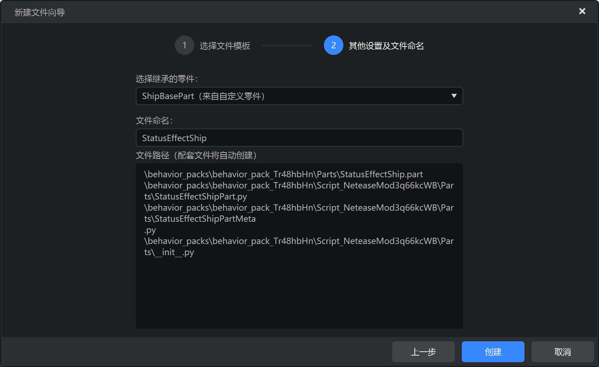
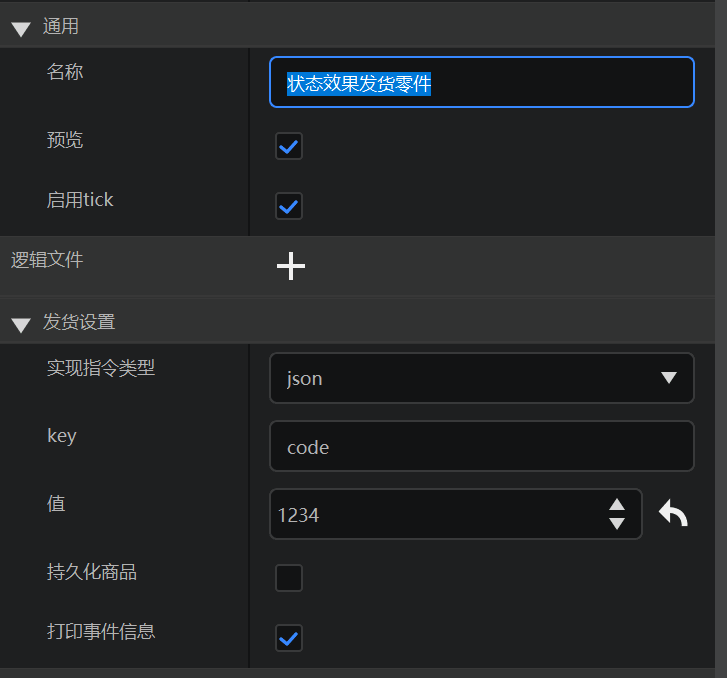
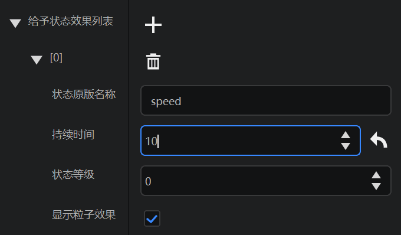
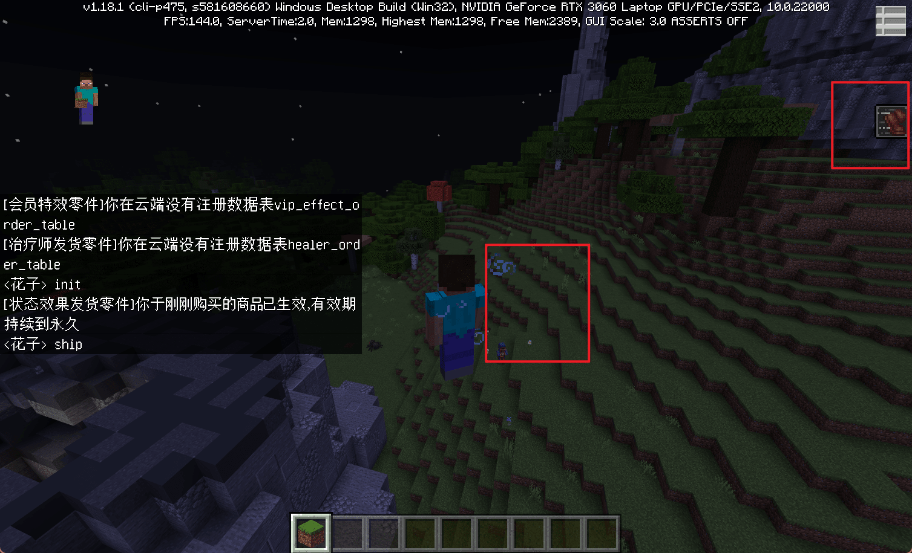

---
front:
hard: 进阶
time: 20分钟
---
# 实现发货逻辑课后作业

## Python向

在学习了如何通过零件实现发货逻辑后，就可以举一反三，完成下面的课后作业。


## 作业要求

- 阅读物品发货零件源码。
- 模仿物品发货零件，制作一个状态效果发货零件。
- 运行状态效果发货零件，测试效果。


## 操作步骤

1.阅读`ItemShipPartMeta.py`

```python
@sunshine_class_meta
class ItemShipPartMeta(ShipBasePartMeta):
	CLASS_NAME = "ItemShipPart"
	PROPERTIES = {
		"itemList": PArray(text="给予物品列表", group="发货设置", sort=30, childAttribute=PDict(children={
			"itemDict": PCustom(
				sort=0,
				text="物品选择",
				editAttribute="MCItems",
				default=("minecraft:wooden_sword", 0),
				withNamespace=True,
				withAuxValue=True,
				isBlock=None,
			),
			"count": PInt(sort=1, text="物品数量", default=1)
		})),
	}
```

2.阅读`ItemShipPart.py`

```python
@registerGenericClass("ItemShipPart")
class ItemShipPart(ShipBasePart):
	def __init__(self):
		ShipBasePart.__init__(self)
		# 零件名称
		self.name = "物品发货零件"
		self.itemList = [{'itemDict': ('bestmap:testItem1', 0), 'count': 1}]
		self.cmdType = 0
		self.cmdValue = 2001

	def CanAdd(self, parent):
		if not isinstance(parent, PlayerPreset):
			return "物品发货零件只能挂在玩家预设下"

	def SOnPlayerBrought(self, playerId, expireTime=-1.0, newBuy=False, orderTime=None):
		parent = self.GetParent()
		if not parent or parent.entityId != playerId:
			return
		for item in self.itemList:
			self.SpawnItemToPlayerInv({
				'newItemName': item['itemDict'][0],
				'newAuxValue': item['itemDict'][1],
				'count': item['count']
			}, playerId)

```

3.分析

可以看到`ItemShipPartMeta.py`元数据文件将物品列表作为一项配置暴露在编辑器的属性栏中，使得对应的数据成员`itemList`可以被可视化编辑，进而在`SOnPlayerBrought`玩家购买商品时将物品发放到玩家背包。

4.模仿

创建StatusEffectShip零件，继承自ShipBase。



修改零件中文名称，和默认属性。



编辑元数据文件，主要注意sort建议30起步，group设为和父零件一样的“发货设置”

```python
@sunshine_class_meta
class StatusEffectShipPartMeta(ShipBasePartMeta):
	CLASS_NAME = "StatusEffectShipPart"
	PROPERTIES = {
		"effectList": PArray(sort=30, text="给予状态效果列表", group="发货设置", childAttribute=PDict(children={
			"effectName": PStr(text="状态原版名称", sort=1, default="speed"),
			"duration": PInt(text="持续时间", sort=2, default=1),
			"amplifier": PInt(text="状态等级", sort=3, default=0),
			"showParticles": PBool(text="显示粒子效果", sort=4, default=True)
		})),
	}

```

编辑逻辑文件的`__init__`方法，添加名为effectList的成员。

```python
def __init__(self):
    ShipBasePart.__init__(self)
    self.name = "状态效果发货零件"
    self.cmdValue = 1234
    self.effectList = [] # 添加这个
```

重写`SOnPlayerBrought`，然后遍历effectList，给玩家添加状态以发货。

```python
def SOnPlayerBrought(self, playerId, expireTime=-1.0, newBuy=False, orderTime=None):
    parent = self.GetParent()
    if not parent or parent.entityId != playerId:
        return
	for effect in self.effectList:
		self.AddEffectToEntity(playerId, effect['effectName'], effect['duration'], effect['amplifier'], effect['showParticles'])
```


## 测试

1.挂载到玩家预设下，配置一个状态效果



2.修改`OrderPollPart`->`ShipPlayer`方中的测试数据，实现指令1234，填写和零件设置一样的值

```python
		if self.debugMode:
			testData = {
                'entity': {
                    'orders': [
								{
									"order_id": 123456789,  # 订单id
									"timestamp": time.time(),  # 购买时间
									"cmd": '{"code":1234}',  # 实现指令
									"product_count": 1  # 购买数量。目前不允许一次购买多个，所以返回都是1
								},
							]
                }
            }
			callback(testData)
		else:
			httpComp.QueryLobbyUserItem(callback, uid)
```

3.进入游戏，聊天框敲入`init`和`ship`，观察效果




## （蓝图版）实现发货逻辑课后作业

在第五章作业中，你设计了一个属于你的新职业，并独立完成制作。现在为你的新职业制作发货逻辑，并完成测试。

1. 创建发货零件，拆分实现逻辑和发货逻辑。
2. 使用逻辑编辑器就，参考本章正文，完成发货过程。
3. 提供两个主要思路用以参考：
   1. 若使用**接口**完成发货，参考[治疗师](./4-为玩法设计内购商品.html?catalog=1#逻辑编辑器程序向实战-制作新职业)。
   2. 若使用**事件**完成发货，参考[会员特效](./4-为玩法设计内购商品.html?catalog=1#逻辑编辑器程序向实战-制作会员特效)。
4. 运行游戏，测试效果。

