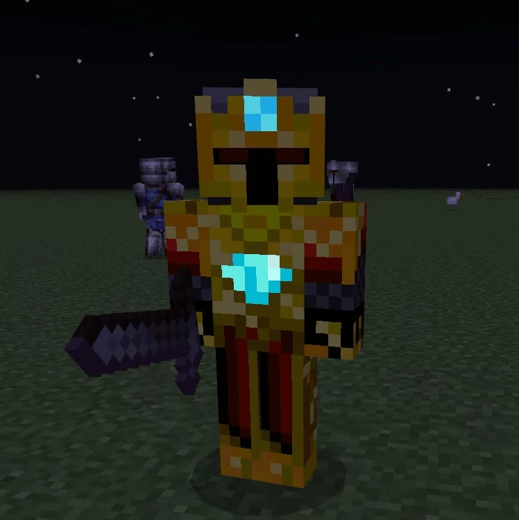
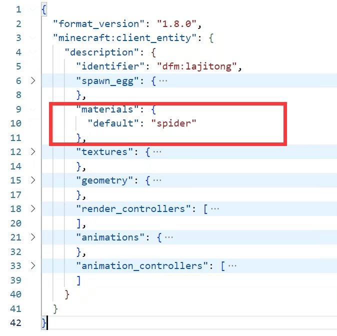
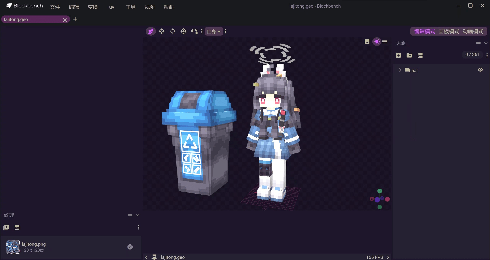
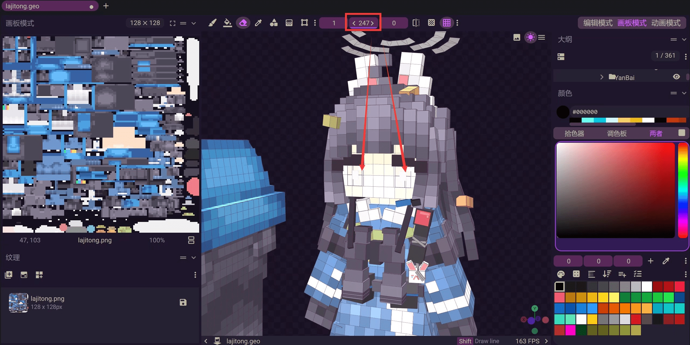
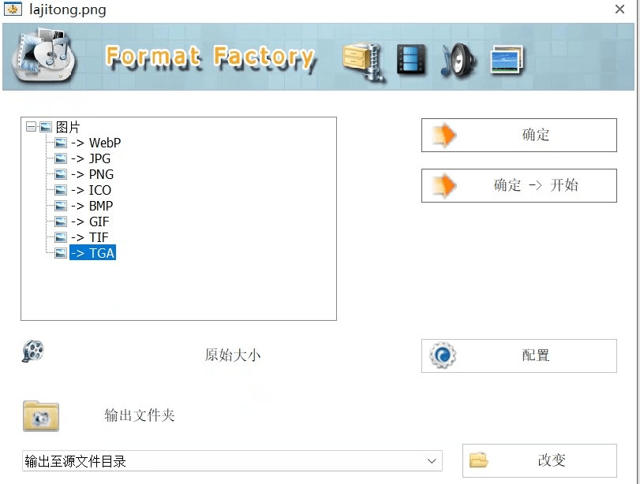
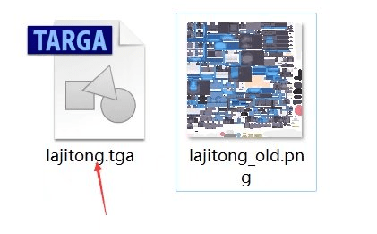
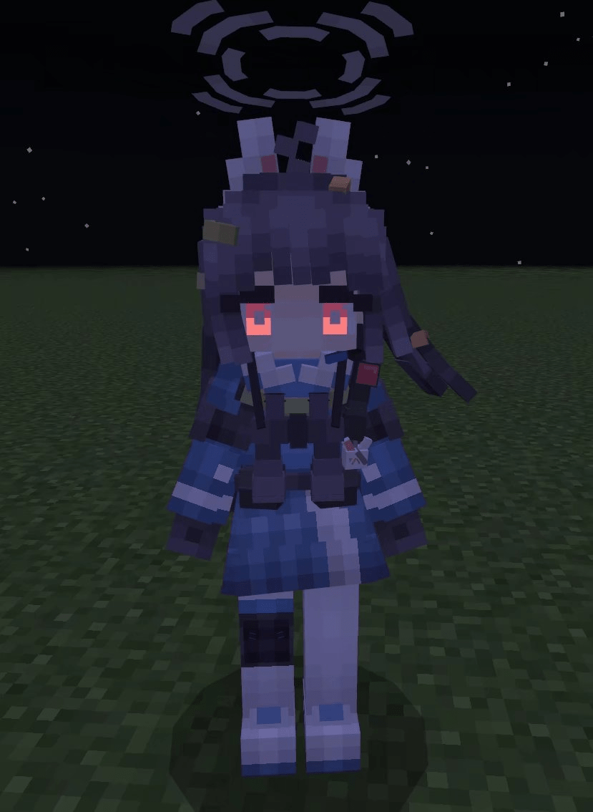

# 手把手教你如何制作发光的生物

>本篇教程获得第一期知识库必看教程奖。
>
>获奖作者：大肥免。

相信很多小伙伴刚开始都有过想做发光贴图的想法叭~肥免也一样！

由于肥免刚当开发者一年，所以下面有些专业术语呀或者什么表述不当的地方还望谅解呐。

这里肥免将会分享如何制作发光贴图！！

这里以一个自定义实体进行示例。

## 一、准备好一个自定义实体

如何准备一个自定义实体可以去找找官方教程或者拿编辑器点一点也可以喔~

## 二、修改materials

打开rp/entity/xxx.json文件，因为比较方便，所以直接引用“蜘蛛”的materials，如图所示。

## 三、制作发光贴图

这里我们使用blockbench软件，将纹理直接导入编辑。

选择“画板模式-橡皮擦工具”，调整擦除透明度，擦除后，**越透明则发光越亮！**

保存贴图！

## 四、将贴图转为tga格式

小伙伴们可能没有ps，用格式工厂也可以，直接将贴图进行转换为tga格，替换原先的贴图！

原先的贴图可以选择留下来，但是名称记得要修改喔~

由于我们rp/entity/xxx.json 已经引用了文件前缀为 lajitong 的贴图，所以就不用改啦~直接进游戏测试！

## **五、完成**

**啊~好亮~好可怕的眼睛！**