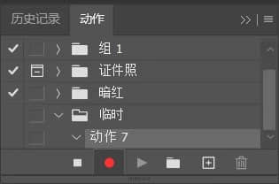
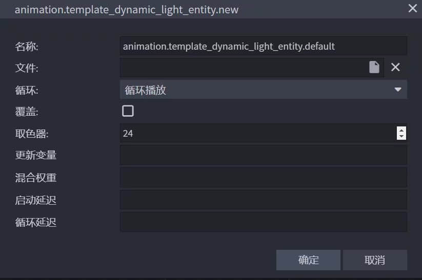
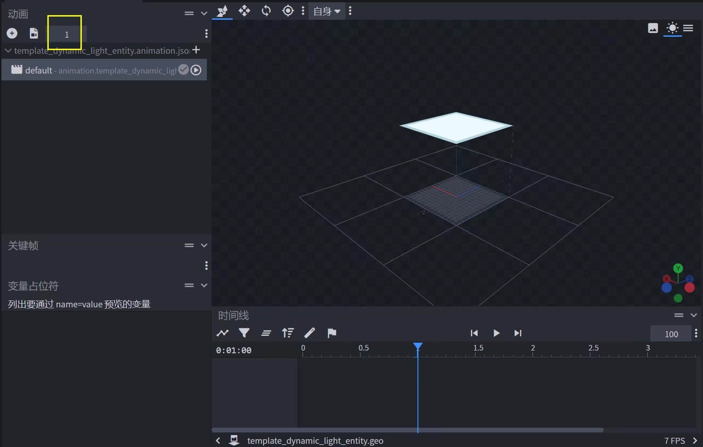

# 发光自定义实体

> 本篇教程获得第一期知识库必看教程奖。
>
> 获奖作者：魔灵工作室-创造者MC。

⚠️警告：本教程默认您会自定义实体。

⚠️警告：本教程最好使用电脑。

✅提示：本教程国际版和网易版通用。

✅提示：本教程最后有示例包可供参考。


让我们先看看本教程的最终效果：

<iframe frameborder="0" height="600" width="800" allowfullscreen="allowfullscreen" src="http://cc.163.com/v/core/externplayer/63e36ff129279d2f4acfc025/"/>


本教程Addon层次结构：

```yaml
- TMSLightDemoRP
  - animations
  - entity
  - models
    - entity（在models文件夹内）
  - render_controllers
  - textures
- TMSLightDemoBP
  - entities
```

请先按照上面的文件夹层次结构创建好你的Addon。


首先，我们打开Blockbench（本教程使用4.4.1版本）新建一个基岩版模型。


我们随便造个模型。


生成一下贴图。


现在是这个样子。


按`ctrl+s`，把模型和贴图保存到指定的文件夹里。


接下来是重头戏，我们要让贴图动起来。这里我使用AE做动态贴图，大家也可以用其他软件，只要最后你得到一张张的逐帧图片就可以。


注意：本教程不教AE如何使用，这不是这个教程的重点，请自行学习，或用你熟悉的工具软件代替。

用你的贴图新建一个合成，注意帧速率和持续时间的设置，一般1秒就够了。我们选择25帧每秒，也就是说最后会得到25张图片。


给纹理图片加个效果。简单起见，我这里使用“色相/饱和度”效果，做一个动态颜色变化。


设置一下关键帧。


现在播放预览一下，效果应该是这样的。


接下来进行输出（添加到渲染队列），一定要注意红框中的设置，我们最后得到的是png序列图片。


选择输出位置。


最后点击渲染按钮，得到这些图片。


这时你可能会产生一个疑问，这么多图片，难道我们每一张都要手动处理吗？太麻烦了吧。

别急，继续看。


打开Photoshop。


打开我们在AE渲染得到的第一张纹理图片。


接下来是一个批量处理图片的技巧，我们利用Photoshop自带的“动作”功能，即可批量处理图片，非常方便！

打开“动作”面板（找不到的可以在软件顶部菜单栏中的“窗口”中找到）点击红框内的按钮，新建一个动作（你也可以点击旁边的文件夹按钮，新建一个组，再在里面新建一个动作），然后会弹出一个对话框。


点击弹出对话框右边的“记录”按钮后，会看到这里的圆点按钮变红并呈现按下去的样子。此时，您在ps内的操作，都会被自动记录，接下来不要有任何多余的操作哦！




然后开始处理图片，让指定区域发光。（这里处理成发光的方法有很多，我这里只写了其中一种方法）。

切换到“通道”面板，点击红框内的加号按钮，新建一个alpha通道。


默认alpha通道是全黑的，按一下ctrl+i键，让alpha通道全白，如下图所示。


然后，我想要的效果是，只让模型的东西南北四个面发光，顶面和底面不发光，我们借助Blockbench看一下纹理的哪些部分是东西南北面。


然后回到ps里，选择RGB通道，用矩形选框工具选中东西南北四个面，得到选区。


再点击alpha通道，向选区内填充黑色（黑色区域即为完全发光区域，若填充不同程度的灰色，还能有不同程度的发光效果）。


回到RGB通道，按下ctrl+shift+s进行另存为操作（注意，此时动作仍然在记录），选择保存类型为tga。


点击保存按钮后弹出如下图所示对话框，这里一定要选32位/像素，并勾选上压缩！！！非常重要！！！如果不选32位/像素，图片会不带alpha通道。如果不勾选压缩，图片会有足足1MB的大小！


确定后再观察下动作面板，已经记录了存储动作。然后我们就可以点击红框内的按钮，结束记录了。


再看一下文件夹（注意tga图片的大小，如果是1MB，那很可能你没有勾选压缩）。


接下来是体现“动作”功能的时候了，我们把其他未处理的图片都拖入ps中（注意关掉ps中原来的图片）。

待所有图片打开完毕后，点击顶部菜单栏上的`文件`->`自动`->`批处理` 。


设置好下图红框内的选项（动作7是我刚刚录制的动作的名称）。


点击确定按钮，ps就会为每一张图片执行咱们之前录好的动作！执行结束后，去文件夹里看一下，把原来png格式的图片删除，结果如下。（可以用ps打开几个，看看对不对）。


接下来又是重头戏，先理一下思路，到这里我们完成了addon的创建，模型的制作以及模型纹理的初步处理。

现在我们可以看到这些纹理图片的命名明显不合适，我们需要批量重命名这些文件。我这里提供了一个自己用Python写的小工具，可实现文件的批量重命名。

下载链接：[python自动化](https://creatormc.lanzoul.com/ie1P70ceaawj)。

下载后解压，我们把这个文件复制到这里。


使用他需要先把我们的纹理文件夹重命名成`tms`。


然后在资源管理器的地址栏上输入cmd并回车，在这个位置打开命令提示符窗口。

​	


随后输入如下图所示的内容并回车

警告：此处需要python2.7的运行环境（下同）

输入：

```bash
python    批量重命名.py    template_dynamic_light_entity_
```

这里的文件名后面的参数，表明了重命名文件的前缀，就是说重命名的图片文件的名字的前面的部分，程序会挨个遍历`tms`文件夹内的图片，并给前缀名字加上从0开始的编号，形成新的名字。


执行完后再次观察文件夹，我们发现名字都变成我们想要的形式了。


然后我们再从上面下载的压缩包中复制这个文件到此处。这个程序就如文件名的意思一样，帮助我们直接生成动态贴图对应的自定义实体客户端文件。


相同的方法，执行下图命令。这里最后一个参数的意思是纹理贴图所在的目标文件夹的路径，和前一个程序一样，在最后会加上编号。

输入：

```bash
python 生成客户端实体定义文件.py textures/moling/template_dynamic_light_entity_
```


执行完后，再看文件夹，出现了一个新的json文件。


把这个文件剪切到表层的entity文件夹里。用代码编辑器（这里我用的是vscode，萝卜青菜，各有所爱）打开，注意下图黄色框内的内容，替换成我们自己的模型和identifier。


注意路径位置，我这里发生了改变，上图黄色框中的图片路径，不是真实的图片路径，我们去移动一下图片（注意下图红框内的路径）。


这样两边就对应起来了，然后我们改一下materials，如下图所示。这是一种发光材料。


现在就差一点了，加油，坚持就是胜利！

我们现在再打开Blockbench，然后打开我们的模型，给他加个1秒的空动画（这里为什么这么做，继续往下看会有解释，这里先跟着做），注意动画是循环的！




注意是1秒。




然后回到代码编辑器，把我们的动画加上，让他默认一直播放。


到这里可能有人已经注意到了，我们还缺一个渲染控制器。

接下来，把上面下载的压缩包内的这个文件拿过来。


然后按照相同的方法执行，这次文件名后面不需要有参数。


执行完后，渲染控制器也被生成了。


我们把渲染控制器放进`render_controllers`文件夹内，然后我们打开观察一下，这个渲染控制器里面到底写了什么。

下图就是生成的渲染控制器，我们可以看到红框内的表达式`query.anim_time * 30`这是什么意思呢？

前面的`query.anim_time`是一个`molang`查询，他会返回自当前动画开始以来的时间！这就是为什么我们前面需要加个1秒的空动画的原因！就是想要让这个查询生效。后面的*30就没什么了，只是让他变化的速度快一些，达到连续切换图片的效果，形成“动态”纹理。


理所当然的，加了渲染控制器，我们肯定也要改变一下客户端实体定义文件。给这个文件的渲染控制器改成我们生成的这个渲染控制器。如下图所示。


然后简单写个行为，保证这个实体能正常生成即可。


然后就可以进游戏测试啦！就会出现一开始的视频里的效果！


🆓本期教程示例：[动态发光自定义实体Demo](https://creatormc.lanzoul.com/iCmjl0ceahaj)。

🆓Python自动化工具：[python自动化生成json](https://creatormc.lanzoul.com/ie1P70ceaawj)。

