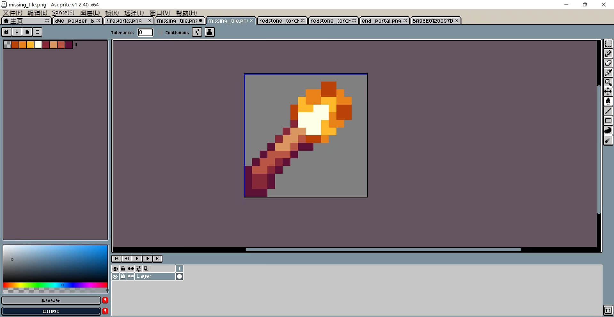

# 火把物品材质

> 本篇教程获得第二期知识库优秀教程奖。
>
> 获奖作者：Blusk147。


[zip文件，提取码4个0 ](https://pan.baidu.com/s/1mBDZZnkoiuSFslyOZOb62g?pwd=0000)。


## 制作方法

1. 在材质包目录创建名为 **blocks.json** 的文件。

   


2. 将下方代码复制到 **blocks.json** 内。

   ```json
   {
       "format_version":[
           1,
           1,
           0
       ],
       "torch":{
           "textures":"torch_on",
           "blockshape":"torch",
           "carried_textures":"missing_tile"
       }
   }
   ```

   


3. 制作一个火把材质贴图，并保存到目录/textures/blocks，命名为missing_tile。

   


完。

