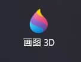
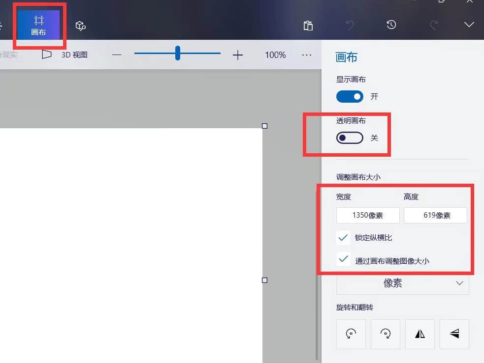
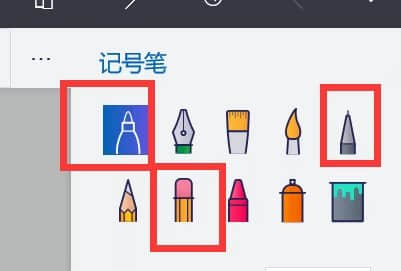
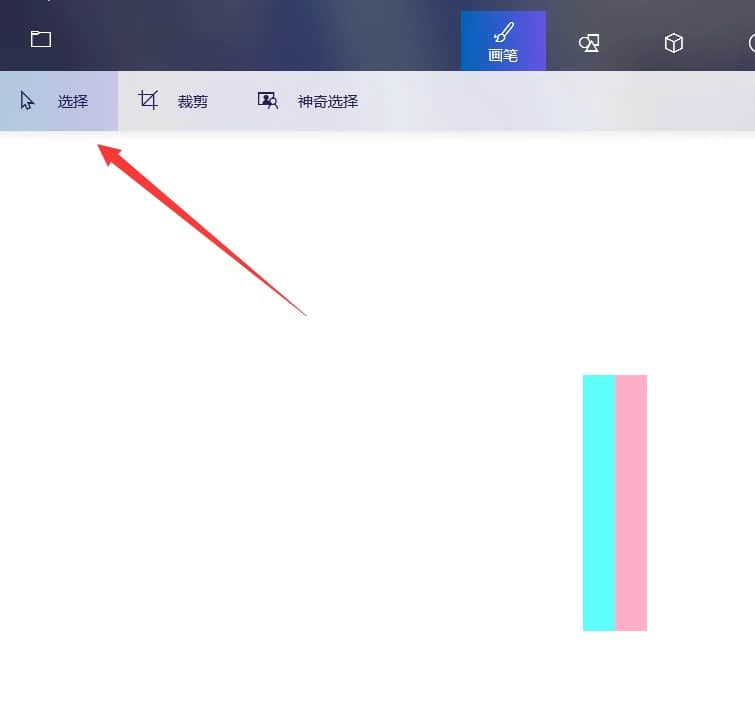
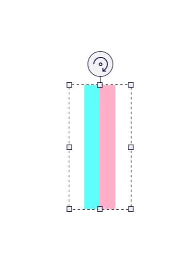

# 画图3D构造像素画

>本篇教程获得第二期知识库优秀教程奖。
>
>获奖作者：鱼摆摆Gokotta。

**今天为大家带来的是一款好用却常常被人忽视的一款软件——画图3D。**

画图3D是微软发行的图片处理工具，在window10/11上预装，如果没有可以前往微软商店自行下载。

首先我们打开画图3D，**｜画面设置｜** 。

在最上面一行我们可以看到画布两个字。点击画布，右边的方框内是：

- 调整分辨率。
- 是否透明。
- 画布调整选项。

将其设置为画材质常用的16×16，之后我们点击画笔。

这是画材质常用的选项：

- 记号笔：带有渐变的绘制工具。
- 橡皮擦：顾名思义。
- 签字笔：纯色绘制工具。

我们点击画面上方的2D图形选项，这里可以画基础的图形。首先我们绘制一个蓝色圆。

然后使用记号笔对它进行明暗处理。

最后不要忘记，物品一般附带有边框，这样会使图形突出画面，给人一种美感。

这样一个水球就画好了。

接着来了解 **渐变处理** 。

首先我们将画面拉到最大，使用你想要渐变的两种或多种颜色。排列在画上，然后点击左上角的选择选项。

将图形扩起来。

拉长之后，我们就会得到一条很自然的渐变线了。

不同的拉伸有不同的效果。

**第一次做分享不是很熟练，已经尽我可能去把过程描述的详细，新人或者电脑内存不足的，可以尝试使用这个软件。**

**如有冒犯轻喷，仅作分享。**