# 更加自然的地表结构

>本篇教程获得第一期知识库必看教程奖。
>
>获奖作者：凌峰轨迹lf。

该教程需要开发者了解结构生成规则的json结构  。

不知道各位开发者在生成地表结构时有没有遇到过以下问题：

1. 结构会刷在水面上。
2. 对于一些凹凸不平的地形，结构部分浮空，显得不自然。

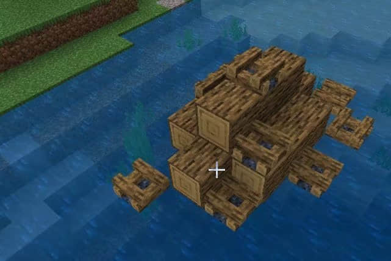

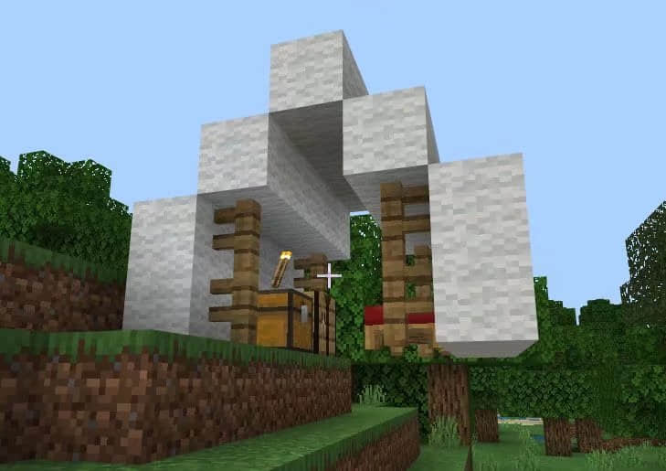

## 对于问题一

解决方法很简单，由于MC的水平面高度是固定的，因此将地表结构避免生成于该高度下即可。

可以如下图所示写法，在结构的生成规则中的y加入判断 。（对于会ModSDK的开发者，建议直接通过监听当结构低于某高度时取消放置）。

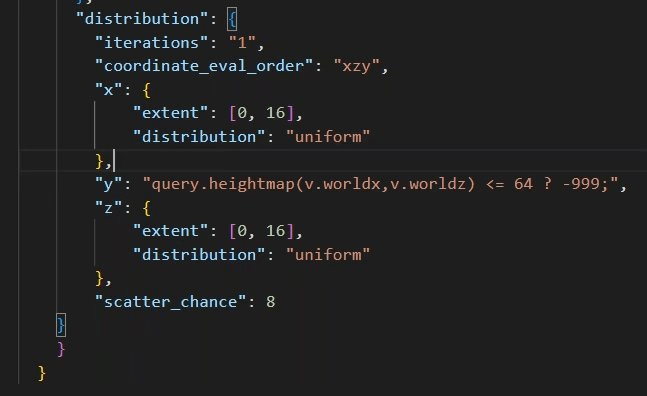

## 对于问题二

有两种解决办法，适用于不同情况下的大小结构。

对于较小的结构来说，可以通过以下方法，让结构生成在平地上，避免出现因地形凹凸而浮空显得不自然的情况，其中v.structure_x_length写结构的x方向长度，z同理 。（复杂式已规避结构生成在水平面下，v.min_y = v.min_y - 0 中的0为结构下嵌高度，适用于一些带地下室或者地板的结构，不要忘了放好结构空位）。

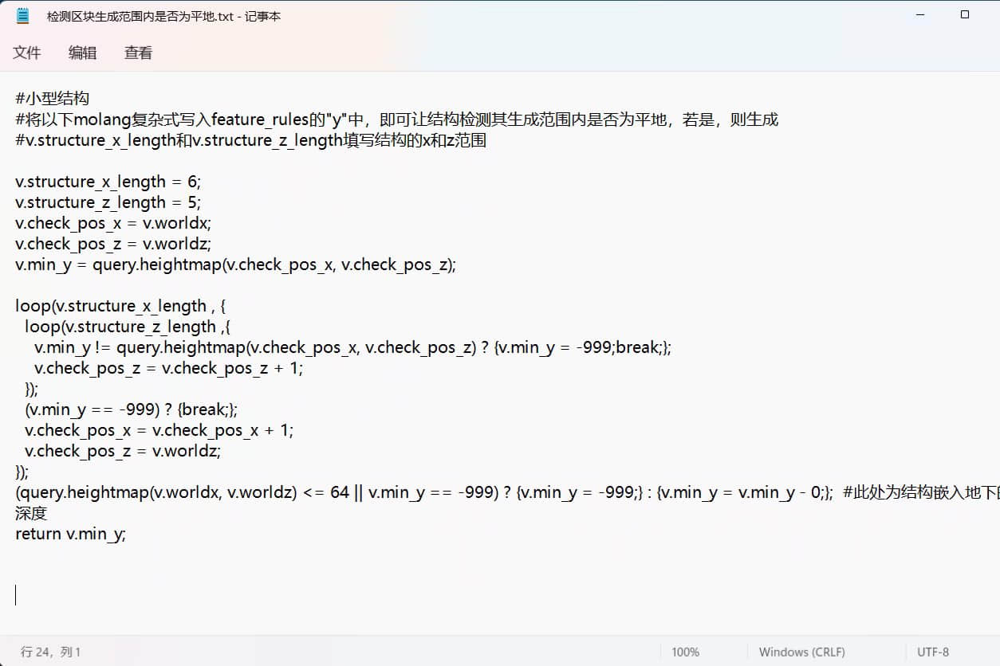

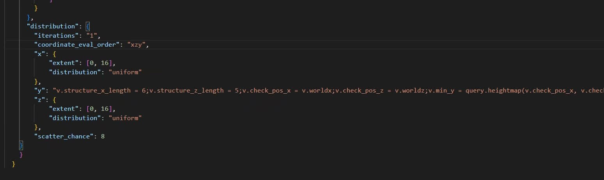

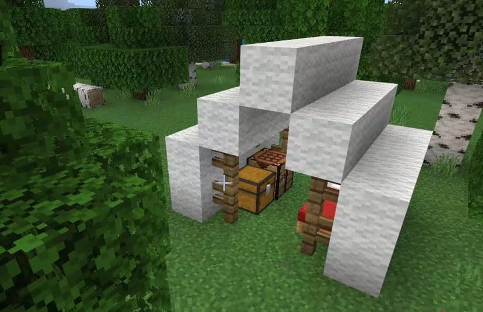

molang复杂式（已去换行，可直接复制黏贴运用至y中，注意根据自己的结构大小设置参数） ：

`v.structure_x_length = 6;v.structure_z_length = 5;v.check_pos_x = v.worldx;v.check_pos_z = v.worldz;v.min_y = query.heightmap(v.check_pos_x, v.check_pos_z);loop(v.structure_x_length , {loop(v.structure_z_length ,{v.min_y != query.heightmap(v.check_pos_x, v.check_pos_z) ? {v.min_y = -999;break;};v.check_pos_z = v.check_pos_z + 1;});(v.min_y == -999) ? break;v.check_pos_x = v.check_pos_x + 1;v.check_pos_z = v.worldz;});(query.heightmap(v.worldx, v.worldz) <= 64 || v.min_y == -999) ? {v.min_y = -999;} : {v.min_y = v.min_y - 0;};return v.min_y; `

加入这样的判断会导致结构生成的概率降低（因为一些不符合要求的结构没有正常生成），所以可以适当调整一下生成的概率。

不过使用该方法时需要注意： 不太适应较大的结构（结构越大，对应其长宽的平地越少），且有时会在一些地形平坦的地方发现结构扎堆，当然你也可以降低该结构在一些地形平坦的群系（平原，沙漠）的生成概率。

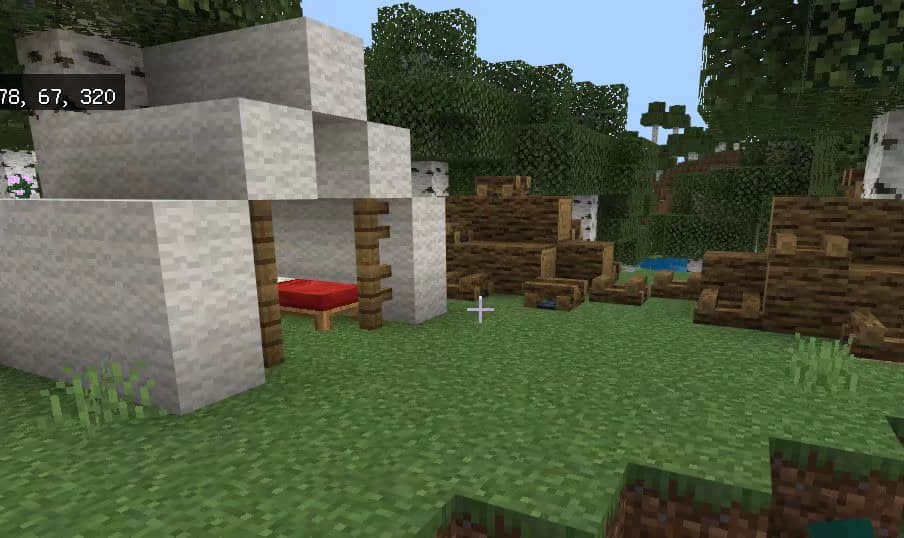

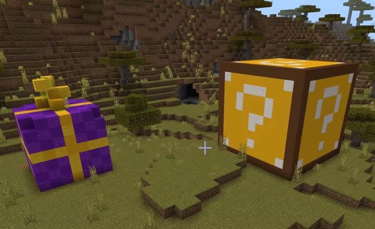

既然以上这种方法对于大型结构不适应，那还有一种方法，见下图：

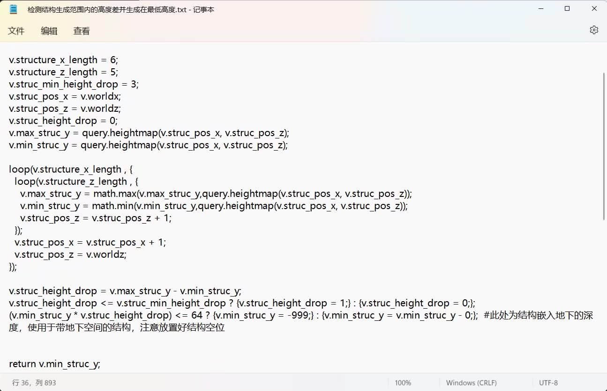

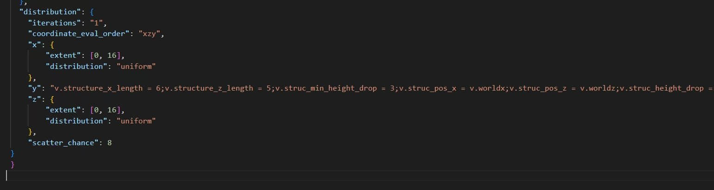

molang复杂式（已去换行，可直接复制黏贴运用至y中，注意根据自己的结构大小设置参数）：

`v.structure_x_length = 6;v.structure_z_length = 5;v.struc_min_height_drop = 3;v.struc_pos_x = v.worldx;v.struc_pos_z = v.worldz;v.struc_height_drop = 0;v.max_struc_y = query.heightmap(v.struc_pos_x, v.struc_pos_z);v.min_struc_y = query.heightmap(v.struc_pos_x, v.struc_pos_z);loop(v.structure_x_length , {loop(v.structure_z_length , {v.max_struc_y = math.max(v.max_struc_y,query.heightmap(v.struc_pos_x, v.struc_pos_z));v.min_struc_y = math.min(v.min_struc_y,query.heightmap(v.struc_pos_x, v.struc_pos_z));v.struc_pos_z = v.struc_pos_z + 1;});v.struc_pos_x = v.struc_pos_x + 1;v.struc_pos_z = v.worldz;});v.struc_height_drop = v.max_struc_y - v.min_struc_y;v.struc_height_drop <= v.struc_min_height_drop ? {v.struc_height_drop = 1;} : {v.struc_height_drop = 0;};(v.min_struc_y * v.struc_height_drop) <= 64 ? {v.min_struc_y = -999;} : {v.min_struc_y = v.min_struc_y - 0;};return v.min_struc_y;`

ps：该复杂式若有用起来问题请在评论区反馈，我还没有实践，理论上可行（绝对不是因为我建筑烂做不出大结构（瑟瑟发抖.jpg））。

这种方法通过判断结构生成范围内的最大高度差来决定是否生成，若最大高度差低于设定值（即地形起伏不大）就可以生成，可以通过修改复杂式中的v.struc_min_height_drop来控制结构生成范围内的最大能容忍的高度差，即v.struc_min_height_drop越大，结构可生成在的地形起伏上限越大。

并且为了结构不悬浮，该复杂式将其生成位置设立为其范围内的最低高度，这样结构的生成就不会浮空，显得自然一些了。

不过请注意，由于复杂式是将结构范围内的高度都遍历一遍，所以还是不建议用此方法高机率地生成过宽大的结构 。

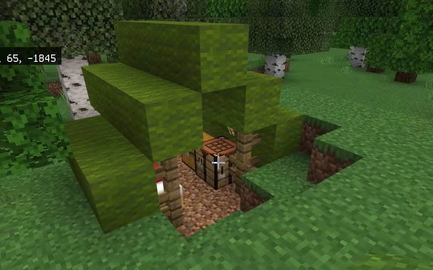

ps：不知道有没有开发者用国际版的写法在中国版正常生成结构，我一开始学习结构生成时尝试用过，但似乎有点问题。

模组开发新手，刚学习编程，有什么地方有问题的可以在评论区指出改进。

不知道各位精通SDK的开发者对于结构生成有没有更好的优化方案（期待.jpg）。

