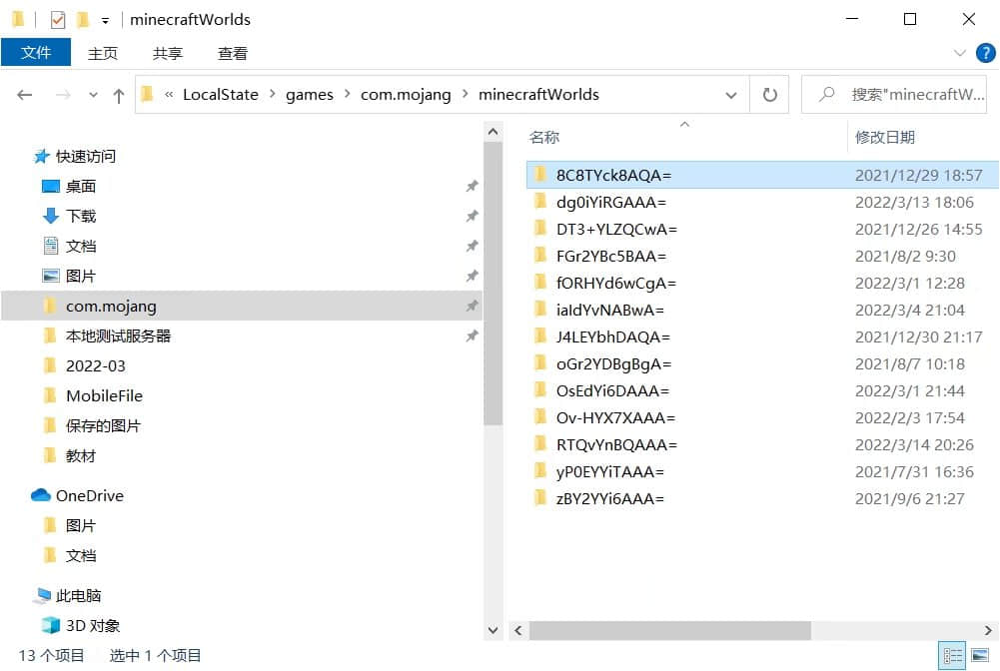
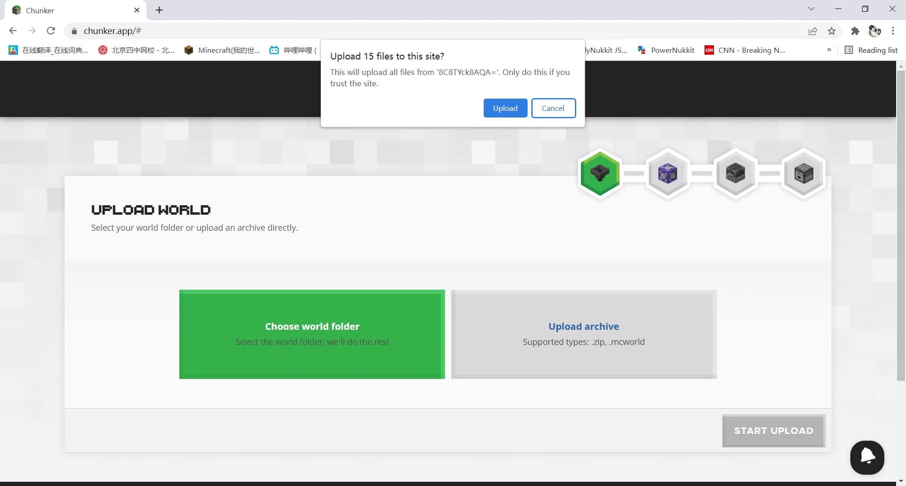

# 使用chunker进行存档转换格式

>本篇教程获得第二期知识库必看教程奖。
>
>获奖作者：从不咕咕的鸽纸。

## 前言

很久以前我曾经写过一篇转换地图存档格式的教程[（使用MCC Toolcheast转换地图存档）](https://www.mcbbs.net/thread-1070066-1-1.html)，但教程中涉及的软件已停止维护，官网也失效了，况且原来的软件也不是非常好用。最近我发现了一个网站，可以在线转换地图存档，并且功能十分齐全，在此分享给大家。这个网站不仅可以进行Java版地图转基岩版、基岩版地图转Java版，也可以进行升降地图版本的操作，比如把Java版1.16地图降到Java版1.12，对于一些服主来说也是非常实用。接下来我将介绍这个网站具体如何使用。为了方便打字，下面我将把Java版称作 **JE** ，基岩版称作 **BE** ；上传的地图版本称为 **源版本** ，想要转换到的地图版本称为 **目标版本** 。

## 如何使用

首先是网站链接：[https://chunker.app/](https://chunker.app/)。

**关于网站：**

这个网站是我的世界基岩版官方精选服务器**The Hive**（https://hivegames.io/）推出的在线地图转换服务。考虑到Hive服务器和Mojang的合作关系，这个网站也算是有Mojang官方背书了，值得信任。对于Hive服务器本身，不再做更多介绍，这不是本教程的主要内容。

接下来我开始介绍如何使用这个网站进行地图转换：

1. **访问网站**

   在浏览器（推荐使用谷歌浏览器或以谷歌为内核的浏览器访问，目前不需要科学手段访问，可直连，但访问速度较慢）

   地址栏输入[https://chunker.app/](https://chunker.app/)，跳转到此页面：

   

   为了方便大家对应网站内容，我将使用原英文页面进行讲解。看不懂英文的建议上完九年义务教育或者开个翻译器去。

2. **上传需要转换的地图存档**

   网站提供了两种上传方式，一种是 **Choose world folder** ，即选择世界文件夹，这里是指从你的Minecraft游戏中选择一个世界。

   基岩版的世界存档路径是"安装我的世界基岩版的系统盘`（如C）:\Users\你的计算机用户名\appData\Local\Packages\Microsoft.MinecraftUWP_8wekyb3d8bbwe\LocalState\games\com.mojang`

   `\minecraftWorlds"`，Java版的地图存档路径是`启动器路径\.minecraft\saves`。

   另一种是 **Upload archive** ，即上传存档，你可以直接上传外部下载的地图存档或者自己打包好的地图存档。

   支持zip格式（JE地图格式）和mcworld格式（BE地图格式）。两种上传方式在上传完之后的操作没有差别，这里以第一种上传方式为例：

   

   以基岩版为例，找到自己想要转换的地图文件夹（只选中，不用进入下级文件夹），由于文件夹中显示的地图名字。是随机字符，你还需要提前确认哪个是你要上传的地图。打开地图文件夹，找到“levelname.txt”打开，就能看到该文件夹对应的地图的原名了。

   

   

   

   选择好地图后，点击 **upload** 上传。

   

   浏览器可能会提示问你是否上传，确定即可，然后等待上传完成。

   

   提示“**Ready To Upload（准备好上传）**”即为成功上传到网站，然后点击 **START UPLOAD（开始上传）** 进入下一步。

   等待上传结束后，会自动进入这个页面：

   

   标有粉色 **SOURCE VERSION** 图标的意为 **源版本** ，也就是你刚刚上传的这个地图的版本，是由网站自动识别的。通常来说识别的非常精准。如果标有黄色 **BETA** 图标的意为 **测试版** ，这代表该版本处于测试中，可能无法完美转换地图。然后选中你想转换到的目标版本（**注意，目前无论是JE还是BE1.18.0以上版本的地图都不能完美地转换到JE1.12.2及以下版本，虽然网站提供了选项，但实际转换到JE1.12.2及以下版本的时候会出现丢失区块的问题）** ：

   

   这里以转换到JE1.16.5为例，选中目标版本后，右下方有 **ADVANCED MODE（高级模式）** 和 **CONVERT & DOWNLOAD（转换＆下载）** 两个选项。后者是不做任何修改直接把地图转换并下载，但我个人推荐还是先打开高级模式查看源地图是否有问题以及进行一些需要的修改。

   

   进入高级模式，首先会展示地图的2D平面图（也就是右侧的 **WORLD PREVIEW** ，地图预览），这有点像卫星地图一样。此时如果你想要更改你的目标版本，还可以点击右下角的 **SWITCH MODE（切换版本）** 重新选择目标版本；如果通过平面图检查地图无误后且不需要做任何修改了，可以点击右下角的“**CONVERT（转换）**”直接进入地图转换流程。如果想要进一步操作，右侧列表中还有许多设置项。

   **WORLD SETTINGS（世界设置）：**

   

   这里提供了一些世界基本设置，如 **Difficulty** 游戏难度， **Gamemode** 游戏模式（从左到右依次为生存，冒险，创造，观察者），上方还有**GAMERULES** 游戏规则（如禁止TNT爆炸、禁止生物破坏），等等。都是一眼就能看明白的设置项，看不懂英文的可以使用翻译器辅助。

   **Dimensions/Pruning（维度/修剪）**

   

   **Output Dimension** 是输出维度，在这里你可以选择转换后的地图保留哪些维度，从左到右依次为没有任何维度、 全部维度、仅下界、仅末路之地。

   **Prune chunks outside of a region** 是修剪区域外的区块。开启后，你可以指定X Z轴坐标，在此范围内的区块会保留，范围外的区块将会被删去 **（谨慎使用！）** 。

   **BLOCK MappING （方块转换）**

   

   如果你是从高版本转换为低版本，一些高版本方块可能无法在低版本地图中正常使用。在这里，你可以选择将某一方块转换为另一种方块代替。左侧 **Input Block** 是输入方块，右侧 **Output Block** 是输出方块。举例，在左侧选择 **minecraft:bedrock（基岩方块）** ，在右侧选择 **minecraft:air（空气方块）** ，那么该地图转换后地图内所有基岩方块都会被替换为空气方块。

   

   **CONVERTER SETTINGS（转换器设置）**
   

   这里是对转换工具本身的一些设置，如是否转换物品等。没有特殊需要的话不要动这里的设置项。

   好了，现在你已经完成所有转换前准备了，你可以正式开始转换地图了！

   在确认无误后，点击右下角 **CONVERT（转换）** ，然后等待排队（非使用高峰期的话基本上不需要排队）。

   

   

   出现 **Ready To Download** 就成功了！接下来点击右下角 **DOWNLOAD（下载）** 将转换好的地图下载下来即可！

   至此地图转换流程就全部结束了，想要再转换别的地图的话点击 **RESTART** 重启转换工具即可。

