# 3D模型转化为有色建筑

>本篇教程获得第二期知识库必看教程奖。
>
>获奖作者：yourzard。

**默认以下：**

- 你懂得如何使用blender、sketchUp2021、Magicavoxel等3D建模软件。
- 你懂得如何使用java版我的世界WorldEdit插件。
- 你懂得如何将地图转换版本。

好的，教程开始。

**总流程：**

1. 模型格式转化。
2. 模型上色。
3. 转化格式。
4. 生成建筑。
5. 存档格式转换。

使用常用建模软件比如maya、c4d、3dmax、blender等，打开后缀为obj/stl/fbx/gltf/dae等通用格式的模型文件。

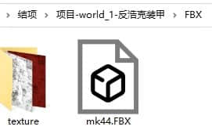

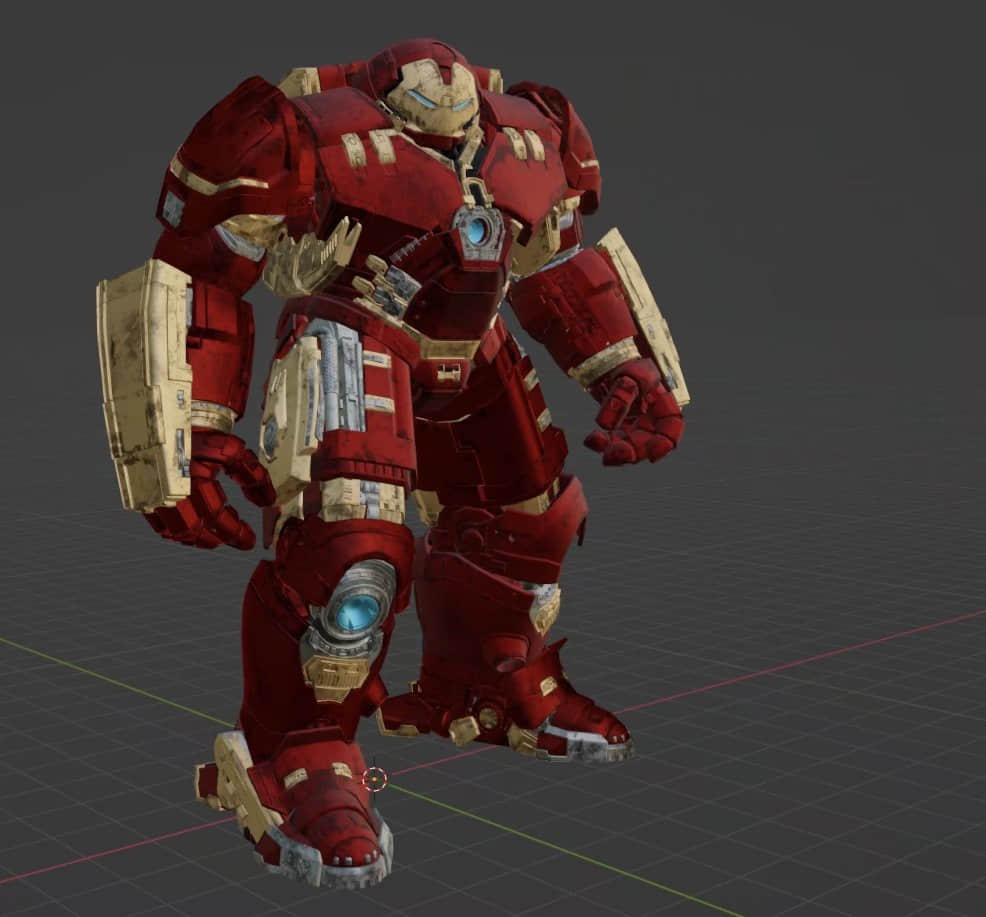

将其转换为stl格式的无贴图纹理的白模。随后打开此网站：[https://drububu.com/miscellaneous/voxelizer/index.html?out=stl](https://drububu.com/miscellaneous/voxelizer/index.html?out=stl)。

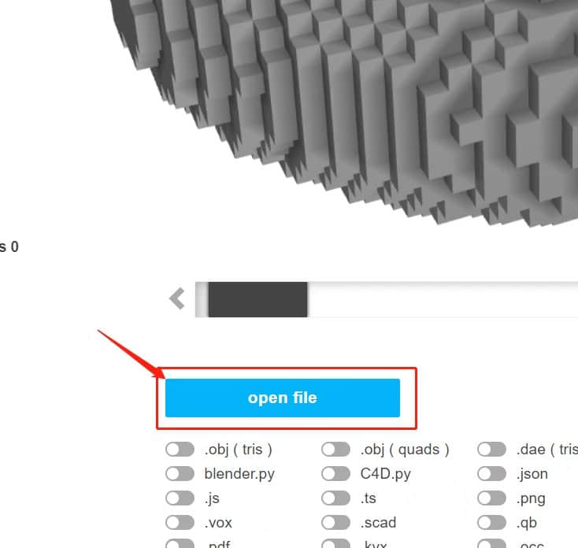

打开文件这里选择刚刚转化好的stl文件。

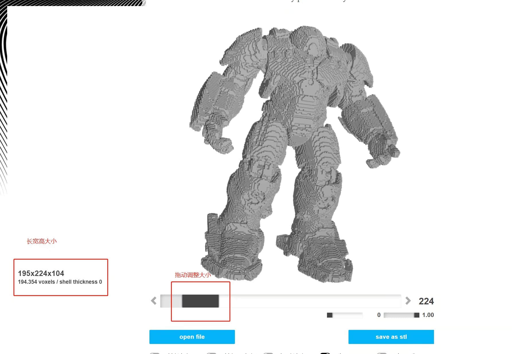

根据你需要的大小调整。

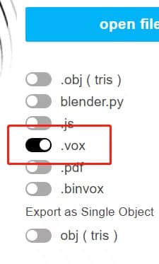

导出为vox后缀的文件，之后使用magicavoxel打开。 **记住，在MV中需要合并整个模型为一个方框框住的，才能正确导出！**

**错误示范：**

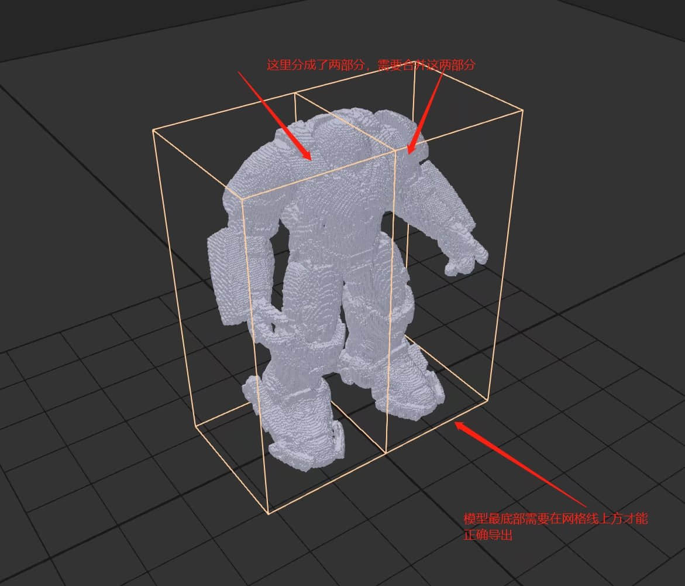

**正确示范：**

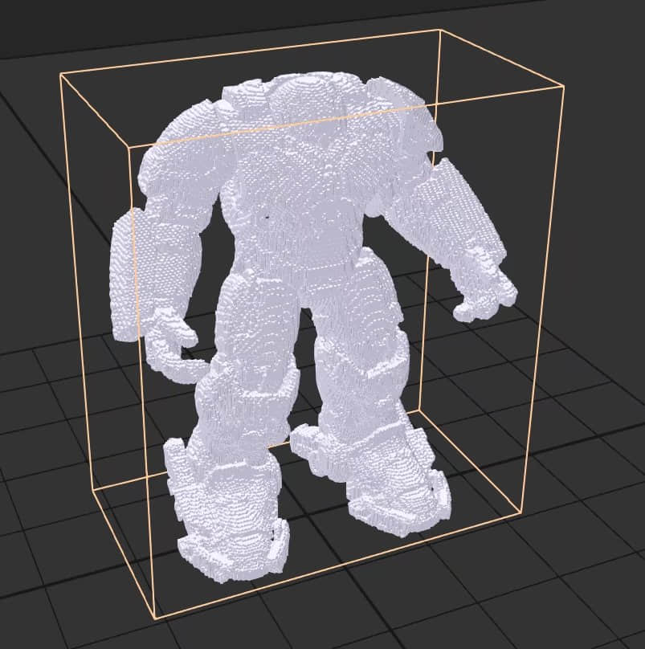

接下来需要对模型进行上色，但你要注意，并不是任何颜色都能被正确识别的。

只能正确识别最多16种颜色，这里我使用混凝土块的颜色色板，你可以保存这个色板后导入MV中的color中。

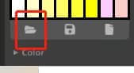

**色板：**

如果模型是左右对称的，你也可以使用镜像上色来同时完成左右两边的上色。

这里我们跳过上色步骤（默认你会使用MV的笔刷等功能）。

我们来看看上色成果。

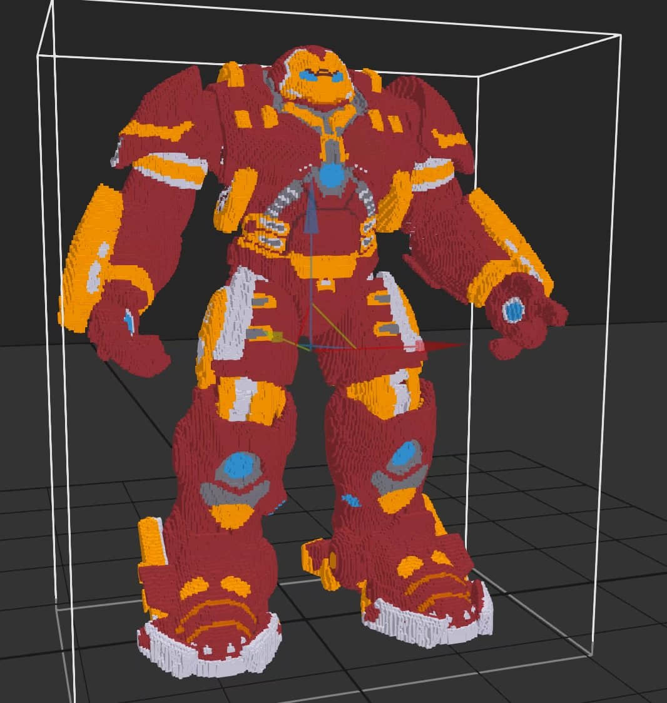

保存这个vox模型，最好有备份。

接着，继续在刚刚那个网站打开这个模型。

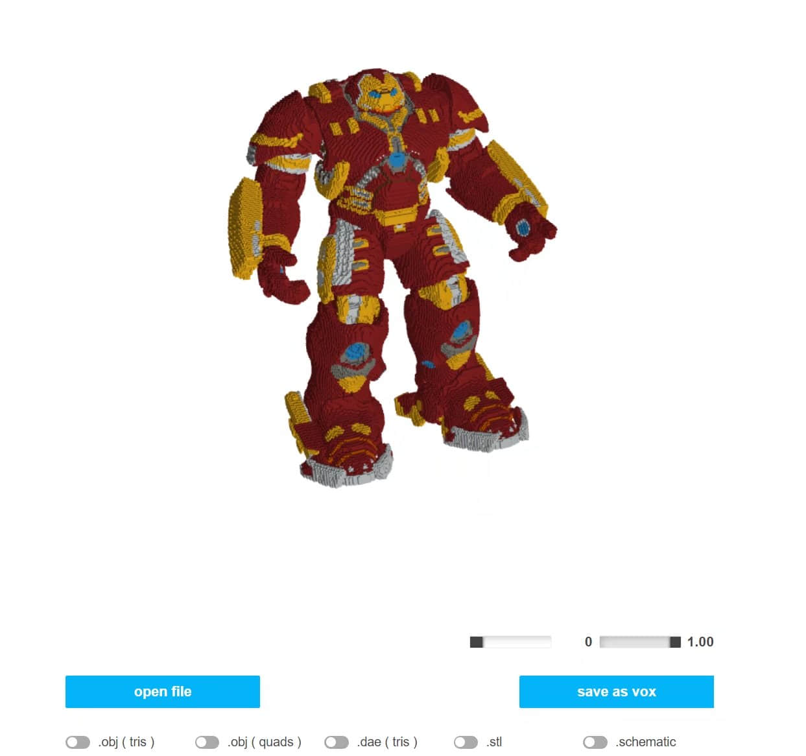

导出为.schematic文件。

之后将xxx.schematic文件，导入到路径中：

AppData\Roaming\.minecraft\config\worldedit\schematics

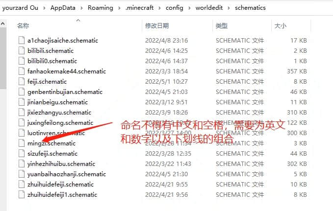

接下来使用小木斧，标记两个点或一个点。

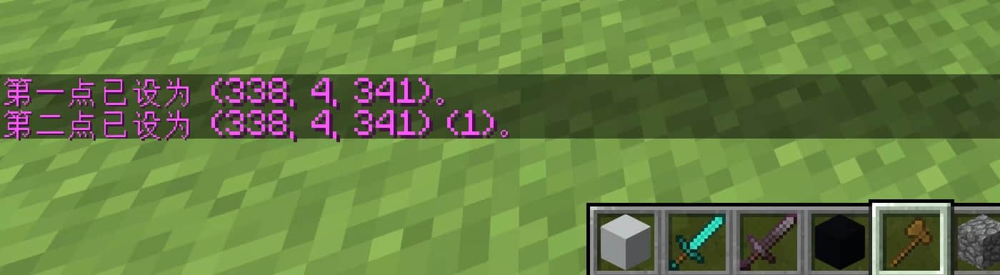

使用命令//schematic load fanhaokemake44（这里的名字是你定义的）。

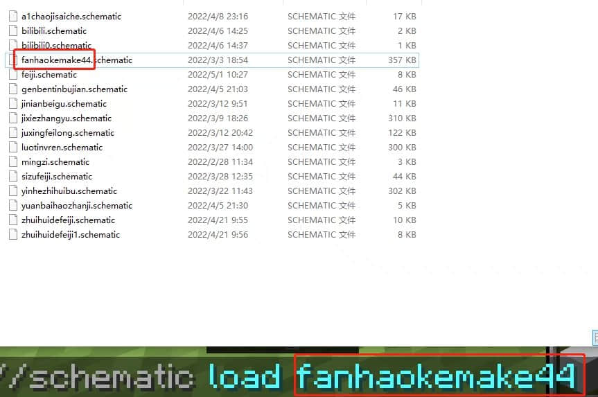

输入//paste，文件较大就等待生成。

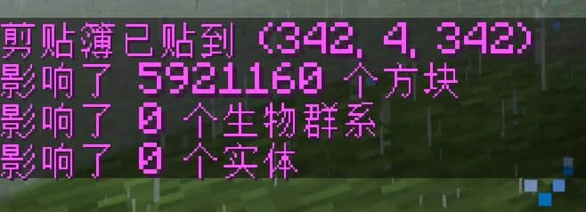

接下来我们就可以看到模型成功生成了，这区别于其他没有颜色的模型，这是支持16种颜色的。

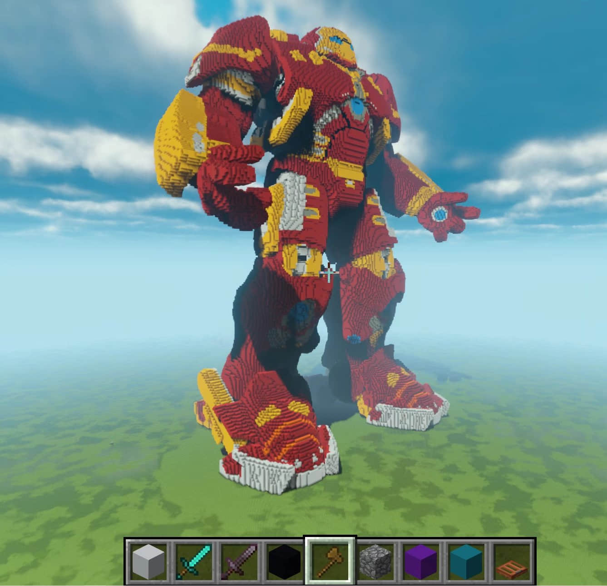

注意：在MV软件中的旋转方向会影响最终生成的旋转方向；若出现了不同于16种混凝土颜色的色彩，会被错误识别成其他方块。

在将vox导出为schematic文件那一步，需要调整生成方块的类型全部为混凝土，且没有勾选其他方块。

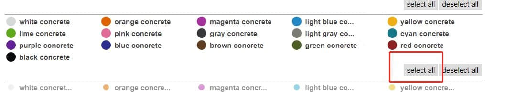

接下来就是常规的转换存档格式了，将JAVA转为基岩版网上有教程。

但要注意的是，这种方法生成的模型，全部都是空心的，并不能以此生成大规模的地形。

此方法的应用场景是服务器的大型雕塑，以及各种复杂模型的建造 **（此类模型在mc中无法直接建造，需要用建模软件）** 。

