# 自定义一个UI控件（调色盘）

> 本篇教程获得第一期知识库必看教程奖。
>
> 获奖作者：红石公司。

先来看看代码部分和具体效果：

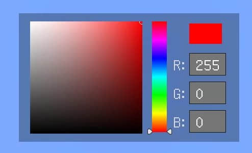

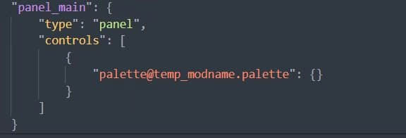

上图展示了简单的一行json配置，即可实现一个自由调节的调色板控件，其中包含滑动条、输入框、颜色选择器（按钮）等组合控件。

这是笔者做过最复杂的一个自定义控件，其他的还有： 数字输入框、虚拟摇杆、可拖动面板等。

任何你觉得以后可以用到的组合控件，都可以打包为自定义控件。

下面简单讲解一下实现方法。

## json部分

先建立一个控件库json文件，方便以后直从库中继承。

1. 调色板左侧色盘部分采用了三张图片叠加，第一层纯白、第二层是一个从左到右从透明到纯白的渐变图片，第三层是一个从上到下从透明到纯黑的渐变图片。这里第三层的渐变使用gradient_renderer渲染器实现。我们调整第二层的颜色，整个色盘就会按预想的变色。

   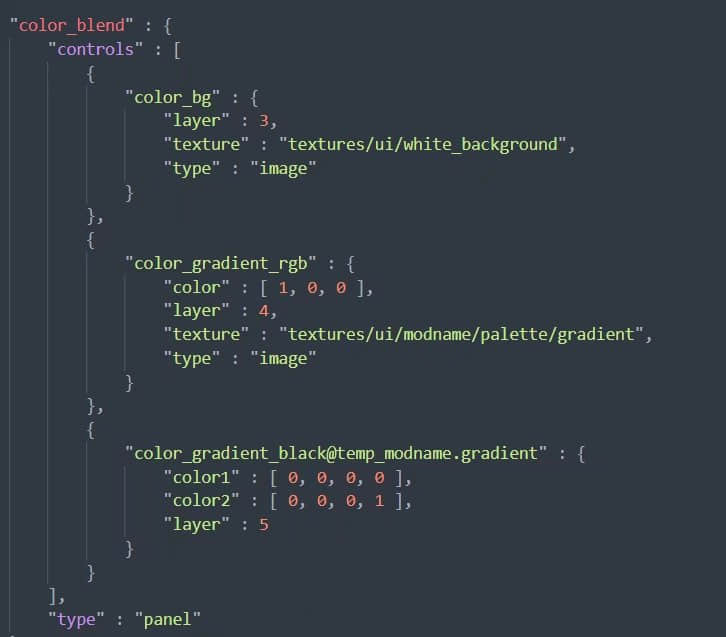

   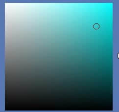

   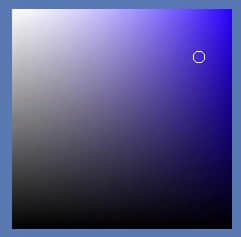

2. 颜色选择器，就是图中色盘上的圆圈。这里整个色盘的父控件是一个input_button，和button一样但是没有“default”、"pressed"等状态，是一个空白的按钮。

   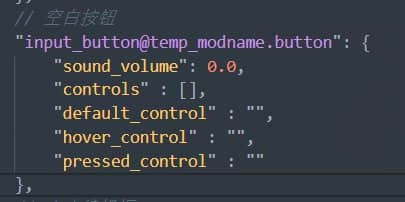

   选用按钮控件的目的是在脚本中监听move事件，然后通过事件中的坐标，改变选择器圆圈的位置，调整颜色等。

3. 色相滑动条。

   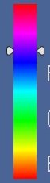

   就是这个东西，简单继承了一个滑动条控件，将背景和box改变一下样式。背景依旧采用gradient_renderer渲染器，但是是一个stack_panel下排列的6个渐变色。其中最底层选用一个空图片控件，原因是滑动条背景必须是一个图片，否则游戏报错。

   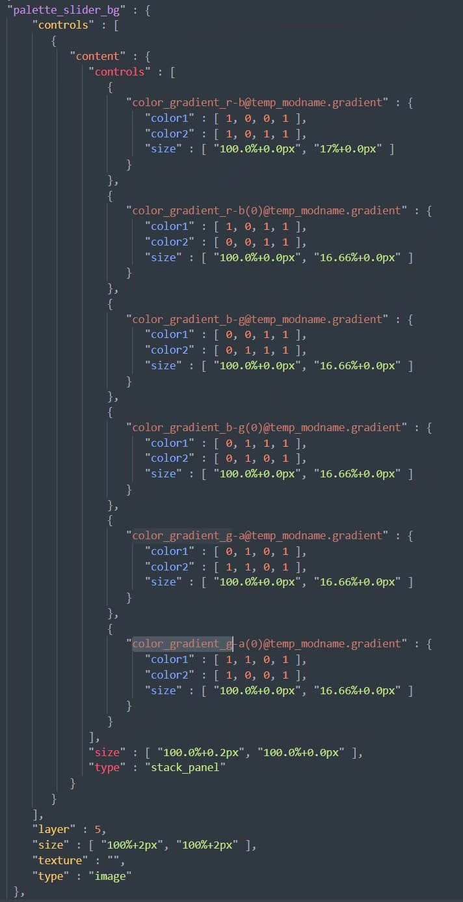

4. 颜色数字输入框。

   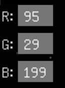

   简单堆叠三个输入框即可。

5. 颜色展示器。

   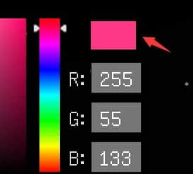

   简单的一个图片控件。以上部分组合起来就是一个完整的调色板控件了，

   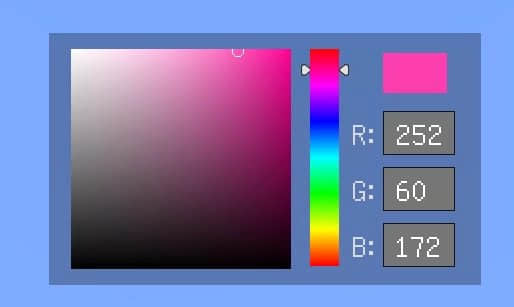

   我们在自己的json文件中继承调色板控件。

   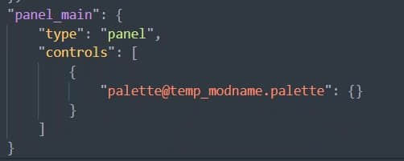

## 脚本部分

1. 即装即用。

   1. json部分：为了实现继承调色板控件后，无需多余配置，无需使用路径注册，我们要实现一个“自动扫描整个界面中的调色板控件”的功能。且需要兼容同时存在多个调色板。 但是我们无法真正的添加一个控件属性。

      我的解决方案是，在调色板控件下增加一个子控件，控件名字是一个标签。我们在脚本中遍历路径，找到标签后往上退一个路径，就是调色板的路径。

      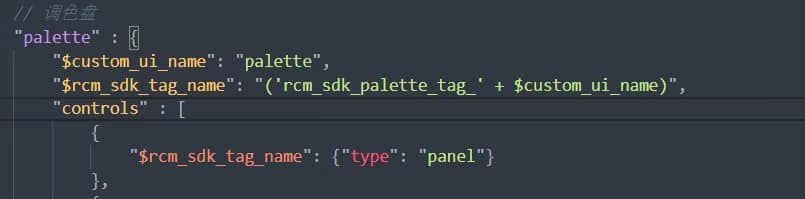

      如图所示，控件名=标签+自定义名，脚本中依靠“标签名“确认是否为调色板控件，使用“自定义名”区分同时存在的多个色板。

      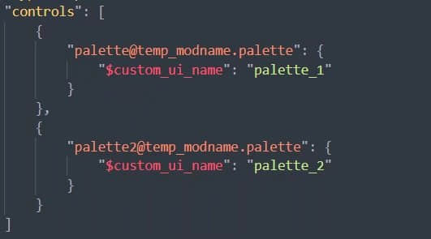

      如图所示，在实际使用过程中，配置custom_ui_name变量即可。

   2. 脚本部分：使用GetChildrenName获取子控件名字，并一层层递归下去，知道找到标签为止。这部分不过多赘述，各位多多实践，自己做出来才是最好的。不是特别大规模的UI界面，整个扫描过程不会超过20ms，基本无法察觉。但是界面中如果存在grid，最好需要过滤下。当然，标签的使用可以做到即装即用，但是也会造成额外的性能消耗，如果可以接受手动输入路径注册，那么就不需要使用标签来获取路径了。

2. 前置。
   我们要将逻辑代码封装在前置中，我们的UI类需要继承这个前置。如果你已经有其他的前置，多继承可能造成冲突，可以再加一层继承来写你的逻辑代码。如果追求代码纯净，不想用前置（像我一样），可以使用如下方式

   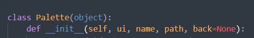

   新建一个控件类，传入UI实例，控件路径等。在这个类中编写你的逻辑代码。

3. 装饰生命周期函数。如果你的控件需要用到生命周期函数，如Create，Update等，你需要在自己的UI类中主动调用。

   即装即用又不想主动调用，那怎么办呢？
   答案是装饰器，将UI的生命周期函数装饰一下，那么如何在自定义类中装饰UI的函数呢，毕竟我不想动UI的任何代码，也不想写@符号。
   可以采用如下方式：

   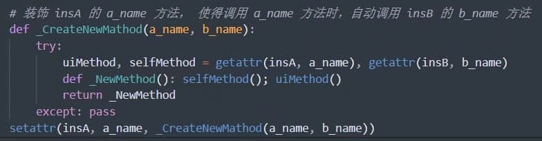

   这样，在调用a_name方法时，就会自动调用下b_name方法。

   在自定义类`__init__`时，使用此方法装饰一下必要的生命周期函数。

4. 动态创建绑定。调色板需要用到 **Slider** 和 **TextEditBox** 控件，这两个控件是需要进行绑定的。当然，可以使用Update来实时检测，但我并不想耗费这个性能。

   动态创建绑定的应用范围非常广，之前没有人公布过方法，在此我公布一下。

   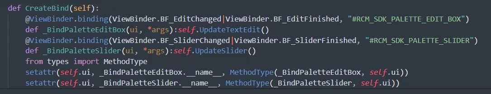

   如图，self.ui是一个UI实例，将两个函数绑定到了实例上。和在UI类中进行绑定效果相同，但是这个代码实际写在自定义类中，在`__init__`时调用。 **#RCM_SDK_PALETTE_EDIT_BOX** 和 **#RCM_SDK_PALETTE_SLIDER** 分别是UI中的文本框和滑动条绑定的变量。如果不懂绑定，可以去观察下官方demo。

5. 现在我们已经集齐所有前置条件，是时候编写逻辑代码了。

   1. 基础知识。整个调色板是HSB结构，如图所示。

      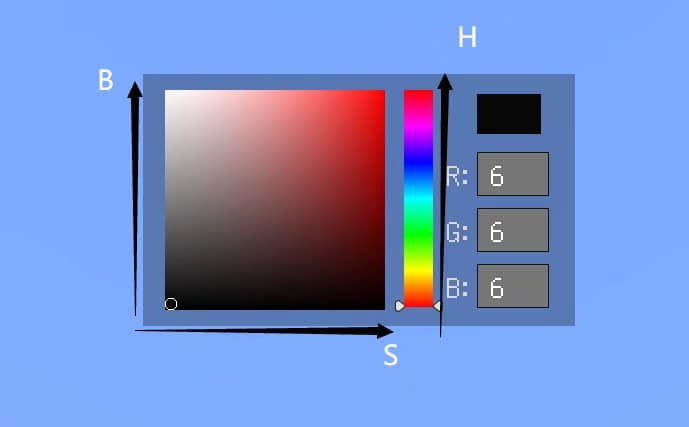

      H代表色相，S代表饱和度，B代表亮度。颜色输出、文本框显示，都是用RGB标准，那就需要堆HSB和RGB进行转换。这个大家可自行百度。

   2. 色相滑动条。当色相滑动条滑动时，滑块位置对应hsb中的H，因此，调整H后，并转换为RGB，更新色盘颜色、展示器颜色、文本框文字即可。

   3. 颜色选择器。即左边的圈圈。由于色盘底是一个按钮，我们注册按钮move事件，在事件中根据手指坐标和相对位置，计算出x轴和y轴的比例，将比例限制在0-1内，再设置圆圈位置，更新展示器颜色和文本框文字。

   4. 文本框调色。文本框输入数字时，将数字限制在0-255内，int格式。然后转为hsb，设置滑动条位置、选择器位置，再更新色盘颜色、展示器颜色即可。

   5. 颜色改变监听。自定义类中加入一个self.back变量，传入你的回调函数。在上述进行任何改变颜色的操作后，将颜色结果通知到回调函数即可。

   6. 接口拓展。GetColor、SetColor、GetVisible、SetVisible等。

## 示例结果

按I键打开和关闭界面。展示了两个互相独立的调色板，并监听了颜色变化事件。

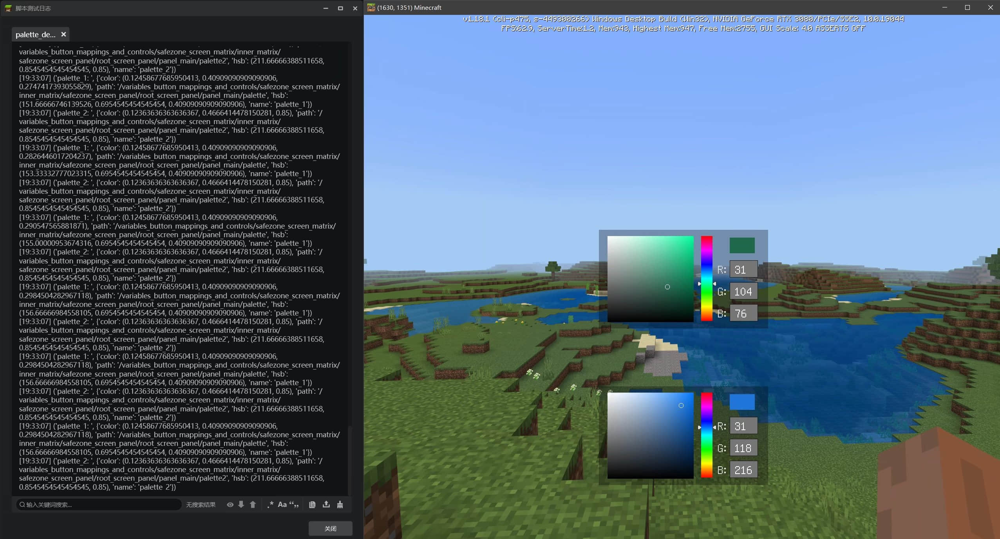

**demo只简单展示了自定义控件的实现思路，仅作为功能预览，不具备实用性。还需要各位开发者根据自己的实际情况，以及编程习惯，开发自己的自定义控件。**

本人是编程新手，也是开发新手，教程如有什么纰漏，表述不当，还请大家指出改进。

若有哪里不明白的地方，可以在评论区提问，我会及时解答的。

