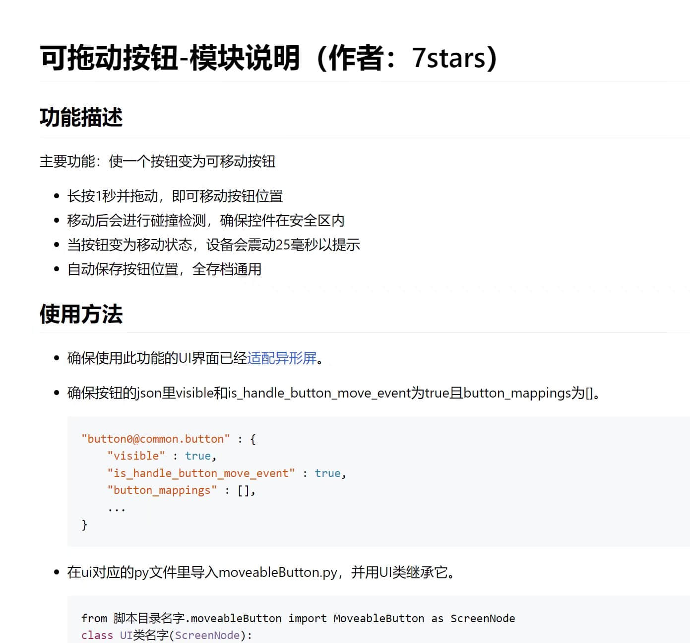
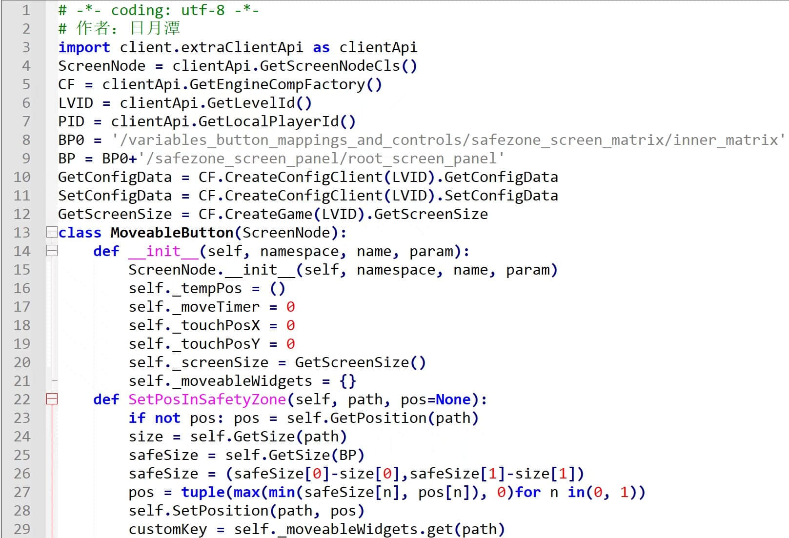

# 可拖曳按钮

> 本篇教程获得第一期知识库必看教程奖。
>
> 获奖作者：日月潭。

我制作了一个可移动按钮的模块，已经封装好了，开发者们自行继承并调用接口即可。

[下载地址](https://mc.netease.com/thread-911048-1-1.html)

1. 下载附件（解压后得到两个文件）。
2. 按照readme.html的说明做出可移动按钮。

**文档截图：**

- 网易同款风格文档，清晰易懂，排版美观流畅。

单文件71行代码，去繁从简，保证最佳性能 。

**使用本模块的前置要求：**

- 了解json格式。
- 了解UI的创建方法并创建过UI。
- 能够制作包含一个功能的小mod。

**本模块适合以下开发者：**

- 想让技能、菜单等按钮能够被玩家拖动的。
- 不太清楚按钮拖动如何实现的。
- 觉得有点麻烦，想直接使用模块的。
- 想实现更好的拖动效果，研究学习他人代码的。

无论如何，只要你需要，我的可移动按钮的模块就可以帮到你，喜欢的同学不要忘记点赞和评论哦。

