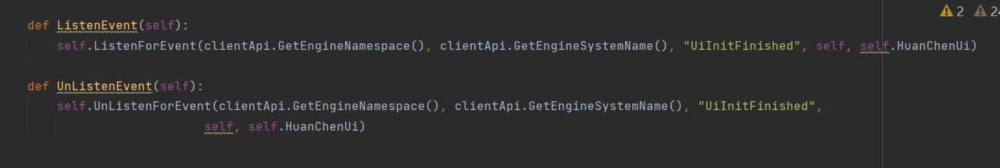
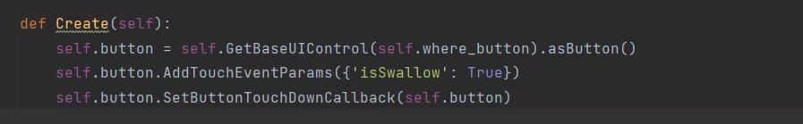

# 定义按钮并执行代码

> 本篇教程获得第一期知识库优秀教程奖。
>
> 获奖作者：幻尘Team-幻尘。

## 前言

本教程针对懂得客户端服务端事件等的Python脚本开发的萌新，以及本教程内的执行方式可能有些繁琐(大概是，大佬不喜勿喷，谢谢！)。


**学习前提：**

1. 熟悉基础的`modMain`注册、客户端`ListenForEvent`、`UnListenForEvent`的操作。
2. 掌握一点点Python语法基础。
3. 有心学习！！！还要有电脑。


## 教程开始

### 制作UI

1. 首先我们需要打开 **MCstudio编辑器** ，创建一个附加包，然后点击编辑，进入 **界面编辑器** 。

2. 如下图，我们的包体当中还不具备 **UI文件** ，因此，我们需要点击左边的按钮 **新建一个UI文件** 。

   

   


3. 接下来输入你要创建的UI文件的名称，点击创建即可。

   


4. 这时候我们可以看到左边的界面出现了 名称为 **main 的 画布** 。接下来，我们就可以在main画布的中开始创造自己的UI了！**PS：必须先选中这个main画布，在它的目录下开始创建你的UI。**

5. 选中画布之后呢，我们就可以点击顶栏的创建自己的按钮啦。

   


   之后，我们就可以看见这个令人喜悦的按钮啦。

   

   **PS：如果你需要修改按钮的位置、大小、字体、内容，均可以在右边的面板中设置（这里不过多介绍，可以自行研究）如图↓**

   


6. 那我们就拥有了一个按钮了好吧，此时我们需要创建出几个 **脚本文件：如图，关于客户端服务端的注册以及配置，我就不过多赘述，大家应该都会** 。

   


### 注册UI并且为按钮添加回调事件

1. 重点讲讲，如何注册UI。

   首先，我们创造完了UI脚本文件，注册配置好了客户端等。我们选择先打开客户端脚本文件，在`ListenForEvent`以及`UnListenEvent`中分别监听和反监听 **`UnInitFinished` 事件，用于接下来的创建、注册UI**  。

   


   


2. 这时候监听完毕之后呢，我们就可以使用这个`UnInitFinished`事件来注创建UI了。

   首先输入如图所示中的第一行代码。

   ```python
   clientApi.RegisterUI("Script_HuanChen6", "HuanChenUi", "Script_HuanChen6.uiScript.HuanChenScreenNode6.HuanChenScreenNode6",
   "HuanChenUi.main")
   ```

   我们来解释一下，第一个参数指的是，你的MOD的名称。第二个参数呢是UI的名称，第三个参数呢是UI文件的路径。第四个参数呢是ui名.画布。

   


   注册完毕之后呢，我们可以开始 注册按钮并且为按钮添加回调了。

3. 打开ui文件，进入之后，我们在Init中声明两个变量，一个是用来代表按钮的变量，一个是表示按钮路径位置的变量。PS：按钮的路径只需要在界面编辑器中选中按钮，然后右键，你就会看见一个复制路径的选项，点击即可复制路径。

   


   


4. 接下来，我们在UI文件中的`Create`中。输入这些代码：

   ```python
   self.button = self.GetBaseUIControl(self.where_button).asButton()
   self.button.AddTouchEventParams({'isSwallow': True})
   self.button.SetButtonTouchDownCallback(self.button)
   ```

   也是无脑照抄就行趴，`self.button`就是我们之前声明的一个用来表示按钮的变量。

   


5. 输入好之后，我们在下面直接def一个函数。为按钮的回调事件添加逻辑代码吧！

   


PS：可能讲的有些急促，有些许纰漏，大佬们不喜勿喷吧嘤嘤嘤。

大功告成啦！！！

