# UI按钮的注册与创建

> 本篇教程获得第二期知识库必看教程奖。
>
> 获奖作者：大肥免。

本教程将默认您已经学会了python的基础语法和ModAPI接口的使用，教程实现的功能为点击按钮实现更换昼夜。

1. 我们首先在界面编辑器中创建一个ui文件，取名由你们自己命名，我这里就叫`uiCourse`了。此时，UI的命名空间就为你所输入的文件名称了，我的就是`uiCourse`，一定要记住，下面会用到。

   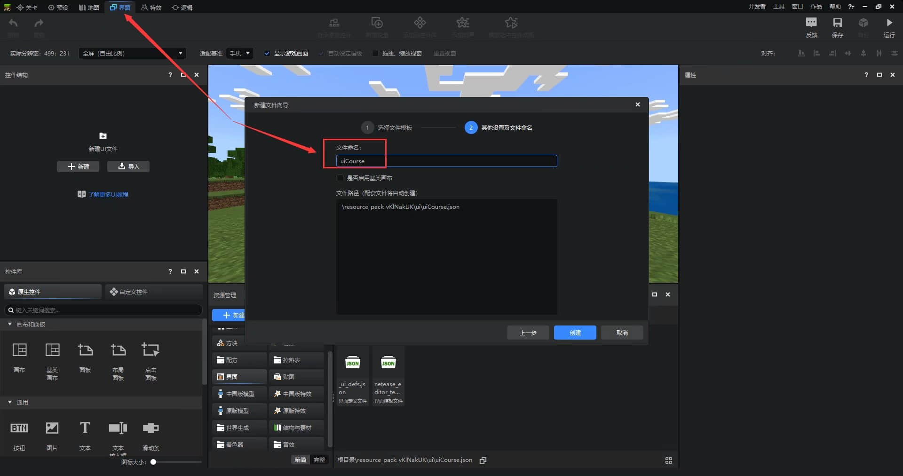

2. 再创建一个如图所示的控件结构，按钮控件的文本内容为 **切换昼夜** ，此时，我们的界面布局也就好了，这时你打开游戏测试会发现，我们创建的按钮不会显示？这是因为你的UI还没有注册和创建。

   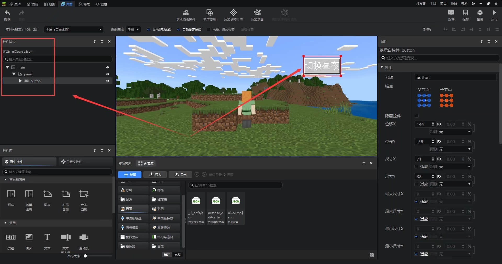

3. 在行为包(behavior_pack)中创建一个名为"uiCourseScripts"的文件夹，命名可以随便修改，但是文件末尾的Scripts必须有。

   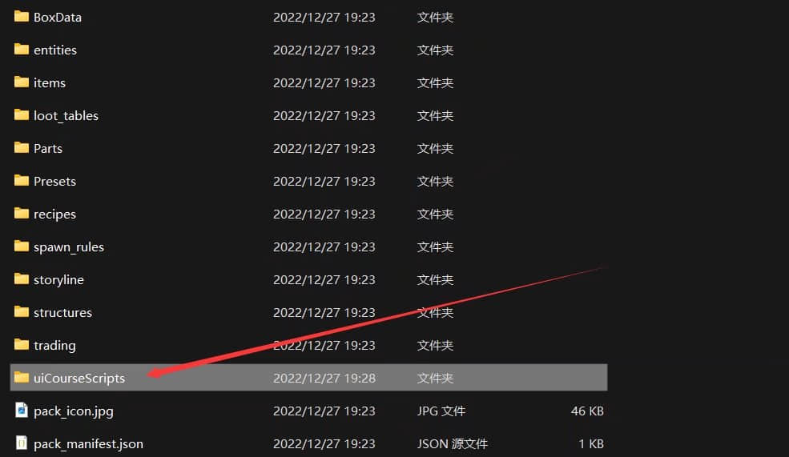

4. 然后，我们再创建一个名为 **uiScript** 的文件夹，用来存放我们的ui脚本，ui脚本里的py文件可随便命名，但必须有一个`__init__`文件，它用于标识当前文件夹是一个包。

   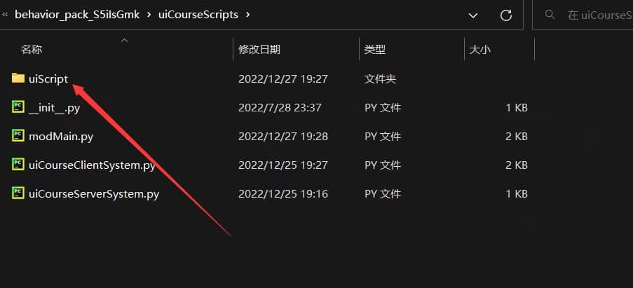

   打开我们创建的ui脚本文件，新定义一个uiCourse类，并继承ScreenNode后留在这备用。

   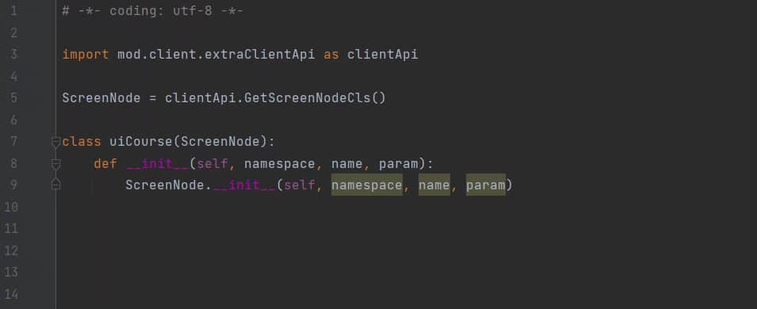

5. 打开我们的客户端py文件，监听"UiInitFinished"事件，它会在UI初始化框架完成时调用，这时我们就可以注册和创建UI了。

   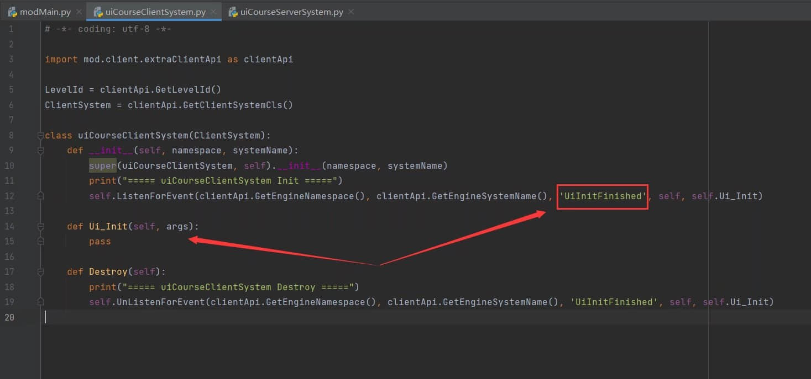

6. 使用我们的"RegisterUI"接口，来注册我们的UI。

   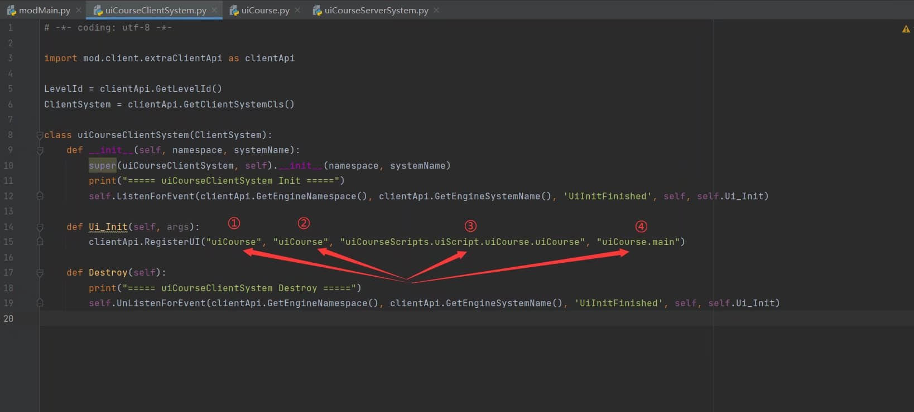

   其中，这四个参数分别对应的是：

   1. py脚本的命名空间。
   2. UI的唯一标识符，也就是UI的命名空间。
   3. UI脚本中类的路径。
   4. UI中画布的路径。

   首先，py脚本的命名空间在`modMain`文件里写了，如图所示：

   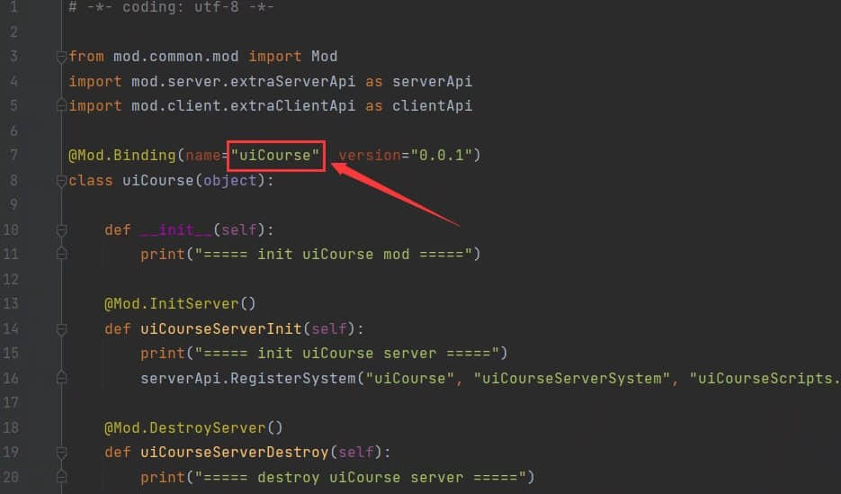

   UI的唯一标识符就是我们上面设置的ui文件名，填在这里就可以了，UI脚本中类的路径也就是 py脚本文件夹-ui脚本文件夹-ui文件-ui类 最终指向它的。

   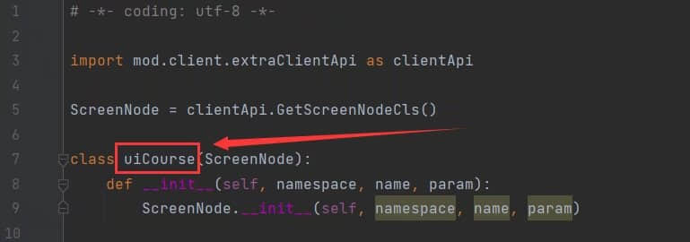

   UI中画布的路径为UI唯一标识符.想打开的画布名称，即为这两个值。

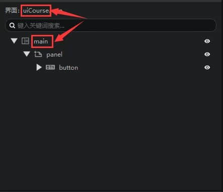

   此时我们的UI注册接口就写好了。

7. 接下来写UI创建接口，我们使用`CreateUI`接口来创建。

   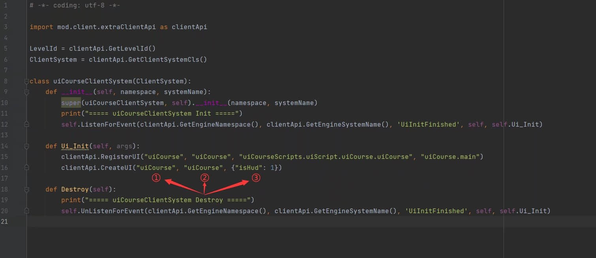

   其中，这四个参数分别对应的是：

   1. py脚本的命名空间。
   2. UI的唯一标识符，也就是UI的命名空间。
   3. 创建UI的参数，isHud即为是否为HUD界面的UI，设置为1时，不会屏蔽原生的操作界面，设置为0时，将会屏蔽除了本UI外的所有操作界面 。

   设置完成后，我们的创建UI接口也就编写完成了，打开游戏看看吧。这时你就会发现按钮显示出来了。

   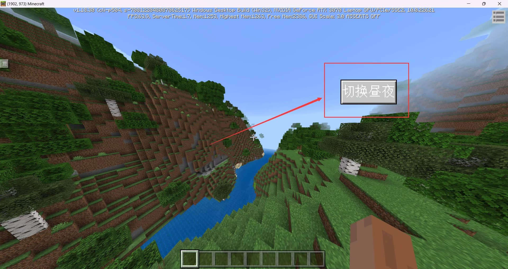

   但是为什么点击没有反应？这是因为你还没有写按钮的回调。在我们之前创建的UI脚本文件里，创建`Create`函数，它会在UI创建成功时调用，使用`GetBaseUIControl`接口根据路径获取UI实例，再使用`AddTouchEventParams`控件开启按钮回调功能来添加按钮的回调。再使用`SetButtonTouchDownCallback`控件设置按钮按下时触发的回调函数。

   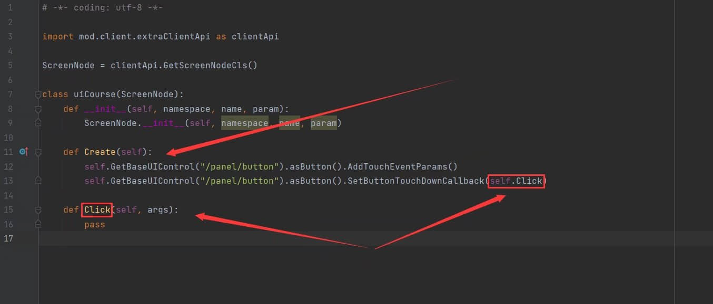

8. 使用按钮按下时触发的回调函数，来通信服务端，修改昼夜时间NotifyToServer接口的用法具体见官方文档。

   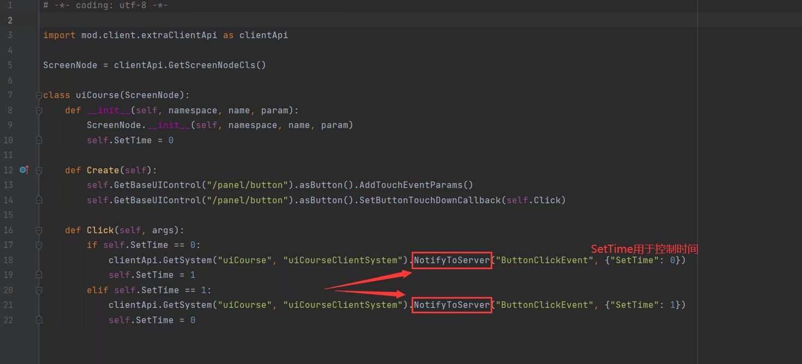

   服务端再监听UI脚本的回调即可，再使用更改当前世界时间的接口来实现昼夜更替。

   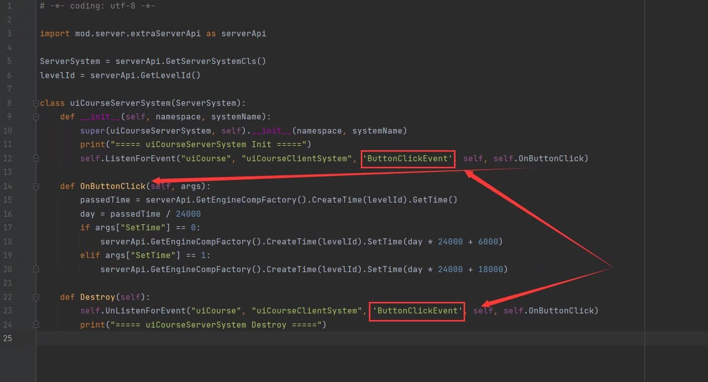

此时，我们的点击按钮实现更换昼夜的功能就实现了。

<iframe frameborder="0" height="600" width="800" allowfullscreen="allowfullscreen" src="http://cc.163.com/v/core/externplayer/63e373b4308c57165bcfd298"/>

如果觉得本教程对你有用的话，可以帮忙点个赞吗？谢谢。