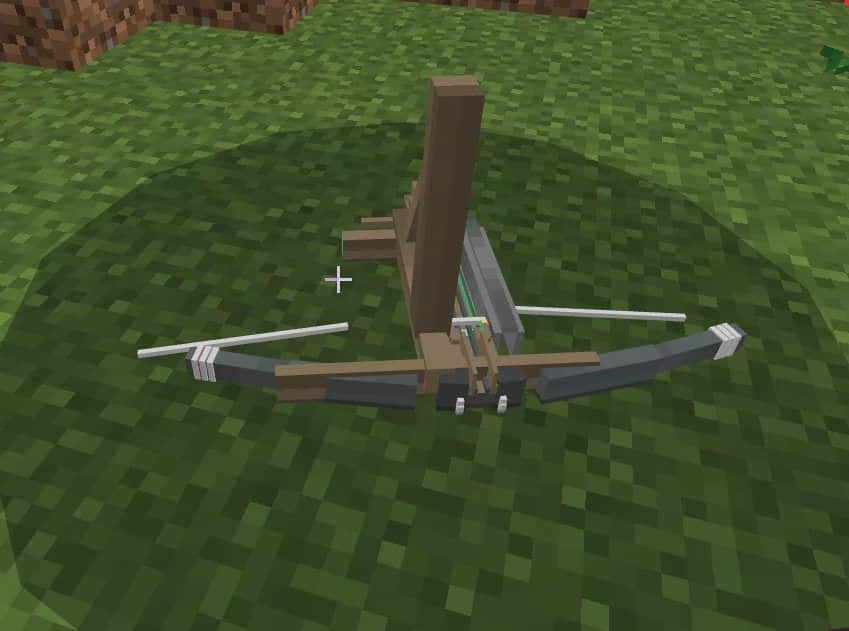
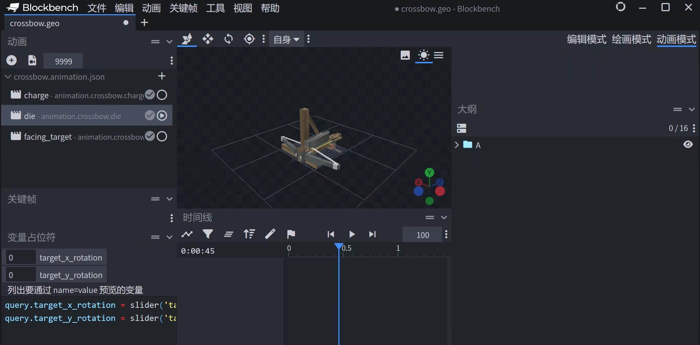
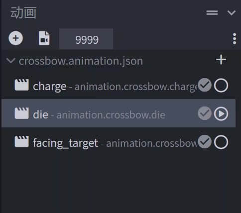
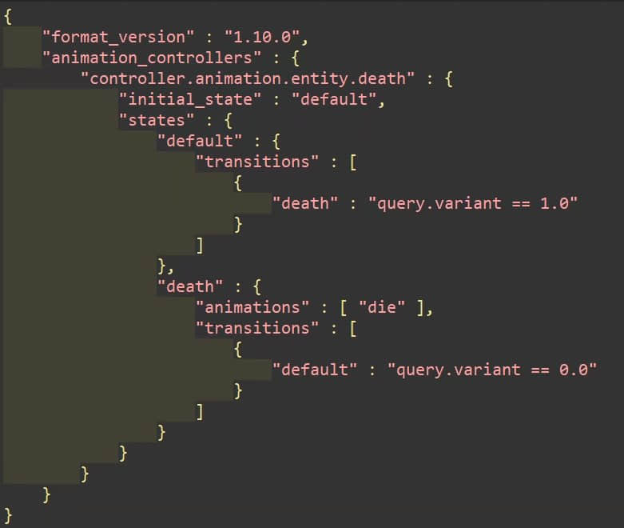
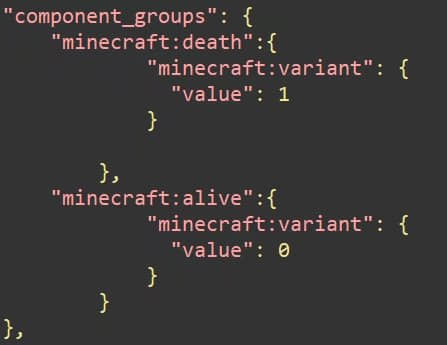
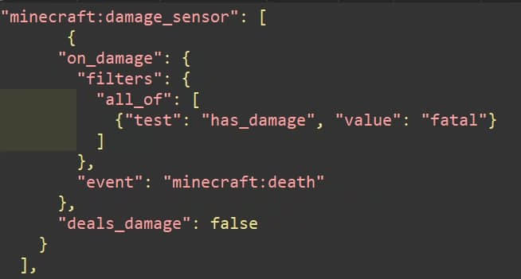
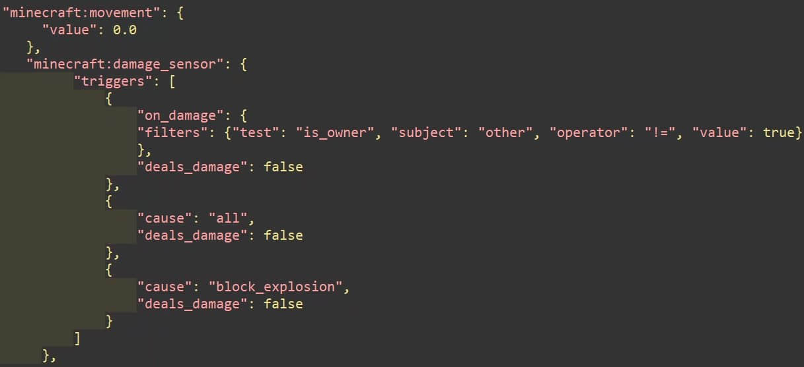
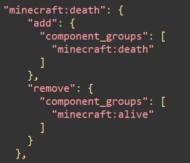
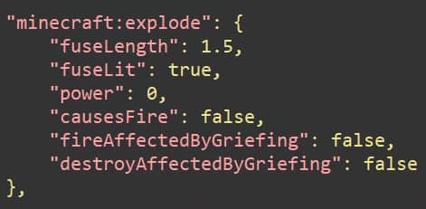

# 制作生物死亡动画

> 本篇教程获得第一期知识库必看教程奖。
>
> 获奖作者：艾诺德。

今天的教程将教各位开发者制作实体死亡动画。这项技术经常被应用于包含动作优化/Boss生物的模组中。

**教程概述：**

主要功能：在实体死亡时播放自定义死亡动画。

实现步骤：

- 检测实体死亡。
- 实体死亡时替换原版动画。
- 动画播放完成后清除实体。

**学习本教程的前置技术要求：**

- 了解json语法格式。

- 了解生物行为代码并能熟练自定义 **component_groups** 和 **events** 中的内容。

- 会使用生物动画控制器且会制作原版生物动画。

**让我们先看看最终效果：**

如下图所示，连弩实体死亡时并没有和原版一样表现出全身泛红倒下，而是播放了我们自定义的死亡动画。

首先我们需要在BlockBench内制作一个生物死亡动画。

**注意：**

1. 该动画必须是循环播放。

2. 无论你实际的动画时长多少，你都需要将该动画时长设置为999（见下图所示）（毕竟我们不想看见生物反复去世对吧）。

   

3. 该动画可设置"override_previous_animation"，设置后可避免生物死亡后在播放动画时发生位移而同时播放行走动画产生诡异的效果。

在准备工作完成后，我们先制作动画控制器（代码如下图所示） 。

由于实体死亡并没有提供molang，因此我们使用`query.variant`进行自定义的死亡状态判定。

**在将动画控制器及动画挂载到entity文件中后材质包中的工作就算完成了。**

接下来我们开始编写实体的行为文件。首先我们需要在`component_groups`创建`death`和`alive`两个group，根据动画控制器里的条件，我们需要将两个组的`variant`分别设置为1和0。核心部分代码如下图所示：

为了判定生物死亡，我们需要在`alive`组里加入如下代码：

该代码会在生物受到致命伤害时执行`event`中定义的`minecraft:death`事件，同时阻止最后一次伤害，从而达到屏蔽实体原版死亡动画的效果，同时为了防止实体在死后仍受到伤害/移动，我们需要在`death`组中加入如下代码：

完成上述步骤后我们需要在`event`中添加如下代码实现状态的转换：

由于实体进入死亡状态后将进入无敌状态，在正常状况下很难让它消失，因此需要在`death`组中添加如下代码移除实体：

上图所示代码将执行一个无破坏力的自爆对实体进行清除，1.5为延迟时间，我们可以将时间调为和死亡动画实际所用时间相同的值以达到播放完动画清除实体的性格，也可以设置更多时间让实体停留一段时间。

最后我们只需要在alive组中添加实体行为代码(如攻击、仇恨目标、行走等，但如`minecraft:health`和`minecraft:physics`等实体基本属性组件需要添加在`components`中，并在`components`中设置`variant`为0就大功告成了！感谢大家的阅读。

