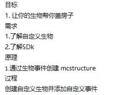
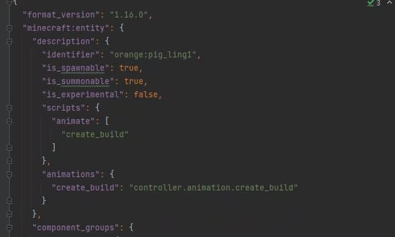
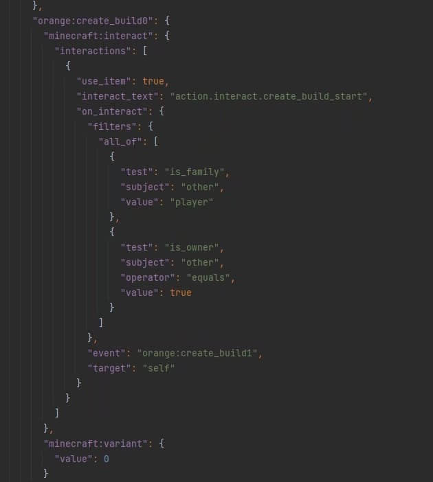
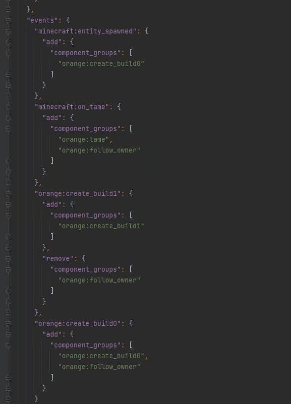
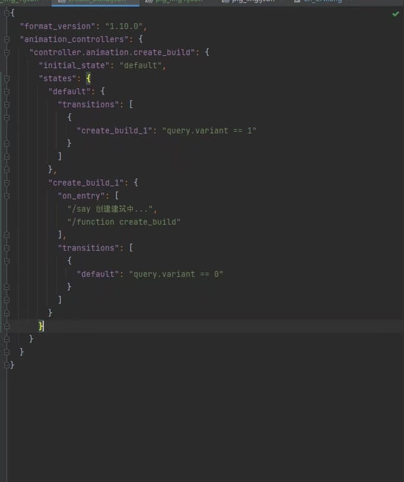
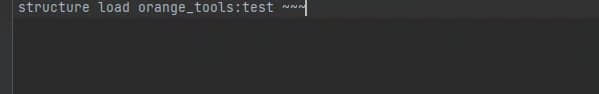

# 生物生成建筑

> 本篇教程获得第一期知识库必看教程奖。
>
> 获奖作者：橘子气泡水。

**效果图**

**效果视频**

<iframe frameborder="0" height="600" width="800" allowfullscreen="allowfullscreen" src="http://cc.163.com/v/core/externplayer/63e38f8529279d2f4acfc1bb/"/>

**目标**

**结构位置**

**动画控制器**

**Function**

这样你就可以让你的猪帮你把房子盖好了。