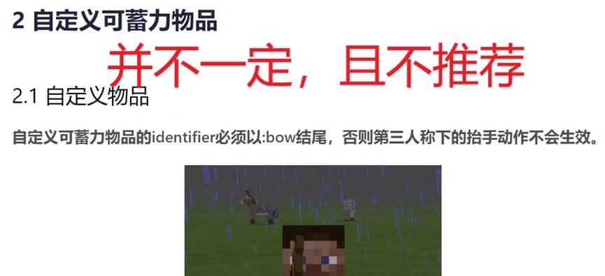
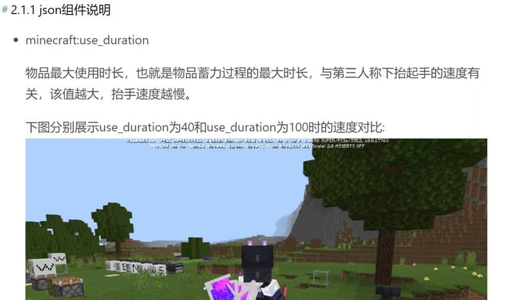
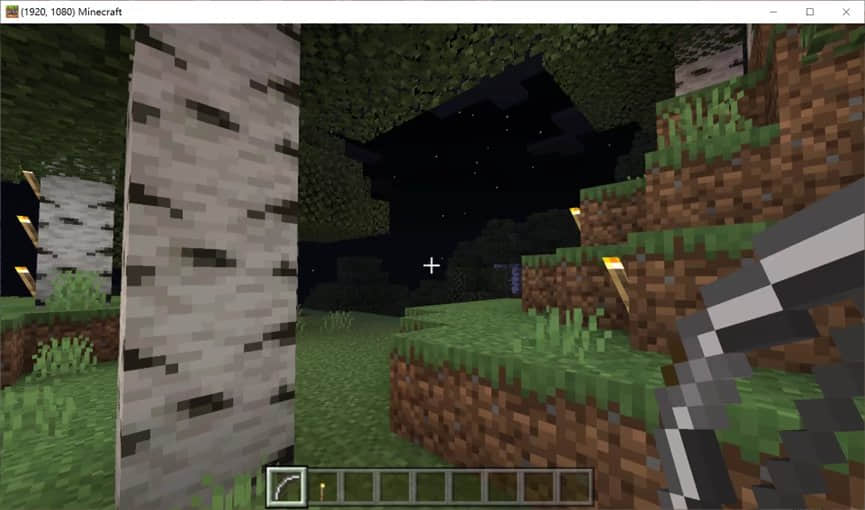
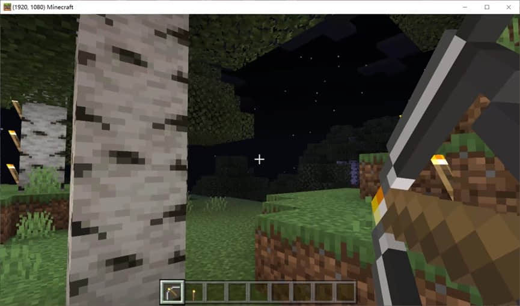
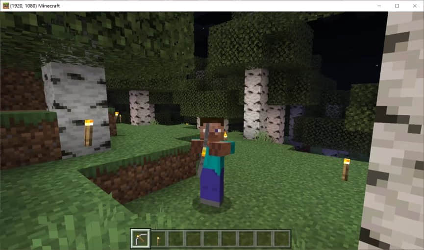

# 自定义弓使用原版弓的动画

> 本篇教程获得第一期知识库必看教程奖。
>
> 获奖作者：日月潭。

开发者按照网易方法自定义远程武器后，会发现物品不像原版弓一样能够有拉弓+微微颤抖的动画，事实上让你的弓使用原版动画十分容易。

如何在自定义远程武器这里就不再赘述，在本期中，我们会聚焦如何 使用原版JSON附加包 及 模组SDK 的方式来让你的弓使用原版动画。想要催更或加码的小伙伴们，请不要吝啬自己手中的点赞和评论，欢迎您们在开发角下方分享你们的收获与灵感。

**阅读本章的前置要求：**

- 了解json数据的格式。
- 知道怎么监听事件，以及客户端和服务器之间通信。
- 能够按照网易教程添加自定义物品。


**在本章你将掌握：**

- 让你的弓使用原版弓的动画。


打开《我的世界》开发工作台，首先新建基岩版组件，我们选择空白Addon，生成一个新的项目并启动编辑。

按照教程[自定义远程武器](https://mc.163.com/dev/mcmanual/mc-dev/mcguide/20-%E7%8E%A9%E6%B3%95%E5%BC%80%E5%8F%91/15-%E8%87%AA%E5%AE%9A%E4%B9%89%E6%B8%B8%E6%88%8F%E5%86%85%E5%AE%B9/6-%E8%87%AA%E5%AE%9A%E4%B9%89%E8%BF%9C%E7%A8%8B%E6%AD%A6%E5%99%A8.html?catalog=1)来自定义你的远程武器。

自定义时，要注意三点：第一点，弓的ID可以随意写，但要足够个性化防止冲突。

因此，不推荐参考官方教程的以下部分：




第二点，`minecraft:use_duration`应该设为72000（也就是一小时，因为1秒对应20帧），而不是40，100这些。


因此，不推荐参考官方教程的以下部分：




那么什么时候需要这种较小的数字呢？use_duration决定了长按屏幕时物品序列帧播放时间，因此在我们今天的条件中，它最小也得是20（即1秒），如果太短，序列帧还没播放完，物品的使用时间就到了。

物品的使用时间到了之后，如果玩家还在右键或者长按屏幕，那么会再次触发`ClientItemTryUseEvent/ServerItemTryUseEvent`事件，并再播放序列帧。所以如果你要做连发武器配序列帧，这个数字就可以决定你武器的射速。

第三点，你并不需要配置`minecraft:use_animation`和`netease:render_offsets`。

按照以上三点，结合网易教程做好自定义弓后，就可以给他上原版动画了。

资源包下新增attachables文件夹，在里面新增一个json文件。json文件内容如下：

```json
{
    "format_version":"1.10.0",
    "minecraft:attachable":{
        "description":{
            "identifier":"sevenstars:torch_bow",//这里换成你的物品id
            "materials":{
                "default":"entity_alphatest",
                "enchanted":"entity_alphatest_glint"
            },
            "textures":{
                "default":"textures/items/sevenstars_torch_bow_standby",//未拉弓时的物品贴图
                "bow_pulling_0":"textures/items/sevenstars_torch_bow_pulling_0",//拉弓贴图1
                "bow_pulling_1":"textures/items/sevenstars_torch_bow_pulling_1",//拉弓贴图2
                "bow_pulling_2":"textures/items/sevenstars_torch_bow_pulling_2",//拉弓贴图3
                "enchanted":"textures/misc/enchanted_item_glint"
            },
            "geometry":{
                "default":"geometry.bow_standby",
                "bow_pulling_0":"geometry.bow_pulling_0",
                "bow_pulling_1":"geometry.bow_pulling_1",
                "bow_pulling_2":"geometry.bow_pulling_2"
            },
            "animations":{
                "wield":"animation.bow.wield",
                "wield_first_person_pull":"animation.bow.wield_first_person_pull"
            },
            "scripts":{
                "animate":[
                    "wield",
                    {
                        "wield_first_person_pull":"query.main_hand_item_use_duration > 0.0f && c.is_first_person"
                    }
                ]
            },
            "render_controllers":[
                "controller.render.bow"
            ]
        }
    }
}
```

按照上面json文件里的注释，把物品id和四张图片修改成自己的，进游戏就能看到效果了。

为什么这么写就可以呢？首先，只要手中物品的名字等于`attachables`的json里的identifier，我的世界就会自动把手持物品换成上面json里的模型，并使用上面定义的贴图，以及动画和渲染控制器等。因为`controller.render.bow`里是按照`use_duration`来切换上方`geometry`里的模型，从而做到拉弓动画的，所以我才说`minecraft:use_duration`不应该小于20，不然它都来不及切换到最后一个模型。因此如果你的弓不是连发，请将它设为72000保持和原版弓一致。

如果物品栏里的序列帧可以播放的再快点，我们就可以自己写一个渲染控制器代替`controller.render.bow`，来让模型的切换和物品栏序列帧保持同步，问题就是`netease:frame_animation`这个json接口只能慢速播放，它不能自定义播放帧率，因此目前用这种方法实现的最快射速只能是1秒一下。

然后，我们配置第三人称拉弓动画。要做到第三人称的动画同步，需要做两件事，在客户端监听`AddPlayerCreatedClientEvent`事件，这样就能知道客户端加载了任意玩家，在回调函数里写入如下代码，并按照里面中文部分的要求，替换字符串即可。

```python
comp = clientApi.GetEngineCompFactory().CreateActorRender(args['playerId'])

comp.AddPlayerAnimation('在这里填写一个英文id，要保证个性化防止冲突', 'animation.player.bow_equipped')

comp.AddPlayerAnimationIntoState('root', 'third_person', '对应上面填写的id', "query.is_item_name_any('slot.weapon.mainhand', '这里填写你的弓id，我的是sevenstars:torch_bow') && (variable.item_use_normalized > 0 && variable.item_use_normalized < 1.0)")
```

**最后效果如图：**









