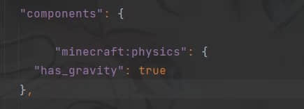
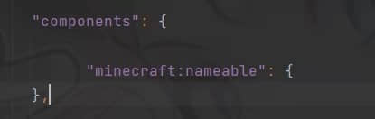
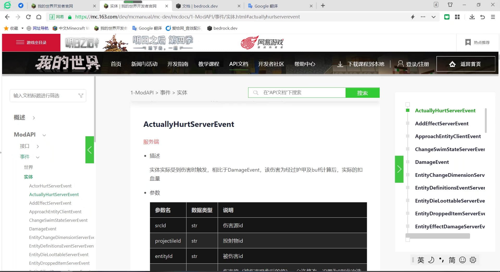
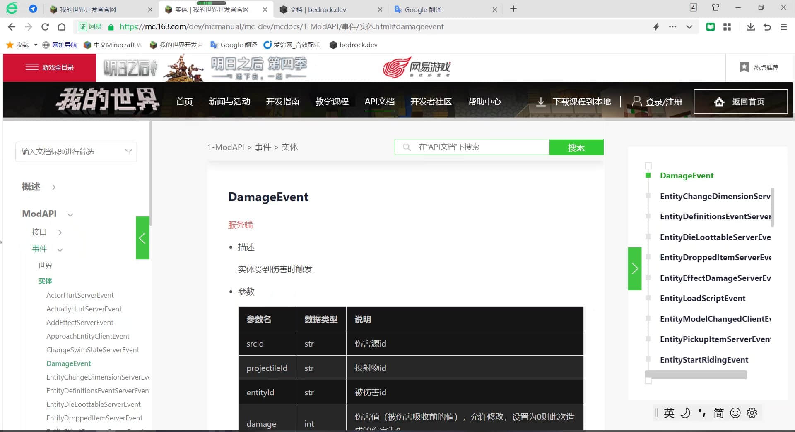
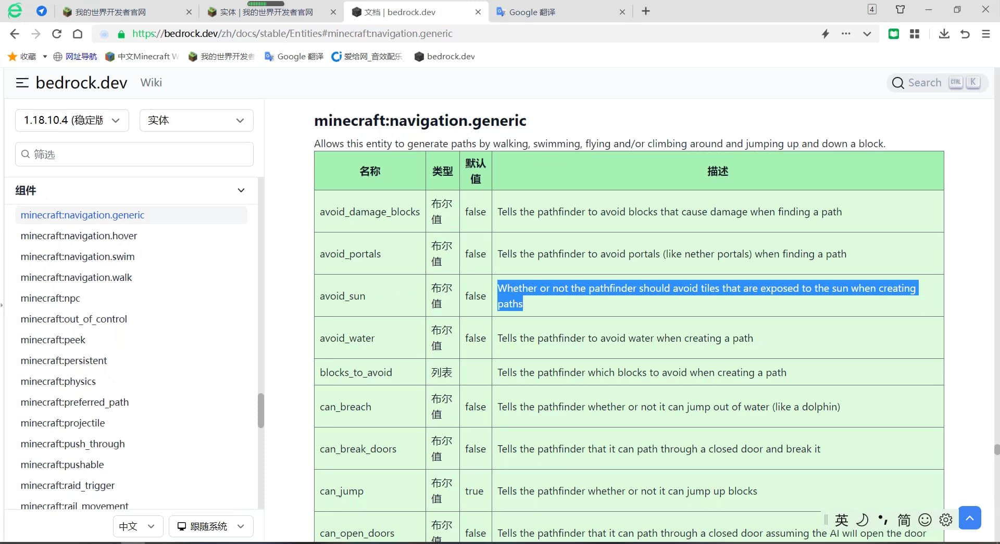

# 生物的简单小知识

>本篇教程获得第一期知识库优秀教程奖。
>
>获奖作者：素笺淡墨。

1. 你的生物受到攻击后会飞上天是因为你没有在这个生物组件里面定义重力。

   

2. 你的生物无法被命名牌命名或者使用`SetName`没有效果，是因为你没有在组件定义这个行为。

   

3. 我们都知道用这个方法可以取消实体受到的伤害。

   

   但是，你会发现实体还是会变红。这个时候我们需要用这个方法来取消：

   

   这样子就能完美的取消伤害并且生物也不会有任何的变红效果。

4. 关于生物更多的json行为，随便找到一个原版生物。可以使用图中的网站进行搜索。原版生物的组件名字，如果看不懂英文可以像我一样使用谷歌翻译。

   

   如果看不懂英文可以像我一样使用谷歌翻译。如果网站里面没有对应的组件名字，可以直接把组件名字放到谷歌翻译里面，自己结合上下文看一看。

