# 手把手教你制作网易模组更多弓

> 本篇教程获得第二期知识库必看教程奖。
>
> 获奖作者：沦陷的王国-某只苦力怕。

## 开头的话

大家好！我是某只苦力怕！今天给大家带来更多弓模组教程！！！现在这个模组在网易为免费模组，截止2022年12月20日下载量为202813，为什么这个看起来很简单的模组会有这么高的下载量呢？今天就让我来给大家从0开始教大家做这个模组， **有不足之处欢迎指正** 。

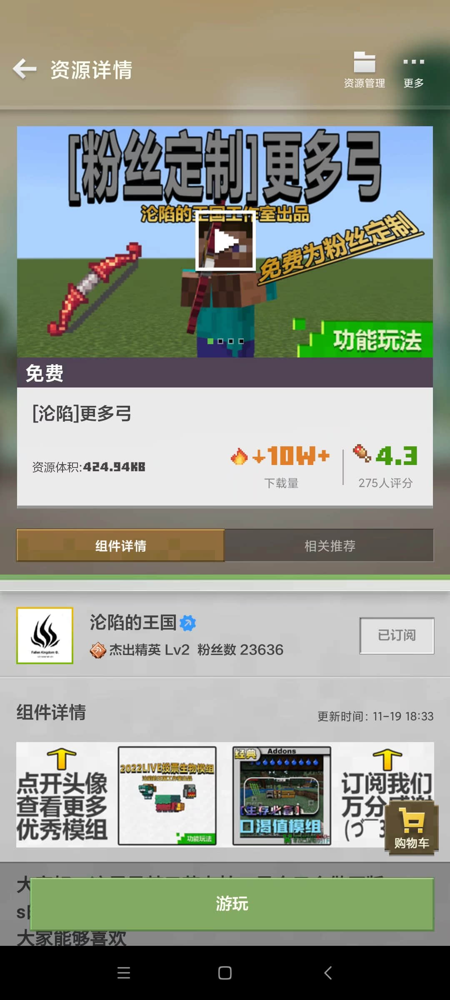


首先是图片贴图，我在某个游戏素材平台下载到了下面这张图片。

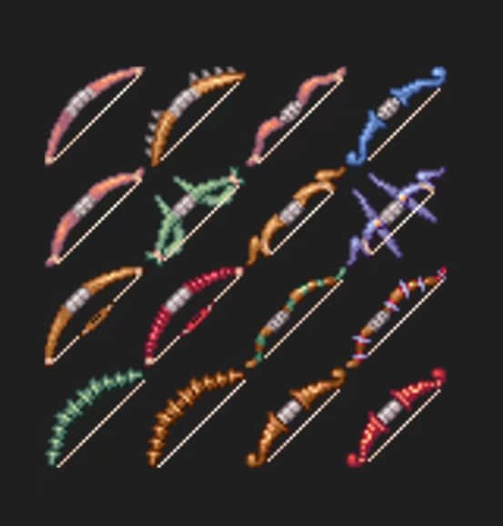


然后用texturepackerGUI这个软件把这张图片处理一下，变为大小一样的多张贴图。


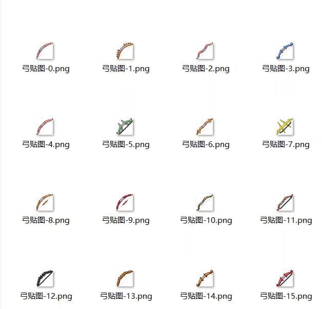


然后再打开ps，这里我直接用了个很笨但很方便的方法，手动选择像素点然后分成新图层，最后我们得到我们要的贴图，一张不带箭、弦不动的贴图和三张不同时期带箭、时长越久弦拉越长的贴图。

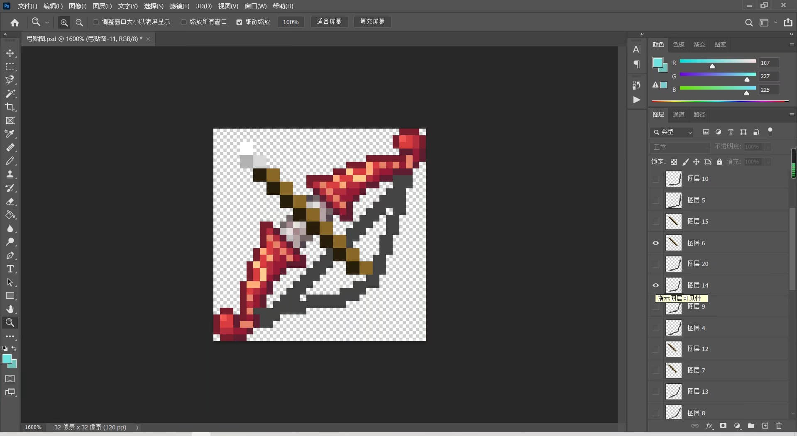


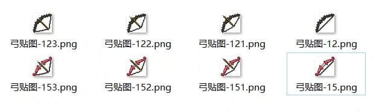


然后打开我的世界编辑器(mcs)，点击页面左侧栏里的内容库，点击作品模板，下载自定义远程武器，然后导入，打开编辑 。

导入所有贴图。

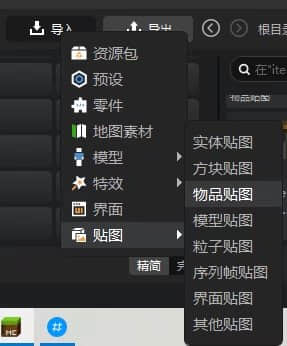


## 物品设置

模板自带3个物品，三叉戟弓弩、弓、苹果箭，我的自定义弓用的是原版箭，那就直接用这个弓就行，点击精简分类里的物品，鼠标移动到其中一个json文件上面不点击，然后看到它会说明这个是物品行为包配置文件还是物品资源包配置文件，先对一个物品行为包配置文件右键，再点（打开文件所在位置），文件夹里中间这个文件customrangedweapon_bow.json就是我要的，其他删掉。

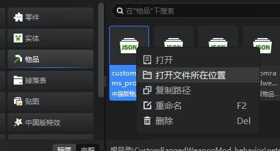


但他还是不够完整，我们用Visual Studio Code（vsc）打开，然后修改一下identifier，改为自己能记得住的物品id，后面的（：bow）要留下，我改为`zcbdg:bow`，筑创冰冻弓的拼音缩写，再增加`minecraft:use_duration`和`minecraft:use_animation`这2个物品组件，前者是使用物品的最大时长，后者是定义这个物品被使用时要使用bow这个动画，下图左边为我模组里的文件，右边为模板里的文件。

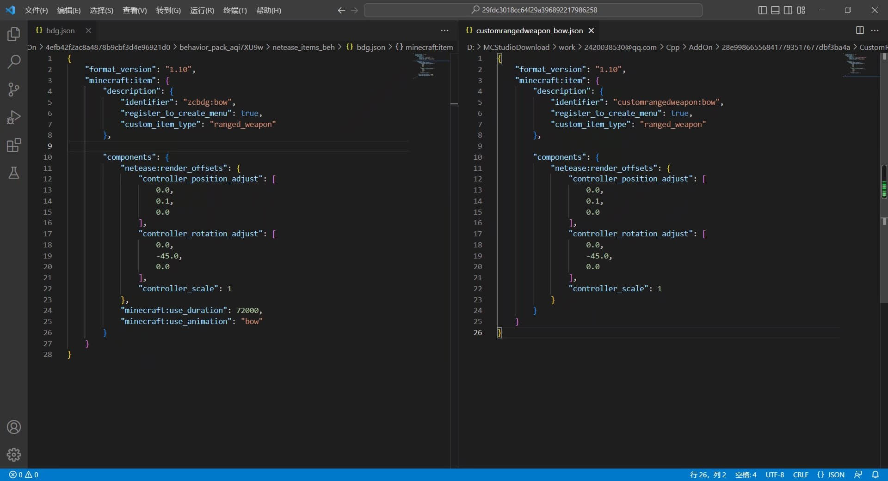


然后自己要做几个物品就复制几份，修改文件名称和对应文件里面的identifier。

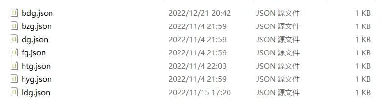


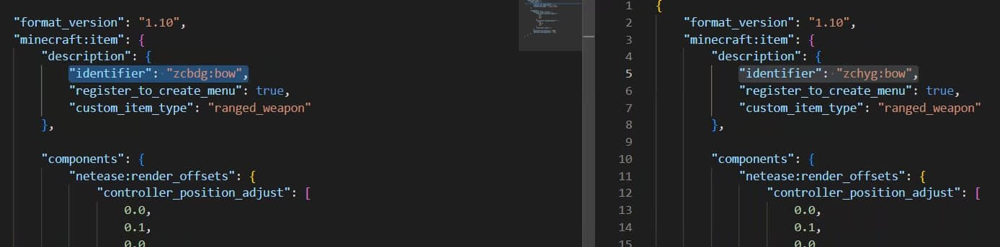

再用同样的方法对一个物品资源包json文件右键，打开文件所在位置，一样是中间那个文件，修改一下identifier，下图左边为我模组里的文件，右边为模板里的文件。

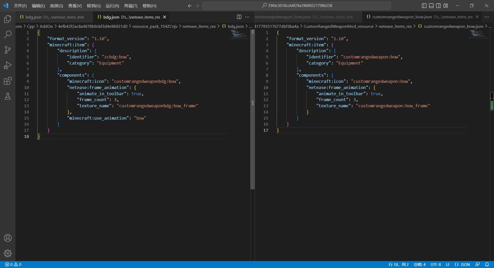

物品行为包json和物品资源包json文件的identifier一样的话，2个文件就绑定在一起，然后几个物品复制几份，每份都要改identifier。

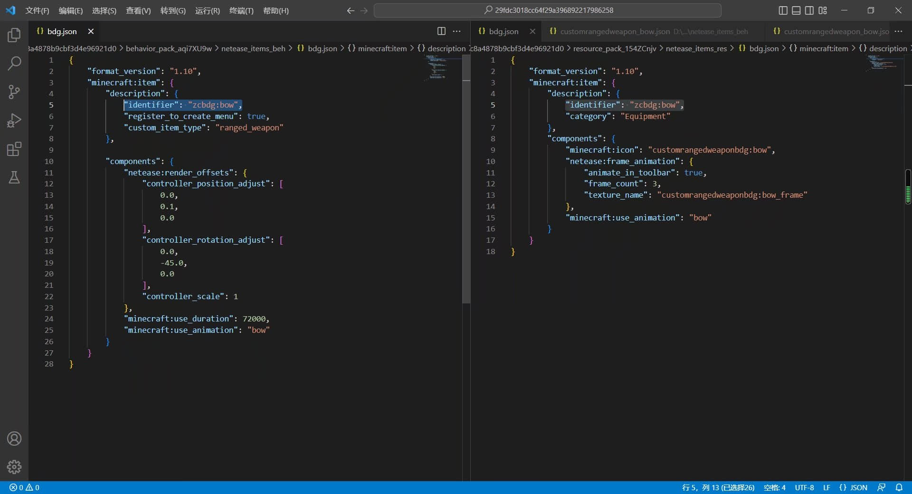


然后在mcs的关卡编辑界面的左下角的配置里面点物品，这里说一下物品名字怎么快速改，点你要修改的物品，在界面右侧会出现属性，点击其中的基础属性右侧的添加属性，能看到有个name，把它点一下，右边的勾自己会点上，然后点调整，就可以在属性里面改物品名称了

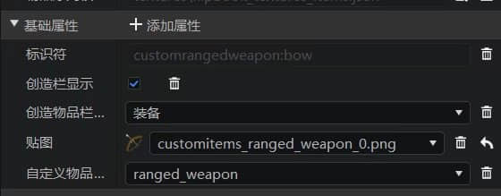


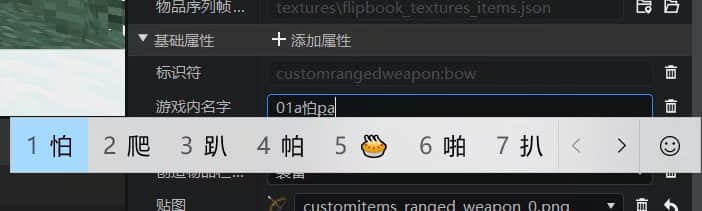


然后修改你的物品贴图为之前准备的不带箭、弦不动的贴图。

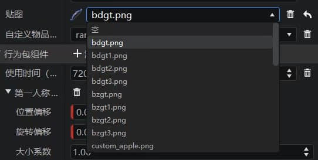


然后点开完整目录中常用目录里的贴图，找到item_texture.json这个文件，右键用vsc打开，这里我直接放几张图，然后再说他们的意思是什么。

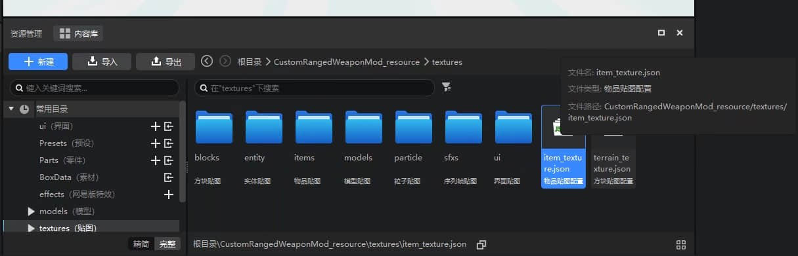


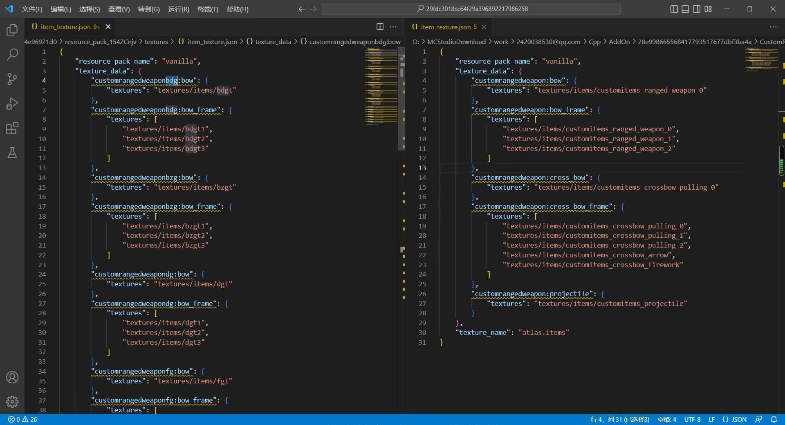


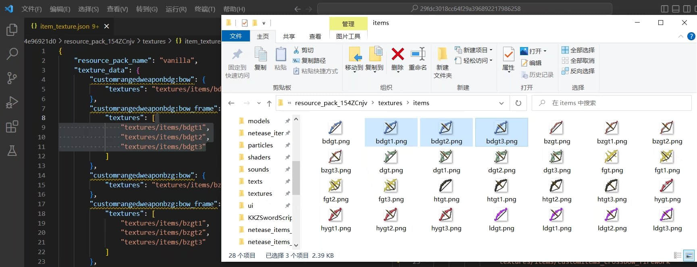


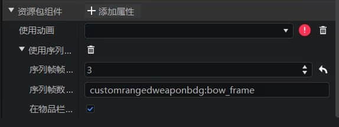


会一点的应该看出来了，这里在定义序列帧，上面的最后一张图是物品属性里面的，我们需要给每个物品手动修改这个。

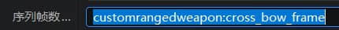


改为item_texture.json这个文件里面定义的名称，我举个例子。

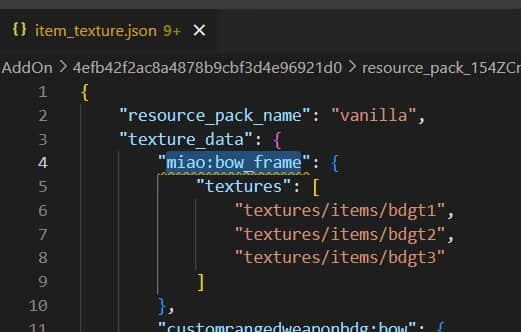


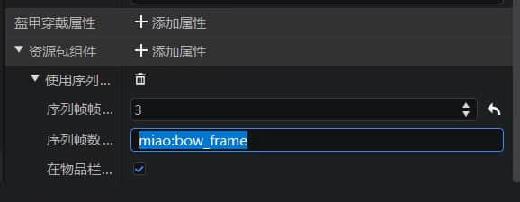


这里数字3的意思就是使用我们之前准备好的三张不同时期带箭、时长越久弦拉越长的贴图，至此，自定义物品做好了，但它没有任何事件，所以下面进入程序部分。


## 程序部分

*他不难！！他不难！！他不难！！不要怕他！！*

首先需要打开python脚本文件，在目录上面的搜索里面搜索脚本，可以看到在根目录的行为包里面，点开，其中2个文件是我们现在需要注意的，`customRangedWeaponClient.py`和`customRangedWeaponServer.py`，我们都右键打开。

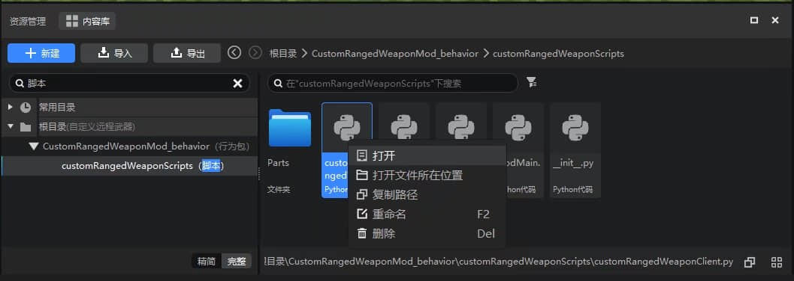


这里请记住2个知识点：

- `customRangedWeaponClient.py`里面写的是客户端事件，关键词Client。
- `customRangedWeaponServer.py`里面写的是服务端事件，关键词Server。


为了让我们编辑python脚本更加方便，我们点击左侧栏里面的——扩展，搜索python，点击安装，安装好后重新启动就装好了

然后，你应该注意到了，在花花绿绿的英文字母和符号中，有一串绿色的中文，绿色部分开头为井字符号（#）。

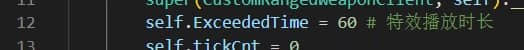


这个叫做注释，在python中，行注释用#，块注释用"""。

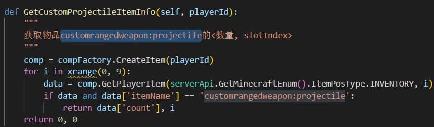


注释在python文件中不参与事件，所以可以随便使用，方便自己看得懂，这个模板里面，非常好心的加了几处注释，可以很容易上手。

然后稍微解释一下现在有的部分：

1. 这个部分是客户端文件的最后2个自定义函数`createParticle()`和`CreateSfx()`，依靠注释并结合上文能看出来`createParticle()`是自定义弓发射子弹（先暂时叫它子弹）后，碰到方块上后，子弹不会消失，会留在方块上，持续播放粒子特效，`CreateSfx()`是自定义弓发射的子弹命中生物后，会产生一个序列帧动画特效，来表示玩家命中生物了，我的更多弓模组，每个箭都有对应的飞行粒子效果，所以`createParticle()`对我没用，我就直接删掉，包括上面的`elif args['hitTargetType'] == "BLOCK": self.createParticle(args)`，

   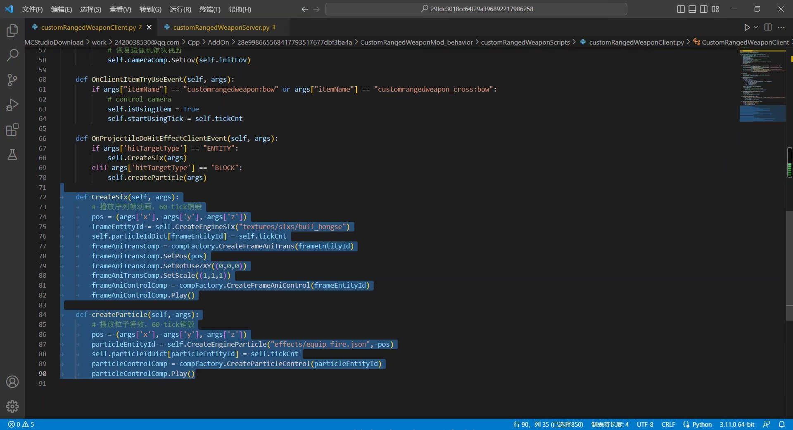

   改完后的样子：

   ```python
   def OnProjectileDoHitEffectClientEvent(self, args):
       if args['hitTargetType'] == "ENTITY":
           self.CreateSfx(args)

   def CreateSfx(self, args):
       # 播放序列帧动画，60 tick销毁
       pos = (args['x'], args['y'], args['z'])
       frameEntityId = self.CreateEngineSfx("textures/sfxs/buff_hongse")
       self.particleIdDict[frameEntityId] = self.tickCnt
       frameAniTransComp = compFactory.CreateFrameAniTrans(frameEntityId)
       frameAniTransComp.SetPos(pos)
       frameAniTransComp.SetRotUseZXY((0,0,0))
       frameAniTransComp.SetScale((1,1,1))
       frameAniControlComp = compFactory.CreateFrameAniControl(frameEntityId)
       frameAniControlComp.Play()
   ```


2. 这个部分是客户端文件的自定义函数`OnClientItemTryUseEvent()`，功能就是检测玩家是否在使用自定义物品，即是否手持弓并开始蓄力准备发射子弹，我们需要修改if判据中的id名称，让模板能检测我们自己做的自定义物品，其中==的意思是判断是否相等的意思，即物品id确认是我们自定义的物品后，执行if块里的内容。

   ```python
   self.isUsingItem = True
   self.startUsingTick = self.tickCnt
   ```

   还有，其中or的意思是（或者），即我们这个if块里的内容想要执行，你手持物品不管是zcbzg:bow还是zcdg:bow还是zcfg:bow或者其他你自定义的物品，只要是其中一个都能执行，所以叫（或者）。

   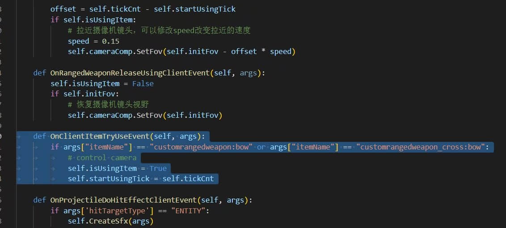


   改完后的样子：

   ```python
   def OnClientItemTryUseEvent(self, args):
   		if args["itemName"] == "zcbzg:bow" or args["itemName"] == "zcdg:bow" or args["itemName"] == "zcfg:bow" or args["itemName"] == "zchtg:bow" or args["itemName"] == "zchyg:bow":
   			# control camera
   			self.isUsingItem = True
   			self.startUsingTick = self.tickCnt
   ```

   这里的id名称，如zcbzg:bow，就是我们做自定义物品时identifier里填的物品id。

3. 这个部分是服务端文件的自定义函数`OnRangedWeaponReleaseUsingServerEvent()`，功能是检测玩家是否放弃使用自定义物品，也就是蓄力结束，可以把子弹发射出去了，它的前提是背包中有规定数量的物品有就发射子弹，即你用弓发射箭如果背包没箭就没办法发射，我的更多弓模组每一把弓发射的每一个子弹效果都是不同的，其实，他们只是不同的生物而已，我后面还要给每个生物都进行单独设置，所以我此处修改了很多东西，我先单独检测每一把弓的物品id，每个物品指定生成一个自己对应的生物，其中自定义函数`DecreaseCustomProjectileItemCount()`是用来减掉玩家背包那支被发射出去的物品的，`comp.CreateProjectileEntity()`即不是我们定义的函数也不是模板自定义的函数了，它是一个接口，功能就是发射生物，可以发射和原版雪球、鸡蛋、末影珍珠一样的实体生物，这个后面会教，你只要知道这个接口的第二个参数是填生物id的就行，比如`customrangedweapon:custom_arrow_hyg`，这个是火焰弓`（zchyg:bow）`发射的生物的生物id。

   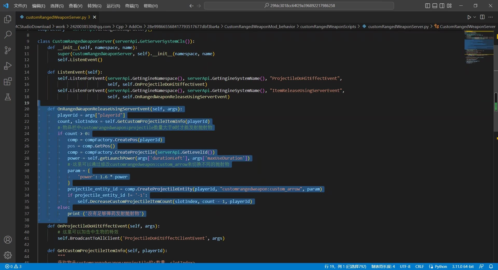


   改完后的样子：

   ```python
   def OnRangedWeaponReleaseUsingServerEvent(self, args):
       playerId = args["playerId"]
       itemDict = args["itemDict"]
       count, slotIndex = self.GetCustomProjectileItemInfo(playerId)
       # 物品栏中customrangedweapon:projectile数量大于0时才能发射抛射物
       if count > 0:
           comp = compFactory.CreatePos(playerId)
           pos = comp.GetPos()
           comp = compFactory.CreateProjectile(serverApi.GetLevelId())
           power = self.getLaunchPower(args["durationLeft"], args["maxUseDuration"])
           # 这里可以通过修改customrangedweapon:custom_arrow来切换不同的抛射物
           param = {"power": 1.6 * power}
           if itemDict["newItemName"] == "zchyg:bow":
               projectile_entity_id = comp.CreateProjectileEntity(
                   playerId, "customrangedweapon:custom_arrow_hyg", param
               )
               if projectile_entity_id != "-1":
                   self.DecreaseCustomProjectileItemCount(slotIndex, count - 1, playerId)
           if itemDict["newItemName"] == "zcbzg:bow":
               projectile_entity_id = comp.CreateProjectileEntity(
                   playerId, "customrangedweapon:custom_arrow_bzg", param
               )
               if projectile_entity_id != "-1":
                   self.DecreaseCustomProjectileItemCount(slotIndex, count - 1, playerId)
           if itemDict["newItemName"] == "zcdg:bow":
               projectile_entity_id = comp.CreateProjectileEntity(
                   playerId, "customrangedweapon:custom_arrow_dg", param
               )
               if projectile_entity_id != "-1":
                   self.DecreaseCustomProjectileItemCount(slotIndex, count - 1, playerId)
           if itemDict["newItemName"] == "zcfg:bow":
               projectile_entity_id = comp.CreateProjectileEntity(
                   playerId, "customrangedweapon:custom_arrow_fg", param
               )
               if projectile_entity_id != "-1":
                   self.DecreaseCustomProjectileItemCount(slotIndex, count - 1, playerId)
           if itemDict["newItemName"] == "zchtg:bow":
               projectile_entity_id = comp.CreateProjectileEntity(
                   playerId, "customrangedweapon:custom_arrow_htg", param
               )
               if projectile_entity_id != "-1":
                   self.DecreaseCustomProjectileItemCount(slotIndex, count - 1, playerId)
           if itemDict["newItemName"] == "zcbdg:bow":
               projectile_entity_id = comp.CreateProjectileEntity(
                   playerId, "customrangedweapon:custom_arrow_bdg", param
               )
               if projectile_entity_id != "-1":
                   self.DecreaseCustomProjectileItemCount(slotIndex, count - 1, playerId)
           if itemDict["newItemName"] == "zcldg:bow":
               projectile_entity_id = comp.CreateProjectileEntity(
                   playerId, "customrangedweapon:custom_arrow_ldg", param
               )
               if projectile_entity_id != "-1":
                   self.DecreaseCustomProjectileItemCount(slotIndex, count - 1, playerId)
       else:
           print("没有足够弹药发射抛射物")
   ```


4. 这个部分是服务端文件的自定义函数`GetCustomProjectileItemInfo()`，功能是获取玩家背包某个物品的数量，即检测玩家背包是否有箭的实际事件部分，这里要进行个小修改，原本的`xrange(0, 9)`只能检测玩家主物品栏的10个格子，背包里的就检测不到，所以改为`range(0, 36)`，去掉x，9改36，然后将需要被检测为发射物品的物品id修改一下，因为我的更多弓只发射原版的箭，所以我改为`minecraft:arrow`。

   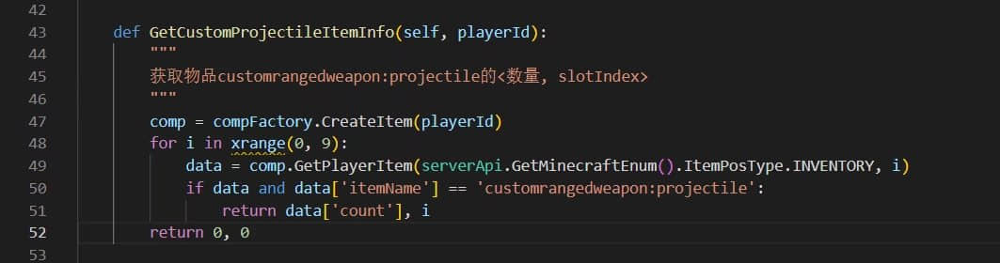


   改好的样子：

   ```python
   def GetCustomProjectileItemInfo(self, playerId):
       """
       获取物品customrangedweapon:projectile的<数量, slotIndex>
       """
       comp = compFactory.CreateItem(playerId)
       for i in range(0, 36):
           data = comp.GetPlayerItem(serverApi.GetMinecraftEnum().ItemPosType.INVENTORY, i)
           if data and data["itemName"] == "minecraft:arrow":
               return data["count"], i
       return 0, 0
   ```

   至此，自定义物品的事件全部完成，进入下一步 **自定义抛掷生物** 。


## 自定义抛掷生物

很明显，我们使用模板提供的生物是远远不够的，用原版生物也很单调，我的更多弓在模板的基础上修改了一些东西，首先是生物行为文件重写：

```json
{
    "format_version":"1.13.0",
    "minecraft:entity":{
        "description":{
            "identifier":"customrangedweapon:custom_arrow_bdg",
            "is_spawnable":false,
            "is_summonable":true,
            "is_experimental":false,
            "scripts":{
                "animate":[
                    "bdglz"
                ]
            },
            "animations":{
                "bdglz":"controller.animation.bdglz"
            }
        },
        "component_groups":{

        },
        "components":{
            "minecraft:projectile":{
                "on_hit":{
                    "impact_damage":{
                        "damage":3,
                        "knockback":true,
                        "semi_random_diff_damage":false,
                        "destroy_on_hit":true
                    },
                    "stick_in_ground":{
                        "shake_time":0.35
                    },
                    "mob_effect":{
                        "effect":"slowness",
                        "duration":200,
                        "durationeasy":200,
                        "durationnormal":200,
                        "durationhard":200,
                        "amplifier":999,
                        "visible":false
                    }
                },
                "hit_sound":"bow.hit",
                "power":10,
                "gravity":0.0039,
                "uncertainty_base":1,
                "uncertainty_multiplier":0,
                "anchor":1,
                "should_bounce":true,
                "offset":[
                    0,
                    -0.1,
                    0
                ]
            },
            "netease:custom_entity_type":{
                "value":"projectile_entity"
            },
            "netease:pick_up":{
                "item_name":"minecraft:arrow",
                "favored_slot":1
            },
            "minecraft:collision_box":{
                "width":0.25,
                "height":0.25
            },
            "minecraft:hurt_on_condition":{
                "damage_conditions":[
                    {
                        "filters":{
                            "test":"in_lava",
                            "subject":"self",
                            "operator":"==",
                            "value":true
                        },
                        "cause":"lava",
                        "damage_per_tick":4
                    }
                ]
            }
        },
        "events":{

        }
    }
}
```

点击精简分类里的实体，鼠标移动到其中一个json文件上面不点击，然后看到它会说明这个是实体行为包配置文件还是实体资源包配置文件，先对一个实体行为包配置文件右键，再点（打开文件所在位置），文件夹里选一个文件，修改它的内容，改为上面的那一大段，其中有一个`netease:pick_up`组件，它的内容为`"item_name": "minecraft:arrow"`,`"favored_slot": 1`，联系上下文可以知道，它的功能是如果这个生物触碰到方块后不会立刻消失，而是会留在方块上，玩家靠近后，可以把它重新捡起来，回到背包里，因为我的更多弓是发射原版的箭所以我这的物品id就用的`minecraft:arrow`，还有，`minecraft:projectile`这个组件，是用来定义这个生物的抛掷物属性！比如它的`on_hit`中的`mob_effect`，联系上下文可以知道，它的功能是如果这个生物碰到生物就等于射中目标，并且给目标附加药水效果，这里我做的是冰冻弓，射中目标后会让目标无法行动，也就是给予时长200秒的1000级的`slowness`（缓慢）效果，所以`amplifier`写999，其他写200（药水效果初始等级为1，对应`amplifier`写0），再比如`minecraft:projectile`这个组件的`on_hit`中的`impact_damage`，内容为`"damage": 3`,`"knockback": true`,`"semi_random_diff_damage": false`,`"destroy_on_hit": true`，这个数字3就是命中后造成的伤害，`knockback`的意思为是否击退命中的目标，填true就是会击退，填false就是不会击退，上面这些都只能用vsc打开然后自己手改，目前在mcs里面是没法改的，包括identifier，它在mcs里面也是没办法修改的，但它关系到生物id，我们在讲脚本的自定义函数`OnRangedWeaponReleaseUsingServerEvent()`时说过，里面用到了一个`comp.CreateProjectileEntity()`接口用来发射生物，其中comp在模板里面已经帮我们定义好了（也就是`comp = compFactory.CreateProjectile(serverApi.GetLevelId())`这部分），我们只需要修改`CreateProjectileEntity()`这个括号里的参数就行，比如我使用`zcbdg:bow（冰冻弓）`发射冰冻箭生物而且冰冻箭生物的实体行为文件中的identifier我写`customrangedweapon:custom_arrow_bdg`那对应的事件部分就是：

```python
if itemDict["newItemName"] == "zcbdg:bow":
    projectile_entity_id = comp.CreateProjectileEntity(playerId, "customrangedweapon:custom_arrow_bdg", param)
    if projectile_entity_id != '-1':
        self.DecreaseCustomProjectileItemCount(slotIndex, count - 1, playerId)
```

再举个例子，比如我做了一个自定义物品苦力怕qiang，物品id是klpqiang:bow,然后做了个自定义生物苦力怕子弹，对应实体行为文件中的identifier我写muapapa:bdg，那对应的事件部分就是：

```python
if itemDict["newItemName"] == "klpqiang:bow":
    projectile_entity_id = comp.CreateProjectileEntity(playerId, "muapapa:bdg", param)
    if projectile_entity_id != '-1':
        self.DecreaseCustomProjectileItemCount(slotIndex, count - 1, playerId)
```

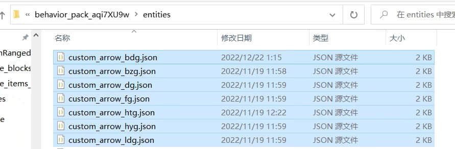


然后要做几个不同效果的箭（不同生物）就复制几份，修改文件名和文件内的内容。

再看实体资源包配置文件，文件`custom_arrow.entity.json`正是我们要用的，修改文件名及其文件里的identifier，要和实体行为包配置文件里的identifier一样，identifier一样的话，2个文件就绑定在一起，然后几个物品复制几份，每份都要改identifier，有基础的开发者，如果学会了改生物的模型和贴图，这里可以自己改，讲到生物模型了，再讲一下这个模板里面提供的模型，它在材质包文件夹models的entity文件夹中，叫`custom_arrow.geo.json`，我们用建模软件Blockbench打开它后能看到这个模型居然有一点点位置上的错误，虽然错误不明显，不改也能用，但建议会用Blockbench可以把它改一下，

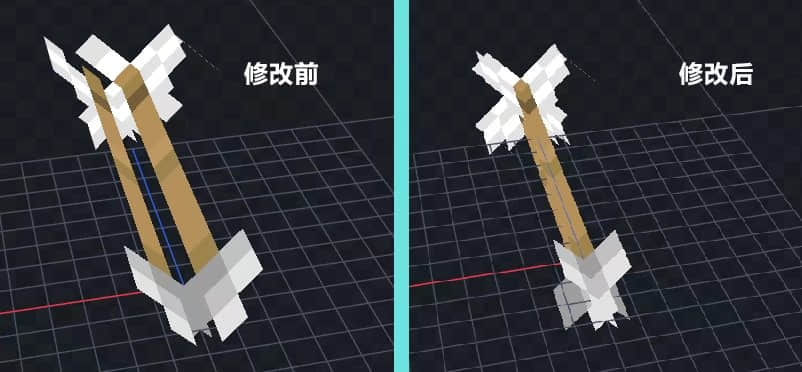


前面说过我的更多弓模组，每个箭都有对应的飞行粒子效果，在实体行为包配置文件中有这么一段：

```json
{
    "scripts":{
        "animate":[
            "bdglz"
        ]
    },
    "animations":{
        "bdglz":"controller.animation.bdglz"
    }
}
```

这样写可以给生物加上一个动画控制器，也就是下一个部分—— **行为包动画控制器** 。


## 行为包动画控制器

首先，打开mcs，在资源管理里选完整目录，点根目录，再右键行为包，选择（打开当前文件夹），在这个文件夹里新建一个文件夹名字叫animation_controllers，打开这个文件夹，在里面新建一个txt文本文档（或者你直接新建json文件也行），右键新建的文本，选择重命名，把文件的后缀名（.txt）改为（.json），文件名随意，用vsc打开，在里面手动输入下面这段内容：

```json
{
    "format_version":"1.10.0",
    "animation_controllers":{
        "controller.animation.bdglz":{
            "initial_state":"default",
            "states":{
                "default":{
                    "transitions":[
                        {
                            "attacking":"(1.0)"
                        }
                    ]
                },
                "attacking":{
                    "on_entry":[
                        "/particle hejin:yyaflz ~ ~ ~"
                    ],
                    "transitions":[
                        {
                            "dimian":"query.is_moving==0.0"
                        },
                        {
                            "default":"(1.0)"
                        }
                    ]
                },
                "dimian":{
                    "transitions":[
                        {
                            "attacking":"query.is_moving==1.0"
                        }
                    ]
                }
            }
        }
    }
}
```

会一点的可以看出来，行为包动画控制器和材质包里面的动画控制器格式一样，唯一不一样的地方在on_entry取代了animations，这里on_entry是用来执行一个游戏里的指令的，我这里执行了播放粒子效果的指令`/particle`，因为格式一样，所以`controller.animation.bdglz`也是动画控制器名，在实体行为包配置文件中animations里面就写了`controller.animation.bdglz`，2处写一样的动画控制器名就可以把2个文件绑定，再看`transitions`中的`query.is_moving`，它是一种叫molang的语言，大家可以通过这个网站进行学习：[molang文档](https://wiki.mcbe-dev.net/p/Molang#%E6%9F%A5%E8%AF%A2%E5%87%BD%E6%95%B0%E6%B8%85%E5%8D%95)，通过这个网站我们能知道`query.is_moving`是用来检测实体是否正在移动，结合上下文可知，这段内容的功能就是，当生物被发射出去后，会一直执行指令，产生飞行粒子，直到射中目标后生物消失或者射中方块后停留在方块上，停留在方块上时不执行指令，不产生粒子，但是，如果此时生物停留的方块没了，生物开始往下坠落，直到射中目标或方块，下坠过程中会继续执行指令，继续产生粒子，但是，原版的粒子很少很难看，我的更多弓，都会产生自定义的粒子，且每个生物产生的粒子颜色都不一样，所以我们要进行下一步—— **自定义粒子** 。


## 自定义粒子

这里用到了一个非常好用的粒子制作网站[暴雪粒子网](https://snowstorm.app/)，可惜这个网站不支持中文，但是也有中文版，只要下载下来就能用，详情看这个视频：[【Minecraft基岩版 粒子效果制作器汉化版】](https://www.bilibili.com/video/BV1GL4y1M7kd?vd_source=f27a2fcb40972f864c9259a5c844d5b7)，我是因为用熟练了，直接用浏览器自带的在线翻译就能看懂了，看不懂的可以下载这个中文版试试，然后，这里简要描述一下粒子制作步骤。

1. 修改粒子贴图和粒子大小：从下图能看到，（粒子）里面的外观可以控制粒子的大小，（粒子）里面的质地可以控制粒子的贴图，通过鼠标点击设置和手动输入具体数值，可以制作出自己想要的好看粒子，非常简单，多试几次就懂了。

   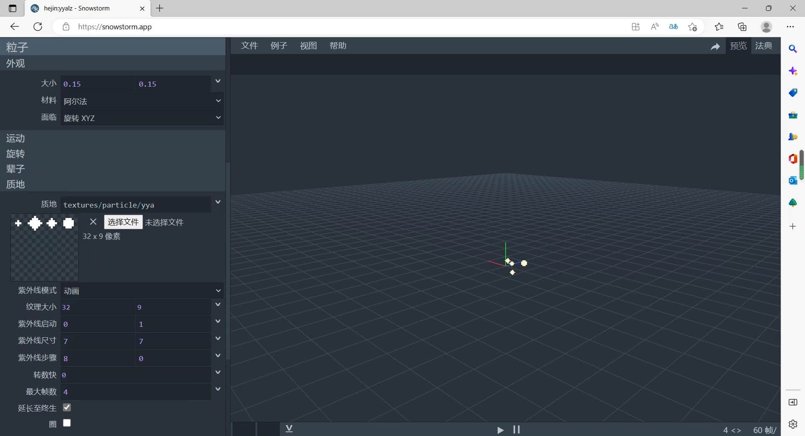

   **附加步骤、修改粒子的颜色：在（粒子）里面的颜色和光线里面我们可以设置粒子的颜色，甚至可以做变色粒子，心细的能看到我粒子贴图里面的颜色是白色的，但生成的粒子却是黄色的，就是在这里修改了粒子颜色。**

2. 修改粒子的数量和存在时长：

   从下图能看到，（发射）里面的率和发射器寿命可以控制粒子的数量，我图里这样写的意思是一次指令就最多生成4个粒子，然后（粒子）里面的辈子可以控制粒子的存在时长，在辈子的最大年龄这里我写的是`math.random(3,8)`，这里用到了一个函数，`math.random(x,y)`，它可以自动生成一个大于等于x，小于不等于y的数字，我图里这样写的意思是这个粒子会最少存在时间持续3秒，最多存在时间不超过8秒。

   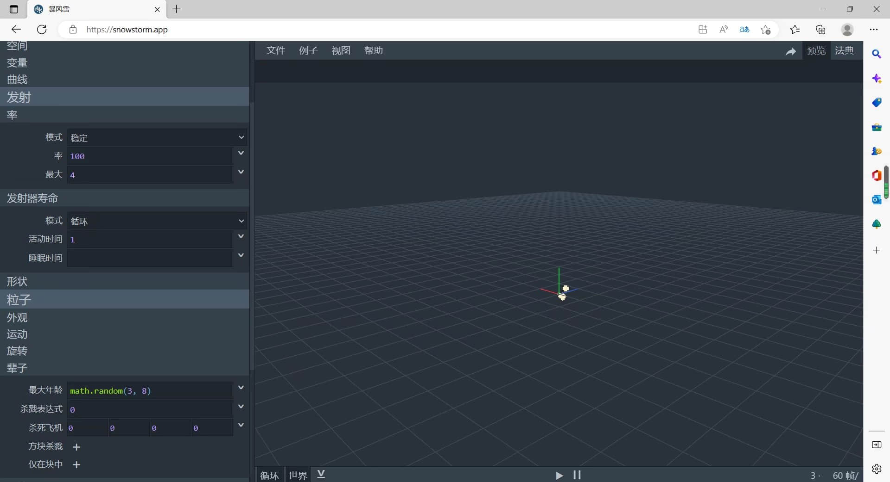


3.  修改粒子的运动起点和运动方式：

   从下图能看到，（发射）里面的形状可以控制粒子的运动起点，然后（粒子）里面的运动和旋转可以控制粒子的运动方式，涉及到速度、方向、加速度等操作，这里也一样经常用到`math.random()`函数，因为它可以做到每次产生粒子时不出现重复的情况，让粒子更加好看。

   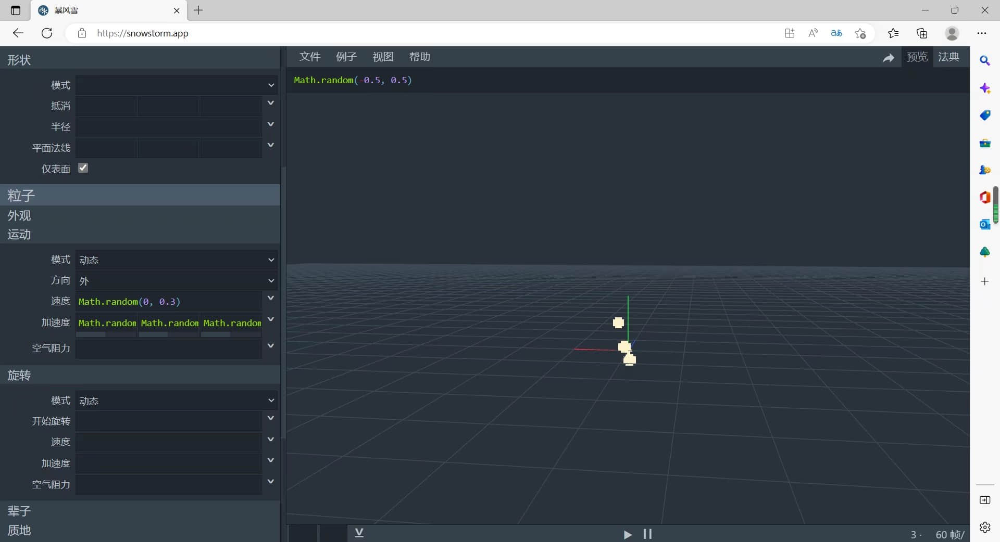


4. 修改粒子id：

   从下图能看到，（影响）里面的元可以控制粒子的粒子id，也就是我执行`/particle hejin:yyaflz ~ ~ ~`这个指令时，里面输入的`hejin:yyaflz`就是粒子id，可以自己设置为好记的。

   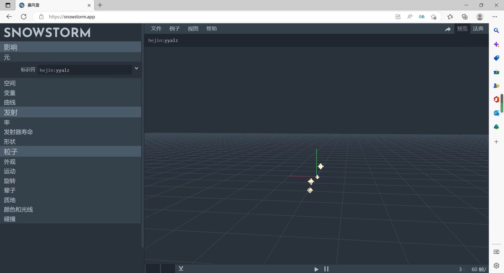


5. 把粒子导出网站并导入mcs：

   点击文件，再点击Download，下载文件后去找这个文件在哪，一般都在浏览器的默认下载文件夹里面，打开mcs，在编辑界面的导入中选择导入原版粒子特效，如果无法导出导入，你也可以点开网站右上角的（法典），里面是文件内的内容，我们复制下来，在mcs编辑界面的资源管理里的搜索中输入particles，找到材质包中的粒子文件夹，右键然后点击（打开当前文件夹），在这个文件夹里面新建一个txt文本文档（或者你直接新建json文件也行），右键新建的文本，选择重命名，把文件的后缀名（.txt）改为（.json），文件名随意，用vsc打开，在里面粘贴你在（法典）中复制的内容。

   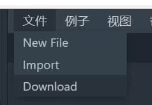


   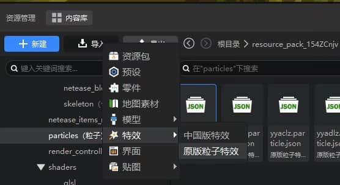


6. 修改文件中贴图的位置：

   当导入好粒子后，还要点开这个粒子的json文件，然后手动修改`"basic_render_parameters": {"material": "particles_alpha","texture": "textures/particle/yya"}`里texture的内容，它是个文件路径，通过这个路径可以找到你的粒子贴图，textures是文件夹名称，particle也是文件夹名称，yya是这个贴图图片的文件名。

   这里我分享一个我自己做的粒子的json文件：

   ```json
   {
       "format_version":"1.10.0",
       "particle_effect":{
           "description":{
               "identifier":"hejin:yyaflz",
               "basic_render_parameters":{
                   "material":"particles_alpha",
                   "texture":"textures/particle/yya"
               }
           },
           "components":{
               "minecraft:emitter_local_space":{
                   "position":true,
                   "rotation":true
               },
               "minecraft:emitter_rate_steady":{
                   "spawn_rate":100,
                   "max_particles":4
               },
               "minecraft:emitter_lifetime_looping":{
                   "active_time":1
               },
               "minecraft:emitter_shape_disc":{
                   "surface_only":true,
                   "direction":"outwards"
               },
               "minecraft:particle_lifetime_expression":{
                   "max_lifetime":"math.random(3, 8)"
               },
               "minecraft:particle_initial_speed":"Math.random(0, 0.3)",
               "minecraft:particle_motion_dynamic":{
                   "linear_acceleration":[
                       "Math.random(-0.5, 0.5)",
                       "Math.random(-0.5, 0.5)",
                       "Math.random(-0.5, 0.5)"
                   ]
               },
               "minecraft:particle_appearance_billboard":{
                   "size":[
                       0.15,
                       0.15
                   ],
                   "facing_camera_mode":"rotate_xyz",
                   "uv":{
                       "texture_width":32,
                       "texture_height":9,
                       "flipbook":{
                           "base_UV":[
                               0,
                               1
                           ],
                           "size_UV":[
                               7,
                               7
                           ],
                           "step_UV":[
                               8,
                               0
                           ],
                           "max_frame":4,
                           "stretch_to_lifetime":true
                       }
                   }
               },
               "minecraft:particle_appearance_lighting":{

               },
               "minecraft:particle_appearance_tinting":{
                   "color":[
                       0,
                       1,
                       1,
                       1
                   ]
               }
           }
       }
   }
   ```

   上面都做完后，当你游戏里输入指令后，例如`/particle hejin:yyaflz ~ ~ ~`，就会执行成功，产生粒子，当然我们做这么多是为了让我们发射的生物有飞行粒子，让它看起来更好看，然后需要几个不同颜色、样子的粒子就复制粘贴这个文件几遍，再修改文件名、粒子id和粒子颜色。


**然后，到现在一个完整的模组基本就做好了** 。

接下来，优化一下各种弓的事件或组件即可，全程很多地方是改模板和复制粘贴，也该有几个地方要动脑筋了，比如我做了个爆炸弓，发射的箭不管射中目标还是碰到方块都会产生爆炸，这里说一下我的思路，首先在爆炸弓对应生物的实体行为包配置文件里的minecraft:projectile这个组件的on_hit中加入：

```json
{
    "spawn_chance":{
        "first_spawn_chance":1,
        "second_spawn_chance":9999,
        "first_spawn_count":1,
        "second_spawn_count":1,
        "spawn_definition":"customrangedweapon:xjbzwbzg",
        "spawn_baby":false
    }
}
```

这部分是用来生成一个生物的，生物id叫做customrangedweapon:xjbzwbzg，在这个生物的实体行为包配置文件中加入组件：

```json
{
    "minecraft:explode":{
        "fuse_lit":true,
        "breaks_blocks":true,
        "causes_fire":false,
        "fuse_length":0,
        "power":3
    }
}
```

意思就是这个生物刚刚召唤出来后就会立刻自爆，然后众所周知，生物只做了实体行为包配置文件，没做实体资源包配置文件，那这个生物就没办法看见，所以这个生物id叫`customrangedweapon:xjbzwbzg`的生物就是个工具生物，只负责实现爆炸弓的效果。


**恭喜你，到了现在，一个完整的模组就做好了** 。

**感谢你的耐心观看，世上无难事，只怕有心人，希望这期教程能给你带来收获！谢谢！**