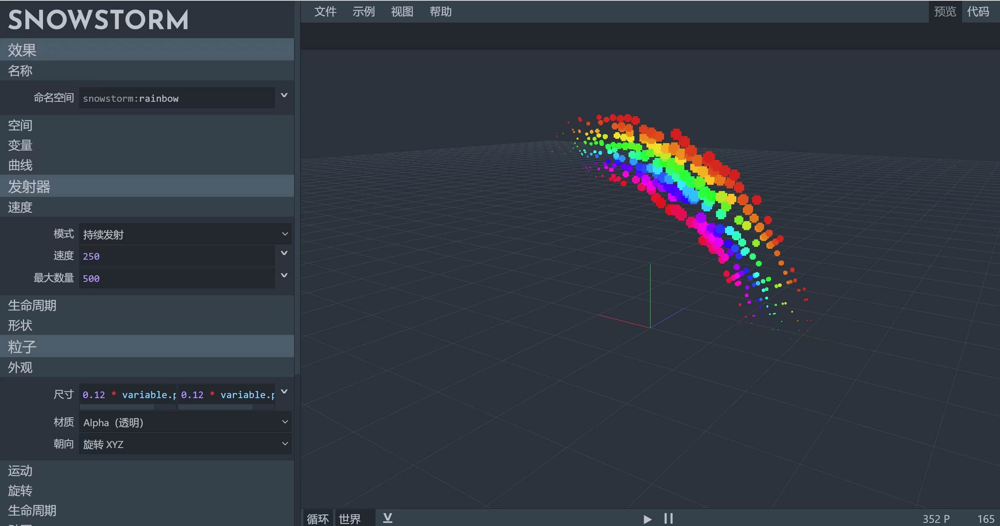

# 基岩版粒子效果制作器（汉化版）

> 本篇教程获得第二期知识库必看教程奖。
>
> 获奖作者：日月潭。

Snowstorm是由Jannis大神发布的一款基岩版粒子效果制作器，具有实时预览，代码同步，操作简单的优点。但对于新手开发者来说，这款软件全英文的界面可能会成为学习路上的绊脚石，因此我汉化了这款软件。

目前的汉化程度为100%，本人具有三年的基岩版开发经验，以及足够的英语水平，在翻译时力求做到描述准确，符合我们的阅读习惯。在原作者描述不够详细的地方也进行了补充。

**下载地址：**

[基岩版粒子效果制作器（汉化版）_网易我的世界论坛 (netease.com)](https://mc.netease.com/thread-916458-1-1.html)

**使用方法：** 下载附件，解压zip，双击Snowstorm.html用浏览器打开。

目前中国版有两套粒子系统，一个是游戏自带，一套是网易开发。游戏自带的粒子系统，在功能性、运行速度、可定制性上，全方位优于网易版。例如支持环境光、碰撞箱、变量和表达式等。

使用原版粒子系统，可以用ModAPI调用指令/particle。你也可以将原版粒子挂接到微软模型上，详见[特效挂接到模型 | 我的世界开发者官网 (163.com)](https://mc.163.com/dev/mcmanual/mc-dev/mcguide/16-%E7%BE%8E%E6%9C%AF/9-%E7%89%B9%E6%95%88/40-%E7%89%B9%E6%95%88%E6%8C%82%E6%8E%A5%E5%88%B0%E6%A8%A1%E5%9E%8B.html?key=%E5%BE%AE%E8%BD%AF%E7%B2%92%E5%AD%90&docindex=1&type=0#%E7%89%B9%E6%95%88%E6%8C%82%E6%8E%A5%E5%88%B0%E6%A8%A1%E5%9E%8B)。

也可以通过网易的API使用微软粒子系统，详见 [微软粒子 | 我的世界开发者官网 (163.com)](https://mc.163.com/dev/mcmanual/mc-dev/mcdocs/1-ModAPI/%E6%8E%A5%E5%8F%A3/%E7%89%B9%E6%95%88/%E5%BE%AE%E8%BD%AF%E7%B2%92%E5%AD%90.html?catalog=1) 。