# 自定义物品与原版生物资源导入

>本篇教程获得第二期知识库优秀教程奖。
>
>获奖作者：志愿者-顾宇。

看到有很多新人开发作者有需要问题不会，只能尽我所能去教学。

## 自定义物品

第一步打开新建。

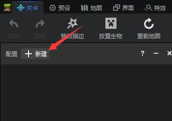

第二步找到要自定义的主体（我这里选的是武器) 。

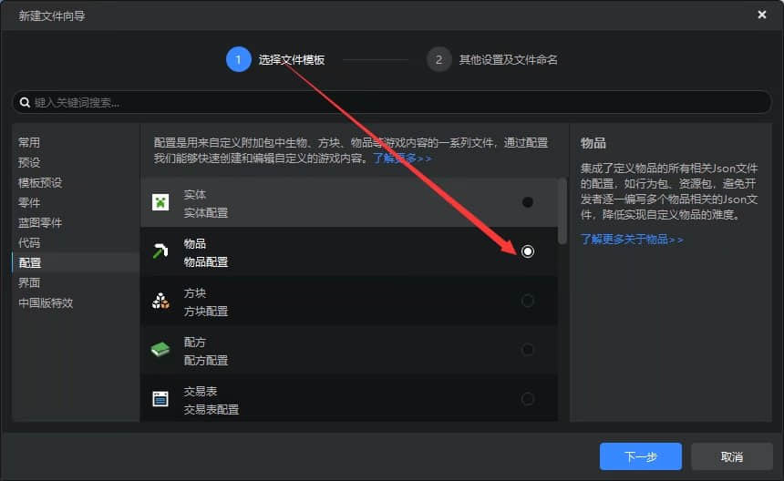

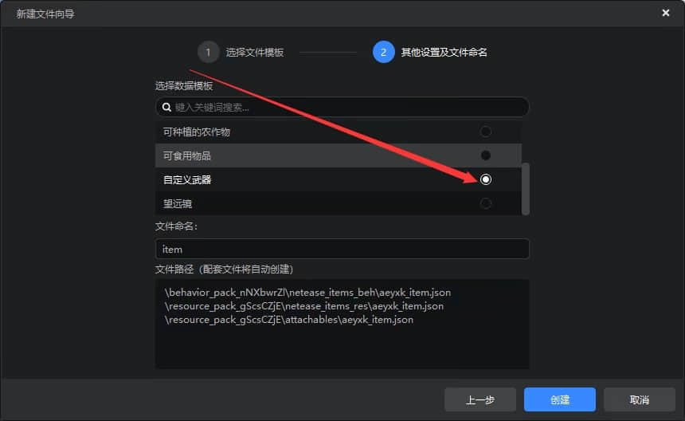

然后查看右边的状态栏，有自定义武器的名称，各种属性，最重要的的是如何选择自己做好的武器贴图。

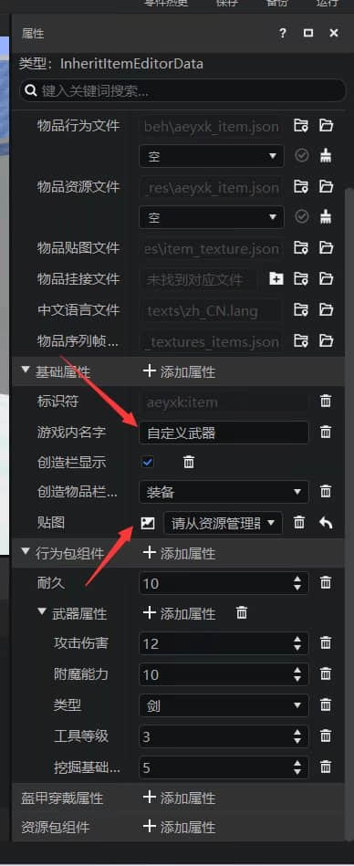

找到正下方的状态栏，其中有一个是贴图，打开这个。

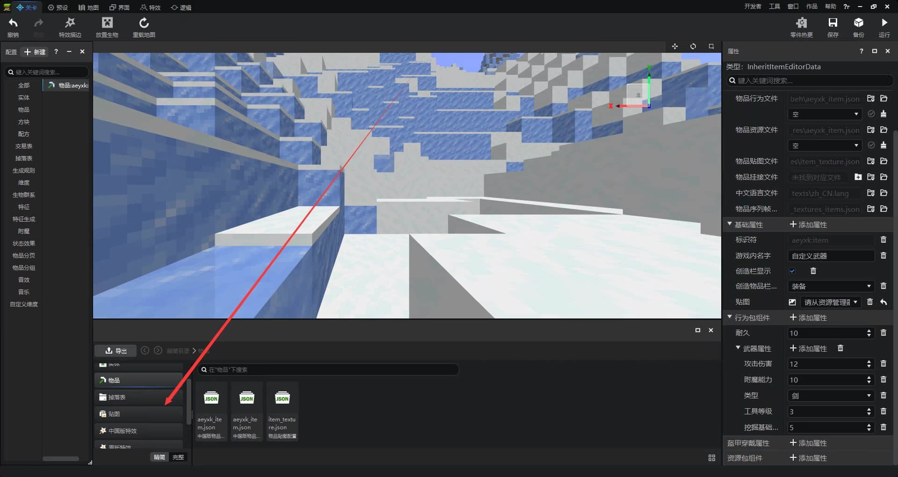

打开之后，右键第一个贴图，找到打开文件所在位置，点击把做好的贴图复制进去即可【注意：贴图文件名不能含有中文】。

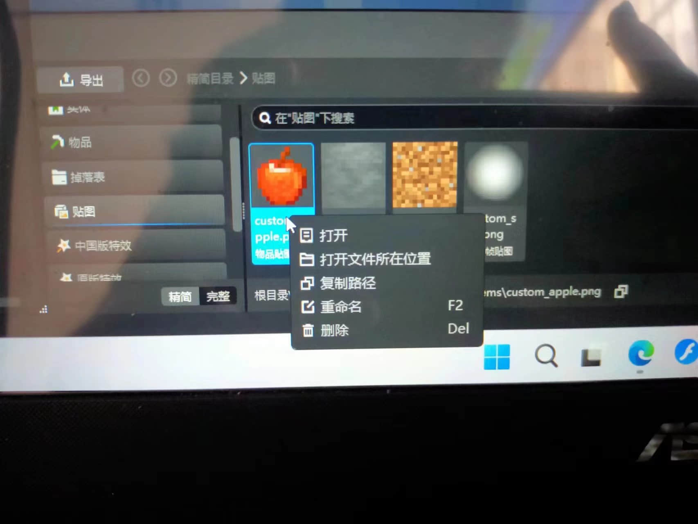

如果你想做的是自定义食物，还需要在资源包组件一栏添加动作属性【eat】 。

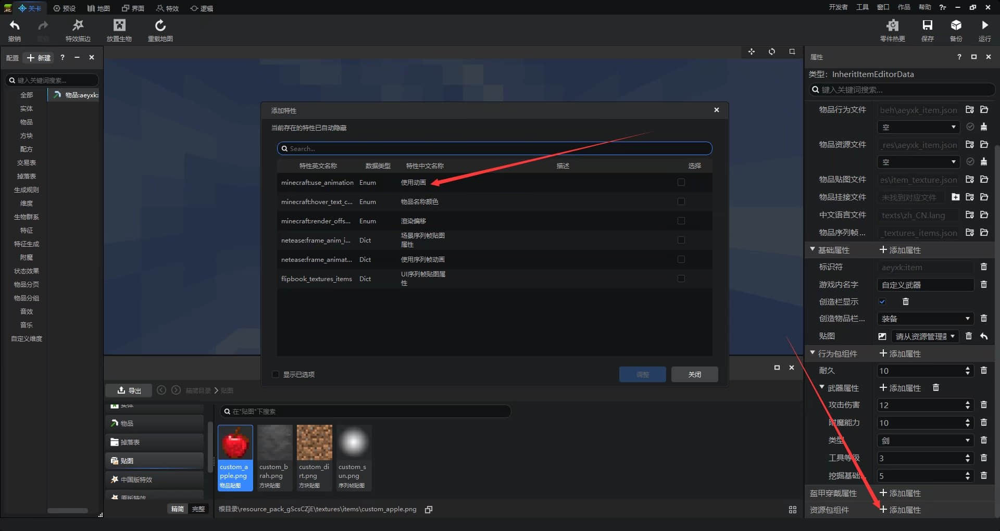

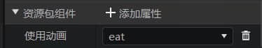

## 原版生物纹理导入

首先你需要一个原版生物模型，使用绘画软件 **{这里推荐blockbench}**  。

做好之后导出选择json文件 。

导入进编辑器 。

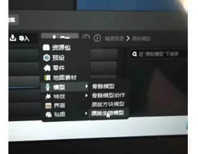

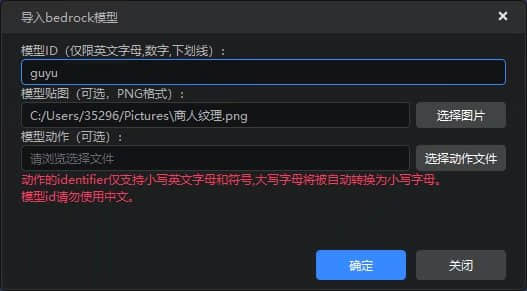

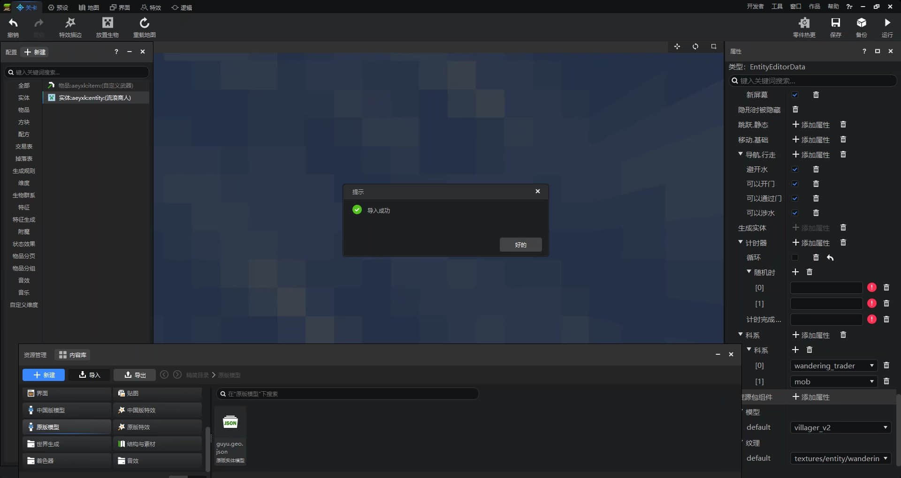

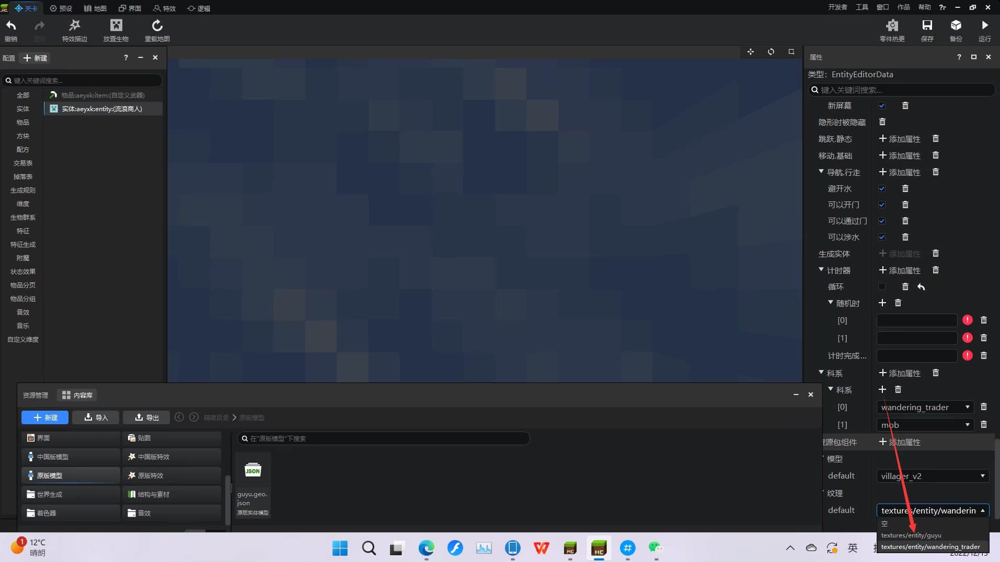

然后让我们进游戏看看效果吧。

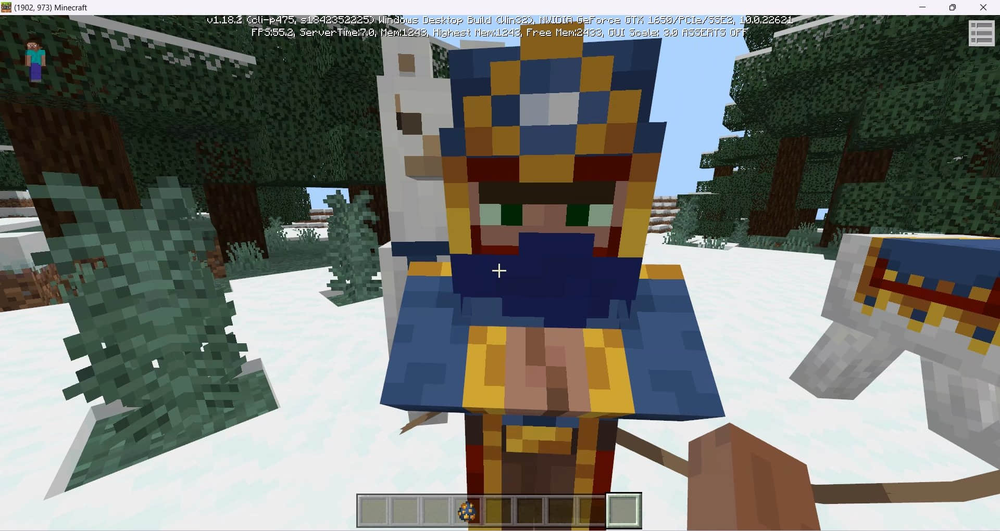

模型导入同上。错误的地方欢迎指正。