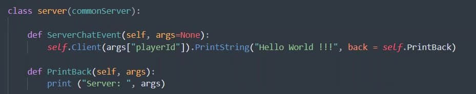
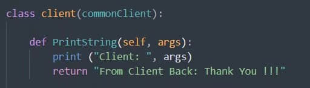
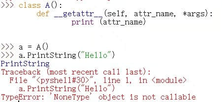
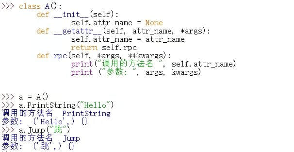
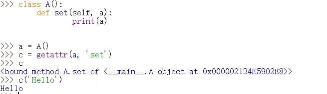
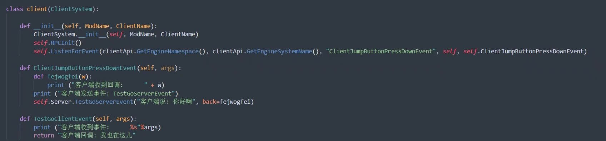
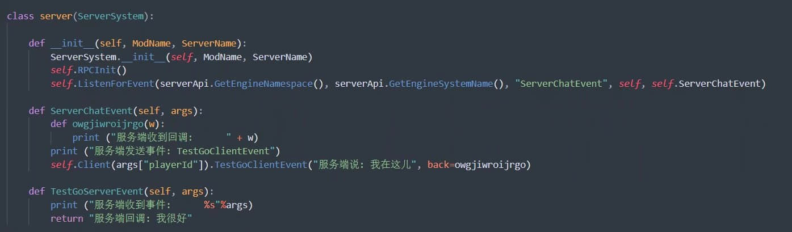

# 更高效的进行双端通信

> 本篇教程获得第一期知识库必看教程奖。
>
> 获奖作者：红石公司。

## 前言

在我的世界模组和网络服的开发过程中，经常需要进行 服务端与客户端 ，或其他系统之间的通信。

一般的我们使用Notify与Broadcast事件进行通信。 但是每次新增一个通信事件都需要使用ListenForEvent接口进行监听。

大部分开发者都将ListenForEvent的调用写在`__init__`里，这就导致无法热更新，需要退出游戏重新进入，十分影响开发效率。

**学习本教程你将掌握：**

- 如何进行通信事件的热更新。
- 如何将调用远程系统变得像调用自身一样方便。

**效果图示：**

- 在服务端发送消息时，向客户端发送事件 并获取返回值。

**学习本教程的前提：**

- 熟悉Python并进行过模组开发。
- 掌握通信事件`NotifyToServer`与`NotifyToClient`、`BroadcastToAllClient`的用法。

## 原理分析解释

根据效果图示可以看到，服务端直接调用了一个未经创建的方法名，这个方法名对应了客户端的方法。在客户端通过某种方式获取到此方法并成功执行。

客户端的return再次返回到服务端，并触发回调函数。

由此可得三个技术点：

1. 使用未创建的方法。
2. 动态获取实例方法。
3. 回调的实现。

### 使用未创建的方法

通过重写`__getattr__`方法可以截获正在调用的方法名。

在此返回一个其他方法，将不会引起报错，我将其称为”万能方法“。并且可以将截获的方法名保存下来，在”万能方法“真正被调用时，可以获得：

1. 刚才保存的方法名。
2. 传入的参数。

这两个集齐了我们通信函数所需的全部参数。可以正常进行通信。如下图所示：

### 动态获取方法

python可以通过内置函数 getattr(obj, attr_name) 获取某个对象的属性值，返回值是属性本身，可以直接使用。

由于调用不存在的方法名会引起报错，所以这里的`getattr`在实际使用时要放在try语句内。

如此，在双端建立的固定通信函数用于发送与接收事件，参数里传入`attr_name,` 在远程端接收到事件后，`getattr`解析`attr_name`为本地方法，即可直接使用。

### 回调的实现

回调本质上也是一次通信，不同的是，不是通过`getattr`方法名获取方法对象，而是一个本身就存在的函数或方法对象，比如一个嵌套函数里的子函数，这通过`getattr`是抓不到的。

所以我们需要检测一个关键字，我这里选用`back`。

为了远程端返回回调后，本地端能够顺利找到回调函数对象，我们使用`uuid`模块的`uuid.uuid1().hex`获取一个回调id，保存在本地端，同时加入通信参数里。

远程端收到事件并执行后，检测到参数里有一个back字段，就将 执行结果 与 回调id，重新通过通信事件发回本地端。

本地端由回调id从刚才的缓存里取出函数对象，并执行。到此一个回调过程完成。（但是禁止套娃）

以上就是通信的热更与直接执行、接受回调 所涉及到的技术难点。

示例代码在这里：[下载地址](https://share.weiyun.com/wGawl7J1)。

示例结果图示：

demo只简单展示了客户端与服务端的双向通信，仅作为功能预览，不具备实用性。还需要各位开发者根据自己的实际情况，以及编程习惯，开发自己的通信系统。

## 拓展

研究透彻后，可以尝试解决以下拓展问题：

- 服务端向所有客户端发送事件，该如何修改代码。
- 客户端或服务端，向本端的其他系统发送事件，该如何修改代码。
- UI或其他自定义逻辑类中，如何不通过 服务端/客户端 中继，直接使用通信。

解决上述问题后，你的通信系统将趋于完善，这将大大加快你的开发进度，提升你的开发效率。（本工作室《我的世界工具盒子》模组，就是采用此方式来应对高频的通信需求。）

本人是编程新手，也是开发新手，教程如有什么纰漏，表述不当，还请大家指出改进。 若有哪里不明白的地方，可以在评论区提问，我会及时解答的。

