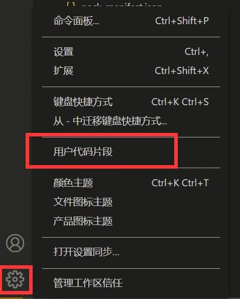
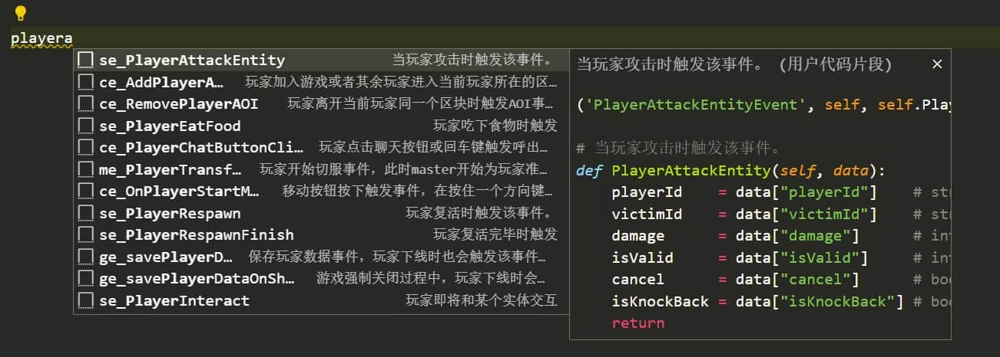

# 事件参数的快速输入

> 本篇教程获得第二期知识库必看教程奖。
>
> 获奖作者：无维心天。

使用vscode的用户代码片段，快速的输入事件函数参数。

即可享受代码片段。

代码片段地址：[vscode_code_snippet.json · 无维心天/网易我的世界 mod_api - Gitee.com](https://gitee.com/wuwei_xintian/netease_mc_mod_api/blob/master/vscode_code_snippet.json)。