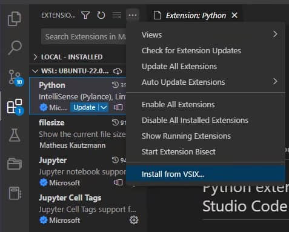
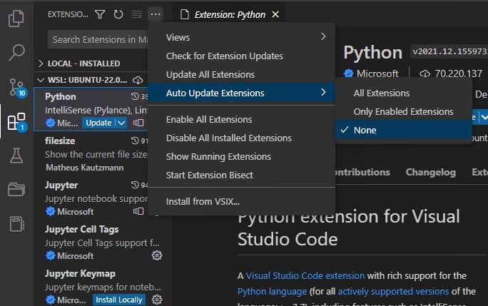
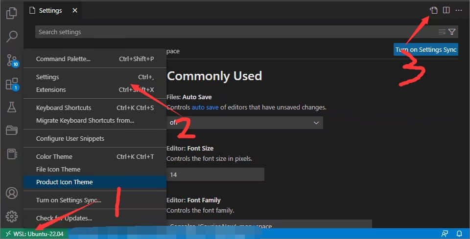
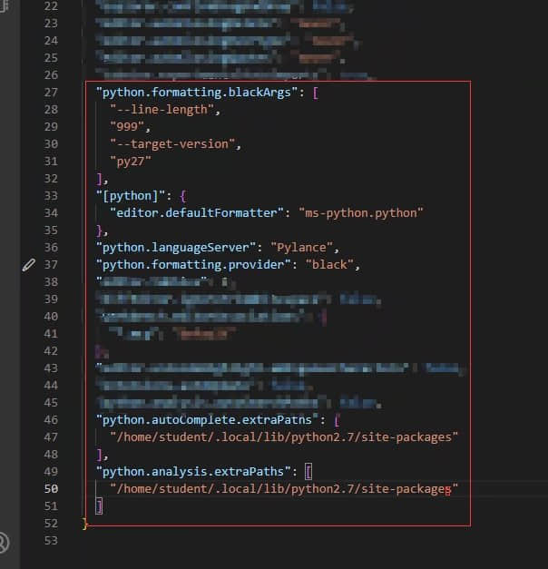

# vscode安装Python2.7开发环境

>本篇教程获得第二期知识库必看教程奖。
>
>获奖作者：Zzz.。

主要是为了自动补全和格式化。

1. 安装好python2.7，python3以及对应的pip。

2. vscode安装python插件。

   新版本不支持python2.7, 需要手动下载安装老版本。

   [https://marketplace.visualstudio.com/_apis/public/gallery/publishers/ms-python/vsextensions/python/2021.12.1559732655/vspackage](https://marketplace.visualstudio.com/_apis/public/gallery/publishers/ms-python/vsextensions/python/2021.12.1559732655/vspackage)。

   

   安装完了记得关闭插件自动更新。

   

3. 安装black。

   python格式化工具很多, 我建议按照我的教程安装black这个格式化工具。black新版本不支持python2.7, 需要安装旧版: python3 -m pip install black[python2]==21.12b0。**（注意是python3 -m pip 不是 python2.7 -m pip.. python2.7装不了black）** 。安装完了重启一个命令行窗口, 输入`black --version`验证是否成功安装。

4. 安装ModSDK补全库。

   使用python2.7安装补全库: `python2.7 -m pip install mc-netease-sdk` 。

5. 配置vscode。

   编辑setting.json。

   

   添加下图没打码的内容。

   

   把`/home/student/.local/lib/python2.7/site-packages`替换成你自己对应的目录：`python2.7 -m pip show mc-netease-sdk` 。

6. 验证。

   vscode随便打开一个.py文件格式化。