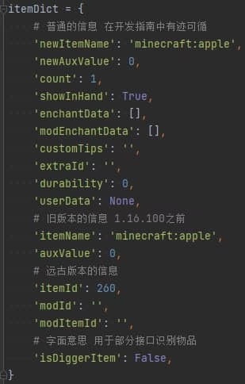
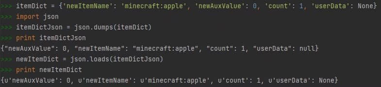
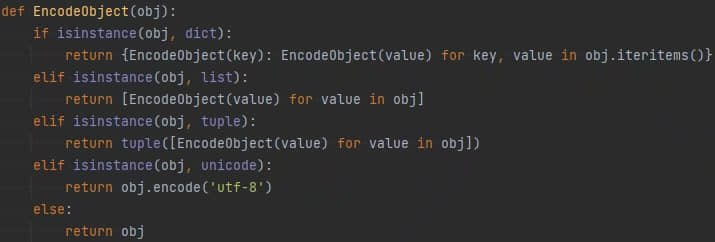

# 简化物品信息字典并用于存储

> 本篇教程获得第二期知识库优秀教程奖。
>
> 获奖作者：MI4C。

开发者可以通过各种事件或接口获取物品信息字典，物品信息字典的介绍可以看[物品信息字典](https://mc.163.com/dev/mcmanual/mc-dev/mcguide/20-%E7%8E%A9%E6%B3%95%E5%BC%80%E5%8F%91/10-%E5%9F%BA%E6%9C%AC%E6%A6%82%E5%BF%B5/1-%E6%88%91%E7%9A%84%E4%B8%96%E7%95%8C%E5%9F%BA%E7%A1%80%E6%A6%82%E5%BF%B5.html#%E7%89%A9%E5%93%81%E4%BF%A1%E6%81%AF%E5%AD%97%E5%85%B8)。

在这个字典中，包含了普通的信息例如newItemName、count、userData（在事件中想要获取userData需要调用GetUserDataInEvent接口），旧版本的信息例如itemName，远古版本的信息例如itemId、modId、modItemId（部分现代事件和接口不会包含远古信息），用于接口内部识别物品的信息例如isDiggerItem。




在实际开发中，部分开发者可能会发现，物品信息字典中的信息，在userData的值中重复出现了，这其实是为了方便开发者对物品的部分通用属性进行修改，而不用了解和修改userData。其他存在于userData中的信息也可以通过特定接口进行修改，例如SetAttackDamage，SetItemLayer，SetItemTierLevel。


## 简化物品信息字典

如果要将物品信息进行存储，那么这些在userData外的无用信息，我们就可以进行剔除，只保留关键的信息。

据本人测试，仅需保留物品信息字典中的newItemName，newAuxValue，count，userData，即可将物品的信息全部保留下来。

可以通过新建一个字典，并将关键信息拷贝至新字典，即可实现物品信息字典的简化。


## 用于存储

我们可以将物品信息字典存储在非常多的位置，例如可以将其存储于另一个物品的userData中，可以将其存储于实体或世界的自定义数据（ExtraData）中，可以将其储存于方块实体（BlockEntityData或TileEntityCustomData）中，甚至可以将其存储于本地配置文件中（ConfigData）。

这些存储虽然方便，但是在读取的时候，可能会破坏userData中的数据，所以这里推荐将物品信息字典转换为字符串再进行存储。

json模块是可以在游戏环境使用的模块之一，其中json.dumps可以将python对象转换成json字符串，json.loads可以将json字符串转换成python对象。




## 从已存储的数据中读取

上述已介绍了json模块中的loads方法，由于引擎使用的是py2，所以我们从json字符串中转出来的python对象还需要将unicode类型转换为str类型。

（这里我们用递归和生成式来对对象进行处理） 。




## 用简化后的物品信息字典重新生成物品

虽然大部分信息都储存于itemDict的userData中，但是 **是否显示在手上** 这个属性却只读取itemDict这一层级的数据，所以我们需要下述操作：

```python
if itemDict['userData']:
  itemDict['showInHand'] = itemDict['userData'].get('display', {}).get('ShowInHand', {}).get('__value__', False)
```

这样使用简化后的物品信息字典，也可以生成正确的物品了。