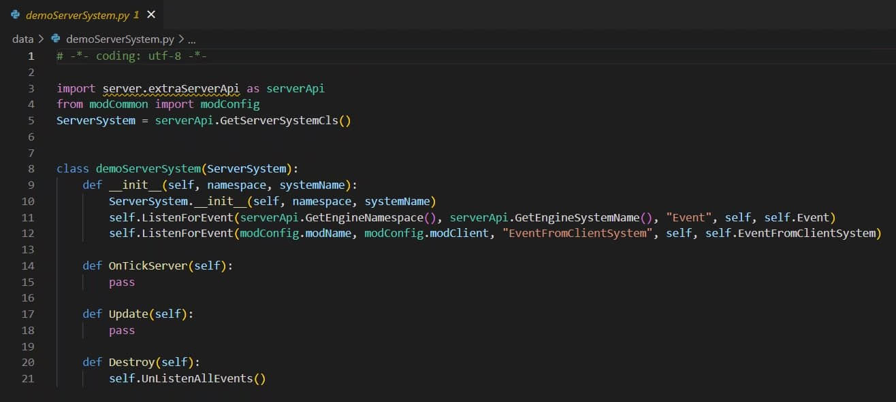

# MODSDKGenerator 1.0.0

>本篇教程获得第二期知识库优秀教程奖。
>
>获奖作者：MaShuGG。

**请务必看完本篇再下载使用！**

**未经授权，禁止搬运，可以复制该频道链接！**

**状态：**

Windows可用，开源，持续更新，有bug请指出。

**简介：**

官方的零件可以直接创建并写代码，不过大多数人还是喜欢用modsdk

但是mcstudio的配置代码创建起来还是比较麻烦，名字，服务端，客户端，modConfig等等，大约要用两分钟

MODSDKGenerator 1.0.0 可以让你输入mod名字就创建scripts，直接开始写代码。

**使用方式：**

下载我们的zip包，我们并没有制作exe包，你需要Python来执行它，点击start.bat即可开始创建，输入行为包目录路径和mod名字

mod名字标准示例:demoTest,一般可以小驼峰命名,你也可以自定义。

**视频教程：**

**特别说明！！！：**

1. 创建的scripts是官方的推荐代码，如果看不懂，请自行学习。

2. 创建的modConfig有一些UI变量，可以方便的更改和复制，创建UI，如果你没有此需求，删掉即可。

   

3. 创建的服务端和客户端中监听了两个事件，上面的是监听引擎事件，下面的是监听异端事件，可以方便的更改和复制，在创建的第一时间监听事件，如果你没有此需求，删掉即可。

   

**下载：**

微云网盘：[https://share.weiyun.com/oCJpq6xs](https://share.weiyun.com/oCJpq6xs) 。