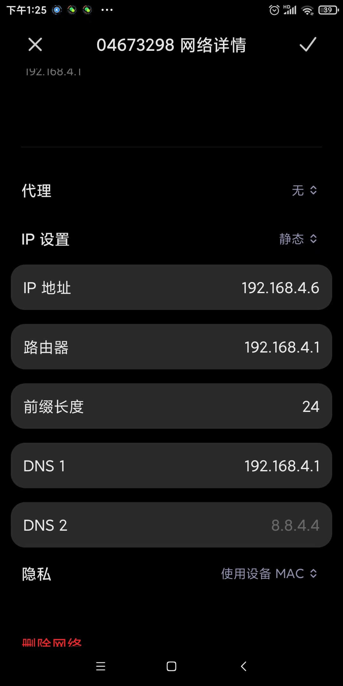
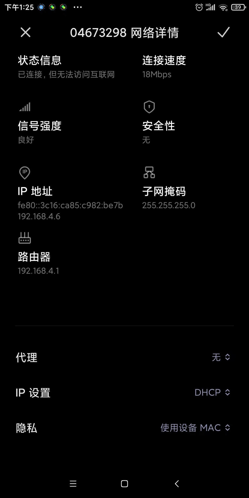
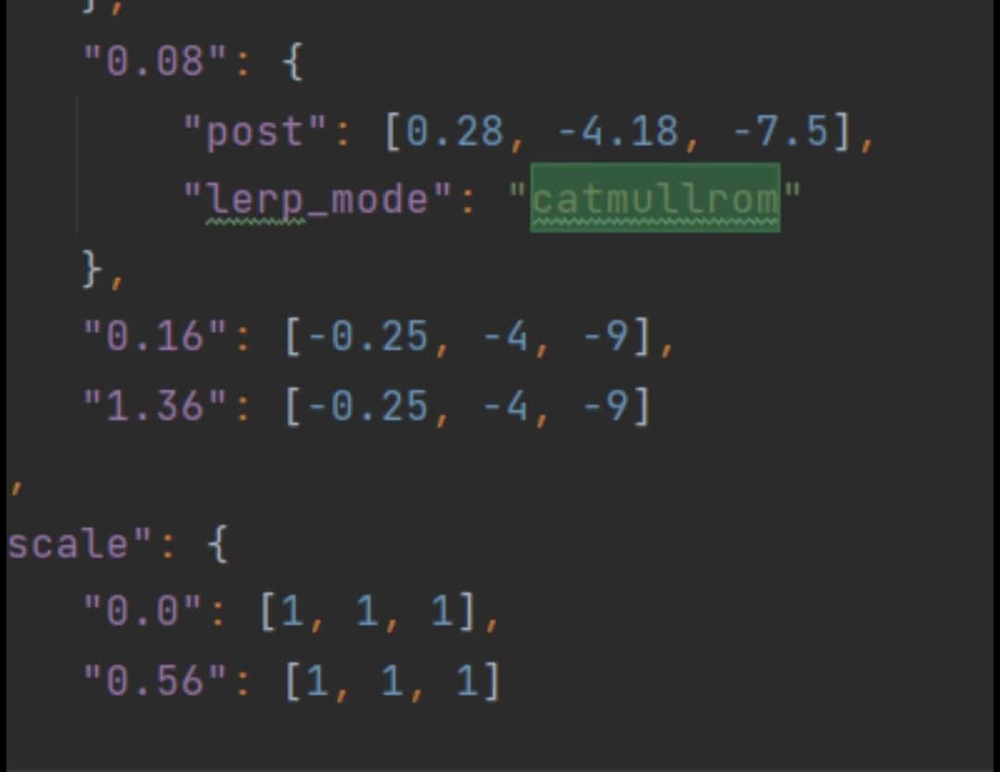
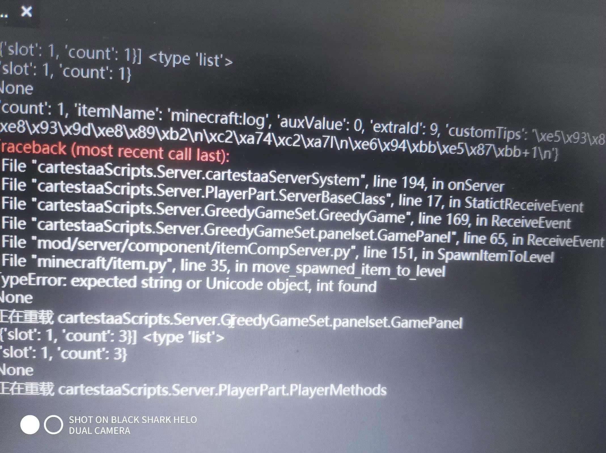
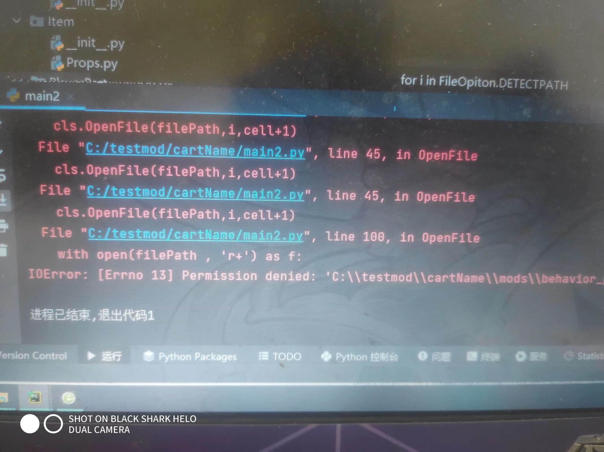
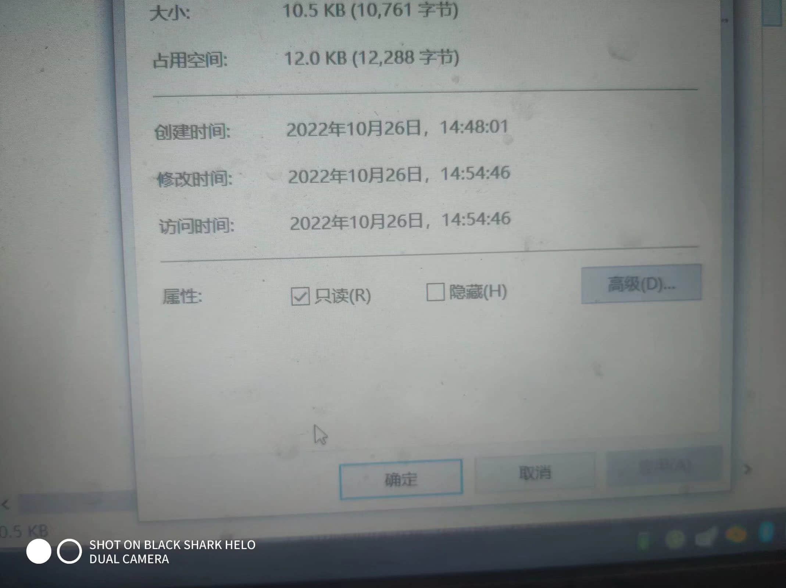

# 踩坑总结

>本篇教程获得第一期知识库优秀教程奖。
>
>获奖作者：素笺淡墨。

我会记录在开发测试中遇到的疑难杂症。

1. 使用调试工具，查看手机上的日志时，必须要保证电脑和手机连接同一个WiFi。

   并且，如果是第一次连接：

   - 最好是连上同一个WiFi的同时，重启一下手机的客户端登录。
   - 然后在手机客户端登录进去之后直接点击客户端IP连接。

   这里需要注意一点  ，客户端IP是WiFi的IP地址不是路由器地址。

   有些手机。 IP地址是乱码。

   

   

   必须要像我这样直接把IP设置弄为静态才能看到。

2. 某个动画不加载，或者对某个动画使用molang时，在电脑上没有问题但是到了手机上却发现设置好像无效。

   - 这个问题困扰了我差不多 三个小时，后面通过排除法发现。
   - 我在其他的动画文件定义了同名的动画名。
   - 也就是我在动画文件a而定义了动画名bbb。

   然后又在动画文件B定义了动画名bbbb。在电脑端运行的时候动画文件B覆盖了动画文件a。但在手机端运行的时候动画文件a覆盖了动画文件。这就出现了我设置的是动画文件B可是却被覆盖导致设置失败。

3. 字符串被API设置过后没有显示这个字符串。

   - 比如我使用`SetName`（设置生物名字）  或者`SetCommand("/say  xxxx")` （广播字符串到所有玩家的聊天栏）。

     在这种情况下，如果字符串是aaaa。可当我用这个字符串设置的时候就会导致某种原因他无法设置成功。这个时候我们需要使用str()将它重新转换成字符串。

   - 这个问题一般经常出现在需要获取zh_cn.lang文件里面的文本信息。

   - 然后通过这个文本信息和其他字符串连接在一起。

4. 定时器包括定服务端或者客户端的事件，根据我的测试他们应该是异步调用。也就是说，假设有一个函数aa()。你通过定时器调用了这个函数aa。但可能还没执行完又会被其他事件调用 。

5. 当你上传的包里面有player.entity.json这个文件名的时候会出现错误码，你需要把它改成player.json。

6. 配方。输出的物品，它的特殊值不能为-1  不然会报错。

7. molang变量。不能有大写字母，不然会出问题。

8. 当你给一个生物调用寻路组件的时候，如果你离这个生物太远，哪怕服务端已经加载不到了，但他还是会触发寻路组件返回的结果。

9. 千万不要在寻路组件返回的方法里再次调用寻路组件，不然会出问题。

10. 当动画里有post ，lerp_mode  这种东西的时候可能会导致动画在游戏内播放异常。

    

11. 判断这个区块是否加载应该使用 CheckChunkState   。而不是使用getblocknew来判断  有时候没加载的区域它会返回空气。

12. 使用SaveExtraData 保存数据的时候。

    - 数据里千万不要有tuple 类型 ，也不要有自己定义的类对象。
    - 浮点数最好尽量转换成int。

13. 服务端和客户端之间的广播事件，使用这广播事件发送数据的时候，千万不要传，自己定义的对象，或者对象方法。还有就是字典。千万不要保存他自己。不然会出现自己引用自己，导致进入递归。

14. 读取json文件时，你会发现有时候这个 json文件明明格式是正确的，但却始终读取失败。这是因为某些文件的前三个字符是隐藏字符。你需要在读取这个文件后，把前面三个字符给过滤掉 ，然后再把它转换成json对象。

15. 物品标识符冒号前面的并不能用于区分。和其他模组的物品，冒号后面的才能区分。比如`aa:gg`和`bb:gg`在游戏里某些逻辑上系统会认为他们是一样的物品。

16. 使用`GetAttrValue`这个API获取速度时，如果你对这个速度使用int()想把它转换成整数。那么你会发现无效，必须要把它变成字符串然后遍历这个字符串截取小数点前面的所有字符才可以变成整数。

17. 获取玩家背包的物品时要注意，不是所有的物品都有aux这个key。有时候你会获取到一个`{“itemName":minecraft:air"}`。

18. 使用静态类成员时，要注意，如果他只是基础变量，int float这些的话最好只用于访问而不是动态修改，如果需要动态修改请让它等于对象或者字典列表等。不然会出现，本地测试时另一个客户端会初始化这个静态类成员。也就是说如果你有一个静态类成员a=0   那么你在脚本中动态修改为一的时候，如果本地的另一个玩家进来，那么他就会重新将这个类成员a等于零。

19. 如果你想让一个物品不要在玩家输入/give的时候显示这个物品的标识符，那么你除了把他的创造栏分类改为none的同时，一定要把它注册到创造栏背包里面 ，要不然就无效。

20. 当你的UI里面有输入框这个控件的时候，不需要的时候一定要把这个UI给卸载掉，注意是卸载不是隐藏 。要不然就会出现你无法对游戏转向。

21. 一个实体刚生成的时候你在客户端是获取不到他的任何信息的。

22. 客户端的`GetPos`等于None的时候，并不一定能百分百保证这个实体已经死亡或者离玩家很远，建议使用IsEntityAlive。

23. 每进行一次维度传送  游戏都会对UI重新初始化一次。所以请不要把一些重要的数据存放在客户端的UI文件里面。

24. 当一个UI处于隐藏状态的时候你是没办法获取这个UI的任何信息，包括对它设置任何数据。也不一定会全部生效。

25. 调用给玩家添加模型的api时，在二点一版本的时候我发现了一个问题。如果存在两个玩家a和b。然后你要给这两个玩家添加一个模型cc。当这两个玩家离得太远的时候，你给这两个玩家添加模型cc，就会出现在玩家a的客户端里，玩家B没有CC模型。因为它添加失败了 。在玩家B的客户端里玩家a没有CC模型。同样失败了 。只有当这两个玩家可以互相看到对方的模型时，你在给这两个玩家添加模型CC才会成功。当然这是我在二点一版本发现的。我不知道现在改了没有，这也是我一直不敢用这个API方法的原因。

26. 当按钮层级等于零的时候，可能会对监听事件失效，也就是点击这个按钮没反应。

27. 维度切换完成后的事件触发并不代表这个时候玩家他已经可以看到被传送维度的方块了。也就是说如果玩家他传送到了末地，触发这个事件的时候玩家的界面仍在显示那个加载中。想获取玩家加载完成后，应该在那个UI监听框架那里，每传送一次维度都会重新触发那个UI框架完成事件。

28. 从一个维度切换到另一个维度时，从一个维度切换到另一个维度时，如果你是指定坐标Y轴需要加3。比如你在地狱的40 4  40 有一个木头，这个木头的周围都是空气。你想让玩家站在这个木头上面，那么你从主世界传送过来的时候应该设置的坐标是40 43 40，不然玩家会从这个木头上掉下去。

29. 记录一个细思极恐的问题，一般玩家加入游戏时我是通过监听UI框架是否加载完成，然后向服务端发送这个玩家的ID，在服务端保存这个玩家ID。但当时我没有意识到切换维度会重新触发这个监听UI框架事件。也就是说，如果玩家传送一次维度那么就会初始化掉这个玩家在服务端的数据。因为我是在这个监听框架下发的添加玩家广播事件。如果各位有像我一样需要在这个 UI框架加载完成事件下面做广播通信的要注意了。

30. 使用添加物品到玩家背包的Api时，日志出现了这个错误的时候。

    

请检查你的extrald，只有他这个值不是字符串的时候就会出现这个错误。

31. 记录文件打开失败的一个错误。

    

    我对某个文件读取时出现了错误，我以为是其他应用占用但是我在关机重启之后还是出现了这个问题，后来我发现，在文件的属性这里我选中了只读。

    