# 模拟原版袭击事件

> 本篇教程获得第一期知识库必看教程奖。
>
> 获奖作者：艾诺德。

今天的教程将教各位开发者实现类似于原版劫掠的袭击事件。这项技术可为RPG类模组提供更高的可玩性。

**教程概述：**

主要功能：实现类似于原版的袭击事件。

实现步骤：

1. 以触发点为原点在距该点**[8, 16]**格的某一位置生成参与袭击事件的生物并增加袭击事件进度条。
2. 参与袭击的生物死亡时更新进度条，并在少于3个袭击者时显示剩余生物的数量。
3. 所有参与袭击生物死亡时判定事件结束。

**学习本教程的前置技术：**

- 基本熟悉Python语法及modApi接口。
- 了解如何进行服务端、客户端互传事件。
- 会使用MCS制作UI。

**目标效果：**

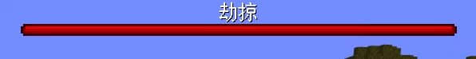

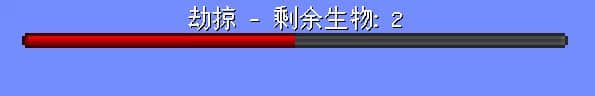

## 实现步骤

首先我们使用MCS的编辑器制作出一个进度条，并制作一个文本框作为进度条的子组件（为了模仿原版，我们默认文本框在进度条的上方，开发者也可自行布局），之后我们保存编辑。

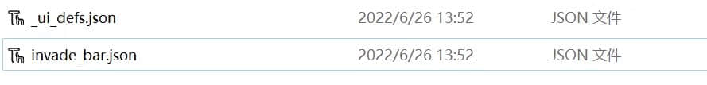

完成上述步骤后，我们在客户端初始化（即`__init__`）事件下定义`self.UiNode = None`用于在加载UI后储存节点。

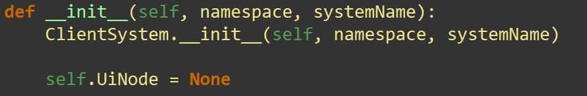

完成后我们在初始化事件下增加对`UiInitFinished`事件的监听。

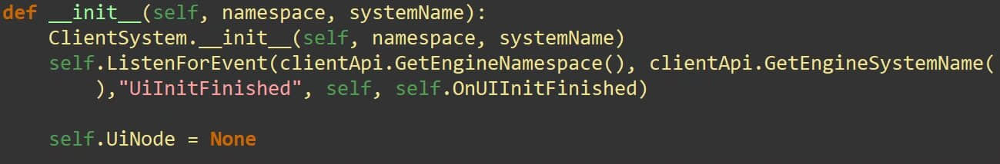

并定义回调函数。我们在回调函数中调用`clientApi.RegisterUI`进行UI的注册（在这里不作过多赘述）完成后，我们使用`clientApi.CreateUI/clientApi.GetUI`获取刚刚注册的UI并赋值给`self.UiNode`。

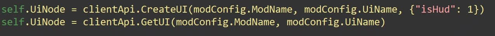

为了防止因ui未成功注册而导致初始化发生错误，我们需要定义如下判定：

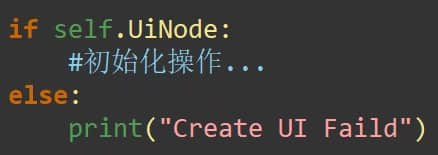

初始化操作中我们需要隐藏进度条（由于进度条是文本框的父组件，在进度条被隐藏后文本框也会自动被隐藏，path为进度条的路径，开发者请根据实际情况调整）（当然，如果开发者写了储存袭击的算法，可自行添加判定决定是否隐藏）。

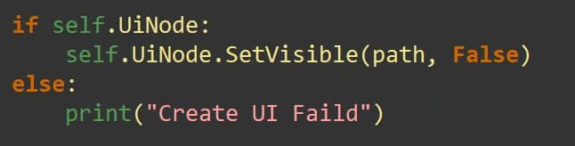

我们在客户端初始化事件下定义如下变量以保存袭击进度。

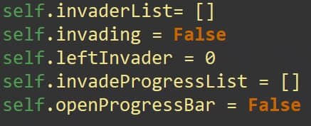

第一个变量用于储存参与袭击的生物，第二个变量用于判定是否处于袭击事件中（注意，该做、储存方式为缓存，在退出游戏后失效，若想不受退出的影响可自行在服务端中通过`SetExtraData`设置储存于全局的变量实现），后续变量用于控制袭击进度条的变化。

接下来我们编写好服务端，增加如下自定义事件并在客户端中监听：

服务端代码：

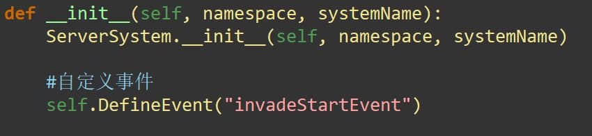

客户端代码：（注意：ServerSystem和modName需要开发者根据实际情况进行调整）

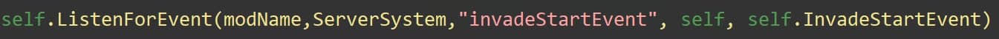

接下来我们编写触发袭击事件。

我们先制作生成袭击生物的函数。为实现随机距离，我们需要导入random库。

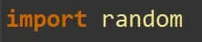

我们通过`GetTopBlockHeight`得到最高的非空气方块的高度，并+1获取生成袭击者的y坐标以保证实体不会卡进地下。

我们通过`SetMoveSetting`组件使袭击者自动寻路前往目标点位，该组件具体用法请自行参考官网（同时为了保护版权，寻路回调函数已略去）。

完成生成后我们返回袭击者的id以进行进一步操作。

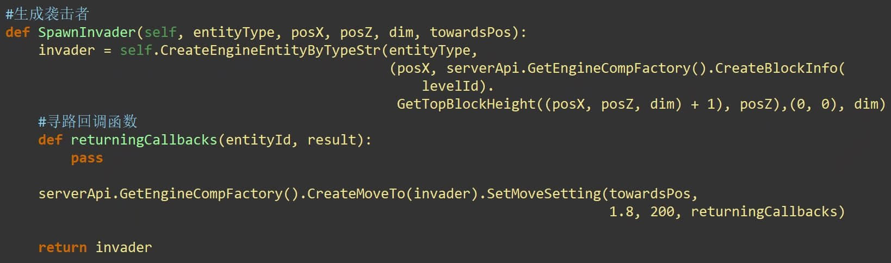

为了像原版一样随机生成袭击者，我们需要编写一个根据权重随机选择实体的函数：

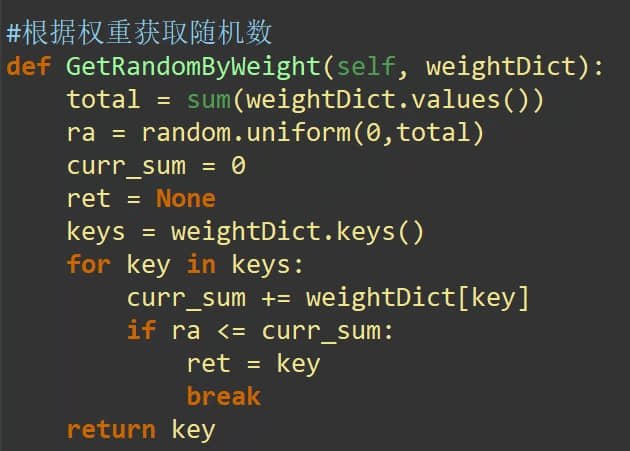

完成该函数的编写后，我们可以传人如下形式的字典参数来获得筛选出的实体id（键名为实体id，对应的值为权重）。

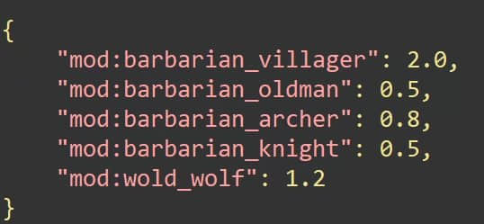

应用上述函数，我们进行开启袭击事件的函数编写：

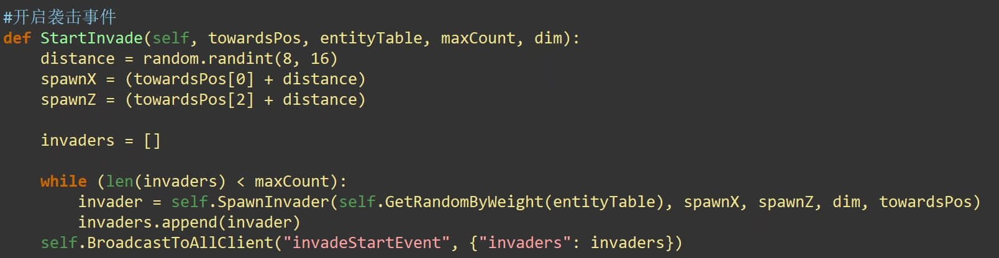

在进行客户端回调函数的编写前，我们需要在客户端制作如下前置函数：

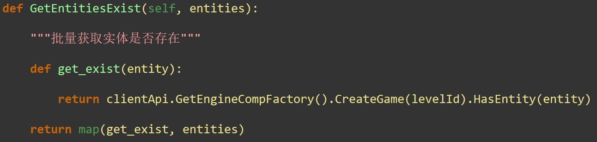

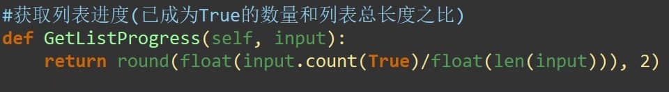

完成后我们编写回调函数：

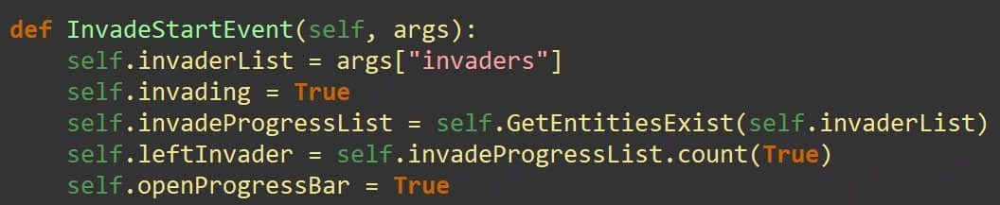

我们增加对OnScriptTickClient事件的监听并编写如下逻辑：

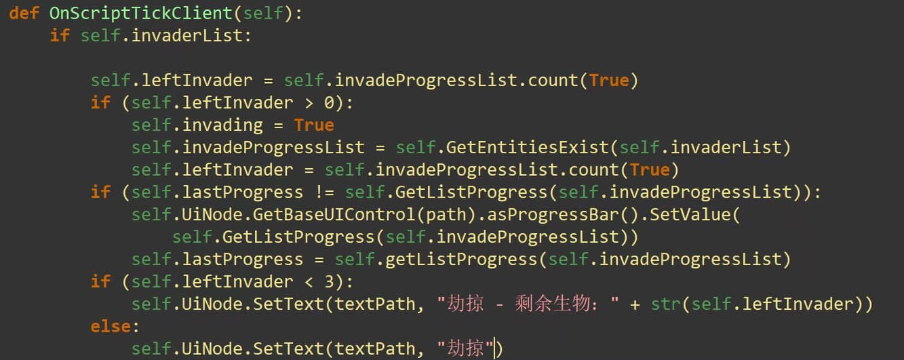

我们通过第一个if下的操作实时进行袭击状态的更新，通过第二个实时进行进度条的更新，通过第三个if-else实现少于3个袭击者时显示剩余生物的数量的逻辑。

最后我们进行胜利条件的判定：

我们在客户端增加自定义函数并在服务端监听回调（这里略去具体细节） 。

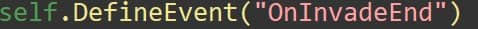

我们在刚才的OnScriptTickClient事件下写如下逻辑：

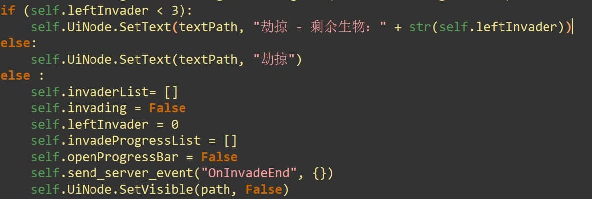

完成后就可以实现一个类似于原版的袭击事件了！

**感谢大家的阅读。**