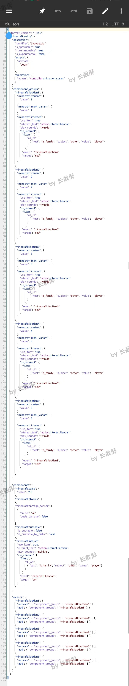
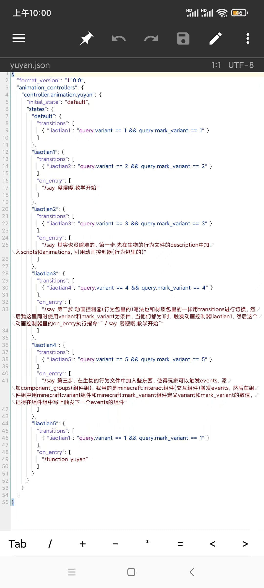
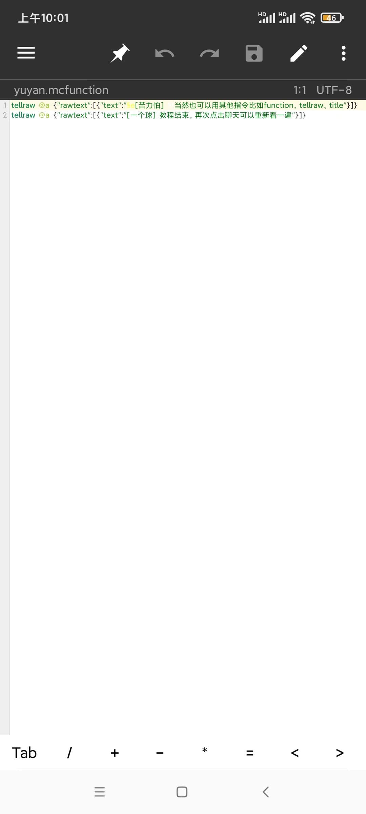
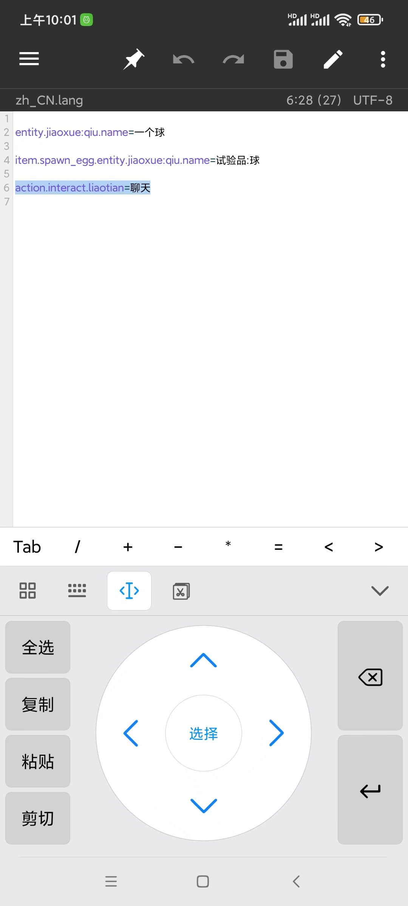

# 制作原版可对话生物

> 本篇教程获得第一期知识库必看教程奖。
>
> 获奖作者：某只苦力怕。

首先，默认你会自定义生物，而且知道组件组、组件和行为。

## 教程开始

第一步，生物行为

1. 先在生物的行为文件的description中加入scripts和animations，引用动画控制器(行为包里的)。

2. 在生物的行为文件中加入些东西，使得玩家可以触发`events`(行为)添加`component_groups`(组件组)，我用的是`minecraft:interact`组件(交互组件)触发`events`，然后在组件组中用`minecraft:variant`组件和`minecraft:mark_variant`组件定义`variant`和`mark_variant`的数值，记得在组件组中写上触发下一个`events`的组件。

   

第二步，动画控制器

动画控制器(行为包里的)写法也和材质包里的一样用`transitions`进行切换，然后我这里同时使用`variant`和`mark_variant`为条件，当他们都为1时，触发动画控制器`liaotian1`，然后这个动画控制器里的`on_entry`执行指令：`／say 嘤嘤嘤,教学开始`。

第三步，对图2中44行`liaotian5`里的`/function yuyan`进行定义，可以用其他指令比如`function`、`tellraw`、`title`，如果`tellraw`放在动画控制器中反而会导致整个动画控制器文件错误，所以放在`mcfunction`文件中。

第四步，对生物行为文件中的`interact_text`里的`action.interact.liaotian`进行定义，推荐这个方法，当然你想直接在生物行为文件中输入中文也是可以。

## 小结

这样一个利用指令进行对话的`npc`就做好了，你也可以在组件组中加入些攻击组件，这样对话到那个组件组，生物就会开始攻击玩家，也可以在动画控制器中加入其他指令，比如`playsound`(播放音效)，这样就能代替`minecraft:interact`组件里的`play_sounds`(交互时播放音效)了，当然如果你要自定义对话按钮的图案的话就没办法用原版的方法了，这边推荐用自定义`ui+python`的方式了。

附带教程文件的下载地址：[教程附带模组](https://wwn.lanzouy.com/ixrfx0dw6zpc) 。

