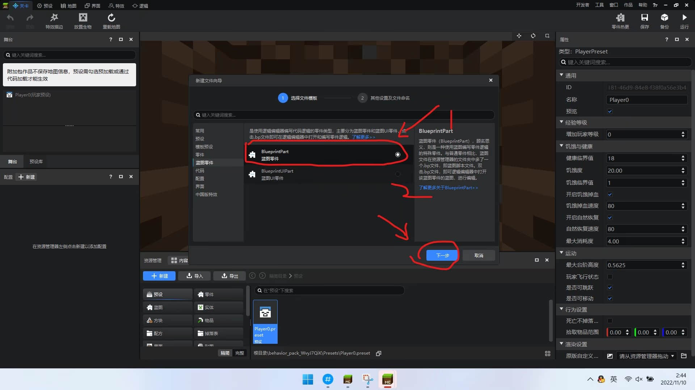
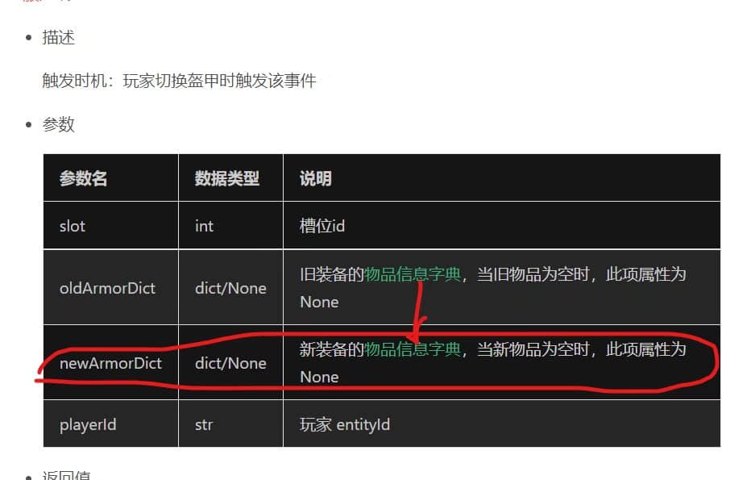
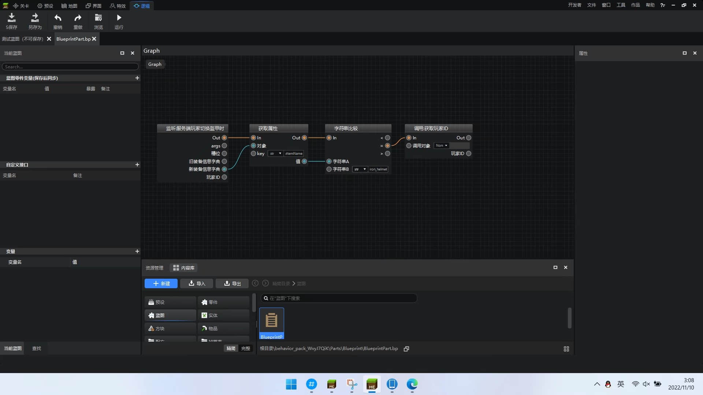

# 使用逻辑编辑器穿上盔甲获得效果

>本篇教程获得第二期知识库必看教程奖。
>
>获奖作者：云易工作室-Moxuan。

上实在是睡不着哟，看到一位小伙伴在求助，我就来帮忙了。这个IDEA说实在还是比较简单的，我们来分割一下元素，分别为 **玩家** ， **切换盔甲事件（服务端）** ， **给与药水效果** 。所以就要开始了。

第一步、我们首先新建一个项目《换盔甲得效果》，点击启动编辑。

首先是第一个元素**玩家**，所以我们新建一个玩家预设。

我们新建了一个名字叫做Player0的玩家预设，当然这个名字是随你们心情的。接下然的元素是**切换盔甲事件**，我们在这里就要为这个玩家挂载一个逻辑蓝图零件。我们还是新建一个蓝图零件。

这里我们新建了一个名字叫做Blueprint的蓝图零件，这个蓝图零件名字当然也是随你们开心的。

然后我们切换到预设界面。将零件挂接到玩家预设上。

当操作完成后就会变成这个样子。然后我们点击蓝图板块，选择蓝图文件，记得名字要和蓝图零件一样的bp文件。

双击进入可视化界面。如下图。

记得要选择正确的文件tab（如红圈），我们可以选择将这个蓝图内的所有内容删掉。然后右键会出现下面的图片有的菜单。

在输入框中输入切换盔甲，并且选择监听服务端事件的那个。我们就会看到出现这么一个模块。

接下来我们进行一个判断，右键在输入框中输入获取属性。

然后我们获取一下这个世界的参数，我们将鼠标移到第一个模块处，模块会有注释出现。点击查看文档。

根据相关信息填入模块中，相关连线也不要忘记哟。然后进行字符串比较。

在这个地方我填上了minecraft:iron_helmet，也就是铁帽的命名空间。

接下来这个地方很关键，我们在输入框输入获取玩家id，选择预设对象接口的那个，然后像图片这样连起来。

然后我们在输入框输入添加状态效果，选择我们图片做了标记的那个。然后按照图片连起来，按照刚刚的方法去查文档添加数值。

到此位置我们所有的准备工作就结束了，先点击保存，然后点击运行看看结果把我选用的版本是2.3的包体。

如果玩家切换装备不是目标装备如何清除状态效果呢？我们在昨天的基础上增加新的分支即可，如图所示。

然后我们就会发现成功了，打完收工。

